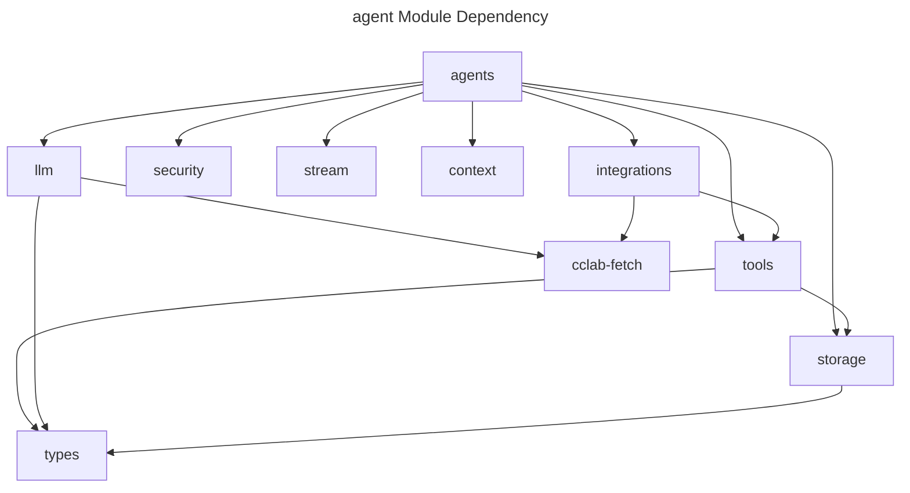
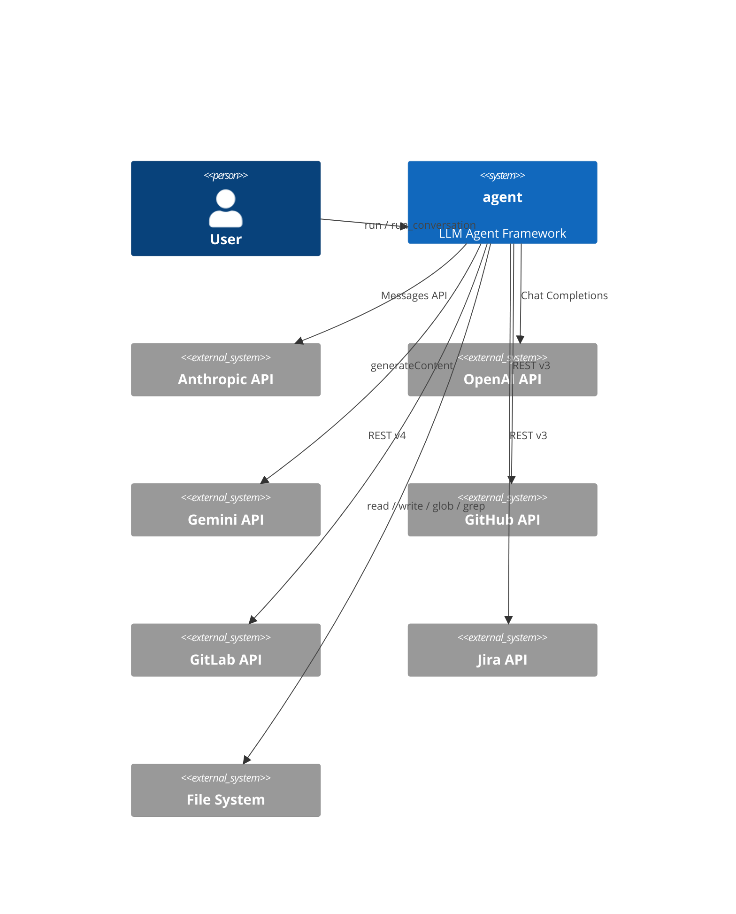
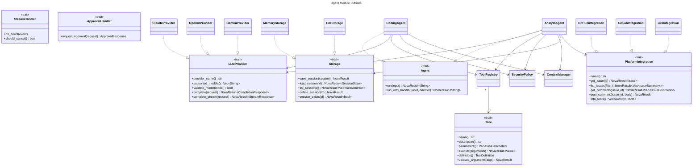

# agent Architecture Spec

## Overview
<!-- type: overview lang: markdown -->

`agent` is an LLM agent framework built around shared ports for agents,
LLM providers, tools, storage, streaming, security, context management, and
platform integrations. The architecture keeps provider-specific API clients and
platform integrations behind traits while higher-level agents compose those
ports for coding and analysis workflows.

## Logic
<!-- type: logic lang: mermaid -->







## Changes
<!-- type: changes lang: yaml -->

```yaml
changes:
  - path: projects/agent/core/src/lib.rs
    action: modify
    section: logic
    impl_mode: hand-written
    description: "Expose the agent module surface used by agents, LLM providers, tools, storage, stream, context, security, and integrations."
  - path: projects/agent/core/src/agents/
    action: modify
    section: logic
    impl_mode: hand-written
    description: "Compose framework ports into concrete coding and analysis agents."
  - path: projects/agent/core/src/llm/
    action: modify
    section: logic
    impl_mode: hand-written
    description: "Keep model-provider implementations behind the shared LLMProvider boundary."
```
