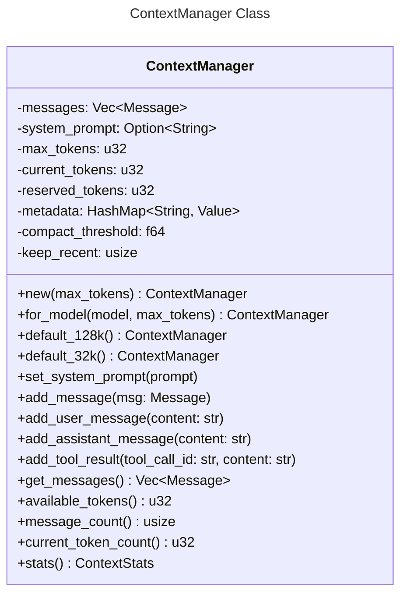
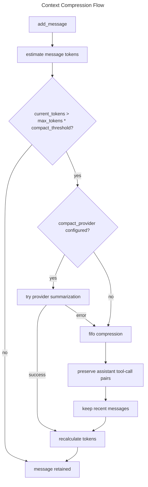
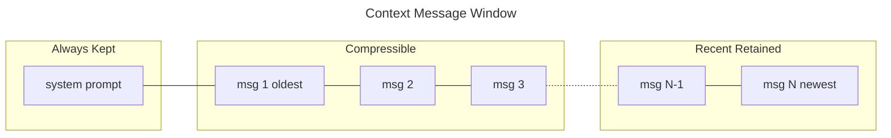

# Context Management Spec

## Overview
<!-- type: overview lang: markdown -->

`ContextManager` owns conversation history and token-budget accounting for
agent requests. It keeps an optional system prompt, stores non-system messages,
tracks estimated token usage, reserves response budget, and compacts old
messages when usage crosses the configured threshold.

Compaction prefers provider-backed summarization when an `LLMProvider` is
configured. If summarization is unavailable or fails, the manager falls back to
FIFO removal while preserving recent messages and tool-call pairing.

## Schema
<!-- type: schema lang: yaml -->

```yaml
definitions:
  ContextStats:
    type: object
    required:
      - message_count
      - estimated_tokens
      - max_tokens
      - available_tokens
      - compression_triggered
    properties:
      message_count: {type: integer, minimum: 0}
      estimated_tokens: {type: integer, minimum: 0}
      max_tokens: {type: integer, minimum: 0}
      available_tokens: {type: integer, minimum: 0}
      compression_triggered: {type: boolean}

  ContextPreset:
    type: object
    required: [name, max_tokens]
    properties:
      name:
        type: string
        enum: [default_128k, default_32k]
      max_tokens:
        type: integer
        enum: [128000, 32000]

  CompressionPolicy:
    type: object
    required:
      - reserved_tokens
      - compact_threshold
      - keep_recent
      - fallback
    properties:
      reserved_tokens: {type: integer, const: 4096}
      compact_threshold: {type: number, const: 0.8}
      keep_recent: {type: integer, const: 4}
      fallback:
        type: string
        const: fifo_pair_preserving_removal
```

## Logic
<!-- type: logic lang: mermaid -->







## Changes
<!-- type: changes lang: yaml -->

```yaml
changes:
  - path: projects/agent/core/src/context.rs
    action: modify
    section: logic
    impl_mode: hand-written
    description: "Define ContextManager token accounting, provider-backed summarization, FIFO compaction, metadata access, and ContextStats."
  - path: projects/agent/core/src/tokenizer.rs
    action: modify
    section: logic
    impl_mode: hand-written
    description: "Provide model-aware and estimate tokenizers used by ContextManager."
```
