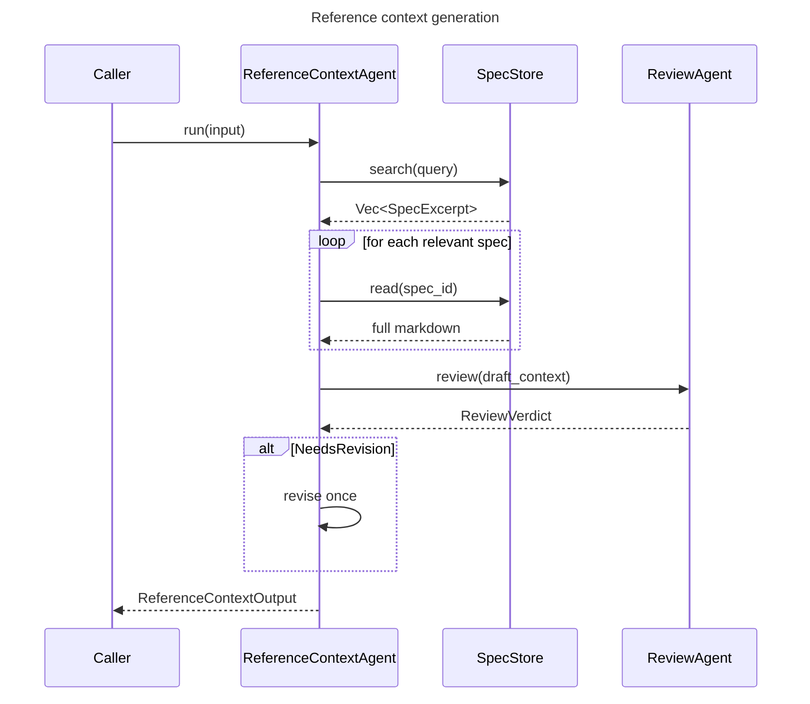

# Reference Context Agent Spec

## Overview
<!-- type: overview lang: markdown -->

`ReferenceContextAgent` discovers and synthesizes specification context for
SDD changes. It searches the `SpecStore`, reads full spec bodies for relevant
hits, scores relevance, extracts applicable requirements, identifies
contradictions, and runs a bounded internal review loop before returning a
structured reference context artifact.

The agent is used during the reference-context and post-clarification phases.
It does not own downstream spec or code authoring; its output is an input to
those later phases.

## Requirements
<!-- type: requirements lang: mermaid -->

```mermaid
---
id: reference-context-agent-requirements
title: Reference Context Agent Requirements
requirements:
  R1:
    text: "ReferenceContextAgent MUST search related specs through SpecStore."
    type: functional
    priority: high
    risk: high
    verification: test
  R2:
    text: "SpecStore MUST expose read(id) so the agent can retrieve full spec markdown, not only search excerpts."
    type: interface
    priority: high
    risk: high
    verification: test
  R3:
    text: "The agent MUST score each relevant spec as high, medium, or low relevance for the current change."
    type: functional
    priority: medium
    risk: medium
    verification: test
  R4:
    text: "The agent MUST extract applicable key requirements from each relevant spec."
    type: functional
    priority: high
    risk: high
    verification: review
  R5:
    text: "The agent MUST identify contradictions between discovered specs and the requested change."
    type: functional
    priority: high
    risk: high
    verification: test
  R6:
    text: "The agent MUST return a structured artifact containing specs, relevance, key requirements, and contradictions."
    type: interface
    priority: high
    risk: high
    verification: test
  R7:
    text: "The agent MUST run one internal review pass and revise when the review verdict is needs-revision."
    type: functional
    priority: medium
    risk: medium
    verification: test
---
requirementDiagram

requirement R1 {
  id: R1
  text: "ReferenceContextAgent MUST search related specs through SpecStore."
  risk: High
  verifymethod: Test
}

requirement R2 {
  id: R2
  text: "SpecStore MUST expose read(id) so the agent can retrieve full spec markdown, not only search excerpts."
  risk: High
  verifymethod: Test
}

requirement R3 {
  id: R3
  text: "The agent MUST score each relevant spec as high, medium, or low relevance for the current change."
  risk: Medium
  verifymethod: Test
}

requirement R4 {
  id: R4
  text: "The agent MUST extract applicable key requirements from each relevant spec."
  risk: High
  verifymethod: Review
}

requirement R5 {
  id: R5
  text: "The agent MUST identify contradictions between discovered specs and the requested change."
  risk: High
  verifymethod: Test
}

requirement R6 {
  id: R6
  text: "The agent MUST return a structured artifact containing specs, relevance, key requirements, and contradictions."
  risk: High
  verifymethod: Test
}

requirement R7 {
  id: R7
  text: "The agent MUST run one internal review pass and revise when the review verdict is needs-revision."
  risk: Medium
  verifymethod: Test
}
```

## Scenarios
<!-- type: scenarios lang: yaml -->

```yaml
scenarios:
  - id: successful_context_generation
    given:
      - "The input change has clear requirements."
      - "SpecStore.search returns relevant spec excerpts."
    when: "ReferenceContextAgent runs."
    then:
      - "The agent reads the full body of relevant specs."
      - "The output contains high-confidence relevance scores and key requirements."
      - "The internal reviewer approves without revision."

  - id: internal_review_triggers_revision
    given:
      - "The first draft misses a contradiction or mis-scores a spec."
    when: "The internal reviewer returns needs-revision."
    then:
      - "The agent revises the reference context once."
      - "The final artifact reflects the reviewer finding."

  - id: spec_store_read_support
    given:
      - "SpecStore.search returns a candidate spec id."
    when: "The agent needs detailed requirements from that spec."
    then:
      - "The agent calls SpecStore.read(id)."
      - "The full spec markdown is included in the relevance and contradiction analysis."
```

## Interaction
<!-- type: interaction lang: mermaid -->



## Schema
<!-- type: schema lang: yaml -->

```yaml
interfaces:
  SpecStore:
    methods:
      search:
        params:
          query: string
        returns: "Vec<SpecExcerpt>"
      read:
        params:
          id: string
        returns: string

  ReferenceContextAgent:
    methods:
      run:
        params:
          input: string
        returns: ReferenceContextOutput
      run_with_handler:
        params:
          input: string
          handler: StreamHandler
        returns: ReferenceContextOutput

definitions:
  ReferenceContextOutput:
    type: object
    required: [specs, contradictions]
    properties:
      specs:
        type: array
        items:
          $ref: "#/definitions/RelevantSpec"
      contradictions:
        type: array
        items:
          $ref: "#/definitions/Contradiction"

  RelevantSpec:
    type: object
    required: [spec_id, spec_group, relevance, key_requirements]
    properties:
      spec_id: {type: string}
      spec_group: {type: string}
      relevance: {type: string, enum: [high, medium, low]}
      key_requirements:
        type: array
        items: {type: string}

  Contradiction:
    type: object
    required: [spec_id, requirement, conflict, resolution]
    properties:
      spec_id: {type: string}
      requirement: {type: string}
      conflict: {type: string}
      resolution: {type: string}
```

## Changes
<!-- type: changes lang: yaml -->

```yaml
changes:
  - path: projects/agent/core/src/context/spec_store.rs
    action: modify
    section: schema
    impl_mode: hand-written
    description: "Add SpecStore::read(id) and update implementations."

  - path: projects/agent/core/src/agents/reference_context.rs
    action: create
    section: logic
    impl_mode: hand-written
    description: "Implement ReferenceContextAgent, builder, SpecStore search/read orchestration, scoring, contradiction detection, and one-pass internal review."

  - path: projects/agent/core/src/agents/mod.rs
    action: modify
    section: changes
    impl_mode: hand-written
    description: "Export ReferenceContextAgent and builder."

  - path: projects/agent/core/src/types/artifacts.rs
    action: modify
    section: schema
    impl_mode: hand-written
    description: "Add typed ReferenceContextOutput, RelevantSpec, and Contradiction artifact shapes."
```
