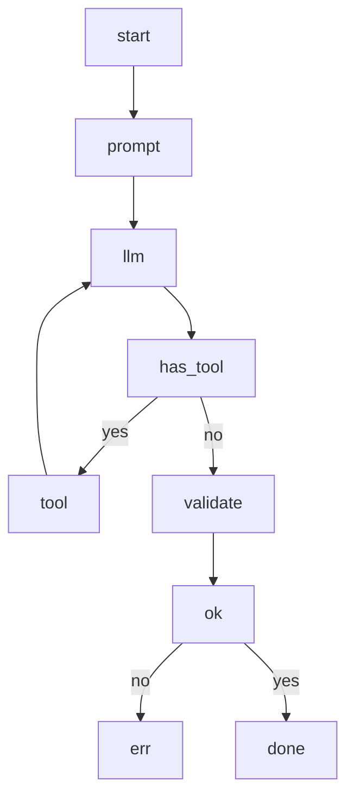
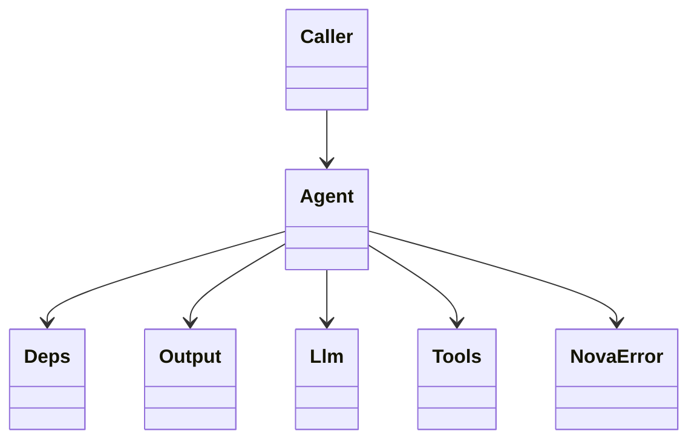
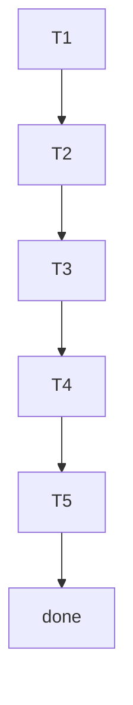

## Run Loop Lifecycle
<!-- type: logic lang: mermaid -->



## Surface Map
<!-- type: dependency lang: mermaid -->



## Test Coverage
<!-- type: test-plan lang: mermaid -->



## Changes
<!-- type: changes lang: yaml -->

```yaml
files:
  - path: .aw/tech-design/projects/agentkit/specs/agent-deps-output-run-loop.md
    action: create
    section: changes
    note: "This TD spec — source of truth for #2030"

  - path: projects/agentkit/core/src/agent.rs
    action: create
    section: changes
    note: "Agent<Deps, Output> struct + builder + run loop — codegen marker block"
```
