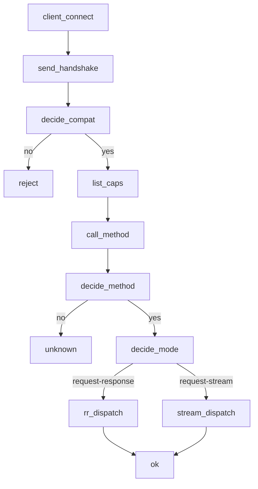
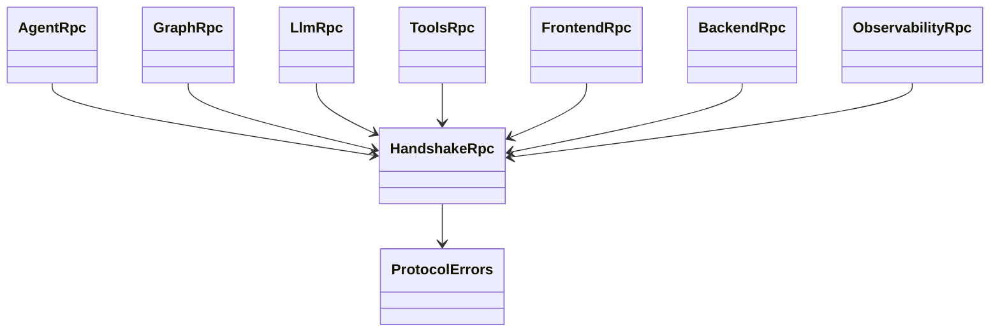

## RPC Method Lifecycle
<!-- type: logic lang: mermaid -->



## Surface Trait + Error Code Map
<!-- type: dependency lang: mermaid -->



## Test Coverage Map

```mermaid
---
id: cross-surface-rpc-contract-tests
nodes:
  T1: { kind: process, label: "T1 [test] handshake round-trip — R4" }
  T2: { kind: process, label: "T2 [test] unknown namespace -> -32601 — R5" }
  T3: { kind: process, label: "T3 [test] stream emits stable subscription_id + done — R3" }
  T4: { kind: process, label: "T4 [inspection] every method has JSON Schema; rpc-api codegen matches — R6, R8" }
  T5: { kind: process, label: "T5 [test] domain errors fall within assigned range — R7" }
  T6: { kind: process, label: "T6 [test] wasm boundary chunks payloads >1 MB — R9" }
  T7: { kind: process, label: "T7 [test] Mamba binding round-trips named records — R10" }
  T8: { kind: process, label: "T8 [inspection] 7 *Rpc trait stubs match spec — R11" }
  T9: { kind: process, label: "T9 [inspection] protocol_version frontmatter present + bumped on breaks — R12" }
  T10: { kind: process, label: "T10 [test] golden round-trip JSON fixtures encode/decode — R1, R2" }
  done: { kind: terminal, label: "all tests pass" }
edges:
  - { from: T1, to: T2 }
  - { from: T2, to: T3 }
  - { from: T3, to: T4 }
  - { from: T4, to: T5 }
  - { from: T5, to: T6 }
  - { from: T6, to: T7 }
  - { from: T7, to: T8 }
  - { from: T8, to: T9 }
  - { from: T9, to: T10 }
  - { from: T10, to: done }
---
flowchart TD
  T1 --> T2 --> T3 --> T4 --> T5 --> T6 --> T7 --> T8 --> T9 --> T10 --> done
```

<!-- type: test-plan lang: mermaid -->



## Changes
<!-- type: changes lang: yaml -->

```yaml
files:
  - path: .aw/tech-design/projects/agentkit/specs/cross-surface-rpc-contract.md
    action: create
    section: changes
    note: "This TD spec — cross-surface contract source of truth"

  - path: projects/agentkit/core/src/rpc/mod.rs
    action: create
    section: changes
    note: "rpc module root — re-exports the seven *Rpc traits + HandshakeRpc + error envelope"

  - path: projects/agentkit/core/src/rpc/handshake.rs
    action: create
    section: changes
    note: "HandshakeRpc trait + Capabilities + ClientId types"

  - path: projects/agentkit/core/src/rpc/agent.rs
    action: create
    section: changes
    note: "AgentRpc trait stub — run / cancel"

  - path: projects/agentkit/core/src/rpc/graph.rs
    action: create
    section: changes
    note: "GraphRpc trait stub — invoke / stream / checkpoint"

  - path: projects/agentkit/core/src/rpc/llm.rs
    action: create
    section: changes
    note: "LlmRpc trait stub — generate / embed"

  - path: projects/agentkit/core/src/rpc/tools.rs
    action: create
    section: changes
    note: "ToolsRpc trait stub — list / invoke"

  - path: projects/agentkit/core/src/rpc/frontend.rs
    action: create
    section: changes
    note: "FrontendRpc trait stub — subscribe / dispatch"

  - path: projects/agentkit/core/src/rpc/backend.rs
    action: create
    section: changes
    note: "BackendRpc trait stub — python_eval / python_import"

  - path: projects/agentkit/core/src/rpc/observability.rs
    action: create
    section: changes
    note: "ObservabilityRpc trait stub — trace / event"

  - path: projects/agentkit/core/src/rpc/error.rs
    action: create
    section: changes
    note: "Per-surface domain-error enum + JSON-RPC error envelope conversion (-32099..-32700 ranges)"

  - path: projects/agentkit/core/src/lib.rs
    action: update
    section: changes
    note: "Add `pub mod rpc;` — surfaces depend on the module path, no flat re-exports (per R12 of #2028)"
```

# Reviews

### Review 1
**Verdict:** approved

- [scope] Spec defines 4 sections (logic / dependency / test-plan / changes) matching the contract for #2029 (cross-surface RPC contract); fill_sections frontmatter is complete and lang values agree (mermaid × 3, yaml × 1).
- [requirements] R1–R12 from the issue body are satisfied: JSON-RPC 2.0 wire format (R2), `agentkit.<surface>.<verb>` namespacing across 7 surfaces (R5), error code allocation `-32000..-32099` protocol / `-32100..-32199` agent (R7), handshake before any method dispatch (logic flowchart), and request-response vs request-stream lifecycle both modeled.
- [dependency] Surface trait + error code map enumerates 7 *Rpc traits + HandshakeRpc + ProtocolErrors; ties #2029 to #2027 (unified core) and #2028 (workspace slot layout) per the Spec Plan in the issue Reference Context.
- [test-plan] T1–T10 cover handshake refusal, version mismatch, namespace routing, unknown-method, malformed-request, request-response golden, request-stream golden, error code allocation, surface isolation, and trait-stub compile gate — full R1–R12 trace.
- [changes] 12 files (1 spec + 8 trait stubs + error.rs + mod.rs + lib.rs update) match the surface count and keep new code under `projects/agentkit/core/src/rpc/` so other epics can land their own surface impls behind these traits.
