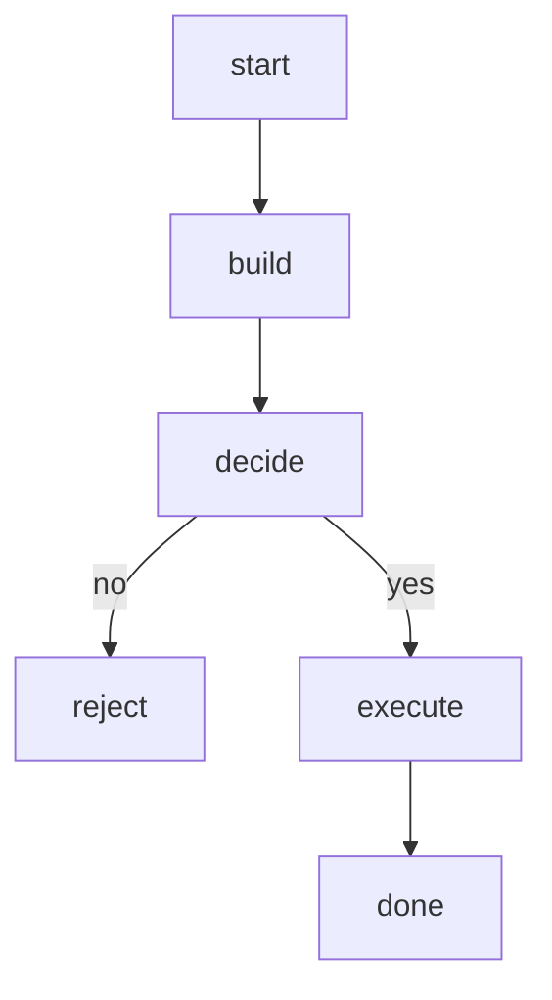
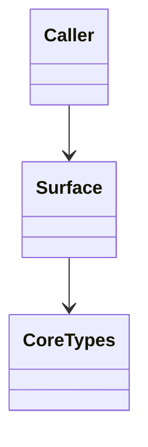
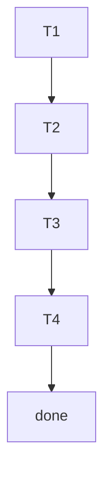

## Lifecycle
<!-- type: logic lang: mermaid -->



## Surface Map
<!-- type: dependency lang: mermaid -->



## Test Coverage
<!-- type: test-plan lang: mermaid -->



## Changes
<!-- type: changes lang: yaml -->

```yaml
files:
  - path: .aw/tech-design/projects/agentkit/specs/llm-provider-expansion.md
    action: create
    section: changes
    note: "This TD spec — source of truth for #2037"

  - path: projects/agentkit/llm/src/llm_provider_expansion.rs
    action: create
    section: changes
    note: "Module stub for LLM provider expansion Groq Ollama Mistral Bedrock Vertex — codegen marker block, implementation lands in this issue's PR"
```
