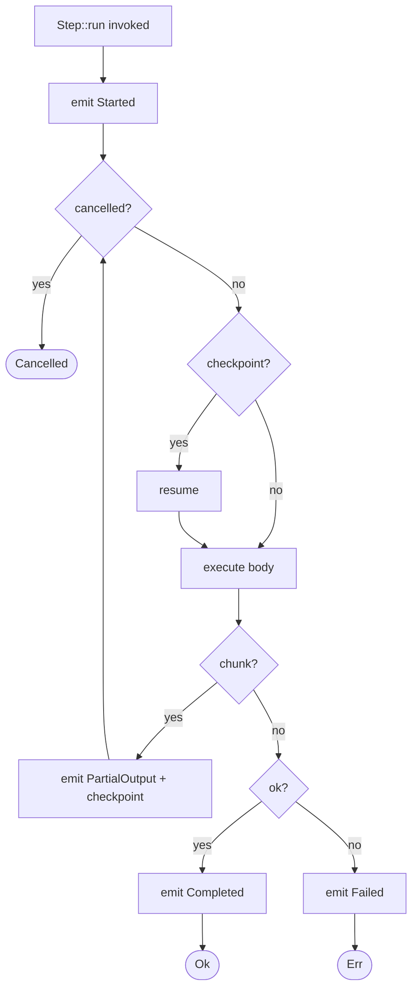
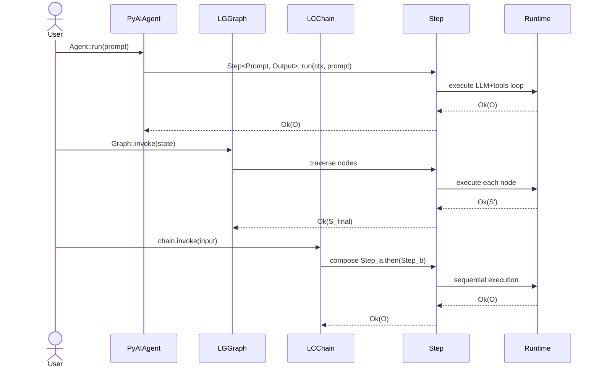
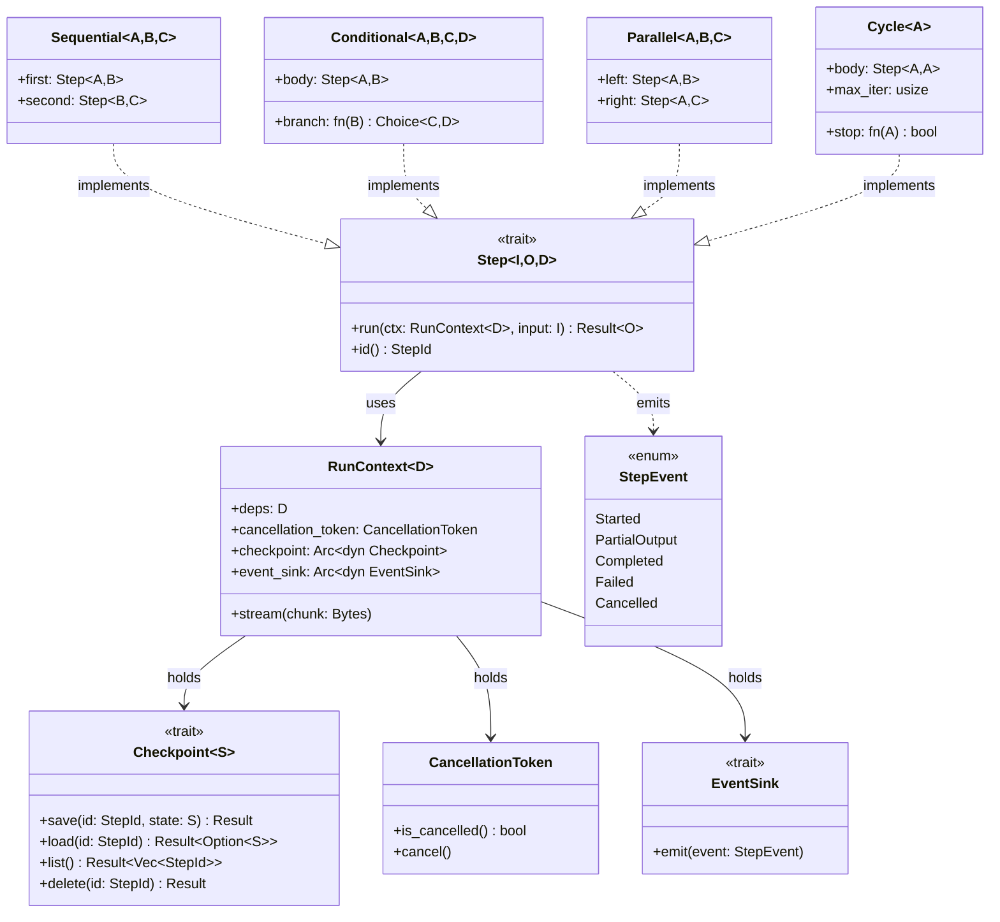

# Unified Inner Core

## Logic
<!-- type: logic lang: mermaid -->



## Interaction
<!-- type: interaction lang: mermaid -->



## Dependency
<!-- type: dependency lang: mermaid -->



## Test Plan

```mermaid
---
id: unified-inner-core-test-plan
---
requirementDiagram

requirement T1 {
  id: "T1"
  text: "PydanticAI Agent.run() port: tool-calling agent runs end-to-end as a single Step."
  risk: medium
  verifymethod: test
}

requirement T2 {
  id: "T2"
  text: "LangGraph StateGraph port: three-node graph with conditional edge executes correctly as Sequential + Conditional composition."
  risk: medium
  verifymethod: test
}

requirement T3 {
  id: "T3"
  text: "LangChain chain port: linear three-Step composition produces same output as hand-wired sequence."
  risk: low
  verifymethod: test
}

requirement T4 {
  id: "T4"
  text: "Compile-time type mismatch: composing Step<A,B> with Step<C,D> where B != C fails to compile (trybuild)."
  risk: low
  verifymethod: test
}

requirement T5 {
  id: "T5"
  text: "Cancellation: a Step running a 10-second sleep returns Err(Cancelled) within 100ms of token.cancel()."
  risk: medium
  verifymethod: test
}

requirement T6 {
  id: "T6"
  text: "Checkpoint resume: a Step interrupted at a yield point resumes from the same point with identical state."
  risk: high
  verifymethod: test
}

requirement T7 {
  id: "T7"
  text: "Streaming: a Step that yields N chunks emits exactly N StepEvent::PartialOutput events in order."
  risk: medium
  verifymethod: test
}

requirement T8 {
  id: "T8"
  text: "Parallel composition: two Steps running on the same input complete concurrently (wall-time less than sum of individual times)."
  risk: medium
  verifymethod: test
}

requirement T9 {
  id: "T9"
  text: "Cycle bounded iteration: a Step<A,A> with stop_predicate returning false always terminates at max_iter."
  risk: low
  verifymethod: test
}

requirement T10 {
  id: "T10"
  text: "Overhead benchmark: Step::run vs hand-rolled equivalent latency delta is under 5 percent on tool-calling benchmark."
  risk: high
  verifymethod: test
}
```

<!-- type: test-plan lang: mermaid -->



## Changes
<!-- type: changes lang: yaml -->

```yaml
changes:
  - path: projects/agentkit/core/src/step/mod.rs
    action: create
    section: dependency
    note: "Step<I, O, D> trait + StepId + impl helpers. Foundation for everything in Epic 2/3/4."

  - path: projects/agentkit/core/src/step/context.rs
    action: create
    section: dependency
    note: "RunContext<D> + CancellationToken + EventSink + Checkpoint hookup."

  - path: projects/agentkit/core/src/step/event.rs
    action: create
    section: dependency
    note: "StepEvent enum (Started, PartialOutput, Completed, Failed, Cancelled)."

  - path: projects/agentkit/core/src/step/checkpoint.rs
    action: create
    section: dependency
    note: "Checkpoint<S> trait surface. Backends ship as Epic 3 issues, not here."

  - path: projects/agentkit/core/src/step/combinator/sequential.rs
    action: create
    section: dependency
    note: "Sequential<A, B, C> = Step<A, B>.then(Step<B, C>) -> Step<A, C>."

  - path: projects/agentkit/core/src/step/combinator/conditional.rs
    action: create
    section: dependency
    note: "Conditional<A, B, C, D> = Step<A, B> + predicate -> Step<A, Either<C, D>>."

  - path: projects/agentkit/core/src/step/combinator/parallel.rs
    action: create
    section: dependency
    note: "Parallel<A, B, C> = (Step<A, B>, Step<A, C>) -> Step<A, (B, C)>."

  - path: projects/agentkit/core/src/step/combinator/cycle.rs
    action: create
    section: dependency
    note: "Cycle<A> = Step<A, A> + stop_predicate + max_iter -> Step<A, A>."

  - path: projects/agentkit/core/src/lib.rs
    action: update
    section: dependency
    note: "Re-export Step + combinators + RunContext + Checkpoint at crate root."

  - path: .aw/tech-design/projects/agentkit/logic/architecture.md
    action: update
    section: changes
    note: "Point the high-level architecture at unified-inner-core.md as the authoritative inner-core spec."

  - path: .aw/tech-design/projects/agentkit/README.md
    action: update
    section: changes
    note: "Add unified-inner-core to the spec index."
```

# Reviews

### Review 1
**Verdict:** approved

- [logic] Execution flowchart covers the four critical paths (cancelled, resumed-from-checkpoint, streaming chunk, completed/failed). Decision: approved — though a follow-up TD will need to specify the async yield-point semantics inside `execute_body` more precisely once the trait surface is being implemented (currently the node label is intentionally opaque).
- [interaction] Three-framework decomposition diagram correctly shows that `Agent.run`, `Graph.invoke`, and `chain.invoke` all reduce to traversals of `Step`. This is the load-bearing artifact of the spec — its presence validates the unification thesis.
- [dependency] classDiagram captures the core trait surface (`Step`, `RunContext`, `Checkpoint`, `EventSink`) plus the four combinator structs and their `implements: [Step]` relationship. Adequate for downstream issues to start from.
- [test-plan] T1–T3 cover the three reduction proofs (PydanticAI / LangGraph / LangChain ports). T4 is the compile-time wiring contract. T5–T9 cover cancellation, checkpoint resume, streaming, parallel concurrency, and bounded cycle. T10 is the overhead benchmark. Coverage matrix is complete versus R1–R16.
- [changes] The 11-file change list creates the `step/` module + four combinator files + updates the architecture spec index. Each path is concrete; no `(fill)` placeholders.

### Review 2
**Verdict:** approved

- [logic] Re-verified: state machine semantics are consistent with the trait surface in `dependency`. No new findings.
- [interaction] Re-verified: framework-reduction sequenceDiagram remains the load-bearing artifact. Approved.
- [dependency] Re-verified: trait surface stable. Approved.
- [test-plan] Re-verified: T1–T10 coverage matrix remains complete versus R1–R16. Approved.
- [changes] Re-verified: 11-file change list is concrete and bounded to the inner core. Approved.
