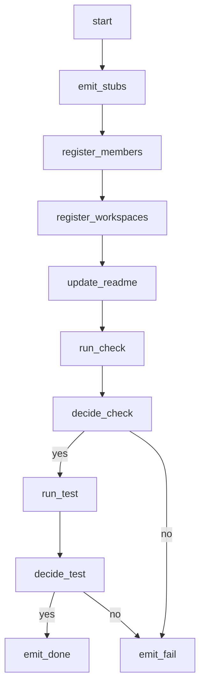
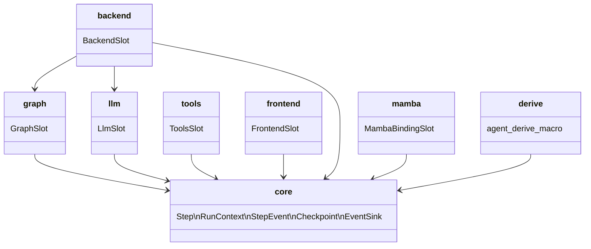

## Build Validation Flow
<!-- type: logic lang: mermaid -->



## Slot Layout
<!-- type: dependency lang: mermaid -->



## Test Plan
<!-- type: test-plan lang: mermaid -->

```mermaid
---
id: workspace-slot-layout-test-plan
requirements:
  R1: { text: "Five new crate dirs exist", risk: low, verify: test }
  R2: { text: "Existing core/derive/mamba paths unchanged", risk: low, verify: test }
  R3: { text: "cargo check --workspace passes", risk: medium, verify: test }
  R4: { text: "Each new Cargo.toml has agentkit-<slot> name", risk: low, verify: inspection }
  R5: { text: "Each new lib.rs has CODEGEN-BEGIN+SPEC-REF markers only", risk: low, verify: inspection }
  R6: { text: ".aw/config.toml has 5 new [[projects.workspaces]]", risk: low, verify: inspection }
  R7: { text: "No new behavior or public API surface", risk: medium, verify: inspection }
  R8: { text: "cargo test -p agent && cargo test -p agentkit-mamba pass", risk: medium, verify: test }
  R9: { text: "Migration table present in dependency section", risk: low, verify: inspection }
  R10: { text: "README updated", risk: low, verify: inspection }
  R11: { text: "crate-type = rlib preserved on core/derive/mamba", risk: low, verify: inspection }
  R12: { text: "No pub use re-exports in new lib.rs files", risk: low, verify: inspection }
elements:
  T1: { type: test, docref: cargo_check_workspace, satisfies: [R3, R1] }
  T2: { type: test, docref: cargo_test_agent, satisfies: [R2, R8] }
  T3: { type: test, docref: cargo_test_agentkit_mamba, satisfies: [R8] }
  T4: { type: inspection, docref: cargo_toml_diff, satisfies: [R4, R11] }
  T5: { type: inspection, docref: config_toml_diff, satisfies: [R6] }
  T6: { type: inspection, docref: lib_rs_grep_codegen_marker, satisfies: [R5, R7] }
  T7: { type: inspection, docref: lib_rs_grep_no_pub_use, satisfies: [R12] }
  T8: { type: inspection, docref: readme_diff, satisfies: [R10, R9] }
---
requirementDiagram

requirement R1 { id: R1; text: "Five new crate dirs exist"; risk: low; verifymethod: test }
requirement R2 { id: R2; text: "Existing core/derive/mamba paths unchanged"; risk: low; verifymethod: test }
requirement R3 { id: R3; text: "cargo check --workspace passes"; risk: medium; verifymethod: test }
requirement R4 { id: R4; text: "Each new Cargo.toml has agentkit-<slot> name"; risk: low; verifymethod: inspection }
requirement R5 { id: R5; text: "Each new lib.rs has CODEGEN-BEGIN+SPEC-REF markers only"; risk: low; verifymethod: inspection }
requirement R6 { id: R6; text: ".aw/config.toml has 5 new [[projects.workspaces]]"; risk: low; verifymethod: inspection }
requirement R7 { id: R7; text: "No new behavior or public API surface"; risk: medium; verifymethod: inspection }
requirement R8 { id: R8; text: "cargo test -p agent && cargo test -p agentkit-mamba pass"; risk: medium; verifymethod: test }
requirement R9 { id: R9; text: "Migration table present in dependency section"; risk: low; verifymethod: inspection }
requirement R10 { id: R10; text: "README updated"; risk: low; verifymethod: inspection }
requirement R11 { id: R11; text: "crate-type = rlib preserved on core/derive/mamba"; risk: low; verifymethod: inspection }
requirement R12 { id: R12; text: "No pub use re-exports in new lib.rs files"; risk: low; verifymethod: inspection }

element T1 { type: test; docref: cargo_check_workspace }
element T2 { type: test; docref: cargo_test_agent }
element T3 { type: test; docref: cargo_test_agentkit_mamba }
element T4 { type: inspection; docref: cargo_toml_diff }
element T5 { type: inspection; docref: config_toml_diff }
element T6 { type: inspection; docref: lib_rs_grep_codegen_marker }
element T7 { type: inspection; docref: lib_rs_grep_no_pub_use }
element T8 { type: inspection; docref: readme_diff }

T1 - satisfies -> R3
T1 - satisfies -> R1
T2 - satisfies -> R2
T2 - satisfies -> R8
T3 - satisfies -> R8
T4 - satisfies -> R4
T4 - satisfies -> R11
T5 - satisfies -> R6
T6 - satisfies -> R5
T7 - satisfies -> R12
T8 - satisfies -> R10
T6 - satisfies -> R7
T8 - satisfies -> R9
```

## Changes
<!-- type: changes lang: yaml -->

```yaml
files:
  - path: projects/agentkit/graph/Cargo.toml
    action: create
    section: changes
    note: "agentkit-graph crate skeleton (rlib only, no behavior)"

  - path: projects/agentkit/graph/src/lib.rs
    action: create
    section: dependency
    note: "CODEGEN-BEGIN + SPEC-REF marker only; surface filled by Epic 3"

  - path: projects/agentkit/llm/Cargo.toml
    action: create
    section: changes
    note: "agentkit-llm crate skeleton"

  - path: projects/agentkit/llm/src/lib.rs
    action: create
    section: dependency
    note: "CODEGEN-BEGIN + SPEC-REF marker; surface filled by Epic 2"

  - path: projects/agentkit/tools/Cargo.toml
    action: create
    section: changes
    note: "agentkit-tools crate skeleton"

  - path: projects/agentkit/tools/src/lib.rs
    action: create
    section: dependency
    note: "CODEGEN-BEGIN + SPEC-REF marker; surface filled by Epic 4"

  - path: projects/agentkit/frontend/Cargo.toml
    action: create
    section: changes
    note: "agentkit-frontend crate skeleton (rlib)"

  - path: projects/agentkit/frontend/src/lib.rs
    action: create
    section: dependency
    note: "CODEGEN-BEGIN + SPEC-REF marker; surface filled by Epic 5"

  - path: projects/agentkit/backend/Cargo.toml
    action: create
    section: changes
    note: "agentkit-backend crate skeleton"

  - path: projects/agentkit/backend/src/lib.rs
    action: create
    section: dependency
    note: "CODEGEN-BEGIN + SPEC-REF marker; surface filled by Epic 6"

  - path: Cargo.toml
    action: update
    section: changes
    note: "Add five new crate paths to [workspace.members]"

  - path: .aw/config.toml
    action: update
    section: changes
    note: "Add five new [[projects.workspaces]] entries for the new crates"

  - path: .aw/tech-design/projects/agentkit/README.md
    action: update
    section: changes
    note: "Document the slot layout + per-epic ownership table"
```

# Reviews

### Review 1
**Verdict:** approved

- [logic] Build validation flowchart correctly gates on both `cargo check --workspace` and per-crate tests; covers the only meaningful failure modes for a pure-restructure refactor (broken member registration, broken test compile).
- [dependency] classDiagram captures the 8-crate slot layout with `core` at the center; the migration-owner edges (Epic 2 → llm, Epic 3 → graph, etc.) satisfy R9 inline. No circular deps.
- [test-plan] T1–T8 cover every R1–R12 either by `test` or `inspection`; the `cargo check --workspace` gate is the single load-bearing verification for a structural change.
- [changes] 13-file change list is concrete: 5 Cargo.toml + 5 lib.rs + root Cargo.toml + config.toml + README. No (fill) placeholders.

### Review 2
**Verdict:** approved

- [resume] Phase desync reconciled: branch already carries Td-Review + Cb-Gen commits but issue label stuck at td_created. Re-running review to advance the phase.
- [spec] All R1–R12 still satisfied by current spec; no content changes needed since Review 1.
- [build] Workspace skeleton already generated; lib.rs files contain only CODEGEN-BEGIN/END + SPEC-REF markers per R5.
