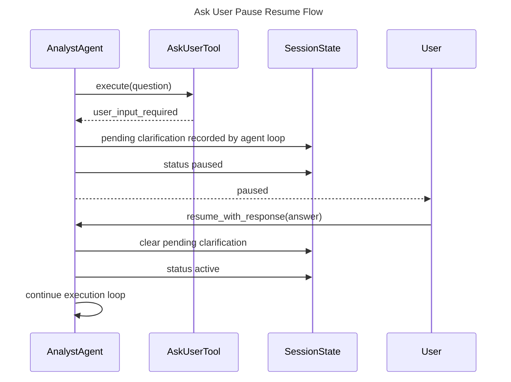
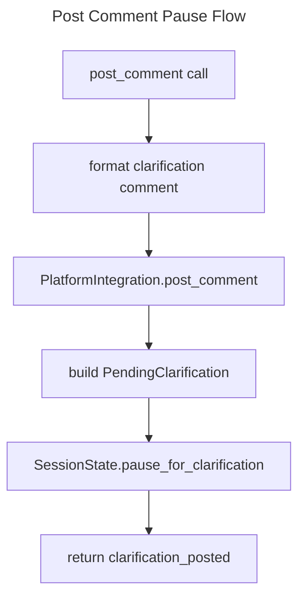

# Analysis Tools Spec

## Overview
<!-- type: overview lang: markdown -->

The analysis tool catalog supports analyst-style agent workflows. The tools can
pause execution for user input, store notes and findings in session state,
search the web, fetch web content, and post clarification comments to an
external issue platform.

`AskUserTool` returns a pending user-input signal without mutating session
state. `TakeNoteTool`, `RecordFindingTool`, and `PostCommentTool` mutate the
shared `SessionState` through an async lock. Web tools use `cclab-fetch` and
return structured JSON values.

## Schema
<!-- type: schema lang: yaml -->

```yaml
definitions:
  AskUserInput:
    type: object
    required: [question]
    properties:
      question: {type: string}
      context: {type: string}
      options:
        type: array
        items: {type: string}

  AskUserOutput:
    type: object
    required: [status, type, question]
    properties:
      status: {type: string, const: pending}
      type: {type: string, const: user_input_required}
      question: {type: string}
      context: {type: string}
      options:
        type: array
        items: {type: string}

  TakeNoteInput:
    type: object
    required: [content]
    properties:
      content: {type: string}
      category: {type: string}

  TakeNoteOutput:
    type: object
    required: [success, content, total_notes]
    properties:
      success: {type: boolean}
      content: {type: string}
      category: {type: string}
      total_notes: {type: integer, minimum: 0}

  RecordFindingInput:
    type: object
    required: [title, description, severity]
    properties:
      title: {type: string}
      description: {type: string}
      severity:
        type: string
        enum: [info, low, medium, high, critical]
      sources:
        type: array
        items: {type: string}

  RecordFindingOutput:
    type: object
    required: [success, title, severity, total_findings]
    properties:
      success: {type: boolean}
      title: {type: string}
      severity:
        type: string
        enum: [info, low, medium, high, critical]
      total_findings: {type: integer, minimum: 0}

  WebSearchInput:
    type: object
    required: [query]
    properties:
      query: {type: string}
      max_results: {type: integer, minimum: 1, default: 10}

  WebSearchOutput:
    type: object
    required: [query, results, count]
    properties:
      query: {type: string}
      results:
        type: array
        items:
          $ref: "#/definitions/WebSearchResult"
      count: {type: integer, minimum: 0}

  WebSearchResult:
    type: object
    required: [title, url, snippet]
    properties:
      title: {type: string}
      url: {type: string}
      snippet: {type: string}

  WebFetchInput:
    type: object
    required: [url]
    properties:
      url: {type: string}
      extract_text: {type: boolean, default: true}

  WebFetchOutput:
    type: object
    required: [url, status, content, length]
    properties:
      url: {type: string}
      status: {type: integer}
      content_type: {type: string}
      content: {type: string}
      length: {type: integer, minimum: 0}

  PostCommentInput:
    type: object
    required: [issue_id, question]
    properties:
      issue_id: {type: string}
      question: {type: string}
      options:
        type: array
        items:
          $ref: "#/definitions/PostCommentOption"
      multi_select: {type: boolean, default: false}

  PostCommentOption:
    type: object
    required: [label]
    properties:
      label: {type: string}
      recommended: {type: boolean}

  PostCommentOutput:
    type: object
    required:
      - status
      - type
      - platform
      - issue_id
      - comment_id
      - comment_url
      - question
      - multi_select
    properties:
      status: {type: string, const: user_input_required}
      type: {type: string, const: clarification_posted}
      platform: {type: string}
      issue_id: {type: string}
      comment_id: {type: string}
      comment_url: {type: string}
      question: {type: string}
      options:
        type: array
        items:
          $ref: "#/definitions/PostCommentOption"
      multi_select: {type: boolean}
```

## Interaction
<!-- type: interaction lang: mermaid -->





## Changes
<!-- type: changes lang: yaml -->

```yaml
changes:
  - path: projects/agent/core/src/tools/analysis.rs
    action: modify
    section: schema
    impl_mode: hand-written
    description: "Define AskUserTool, TakeNoteTool, RecordFindingTool, WebSearchTool, WebFetchTool, and PostCommentTool argument and result shapes."
  - path: projects/agent/core/src/tools/analysis.rs
    action: modify
    section: interaction
    impl_mode: hand-written
    description: "Implement pause signals, session note/finding writes, DuckDuckGo HTML parsing, HTML text extraction, and clarification comment posting."
```
