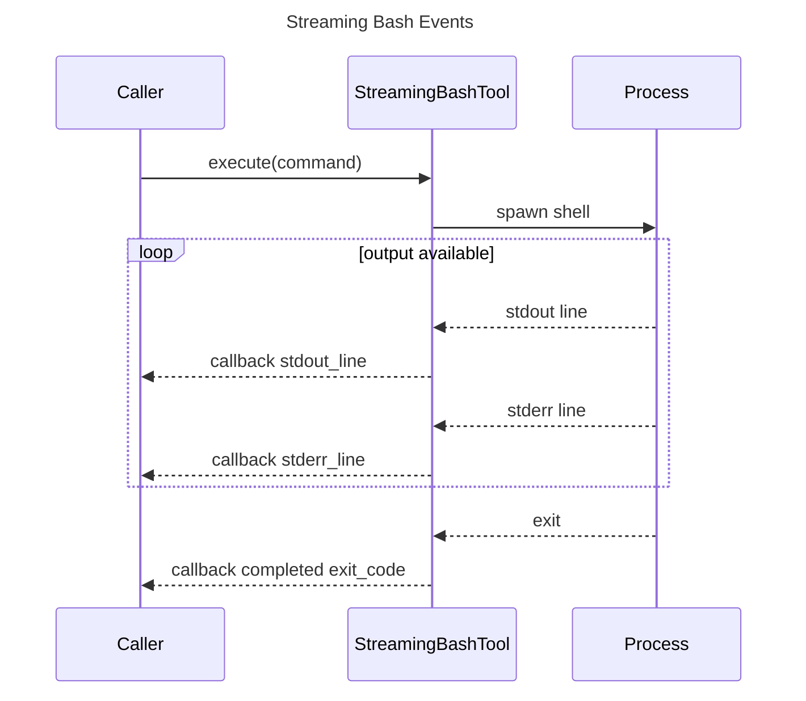
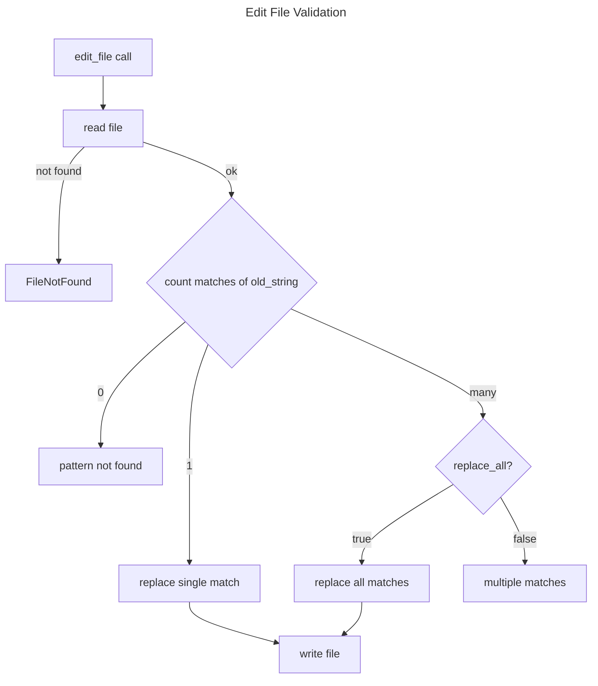

# Coding Tools Spec

## Overview
<!-- type: overview lang: markdown -->

The coding tool catalog exposes filesystem search, filesystem mutation, shell
execution, streaming shell execution, and codebase inspection tools through the
shared `Tool` trait. These tools are intended for coding and codebase-analysis
agents that need bounded command execution, file reading, editing, globbing,
grep-style search, manifest inspection, folder summaries, and token estimates.

## Schema
<!-- type: schema lang: yaml -->

```yaml
definitions:
  BashInput:
    type: object
    required: [command]
    properties:
      command: {type: string}
      timeout: {type: integer, minimum: 1}

  BashOutput:
    type: object
    required: [exit_code, stdout, stderr, success]
    properties:
      exit_code: {type: integer}
      stdout: {type: string}
      stderr: {type: string}
      success: {type: boolean}

  ReadFileInput:
    type: object
    required: [file_path]
    properties:
      file_path: {type: string}
      offset: {type: integer, minimum: 1}
      limit: {type: integer, minimum: 1, default: 2000}

  ReadFileOutput:
    type: object
    required: [content, total_lines, truncated]
    properties:
      content: {type: string}
      total_lines: {type: integer, minimum: 0}
      truncated: {type: boolean}

  WriteFileInput:
    type: object
    required: [file_path, content]
    properties:
      file_path: {type: string}
      content: {type: string}

  WriteFileOutput:
    type: object
    required: [success, bytes_written, lines_written]
    properties:
      success: {type: boolean}
      bytes_written: {type: integer, minimum: 0}
      lines_written: {type: integer, minimum: 0}

  EditFileInput:
    type: object
    required: [file_path, old_string, new_string]
    properties:
      file_path: {type: string}
      old_string: {type: string}
      new_string: {type: string}
      replace_all: {type: boolean, default: false}

  EditFileOutput:
    type: object
    required: [success, replacements]
    properties:
      success: {type: boolean}
      replacements: {type: integer, minimum: 0}

  GlobInput:
    type: object
    required: [pattern]
    properties:
      pattern: {type: string}
      path: {type: string}
      max_results: {type: integer, minimum: 1, default: 1000}

  GlobOutput:
    type: object
    required: [matches, total, truncated]
    properties:
      matches:
        type: array
        items: {type: string}
      total: {type: integer, minimum: 0}
      truncated: {type: boolean}

  GrepInput:
    type: object
    required: [pattern]
    properties:
      pattern: {type: string}
      path: {type: string}
      file_type:
        type: string
        enum: [rs, py, ts, js, go, java, c, cpp]
      context: {type: integer, minimum: 0, default: 2}
      max_results: {type: integer, minimum: 1, default: 500}

  GrepOutput:
    type: object
    required: [matches, total]
    properties:
      matches:
        type: array
        items:
          $ref: "#/definitions/GrepMatch"
      total: {type: integer, minimum: 0}

  GrepMatch:
    type: object
    required: [file, line, content]
    properties:
      file: {type: string}
      line: {type: integer, minimum: 1}
      content: {type: string}
      context_before:
        type: array
        items: {type: string}
      context_after:
        type: array
        items: {type: string}

  CodingToolLimits:
    type: object
    required: [bash_timeout_secs, bash_max_output_bytes, read_max_file_size_bytes]
    properties:
      bash_timeout_secs: {type: integer, const: 120}
      bash_max_output_bytes: {type: integer, const: 102400}
      read_max_file_size_bytes: {type: integer, const: 10485760}
```

## Interaction
<!-- type: interaction lang: mermaid -->





## Changes
<!-- type: changes lang: yaml -->

```yaml
changes:
  - path: projects/agent/core/src/tools/bash.rs
    action: modify
    section: interaction
    impl_mode: hand-written
    description: "Define BashTool and StreamingBashTool command execution behavior, output truncation, and streaming callbacks."
  - path: projects/agent/core/src/tools/file.rs
    action: modify
    section: schema
    impl_mode: hand-written
    description: "Define ReadFileTool, WriteFileTool, EditFileTool, GlobTool, and GrepTool argument and result shapes."
  - path: projects/agent/core/src/tools/read_manifest.rs
    action: modify
    section: schema
    impl_mode: hand-written
    description: "Expose manifest inspection for workspace-aware coding agents."
  - path: projects/agent/core/src/tools/list_folder_summary.rs
    action: modify
    section: schema
    impl_mode: hand-written
    description: "Expose folder summary inspection for codebase exploration."
  - path: projects/agent/core/src/tools/estimate_tokens.rs
    action: modify
    section: schema
    impl_mode: hand-written
    description: "Expose heuristic file and directory token estimation for context budgeting."
```
