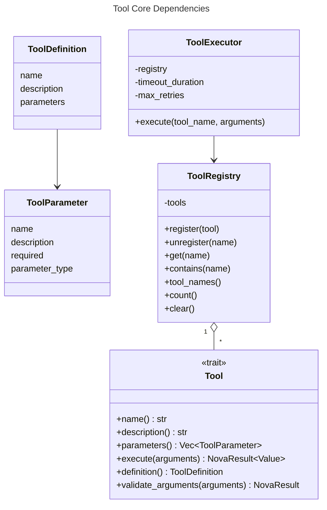
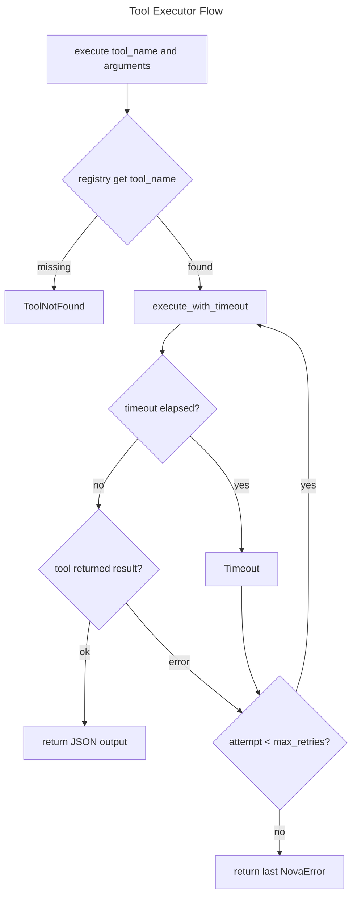

# Tool Core

## Overview
<!-- type: overview lang: markdown -->

The core tool system lives in `projects/agent/core/src/tools/tool.rs` and
`projects/agent/core/src/tools/registry.rs`. `Tool` defines the async execution
contract. `ToolRegistry` stores named `Arc<dyn Tool>` entries in a thread-safe
map. `ToolExecutor` resolves tools from a registry and executes them with a
timeout and bounded retry loop, returning the tool's JSON output directly.

## Schema
<!-- type: schema lang: yaml -->

```yaml
definitions:
  ToolParameter:
    type: object
    required: [name, description, required, parameter_type]
    properties:
      name: {type: string}
      description: {type: string}
      required: {type: boolean}
      parameter_type:
        type: string
        enum: [string, integer, number, boolean, array, object]

  ToolDefinition:
    type: object
    required: [name, description, parameters]
    properties:
      name: {type: string}
      description: {type: string}
      parameters:
        type: array
        items:
          $ref: "#/definitions/ToolParameter"

  Tool:
    type: object
    required: [name, description, parameters, execute]
    properties:
      name:
        type: string
        description: "Stable tool name used by LLM tool calls."
      description:
        type: string
      parameters:
        type: array
        items:
          $ref: "#/definitions/ToolParameter"
      execute:
        type: string
        const: "async fn execute(arguments: serde_json::Value) -> NovaResult<serde_json::Value>"

  ToolExecutor:
    type: object
    required: [registry, timeout_duration, max_retries]
    properties:
      registry:
        type: string
        description: "Arc<ToolRegistry>"
      timeout_duration:
        type: integer
        description: "Timeout in seconds."
        default: 30
      max_retries:
        type: integer
        default: 1
```

## Dependency
<!-- type: dependency lang: mermaid -->



## Interaction
<!-- type: interaction lang: mermaid -->



## Changes
<!-- type: changes lang: yaml -->

```yaml
changes:
  - path: projects/agent/core/src/tools/tool.rs
    action: modify
    section: schema
    impl_mode: hand-written
    description: "Maintain ToolParameter, ToolDefinition, Tool trait, ToolExecutor, and timeout/retry execution."
  - path: projects/agent/core/src/tools/registry.rs
    action: modify
    section: schema
    impl_mode: hand-written
    description: "Maintain thread-safe ToolRegistry registration, lookup, enumeration, and removal."
  - path: projects/agentic-workflow/src/agents/coding.rs
    action: modify
    section: interaction
    impl_mode: hand-written
    description: "Build tool definitions from ToolRegistry and execute requested tools through ToolExecutor."
  - path: projects/agentic-workflow/src/agents/analyst.rs
    action: modify
    section: interaction
    impl_mode: hand-written
    description: "Use ToolRegistry and ToolExecutor for analysis and platform integration tools."
```
