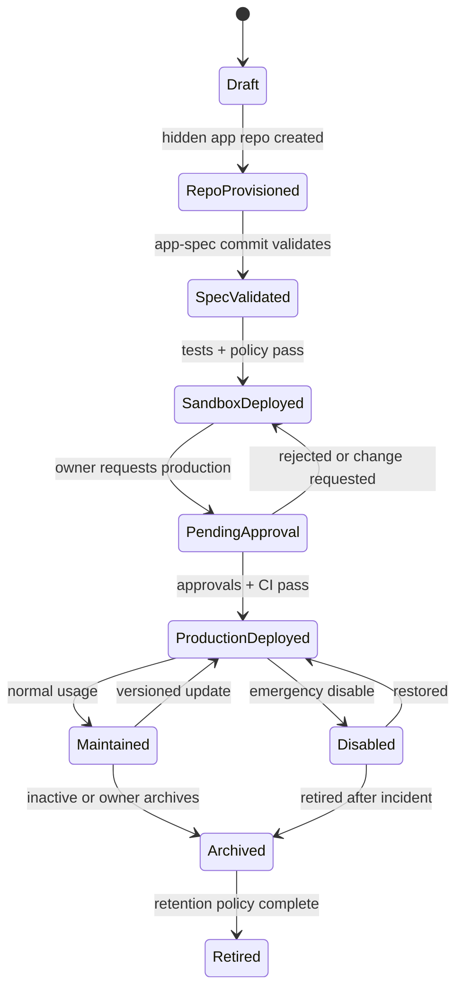

# cue - Prompt-to-Governed-Artifact Control Plane

Status: draft. This document is the active Cue product architecture. It
supersedes the earlier terminal SDD-runner, TUI, and generic multi-surface
framing for Cue.

## Positioning

Cue is a governed web control plane for enterprise internal work artifacts.
Business users describe the workflow they need; Cue turns that intent into a
versioned artifact graph, provisions hidden artifact source, evaluates policy
and risk, deploys a sandbox when the runtime artifact requires one, routes
approval, and operates the production runtime artifact through a registry.

Cue is not a simple FE/BE project split. The hard problem is managing many
team-owned and user-owned apps without exposing Git, CI, deployment wiring, or
runtime tenancy to business users.

```text
Prompt
  -> WorkItem gate
  -> routing, requirements, and clarification
  -> PRD artifact
  -> TD artifact
  -> runtime artifact draft
  -> assigned governed agent team
  -> hidden per-project GitLab project
  -> artifact, policy, permission, connector, and test commits
  -> sandbox deploy from a repo ref
  -> policy and approval gate
  -> release tag
  -> production deploy
  -> registry, audit, health, rollback, archive, retirement
```

## Product Boundary

| In | Out |
|----|-----|
| Internal employee work apps | Customer-facing applications |
| Tracker, approval, triage, intake, dashboard workflows | Core transaction system ownership |
| Spec-backed primitive composition | Unbounded arbitrary code generation |
| Hidden per-app repo lifecycle | User-visible Git/GitLab workflow |
| Registry, ownership, data tenancy, policy, audit, lifecycle | Shadow IT with no central control |
| Browser builder, studio, registry, and admin console | Terminal-first end-user experience |

`score` remains the development lifecycle tool used to build Cue itself.
Generated business apps do not run Score CRRR. They run Cue's App Spec and app
release lifecycle.

## Reference Context

- [AI workbench UI reference](references/ai-workbench-ui-reference.md) captures
  official Firebase Studio and Google AI Studio patterns for prompt-first
  workspaces, blueprint/spec review, preview plus artifact tabs, deploy/test
  flow, resource/API permission gates, and gallery/template/remix behavior.
  This is reference context only. Cue adapts those patterns into governed User
  Workspace and Admin Workspace flows with durable App Spec artifacts, hidden
  app repos, runtime tenancy, policy checks, and Admin review tickets.
- [SDD Workbench UI System](../sdd/specs/workbench-ui-system.md) is the shared
  UI contract for SDD-based work surfaces. Cue borrows enterprise UI system
  specifications for density and interaction patterns, but production product
  code should expose Cue/SDD-owned primitives rather than treating a vendor UI
  library as the product architecture.

## App Owner Interaction Model

Cue is conversation-first, but not chat-only. The app owner speaks or types
business intent inside a Project Session. The Session is the working thread;
the WorkItem is the durable goal context attached to that thread. Agents do not
execute project work without an active WorkItem. When a Session has no active
WorkItem, Cue either creates or clarifies one; when it has an active WorkItem,
Cue advances that WorkItem's delivery plan.

A WorkItem is not a single ticket or a single artifact. It is a Goal Delivery
Unit that records project, owner, goal, route, target artifacts, blockers,
stage tasks, gates, and artifact outputs. Goal granularity is user-defined:
"reporting system" can be one WorkItem with import/export tasks, while another
owner may split report import and report export into separate WorkItems. Cue
normalizes execution inside each WorkItem into comparable todo-sized stage
tasks.

PRD and TD are first-class artifacts inside the WorkItem lifecycle. Runtime
artifacts such as workflow apps depend on them and can then be previewed,
tested, approved, released, and rolled back.

Each app receives a governed agent team:

| Agent role | Responsibility |
|------------|----------------|
| PM agent | Clarifies goal, scope, owner, success metric, and release readiness |
| Designer agent | Maps requirements to approved UI primitives and app layout |
| Dev agent | Applies App Spec and generated artifact changes to the hidden repo |
| Data agent | Defines runtime tenant binding, app database boundary, connectors, and data contracts |
| QA/Policy agent | Runs permission, workflow, policy, migration, and audit checks |
| Release agent | Manages sandbox, production request, release ref, rollback, and Registry update |

The durable state is not the conversation transcript. The durable state is the
WorkItem plus artifact graph: PRD, TD, App Spec or runtime manifest, hidden repo
refs, runtime tenant binding, policy results, test results, approval records,
release refs, Registry state, and audit events. Chat is an input and explanation
surface for that state.

The canonical Session and WorkItem delivery model is captured in
[`session-workitem-delivery-model.md`](session-workitem-delivery-model.md).

## Source of Truth

Cue has three distinct sources of truth. Keeping them separate is required for
scale.

| Layer | Source of truth | User-visible? | Purpose |
|-------|-----------------|---------------|---------|
| Cue control plane | `projects/cue/{app,fe,be,schemas,examples,docs}` plus this TD tree | Developers only | Cue product implementation, contracts, examples, and specs |
| Generated app artifacts | One hidden GitLab project per app | Hidden from business users | Versioned App Spec, policy, permissions, connector config, tests, generated assets, CI, release refs |
| Runtime data | Runtime data substrate keyed by app/env/version/tenant | App UI only | Records, comments, attachments, workflow state, usage, audit streams, runtime events |

The hidden GitLab repo is durable artifact truth for each generated app. It is
not the runtime database. Runtime records and events must not be stored as Git
history.

## Hidden App Repository Contract

Every generated app gets one hidden GitLab project. Cue owns provisioning,
commits, merge requests, tags, CI, archival, and deletion policy. Business users
interact through Cue Registry and App Studio only.

Minimum repository layout:

```text
app-spec.json
policy.json
permissions.json
connectors.json
tests/
  permission-tests.json
  workflow-tests.json
  policy-tests.json
generated/
  runtime-config.json
  ui-manifest.json
releases/
  release-<version>.json
.gitlab-ci.yml
```

MVP can start with spec, policy, permissions, connector config, tests, CI, and
release metadata only. Generated code or generated UI assets are optional until
the primitive runtime requires them.

The Cue Registry stores the mapping from product identity to GitLab identity:

```yaml
app_repository:
  app_id: string
  gitlab_host: string
  gitlab_project_id: integer
  gitlab_full_path: string
  default_branch: main
  current_spec_ref: git_sha
  current_release_tag: string | null
  sandbox_ref: git_sha | null
  production_ref: git_sha | null
  archived_at: timestamp | null
```

This mapping is platform state, not business-user UI. The UI can show version,
release, health, and changelog, but it must not require users to know GitLab.

## Runtime Data Tenancy

Runtime data is stored outside Git with app-aware tenancy. The durable keys are:

```yaml
runtime_tenant:
  app_id: string
  environment: sandbox | production
  app_version: integer
  release_ref: string
  owner_namespace: personal | team
  owner_user: string | null
  owner_team: string | null
  data_region: string
  storage_cluster_id: string
  storage_cluster_mode: shared | dedicated
  storage_isolation_unit: database
  database_name: string
  retention_policy: string
```

Runtime stores must support:

- Records and field values.
- Comments, mentions, and notifications.
- Attachments and blob metadata.
- Workflow state and transition history.
- Usage metrics and health signals.
- Runtime audit events.
- Export, retention, archive, and erase policies.

Rollback switches the deployed release ref. It does not rewrite runtime data.
Schema migrations and compatibility checks are therefore part of the release
gate.

Managed Cue defaults to a shared AlloyDB cluster per environment and region.
Generated apps are isolated by app-owned database, schema, and runtime role
inside that cluster. Dedicated AlloyDB clusters are platform-approved
exceptions for high-risk, high-load, residency, backup, encryption, or
isolation cases.

## Ownership Namespace

Cue must model ownership before it models more app types. A generated app can be
personal, team-owned, cross-team, or platform-owned. The initial contract should
not pretend every app is just a frontend/backend pair.

Minimum ownership fields:

```yaml
ownership:
  namespace: personal | team | cross_team | platform
  owner_user: string | null
  owner_team: string | null
  data_owner: string | null
  platform_owner: string
  emergency_contact: string
  quota_policy: string
  transfer_policy: owner_required | manager_required | platform_required
```

Registry and policy behavior depends on this namespace:

- Personal apps default to sandbox-only or low-risk team sharing.
- Team apps require a durable team owner and transfer path.
- Cross-team apps require manager and data-owner routing.
- Platform-owned apps require stronger release and incident controls.
- Orphaned apps must be detected and disabled, transferred, archived, or
  retired.

## Web Product Areas

| Area | Responsibility |
|------|----------------|
| Artifact Studio | Project owner front office: project list, intent workstream, WorkItem -> PRD -> TD -> runtime artifact dependency status, next action, preview, sandbox, production request |
| Admin | High-information governance and operations console: review queues, workflow evidence, blockers, policy, runtime, repo diagnostics, controls |
| Runtime Artifacts | Employee-facing interactive workflows, dashboards, reports, automations, and other generated artifacts from approved specs |
| Project Registry | Catalog, duplicate detection, owner transfer, project repo mapping, release state, health, usage, archive, retirement |

Artifact Studio is not a general chat product or free visual builder. Its left
navigation is Project and Session oriented because that is how app owners enter
work. WorkItems appear as active context files attached to Sessions and as
searchable project state, not as the primary navigation hierarchy. The right
context pane should show the active WorkItem delivery plan: stages, todo-sized
tasks, artifacts, gates, blockers, and next action.

General chat should redirect to ChatGPT/Gemini instead of consuming Cue's
project workflow. Project work must first create or attach a WorkItem, then
advance that WorkItem.

## App Spec Contract

App Spec describes the app behavior and governance intent. It does not contain
GitLab project ids or runtime record data.

The canonical v0 schema is
[`../../../../projects/cue/schemas/app-spec.v0.schema.json`](../../../../projects/cue/schemas/app-spec.v0.schema.json).
The tracker MVP example is
[`../../../../projects/cue/examples/tracker-app-spec.v0.json`](../../../../projects/cue/examples/tracker-app-spec.v0.json).
Lifecycle, risk, approval, registry, and audit behavior is captured in
[`governance-contract.md`](governance-contract.md).
Hidden per-app GitLab repository lifecycle is captured in
[`hidden-app-repo-lifecycle.md`](hidden-app-repo-lifecycle.md).
Ownership namespace, quota, transfer, orphan detection, Registry visibility,
and hidden GitLab path mapping are captured in
[`ownership-namespace-quota.md`](ownership-namespace-quota.md).
Runtime data tenancy and the AlloyDB/local PostgreSQL storage boundary are
captured in [`runtime-data-tenancy.md`](runtime-data-tenancy.md).
Cue-local user stories are captured in
[`cue-user-story-contract.md`](cue-user-story-contract.md) until
SDD ships the upstream `user-story` section type in #1540.
The first Prompt Builder -> Studio -> Sandbox -> Approval -> Registry user
story and wireframe contract is captured in
[`web-mvp-user-story.md`](web-mvp-user-story.md).

Minimum v0 sections:

```yaml
schema_version: cue.app-spec.v0
app:
  id: string
  name: string
  description: string
  goal: object
  owner_team: string
  owner_user: string
  risk_tier: tier_0 | tier_1 | tier_2 | tier_3 | tier_4
  lifecycle_status: draft | sandbox | production | archived | retired
users: object
data: object
permissions: object
workflow: object
automation: object
dashboard: object
audit: object
tests: object
deployment: object
```

Near-term expansion should happen through explicit issues for hidden repo
lifecycle, runtime data tenancy, and ownership namespace rather than by mixing
all concerns into `app-spec.v0`.

## Risk Model

| Tier | Name | MVP behavior |
|------|------|--------------|
| Tier 0 | Personal Utility | Auto-create personal sandbox only |
| Tier 1 | Team Productivity | Requires app owner approval |
| Tier 2 | Cross-functional Workflow | Requires app owner, team manager, data owner as needed |
| Tier 3 | Operational Critical | Requires platform, security, system owner, and possible legal review |
| Tier 4 | High-risk / Regulated | Blocked in MVP; route to formal engineering project |

Tier 4 examples are automatic refunds, payment updates, order-state writes,
inventory writes, price changes, member-benefit changes, large personal-data
exports, and externally sent legal or contract documents.

## Lifecycle



Every transition writes an audit event. Transitions that affect sandbox or
production also write a release or registry record with the exact app repo ref.

## Architecture

```text
Browser
  Artifact Studio / Runtime Artifacts / Registry / Admin
        |
        v
Cue Web API
  Auth, sessions, app CRUD, registry, approvals, repo operations, runtime routing
        |
        v
Application Services
  Prompt-to-WorkItem service
  Prompt-to-PRD service
  SDD work item service
  Governed agent orchestration service
  Spec service
  Hidden repo provisioner
  Policy and risk service
  Test service
  Deployment service
  Runtime tenant service
  Registry service
  Audit service
        |
        +--> Hidden GitLab projects
        |      App Spec, policy, permissions, connectors, tests, generated assets, release tags
        |
        +--> Runtime data substrate
        |      Records, comments, attachments, workflow state, usage, runtime audit
        |
        +--> Enterprise systems
               IAM / SSO / HR groups / connector gateway / notification channels / SIEM
```

## Canonical Tech Stack

Cue's product stack is fixed:

```text
Backend: Mamba
Frontend: Jet
Development lifecycle: score
Generated app artifact store: hidden GitLab projects
Runtime data: app-aware runtime substrate, not Git
```

Mamba owns backend application code: APIs, App Spec services, hidden repo
provisioning, policy and risk evaluation, registry, deployment workflow,
runtime tenancy, audit, connector orchestration, and test harness logic.

Cue backend uses SDD and cclab-agent as Mamba libraries, not as shell-driven
CLI subprocesses. This keeps the browser product runtime deterministic,
auditable, and deployable without depending on developer command-line state.
`claude -p` may be used as a temporary local adapter behind the agent provider
boundary, but Cue product code should never call it directly. The stable
interface is a WorkItem task envelope plus structured agent result compatible
with AgentKit core and future `cclab-agent-mamba`.
While Mamba is catching up, Python code that previews future Mamba-facing
library APIs lives under `projects/cue/backend/src/mambalibs/`. Treat
`mambalibs` as a contract-compatible shim: it may provide deterministic or
Claude-headless adapters, but Cue services must still depend on the same
task/result shape that the real Mamba library will expose.

Required Mamba library surfaces:

| Surface | Product responsibility |
|---------|------------------------|
| `pgkit` | Postgres persistence, connection/config boundary, query execution result shape |
| `sdd-mamba` | Work item state, App Spec artifact transitions, review gates, audit-linked lifecycle events |
| `cclab-agent-mamba` | Governed PM/designer/dev/data/QA/release agent execution, structured artifact output, Admin review-ticket emission |

The CLI wrappers for SDD and cclab-agent can remain for developers and
operators, but Cue product code should depend on the library API shape.

Jet owns the browser product surface: web shell, routes, build pipeline, dev
server, bundling, assets, and frontend test/dev workflow. Cue frontend product
code should be pure TS/TSX running on Jet.

Rust remains substrate/tooling, not Cue product code. Cue should use
Mamba-facing cclab bindings only after the relevant Mamba path is stable enough
for product use.

## Substrate Validation Policy

Cue should not stall just because Jet or Mamba is still maturing. Product work
continues on thin vertical slices while substrate defects are isolated and sent
back to the owning project.

Frontend rule:

- Use Jet as Cue's product frontend substrate.
- If Jet behavior blocks a slice, reproduce the same minimal React/TSX case in
  Vite.
- If Vite works and Jet fails, file or link a `project:jet` / `crate:jet` issue
  with the minimal repro, runtime or build error, and expected behavior.
- Keep any Cue-side workaround narrow, documented, and removable once Jet is
  fixed.
- If Vite also fails, debug Cue app code or dependency usage before blaming Jet.

Backend rule:

- Use Mamba as Cue's product backend target.
- If Mamba behavior blocks a slice, reproduce the equivalent contract in
  CPython or a mature reference backend stack.
- If the reference path works and Mamba fails, file or link a `project:mamba` /
  `crate:mamba` issue with the minimal repro and expected behavior.
- Temporary CPython bridges are allowed only to unblock thin product slices and
  must preserve the future Mamba API shape, App Spec contracts, policy,
  registry, runtime tenancy, and audit semantics.

## Active Project Layout

```text
projects/cue/
  artifact-studio/ Project owner frontend site on Jet
  admin/           Platform admin frontend site on Jet
  backend/         Cue API, jobs, adapters, and domain logic on Mamba/mambalibs.http
    mambalibs/     Temporary Python preview of future Mamba library contracts
  shared/          Shared domain types, API client, and status mapping only
  schemas/         Artifact and runtime contracts
  examples/        Versioned example manifests
  docs/            Legacy terminal/TUI notes
```

Planned generated-app infrastructure:

```text
projects/cue/app-repo-template/   hidden app GitLab template, not created yet
```

There is no Rust product crate under `projects/cue`. Score routing must not run
`cargo test -p cue` for this project.

The current `fe/` and `be/` implementation is transitional. The target boundary
is:

```text
artifact-studio FE -> backend API
admin FE           -> backend API
backend            -> repo backend / DB / deploy / agents / policy
```

Generated project artifact source lives in hidden project repos, not in a Cue
`runtime/` directory. Cue manages source-code lifecycle technically; project
owners only manage intent, artifact dependency review, Sandbox acceptance,
Production request, and owned project state.

## Data Model

Initial entities:

| Entity | Purpose |
|--------|---------|
| Project | Workspace identity, name, goal, owner, risk, lifecycle, current release |
| WorkItem | Governed intake and routing ticket created from a prompt; gates every prompt-to-X flow |
| Artifact | PRD, TD, App Spec, runtime manifest, or future artifact produced after WorkItem acceptance |
| ArtifactRepository | Hidden GitLab project mapping, refs, branches, release tags, archival state |
| ArtifactVersion | Immutable artifact snapshot and release status |
| AppSpec | Runtime-app artifact contract: normalized requirements, manifest, validation, risk result |
| OwnershipNamespace | Personal, team, cross-team, or platform ownership and transfer rules |
| RuntimeTenant | App/environment/version tenancy, region, retention, storage binding |
| RuntimeRecord | User-created app data stored outside Git |
| DataConnector | Approved data source, owner, allowed fields, sensitivity, policies |
| PermissionPolicy | Role-resource-action-condition grants |
| AuditLog | Control-plane and runtime event stream |
| TestRun | Spec, permission, workflow, policy, integration, regression results |
| Deployment | Sandbox and production release records with rollback target |
| ApprovalRequest | Required approvers, status, decision, comments, timestamps |
| Template | Reusable app pattern with owner and version |

## MVP Prompt Routes

Build prompt-to-WorkItem and prompt-to-PRD first. WorkItem is the ticket for
every later prompt-to-X route.

1. User submits a prompt for a project or artifact change.
2. Cue creates or updates a WorkItem and classifies intent, project, owner,
   target artifact type, route, risk hints, blockers, and whether the prompt is
   general chat that should be redirected out of Cue.
3. Cue asks only the missing clarification required to make the WorkItem
   actionable.
4. Accepted WorkItems can invoke prompt-to-PRD.
5. Cue generates or revises a PRD artifact from the WorkItem and clarified
   intent.
6. Artifact Studio shows simple owner-facing state: started, waiting for input,
   completed, or blocked.
7. PRD approval unlocks future prompt-to-TD; TD approval unlocks future
   prompt-to-runtime.
8. Every transition writes lifecycle and audit state that Admin can inspect.

Success for the first MVP means at least five pilot prompts across three
departments can reliably become accepted WorkItems, and accepted WorkItems can
produce reviewable PRD artifacts without exposing Git, CI, or backend internals
to project owners.

## Implementation Sequencing

### Phase 0 - Direction and Routing Cleanup

- Replace terminal-first docs and product framing.
- Treat Cue as a web control plane for many generated apps, not a single FE/BE
  application.
- Keep legacy terminal/TUI specs as historical notes only.
- Fix Score routing so Cue workspaces map to TypeScript, Python, and schema
  targets instead of a nonexistent Rust crate.

### Phase 1 - Hidden Repo, Ownership, and Runtime Contracts

- Specify hidden per-app GitLab project lifecycle.
- Specify app repo template contents and CI responsibilities.
- Specify Cue Registry mapping for `app_id` to GitLab project/ref/release.
- Specify ownership namespace, quota, transfer, orphan detection, and retirement.
- Specify runtime data tenancy and storage boundaries.

### Phase 2 - Spec and Governance Core

- WorkItem lifecycle and prompt router.
- Prompt-to-PRD artifact generation contract.
- App Spec validation.
- Risk tier assignment.
- Policy engine v0.
- App Registry persistence.
- Audit event writer.
- Approval request model.

### Phase 3 - Web Foundation

- Prompt-to-WorkItem shell.
- Prompt-to-PRD review shell.
- Artifact Studio shell.
- Registry shell.
- Admin Console shell.
- Jet build/dev/test flow connected to the backend scaffold.

### Phase 4 - Tracker Runtime

- Tracker primitive renderer.
- Table/form/status/owner/due-date/comment/attachment/dashboard primitives.
- Permission simulation.
- Synthetic test data.
- Sandbox runtime backed by runtime tenancy.

### Phase 5 - Production Deployment

- Hidden app repo release tags.
- Approval routing.
- Production deploy.
- Rollback.
- Usage and health metrics.
- Template creation from successful pilot apps.

### Phase 6 - Approval and Triage Apps

- Approval nodes and conditional routing.
- Triage intake, assignment, escalation, and SLA.
- Expanded connector and notification integrations.

## Legacy Notes

The old Rust `projects/cue/src/tui/` issue-CRRR driver is no longer active
product code. Legacy terminal notes are kept under
[`../../../../projects/cue/docs/legacy/`](../../../../projects/cue/docs/legacy/)
for historical reference and should not be extended as a user-facing surface.

The old `cue-app-protocol*`, `cue-multi-target-slice`, and
`cue-tui-lifecycle-ux` specs are historical unless rewritten for this product
direction. They describe a developer runtime surface, not the governed
business-app control plane.

## Open Questions

1. Which GitLab group/namespace should hidden app repos live under?
2. Should one generated app always map to one GitLab project, or can future
   enterprise templates group tightly coupled apps?
3. Which IAM/group source owns user/team/manager/data-owner resolution?
4. Which runtime data store is the MVP substrate for records, comments,
   attachments, workflow state, and audit?
5. Which connector gateway exists today, if any?
6. What is the exact Tier 4 blocklist for the first pilot?
7. What is the quota and retirement policy for personal apps?
