# Cue App Protocol

## Schema
<!-- type: schema lang: yaml -->

```yaml
$schema: "https://json-schema.org/draft/2020-12/schema"
$id: cue-app-protocol-schema
description: >
  Renderer-neutral Cue protocol above sdd::runtime::Session and below Jet UI
  surfaces. TUI, desktop, and web adapters send commands and queries through
  this contract and consume events from it.

definitions:
  RequestId:
    type: string
    description: Client-generated id used to correlate command/query responses.
  SessionId:
    type: string
    description: Cue session identifier. Stable for one running app session.
  IssueSlug:
    type: string
    description: SDD issue slug. Worktree paths are intentionally not exposed.
  TurnId:
    type: string
    description: User/assistant turn identifier scoped to a session.
  ApprovalId:
    type: string
    description: Pending tool approval identifier scoped to a session.

  ProtocolOwner:
    type: string
    enum: [cue, sdd, jet]
    description: Contract owner for a protocol message.

  CueCommandKind:
    type: string
    enum:
      - submit_chat
      - new_issue
      - pick_issue
      - close_issue
      - ship
      - discard
      - switch_issue
      - set_model
      - approve_tool
      - reject_tool
    description: User or UI intent accepted by Cue.

  CueQueryKind:
    type: string
    enum:
      - current_session
      - issue_list
      - issue_detail
      - transcript
      - available_tools
      - usage
      - transport_health
    description: Read-only request for app or runtime state.

  CueEventKind:
    type: string
    enum:
      - command_accepted
      - query_result
      - session_changed
      - transcript_delta
      - phase_changed
      - tool_use
      - tool_result
      - approval_requested
      - error
      - reconnected
    description: Event emitted by Cue to UI and transport consumers.

  SessionPhase:
    type: string
    enum:
      - idle
      - issue_bound
      - running_turn
      - awaiting_approval
      - error
      - terminal
    description: Renderer-neutral Cue app phase from the protocol FSM.

  TranscriptRole:
    type: string
    enum: [user, assistant, system, tool]
    description: Source role for transcript content.

  ToolStatus:
    type: string
    enum: [pending, approved, rejected, running, succeeded, failed]
    description: Tool lifecycle status visible to UI surfaces.

  CommandPayload:
    oneOf:
      - $ref: "#/definitions/SubmitChatPayload"
      - $ref: "#/definitions/NewIssuePayload"
      - $ref: "#/definitions/IssueSlugPayload"
      - $ref: "#/definitions/SetModelPayload"
      - $ref: "#/definitions/ApproveToolPayload"
      - $ref: "#/definitions/RejectToolPayload"

  SubmitChatPayload:
    type: object
    required: [content]
    properties:
      content:
        type: string
        minLength: 1
        description: Free-form developer text routed to the mainthread agent.
    additionalProperties: false

  NewIssuePayload:
    type: object
    required: [title]
    properties:
      title:
        type: string
        minLength: 1
        description: Short issue title passed to SDD issue creation.
    additionalProperties: false

  IssueSlugPayload:
    type: object
    required: [issue_slug]
    properties:
      issue_slug:
        $ref: "#/definitions/IssueSlug"
    additionalProperties: false

  SetModelPayload:
    type: object
    required: [task, provider, model]
    properties:
      task:
        type: string
        enum: [mainthread, author, review, revise, classifier, summarizer]
      provider:
        type: string
      model:
        type: string
    additionalProperties: false

  ApproveToolPayload:
    type: object
    required: [approval_id]
    properties:
      approval_id:
        $ref: "#/definitions/ApprovalId"
    additionalProperties: false

  RejectToolPayload:
    type: object
    required: [approval_id, reason]
    properties:
      approval_id:
        $ref: "#/definitions/ApprovalId"
      reason:
        type: string
        minLength: 1
    additionalProperties: false

  EventPayload:
    oneOf:
      - $ref: "#/definitions/CommandAcceptedEventPayload"
      - $ref: "#/definitions/QueryResultEventPayload"
      - $ref: "#/definitions/SessionChangedEventPayload"
      - $ref: "#/definitions/TranscriptDeltaEventPayload"
      - $ref: "#/definitions/PhaseChangedEventPayload"
      - $ref: "#/definitions/ToolUseEventPayload"
      - $ref: "#/definitions/ToolResultEventPayload"
      - $ref: "#/definitions/ApprovalRequestedEventPayload"
      - $ref: "#/definitions/ErrorEventPayload"
      - $ref: "#/definitions/ReconnectedEventPayload"

  CommandAcceptedEventPayload:
    type: object
    required: [command_kind]
    properties:
      command_kind:
        $ref: "#/definitions/CueCommandKind"
      issue_slug:
        $ref: "#/definitions/IssueSlug"
        description: Present when the accepted command is issue-scoped.
    additionalProperties: false

  QueryResultEventPayload:
    type: object
    required: [query_kind, result]
    properties:
      query_kind:
        $ref: "#/definitions/CueQueryKind"
      result:
        type: object
        description: Renderer-neutral query result for the requested query kind.
    additionalProperties: false

  SessionChangedEventPayload:
    type: object
    required: [phase]
    properties:
      session_id:
        $ref: "#/definitions/SessionId"
      issue_slug:
        $ref: "#/definitions/IssueSlug"
      phase:
        $ref: "#/definitions/SessionPhase"
      active_turn_id:
        $ref: "#/definitions/TurnId"
    additionalProperties: false

  TranscriptDeltaEventPayload:
    type: object
    required: [turn_id, role, content_delta, final]
    properties:
      turn_id:
        $ref: "#/definitions/TurnId"
      role:
        $ref: "#/definitions/TranscriptRole"
      content_delta:
        type: string
      final:
        type: boolean
        description: True when this delta completes the turn output.
    additionalProperties: false

  PhaseChangedEventPayload:
    type: object
    required: [phase]
    properties:
      issue_slug:
        $ref: "#/definitions/IssueSlug"
      phase:
        $ref: "#/definitions/SessionPhase"
      source:
        $ref: "#/definitions/ProtocolOwner"
    additionalProperties: false

  ToolUseEventPayload:
    type: object
    required: [tool_name, status, requires_approval]
    properties:
      approval_id:
        $ref: "#/definitions/ApprovalId"
      tool_name:
        type: string
        minLength: 1
      status:
        $ref: "#/definitions/ToolStatus"
      requires_approval:
        type: boolean
      args_summary:
        type: string
        description: Redacted, display-safe argument summary.
    additionalProperties: false

  ToolResultEventPayload:
    type: object
    required: [tool_name, status]
    properties:
      approval_id:
        $ref: "#/definitions/ApprovalId"
      tool_name:
        type: string
        minLength: 1
      status:
        $ref: "#/definitions/ToolStatus"
      summary:
        type: string
        description: Redacted, display-safe result summary.
    additionalProperties: false

  ApprovalRequestedEventPayload:
    type: object
    required: [approval_id, tool_name]
    properties:
      approval_id:
        $ref: "#/definitions/ApprovalId"
      tool_name:
        type: string
        minLength: 1
      reason:
        type: string
        description: Human-readable approval prompt.
    additionalProperties: false

  ErrorEventPayload:
    type: object
    required: [message, recoverable]
    properties:
      code:
        type: string
      message:
        type: string
        minLength: 1
      recoverable:
        type: boolean
    additionalProperties: false

  ReconnectedEventPayload:
    type: object
    required: [transport, missed_events_replayed]
    properties:
      transport:
        type: string
        enum: [tui, desktop, web, backend]
      last_event_id:
        type: string
      missed_events_replayed:
        type: boolean
    additionalProperties: false

  CueCommand:
    type: object
    required: [request_id, owner, kind, payload]
    properties:
      request_id:
        $ref: "#/definitions/RequestId"
      owner:
        const: cue
      kind:
        $ref: "#/definitions/CueCommandKind"
      payload:
        $ref: "#/definitions/CommandPayload"
    additionalProperties: false

  CueQuery:
    type: object
    required: [request_id, owner, kind]
    properties:
      request_id:
        $ref: "#/definitions/RequestId"
      owner:
        const: cue
      kind:
        $ref: "#/definitions/CueQueryKind"
      issue_slug:
        $ref: "#/definitions/IssueSlug"
        description: Required for issue_detail; optional filter for transcript.
    additionalProperties: false

  CueEvent:
    type: object
    required: [owner, kind, session_id, payload]
    properties:
      owner:
        $ref: "#/definitions/ProtocolOwner"
      kind:
        $ref: "#/definitions/CueEventKind"
      session_id:
        $ref: "#/definitions/SessionId"
      request_id:
        $ref: "#/definitions/RequestId"
        description: Present when the event answers a command or query.
      payload:
        $ref: "#/definitions/EventPayload"
    additionalProperties: false

  OwnershipRules:
    type: object
    description: >
      CueCommand and CueQuery are cue-owned. Events derived directly from
      sdd::runtime::SessionEvent use owner=sdd. Events that package state for
      UI or transport consumers use owner=cue. Jet consumes event payloads but
      does not own protocol behavior in this slice.
    properties: {}
```

# Reviews

### Review 2
**Verdict:** needs-revision

- [schema] `CueEvent.payload` is only a generic object, so implementers cannot tell which fields belong to `session_changed`, `transcript_delta`, `phase_changed`, tool approval/result, error, or reconnect events. Add named event payload schemas and bind them through the event contract.

### Review 3
**Verdict:** approved

## State Machine

```mermaid
---
id: cue-app-protocol-fsm
initial: idle
nodes:
  idle:
    kind: normal
    label: Idle
    description: No issue is bound; chat can ask questions or create/pick an issue.
  issue_bound:
    kind: normal
    label: Issue bound
    description: A visible issue binding exists; worktree details remain hidden.
  running_turn:
    kind: normal
    label: Running turn
    description: A Cue command has been accepted and SDD runtime is streaming events.
  awaiting_approval:
    kind: normal
    label: Awaiting approval
    description: A tool call requires explicit developer approval or rejection.
  error:
    kind: normal
    label: Error
    description: Recoverable protocol, transport, SDD runtime, or provider failure.
  terminal:
    kind: terminal
    label: Terminal
    description: The bound issue was shipped, discarded, or closed.
edges:
  - from: idle
    to: running_turn
    event: submit_chat
    label: mainthread receives free-form input
  - from: idle
    to: issue_bound
    event: pick_issue
    label: existing issue becomes active
  - from: running_turn
    to: issue_bound
    event: session_changed
    label: issue created or selected
  - from: issue_bound
    to: running_turn
    event: submit_chat
    label: bound issue receives another turn
  - from: running_turn
    to: awaiting_approval
    event: approval_requested
    label: tool call is blocked on developer choice
  - from: awaiting_approval
    to: running_turn
    event: approve_tool
    label: approved tool resumes execution
  - from: awaiting_approval
    to: issue_bound
    event: reject_tool
    label: rejected tool stops without executing
  - from: running_turn
    to: error
    event: error
    label: runtime or transport failure
  - from: error
    to: issue_bound
    event: submit_chat
    label: user recovers in the same issue
  - from: issue_bound
    to: terminal
    event: ship
    label: merge and close
  - from: issue_bound
    to: terminal
    event: discard
    label: close without merge
  - from: issue_bound
    to: terminal
    event: close_issue
    label: close selected work item
classifications: {}
emit_next_fn: false
---
stateDiagram-v2
  [*] --> idle
  idle --> running_turn: submit_chat
  idle --> issue_bound: pick_issue
  running_turn --> issue_bound: session_changed
  issue_bound --> running_turn: submit_chat
  running_turn --> awaiting_approval: approval_requested
  awaiting_approval --> running_turn: approve_tool
  awaiting_approval --> issue_bound: reject_tool
  running_turn --> error: error
  error --> issue_bound: submit_chat
  issue_bound --> terminal: ship
  issue_bound --> terminal: discard
  issue_bound --> terminal: close_issue
  terminal --> [*]
```

<!-- type: state-machine lang: mermaid -->



## Scenarios
<!-- type: scenarios lang: yaml -->

```yaml
id: cue-app-protocol-scenarios
scenarios:
  - id: submit-chat-mainthread
    name: Submit chat drives mainthread through SDD runtime
    given: "A Cue session is idle and the UI sends CueCommand kind=submit_chat."
    when: "Cue forwards the content to sdd::runtime::Session::decide."
    then: "Cue emits transcript_delta events and a session_changed event if SDD creates an issue."
    verifies: [CueCommand, CueEvent]
  - id: query-current-session
    name: Query current session returns renderer-neutral state
    given: "A UI surface sends CueQuery kind=current_session."
    when: "Cue reads binding, phase, pending turn, and transport health."
    then: "Cue emits query_result without exposing worktree paths."
    verifies: [CueQuery, OwnershipRules]
  - id: approval-round-trip
    name: Tool approval blocks and resumes runtime execution
    given: "SDD runtime emits a tool_use that requires developer approval."
    when: "Cue emits approval_requested and the UI returns approve_tool or reject_tool."
    then: "Approved tools resume running_turn; rejected tools return to issue_bound."
    verifies: [CueCommand, CueEvent]
  - id: runtime-error
    name: Runtime failure is surfaced as a recoverable error event
    given: "SDD runtime or transport emits an error."
    when: "Cue packages the failure into CueEvent kind=error."
    then: "The protocol enters error state and keeps issue binding available for recovery."
    verifies: [CueEvent]
```

## Changes
<!-- type: changes lang: yaml -->

```yaml
changes:
  - path: projects/cue/src/runtime/protocol.rs
    action: create
    section: schema
    impl_mode: codegen
    replaces:
      - RequestId
      - SessionId
      - IssueSlug
      - TurnId
      - ApprovalId
      - ProtocolOwner
      - CueCommandKind
      - CueQueryKind
      - CueEventKind
      - CueCommand
      - CueQuery
      - CueEvent
    description: >
      Renderer-neutral protocol types generated from the schema section.
      The module is Cue-owned and must not expose ratatui, Tauri, DOM,
      Mamba, or worktree path details.

  - path: projects/cue/src/runtime/mod.rs
    action: modify
    section: schema
    impl_mode: hand-written
    description: >
      Re-export the generated protocol module and provide adapter functions
      between CueCommand/CueQuery/CueEvent and the current sdd::runtime
      Session/SessionEvent surface.

  - path: projects/cue/src/tui/actions.rs
    action: modify
    section: schema
    impl_mode: hand-written
    description: >
      Keep Action as the TUI reducer input, but treat it as an adapter over
      CueCommand and CueEvent instead of the public app protocol.

  - path: projects/cue/src/tui/runner.rs
    action: modify
    section: state-machine
    impl_mode: hand-written
    description: >
      Translate SessionEvent streams into CueEvent values before applying
      TUI actions, preserving existing SubmitChat and CloseIssue behavior.
```
