# Cue User Story Contract

Issues: #1540
Status: draft

Cue needs first-class user stories before the SDD `user-story` section type
exists. This spec defines a Cue-local contract named `cue.user-story.v0`. It is
valid Score TD today because it is expressed through existing `schema`,
`manifest`, `scenarios`, and `test-plan` sections. After #1540 lands, this file
should be standardized into the upstream SDD section type.

## Schema
<!-- type: schema lang: yaml -->

```yaml
$schema: https://json-schema.org/draft/2020-12/schema
$id: cue.user-story.v0
title: CueUserStoryContract
type: object
required:
  - version
  - migration_target
  - stories
additionalProperties: false
properties:
  version:
    const: cue.user-story.v0
  migration_target:
    type: object
    required: [issue, planned_section_type]
    additionalProperties: false
    properties:
      issue: { type: string }
      planned_section_type: { type: string }
      migration_rule: { type: string }
  stories:
    type: array
    minItems: 1
    items:
      $ref: "#/$defs/CueUserStory"
$defs:
  CueUserStory:
    type: object
    required:
      - id
      - title
      - persona
      - goal
      - entry_route
      - preconditions
      - steps
      - visible_artifacts
      - hidden_platform_actions
      - visibility_boundary
      - acceptance
      - e2e
      - status
    additionalProperties: false
    properties:
      id: { type: string, pattern: "^CUS-[0-9]{3}$" }
      title: { type: string }
      persona:
        type: string
        enum:
          - app_owner
          - platform_maintainer
          - platform_admin
          - generated_app_user
      goal: { type: string }
      entry_route: { type: string }
      preconditions:
        type: array
        items: { type: string }
      steps:
        type: array
        minItems: 1
        items:
          type: object
          required: [id, actor, action, system_response]
          additionalProperties: false
          properties:
            id: { type: string }
            actor: { type: string }
            action: { type: string }
            system_response: { type: string }
            state_transition: { type: string }
            artifacts:
              type: array
              items: { type: string }
      visible_artifacts:
        type: array
        items: { type: string }
      hidden_platform_actions:
        type: array
        items: { type: string }
      visibility_boundary:
        type: object
        required: [owner_visible, platform_only, invariant]
        additionalProperties: false
        properties:
          owner_visible:
            type: array
            items: { type: string }
          platform_only:
            type: array
            items: { type: string }
          invariant:
            type: array
            items: { type: string }
      acceptance:
        type: object
        required: [scenario_refs, criteria]
        additionalProperties: false
        properties:
          scenario_refs:
            type: array
            items: { type: string }
          criteria:
            type: array
            items: { type: string }
      e2e:
        type: object
        required: [coverage, test_refs]
        additionalProperties: false
        properties:
          coverage:
            type: string
            enum: [covered, partial, planned, blocked]
          test_refs:
            type: array
            items: { type: string }
          blocker: { type: string }
      status:
        type: string
        enum: [draft, ready_for_ui, ready_for_backend, covered, deferred]
```

## Manifest
<!-- type: manifest lang: yaml -->

```yaml
version: cue.user-story.v0
migration_target:
  issue: "#1540"
  planned_section_type: user-story
  migration_rule: >
    Keep story ids, persona, steps, artifacts, boundaries, acceptance criteria,
    and e2e refs stable; remap this manifest to the future SDD user-story
    section without changing product intent.
stories:
  - id: CUS-001
    title: App owner starts an App Studio create flow from conversation
    persona: app_owner
    goal: Turn a natural-language tracker request into a reviewed App Spec draft inside the App Studio creation flow.
    entry_route: /apps/new
    preconditions: []
    steps:
      - id: step-1
        actor: app_owner
        action: Describe the tracker workflow in conversation.
        system_response: Cue records the prompt and evaluates missing governance details.
        state_transition: PromptDraft -> Clarifying
      - id: step-2
        actor: governed_agent_team
        action: Ask owner fields roles runtime data and approval questions.
        system_response: Cue shows PM designer dev data QA-policy and release agents as the assigned delivery team.
      - id: step-3
        actor: app_owner
        action: Answer the clarification questions.
        system_response: Cue creates an App Spec draft and review artifact.
        state_transition: Clarifying -> SpecDraft
        artifacts: [app_spec, agent_team_assignment, clarification_record]
    visible_artifacts:
      - App Spec draft
      - agent team assignment
      - clarification status
    hidden_platform_actions:
      - prepare hidden GitLab project plan
      - prepare runtime tenant plan
      - prepare policy and permission checks
    visibility_boundary:
      owner_visible: [App Spec draft, agent team, governance questions]
      platform_only: [gitlab_project_id, branch, commit_sha, ci_pipeline_id]
      invariant: [conversation_never_the_only_source_of_truth, new_app_is_create_action_not_peer_navigation]
    acceptance:
      scenario_refs: [web-mvp-user-story:S1]
      criteria:
        - Owner can reach an App Spec draft without seeing GitLab or CI terms.
        - Cue persists structured artifacts instead of relying on chat transcript only.
        - New App is exposed as a create action under the Studio IA, not as a peer primary nav surface.
    e2e:
      coverage: planned
      test_refs: [component_prompt_builder]
    status: ready_for_ui

  - id: CUS-002
    title: App owner reviews Studio preview and requests Sandbox
    persona: app_owner
    goal: Review generated app settings and move a valid App Spec into Sandbox.
    entry_route: /apps/:app_id/studio
    preconditions:
      - App Spec draft exists
      - policy checks do not block Sandbox
    steps:
      - id: step-1
        actor: app_owner
        action: Open App Studio.
        system_response: Cue shows tracker preview, primitive editor tabs, risk panel, and owner-visible artifacts.
        state_transition: SpecDraft -> StudioPreview
      - id: step-2
        actor: app_owner
        action: Review fields workflow permissions notifications and dashboard tabs.
        system_response: Cue keeps changes in structured App Spec and permission artifacts.
      - id: step-3
        actor: app_owner
        action: Request Sandbox.
        system_response: Cue navigates to Sandbox and marks the story SandboxReady.
        state_transition: StudioPreview -> SandboxReady
        artifacts: [sandbox_release, runtime_tenant_binding]
    visible_artifacts:
      - Studio preview
      - business settings
      - permission model
      - sandbox release state
    hidden_platform_actions:
      - commit generated artifacts to hidden repo
      - bind sandbox runtime tenant
      - run policy and test pack
    visibility_boundary:
      owner_visible: [preview, settings, permissions, sandbox state]
      platform_only: [hidden_gitlab_project, runtime_database_name, release_ref]
      invariant: [owner_requests_sandbox_without_understanding_git_or_db]
    acceptance:
      scenario_refs: [web-mvp-user-story:S2]
      criteria:
        - Studio direct link renders without 404.
        - Clicking request Sandbox routes to /apps/:app_id/sandbox.
        - Owner sees SandboxReady and acceptance guidance.
    e2e:
      coverage: partial
      test_refs: [projects/cue/fe/e2e/cue-shell.spec.ts]
      blocker: "#1534 blocks native jet test page fixture"
    status: covered

  - id: CUS-003
    title: Platform maintainer inspects hidden infrastructure
    persona: platform_maintainer
    goal: Inspect repo runtime policy and release artifacts without exposing them to app owners.
    entry_route: /apps/:app_id/sandbox
    preconditions:
      - Sandbox app exists
      - platform maintainer has platform view permission
    steps:
      - id: step-1
        actor: platform_maintainer
        action: Switch from App Owner persona to Platform persona.
        system_response: Cue reveals platform artifacts while preserving owner contract.
      - id: step-2
        actor: platform_maintainer
        action: Inspect hidden GitLab project runtime tenant binding policy test pack and release ref.
        system_response: Cue shows operational readiness and risk signals.
        artifacts: [hidden_gitlab_project, runtime_tenant_binding, policy_test_pack, release_ref]
    visible_artifacts:
      - hidden GitLab project
      - runtime tenant binding
      - policy test pack
      - release reference
    hidden_platform_actions:
      - reconcile hidden repo health
      - inspect runtime database isolation
      - inspect migration and retention state
    visibility_boundary:
      owner_visible: [owner artifacts, sandbox guidance]
      platform_only: [gitlab_full_path, database_name, release_ref, ci_pipeline_id]
      invariant: [platform_detail_does_not_change_business_user_language]
    acceptance:
      scenario_refs: [web-mvp-user-story:S3]
      criteria:
        - Owner view does not show hidden GitLab artifact.
        - Platform view shows hidden GitLab and runtime tenant artifacts.
    e2e:
      coverage: partial
      test_refs: [projects/cue/fe/e2e/cue-shell.spec.ts]
      blocker: "#1534 blocks native jet test page fixture"
    status: covered

  - id: CUS-004
    title: App owner requests Production from an accepted Sandbox
    persona: app_owner
    goal: Promote a reviewed Sandbox app into a production approval request.
    entry_route: /apps/:app_id/sandbox
    preconditions:
      - SandboxReady state exists
      - owner has completed review
    steps:
      - id: step-1
        actor: app_owner
        action: Review sandbox sample data and runtime guidance.
        system_response: Cue keeps Sandbox isolated from production data.
      - id: step-2
        actor: app_owner
        action: Request Production.
        system_response: Cue creates a production approval package and routes Admin review.
        state_transition: SandboxReady -> ProductionRequested
        artifacts: [production_approval_package, audit_event]
    visible_artifacts:
      - sandbox preview
      - production request package
      - approval status
    hidden_platform_actions:
      - freeze release candidate ref
      - prepare rollback target
      - route policy approval
    visibility_boundary:
      owner_visible: [sandbox preview, approval status, release readiness]
      platform_only: [release_ref, rollback_ref, ci_pipeline_id]
      invariant: [production_requires_approval]
    acceptance:
      scenario_refs: [web-mvp-user-story:S4]
      criteria:
        - Production request creates an approval state.
        - Owner sees next action without needing release ref details.
    e2e:
      coverage: planned
      test_refs: [future_production_request_e2e]
    status: ready_for_backend

  - id: CUS-005
    title: Platform admin approves production release
    persona: platform_admin
    goal: Approve policy runtime quota and release state before production exposure.
    entry_route: /admin
    preconditions:
      - ProductionRequested state exists
      - policy and test results are attached
    steps:
      - id: step-1
        actor: platform_admin
        action: Review policy findings runtime binding quota and release package.
        system_response: Cue shows hidden infrastructure and approval controls.
      - id: step-2
        actor: platform_admin
        action: Approve release.
        system_response: Cue records production release state and updates Registry.
        state_transition: ProductionRequested -> ProductionReady
        artifacts: [production_release_tag, registry_update, audit_event]
    visible_artifacts:
      - approval queue item
      - policy findings
      - production release state
    hidden_platform_actions:
      - tag release
      - deploy production runtime
      - update registry current release
    visibility_boundary:
      owner_visible: [approval result, production state]
      platform_only: [gitlab_full_path, runtime_database_name, release_tag, emergency_controls]
      invariant: [platform_approval_is_auditable]
    acceptance:
      scenario_refs: [web-mvp-user-story:S4]
      criteria:
        - Approval records production release state.
        - Registry shows app health version and lifecycle.
    e2e:
      coverage: planned
      test_refs: [future_admin_release_e2e]
    status: ready_for_backend

  - id: CUS-006
    title: App owner manages released app from Registry
    persona: app_owner
    goal: Track lifecycle health version and start a new governed version from Registry.
    entry_route: /registry
    preconditions:
      - app exists in SandboxReady or ProductionReady state
    steps:
      - id: step-1
        actor: app_owner
        action: Open Registry.
        system_response: Cue lists app owner namespace lifecycle risk health and version.
      - id: step-2
        actor: app_owner
        action: Open App Studio from Registry.
        system_response: Cue starts a new governed change path for the same app.
        state_transition: RegistryMaintained -> StudioPreview
    visible_artifacts:
      - app lifecycle row
      - health and version
      - owner namespace
      - open Studio action
    hidden_platform_actions:
      - map app identity to hidden repo and release refs
      - keep runtime tenant binding attached
    visibility_boundary:
      owner_visible: [app_id, display_name, owner, lifecycle, risk, health, version]
      platform_only: [gitlab_project_id, production_ref, sandbox_ref, database_name]
      invariant: [registry_is_product_catalog_not_git_console]
    acceptance:
      scenario_refs: [web-mvp-user-story:S5]
      criteria:
        - Registry lists governed app lifecycle data.
        - Opening Studio preserves app identity and starts a governed version path.
    e2e:
      coverage: planned
      test_refs: [future_registry_lifecycle_e2e]
    status: ready_for_ui

  - id: CUS-007
    title: Admin reviews agent-produced tickets for deployment SaaS API and costly resources
    persona: platform_admin
    goal: Gate deployment publication SaaS API access and costly resources before a user workspace agent team receives permission.
    entry_route: /admin
    preconditions:
      - app owner has a user workspace
      - assigned agent team has converted conversation into App Spec implementation tests and release package
      - review tickets include app workspace resource risk environment data scope agent output and rationale
    steps:
      - id: step-1
        actor: app_owner
        action: Describe the app need in conversation.
        system_response: Cue has the agent team organize requirements and produce structured App Spec implementation tests and release package.
        artifacts: [requirements_summary, app_spec, implementation_output, test_result, release_package]
      - id: step-2
        actor: governed_agent_team
        action: Request deployment test publication SaaS API access or costly resource usage.
        system_response: Cue records Admin review tickets instead of granting permissions directly.
        state_transition: StudioPreview -> AdminReviewPending
        artifacts: [admin_review_ticket, audit_event]
      - id: step-3
        actor: platform_admin
        action: Open Admin workspace and review ticket kind workspace app requester risk resource environment data scope agent output and rationale.
        system_response: Cue shows pending review tickets with hidden runtime policy and cost context.
      - id: step-4
        actor: platform_admin
        action: Approve ticket.
        system_response: Cue grants only the scoped ticket resource and records the grant.
        state_transition: AdminReviewPending -> AdminReviewApproved
        artifacts: [ticket_grant, workspace_permission_audit]
    visible_artifacts:
      - Admin review ticket
      - requested resource
      - ticket status
      - scoped data and environment summary
    hidden_platform_actions:
      - evaluate data boundary
      - evaluate SaaS API scope or resource budget
      - bind approved permission to workspace agents
      - record ticket grant audit event
    visibility_boundary:
      owner_visible: [ticket_kind, requested_resource, approval_status, scope_summary]
      platform_only: [runtime_permission_binding, saas_scope_policy, cost_budget, tool_grant_ref]
      invariant: [user_describes_needs_agents_create_tickets_admin_grants_sensitive_resources]
    acceptance:
      scenario_refs: [web-mvp-user-story:S7]
      criteria:
        - User workspace turns agent output into review tickets instead of granting sensitive permissions directly.
        - Admin workspace shows deployment SaaS API and costly resource tickets with workspace app requester risk resource environment data scope agent output and rationale.
        - Ticket approval grants only the scoped workspace resource.
    e2e:
      coverage: planned
      test_refs: [future_admin_review_ticket_e2e]
    status: ready_for_ui
```

## Scenarios
<!-- type: scenarios lang: yaml -->

```yaml
- id: CUS-001
  given: App owner needs a tracker and no App Spec exists
  when: owner describes the workflow and answers governance questions
  then: Cue creates App Spec draft and owner-safe artifact view

- id: CUS-002
  given: App Spec draft is valid and Sandbox eligible
  when: owner opens Studio and requests Sandbox
  then: Cue routes to SandboxReady and shows owner acceptance guidance

- id: CUS-003
  given: Sandbox app exists
  when: platform maintainer switches to Platform persona
  then: hidden GitLab runtime policy and release artifacts become visible only to platform

- id: CUS-004
  given: SandboxReady app has owner acceptance
  when: owner requests Production
  then: Cue creates production approval package and moves to ProductionRequested

- id: CUS-005
  given: ProductionRequested app has policy and test results
  when: platform admin approves release
  then: Cue records production release tag registry update and audit event

- id: CUS-006
  given: governed app exists in SandboxReady or ProductionReady
  when: owner opens Registry and chooses Open Studio
  then: Cue preserves app identity and starts a governed new-version path

- id: CUS-007
  given: user workspace agent team emits deployment SaaS API or costly resource review tickets
  when: platform admin reviews and approves a scoped ticket
  then: Cue grants only that ticket resource after Admin workspace approval and records the audit event
```

## Test Plan

```mermaid
---
id: cue-user-story-contract-test-plan
requirements:
  CUS001:
    id: CUS001
    text: "Conversation creates owner-safe App Spec draft"
    kind: functional
    risk: high
    verify: test
  CUS002:
    id: CUS002
    text: "Studio request routes to SandboxReady"
    kind: functional
    risk: high
    verify: test
  CUS003:
    id: CUS003
    text: "Platform-only infrastructure remains hidden from owners"
    kind: authorization
    risk: high
    verify: test
  CUS004:
    id: CUS004
    text: "Owner can request Production from Sandbox"
    kind: workflow
    risk: medium
    verify: test
  CUS005:
    id: CUS005
    text: "Platform approval records production release"
    kind: workflow
    risk: high
    verify: test
  CUS006:
    id: CUS006
    text: "Registry manages governed app lifecycle"
    kind: functional
    risk: medium
    verify: test
  CUS007:
    id: CUS007
    text: "Admin gates deployment SaaS API and costly resource review tickets"
    kind: authorization
    risk: high
    verify: test
elements:
  prompt_builder_component:
    kind: test
    type: "ts/component"
  cue_shell_e2e_studio_sandbox:
    kind: test
    type: "jet/browser-e2e"
  cue_shell_e2e_platform_visibility:
    kind: test
    type: "jet/browser-e2e"
  production_request_e2e:
    kind: test
    type: "future/e2e"
  admin_release_e2e:
    kind: test
    type: "future/e2e"
  registry_lifecycle_e2e:
    kind: test
    type: "future/e2e"
  admin_review_ticket_e2e:
    kind: test
    type: "future/e2e"
relations:
  - { from: prompt_builder_component, verifies: CUS001 }
  - { from: cue_shell_e2e_studio_sandbox, verifies: CUS002 }
  - { from: cue_shell_e2e_platform_visibility, verifies: CUS003 }
  - { from: production_request_e2e, verifies: CUS004 }
  - { from: admin_release_e2e, verifies: CUS005 }
  - { from: registry_lifecycle_e2e, verifies: CUS006 }
  - { from: admin_review_ticket_e2e, verifies: CUS007 }
---
requirementDiagram
    requirement CUS001 {
      id: CUS001
      text: "Conversation creates App Spec"
      risk: high
      verifymethod: test
    }
    requirement CUS002 {
      id: CUS002
      text: "Studio routes to Sandbox"
      risk: high
      verifymethod: test
    }
    requirement CUS003 {
      id: CUS003
      text: "Platform-only infra hidden"
      risk: high
      verifymethod: test
    }
    requirement CUS004 {
      id: CUS004
      text: "Owner requests Production"
      risk: medium
      verifymethod: test
    }
    requirement CUS005 {
      id: CUS005
      text: "Admin approves release"
      risk: high
      verifymethod: test
    }
    requirement CUS006 {
      id: CUS006
      text: "Registry lifecycle management"
      risk: medium
      verifymethod: test
    }
    requirement CUS007 {
      id: CUS007
      text: "Admin gates review tickets"
      risk: high
      verifymethod: test
    }
    element prompt_builder_component {
      type: "ts/component"
    }
    element cue_shell_e2e_studio_sandbox {
      type: "jet/browser-e2e"
    }
    element cue_shell_e2e_platform_visibility {
      type: "jet/browser-e2e"
    }
    element production_request_e2e {
      type: "future/e2e"
    }
    element admin_release_e2e {
      type: "future/e2e"
    }
    element registry_lifecycle_e2e {
      type: "future/e2e"
    }
    element admin_review_ticket_e2e {
      type: "future/e2e"
    }
    prompt_builder_component - verifies -> CUS001
    cue_shell_e2e_studio_sandbox - verifies -> CUS002
    cue_shell_e2e_platform_visibility - verifies -> CUS003
    production_request_e2e - verifies -> CUS004
    admin_release_e2e - verifies -> CUS005
    registry_lifecycle_e2e - verifies -> CUS006
    admin_review_ticket_e2e - verifies -> CUS007
```

<!-- type: test-plan lang: mermaid -->



## Changes
<!-- type: changes lang: yaml -->

```yaml
changes:
  - path: .aw/tech-design/projects/cue/cue-user-story-contract.md
    action: create
    reason: define Cue-local user-story contract until SDD issue #1540 ships
  - path: .aw/tech-design/projects/cue/web-mvp-user-story.md
    action: modify
    reason: reference the local user-story contract as the story source of truth
  - path: .aw/tech-design/projects/cue/README.md
    action: modify
    reason: document the local user-story contract in the Cue TD index
  - path: projects/cue/fe/src
    action: modify
    reason: add user workspace vs Admin workspace review ticket gate to the web MVP shell
```
