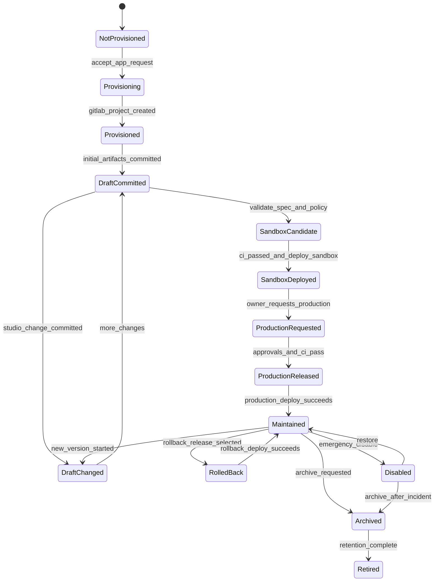
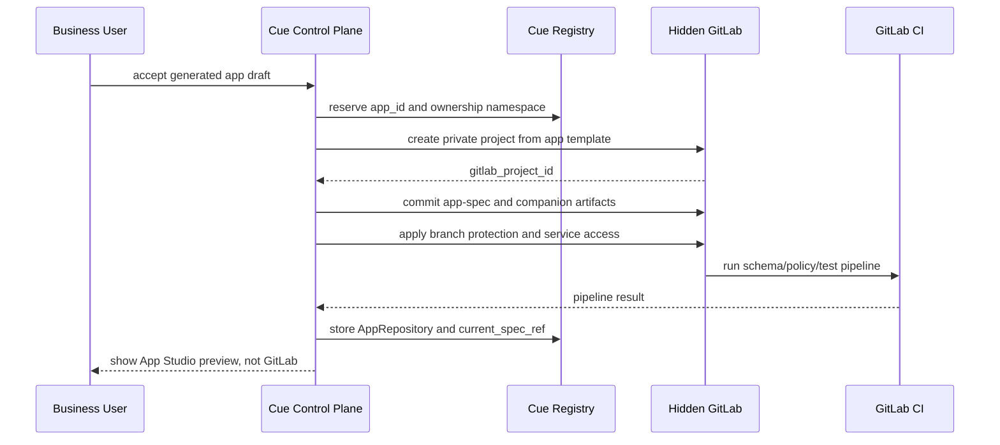

# Hidden App Repository Lifecycle

Issue: #1374
Status: implemented

This spec defines how Cue manages one hidden GitLab project for each generated
business app. The repo is the durable artifact source of truth for the app. It
is not visible to business users and it is not the runtime data store.

## Goals
<!-- type: manifest lang: yaml -->

```yaml
goals:
  - durable_versioned_artifact_workspace_per_generated_app
  - gitlab_branches_merge_requests_ci_and_tags_hidden_behind_cue
  - sandbox_and_production_deploy_from_immutable_refs
  - rollback_by_selecting_prior_immutable_release_ref
  - registry_read_model_for_product_and_governance_questions
  - governance_enforced_by_credentials_branch_protection_ci_approval_and_audit
```

## Non-Goals
<!-- type: manifest lang: yaml -->

```yaml
non_goals:
  - expose_gitlab_ui_to_app_builders_owners_or_end_users
  - store_runtime_records_comments_attachments_workflow_state_usage_or_runtime_audit_in_git
  - require_full_generated_source_code_in_mvp
  - replace_cue_registry_with_gitlab_project_search
  - define_final_runtime_storage_for_generated_app_data
  - define_full_ownership_namespace_and_quota_policy
related_issues:
  runtime_storage: 1376
  ownership_namespace: 1377
```

## Source of Truth Split
<!-- type: manifest lang: yaml -->

```yaml
sources_of_truth:
  generated_app_artifacts: hidden_gitlab_project
  current_product_governance_read_model: cue_registry
  runtime_app_data: runtime_data_substrate
  cue_product_implementation:
    - projects/cue
    - .aw/tech-design/projects/cue
```

| Concern | Source of truth |
|---------|-----------------|
| Generated app artifacts | Hidden GitLab project |
| Current product/governance read model | Cue Registry |
| Runtime app data | Runtime data substrate |
| Cue product implementation | `projects/cue/` and `.aw/tech-design/projects/cue/` |

GitLab stores artifacts and refs. Registry stores current operational state.
Runtime storage stores user-created data.

## AppRepository Model
<!-- type: schema lang: yaml -->

`AppRepository` is a Cue Registry entity. It maps one Cue app to one hidden
GitLab project.

```yaml
app_repository:
  app_id: string
  gitlab_host: string
  gitlab_project_id: integer
  gitlab_full_path: string
  default_branch: main
  template_version: string
  current_spec_ref: git_sha
  sandbox_ref: git_sha | null
  production_ref: git_sha | null
  latest_release_tag: string | null
  last_ci_pipeline_id: integer | null
  branch_protection_profile: restricted
  visibility: private
  user_visible: false
  archived_at: timestamp | null
  retired_at: timestamp | null
```

Rules:

- `app_id` is the product identity used by Cue UI and APIs.
- `gitlab_project_id` is platform-only infrastructure identity.
- `current_spec_ref`, `sandbox_ref`, and `production_ref` must be immutable
  commit SHAs, not branch names.
- `latest_release_tag` must point at the same commit as `production_ref` after
  a successful production deploy.
- `user_visible` is always `false` for generated app repos.

## Hidden Repo Layout
<!-- type: config lang: yaml -->

```yaml
repo_template:
  required_files:
    - app-spec.json
    - policy.json
    - permissions.json
    - connectors.json
    - .gitlab-ci.yml
    - README.md
  required_directories:
    tests:
      - permission-tests.json
      - workflow-tests.json
      - policy-tests.json
    generated:
      - runtime-config.json
      - ui-manifest.json
    releases:
      pattern: release-<version>.json
  mvp_generated_code_required: false
```

MVP repo template:

```text
app-spec.json
policy.json
permissions.json
connectors.json
tests/
  permission-tests.json
  workflow-tests.json
  policy-tests.json
generated/
  runtime-config.json
  ui-manifest.json
releases/
  release-<version>.json
.gitlab-ci.yml
README.md
```

MVP rules:

- `app-spec.json` must conform to `cue.app-spec.v0`.
- `policy.json`, `permissions.json`, and `connectors.json` are companion
  governance artifacts, not runtime data.
- `tests/` must contain machine-readable checks used by CI and Cue's test
  service.
- `generated/` may contain only runtime config and UI manifests in MVP.
  Generated application code can be added later.
- `releases/` records release metadata for audit and rollback readability; the
  immutable source of truth remains the Git tag and commit SHA.

## Lifecycle State Machine
<!-- type: state-machine lang: mermaid -->



State rules:

| State | Required repo/registry evidence |
|-------|---------------------------------|
| Provisioned | GitLab project exists, Registry has `gitlab_project_id` |
| DraftCommitted | `app-spec.json` and companion artifacts committed to default branch or draft branch |
| SandboxCandidate | schema, policy, permission, workflow, and test artifacts are present |
| SandboxDeployed | `sandbox_ref` is an immutable commit SHA and sandbox runtime tenant exists |
| ProductionReleased | release tag exists, CI passed, approvals are recorded |
| Maintained | `production_ref` and `latest_release_tag` point to deployed app artifacts |
| RolledBack | rollback target tag/ref and rollback reason are recorded |
| Archived | repo is archived or locked, runtime access disabled except retention/export flows |
| Retired | repo retention policy completed and app is no longer deployable |

## Provisioning Flow
<!-- type: interaction lang: mermaid -->



Required audit events:

```yaml
provisioning_events:
  - app_repository_reserved
  - gitlab_project_created
  - app_template_applied
  - initial_artifacts_committed
  - branch_protection_applied
  - ci_pipeline_started
  - ci_pipeline_completed
  - app_repository_registered
```

## Draft Update Flow
<!-- type: config lang: yaml -->

Draft changes originate from Prompt Builder or App Studio. Cue converts them to
artifact commits.

```yaml
draft_update:
  input_surfaces:
    - prompt_builder
    - app_studio
    - admin_console
  allowed_artifacts:
    - app-spec.json
    - policy.json
    - permissions.json
    - connectors.json
    - tests/**
    - generated/runtime-config.json
    - generated/ui-manifest.json
  commit_author: cue_service_account
  user_attribution: required
  ci_required: true
  user_sees_git: false
```

Rules:

- Every commit must include the triggering Cue user, app id, and change reason
  in metadata available to audit.
- Cue may use direct commits on a draft branch for low-risk drafts.
- Cue must use hidden merge requests or equivalent review gates when changes
  affect production, data access, permissions, risk tier, or connector writes.
- App Studio displays semantic diffs, not raw Git diffs.

## Deployment Ref Contract
<!-- type: schema lang: yaml -->

Sandbox and production deployments consume immutable refs.

```yaml
deployment_ref:
  app_id: string
  environment: sandbox | production
  gitlab_project_id: integer
  commit_sha: git_sha
  release_tag: string | null
  app_spec_version: integer
  template_version: string
  ci_pipeline_id: integer
  created_at: timestamp
```

Rules:

- Sandbox can deploy from a validated commit without a release tag.
- Production must deploy from a release tag.
- Production release tags are immutable.
- Registry updates happen only after deployment succeeds.
- Runtime data schema compatibility must be checked before changing
  `production_ref`.

## Production Gate
<!-- type: config lang: yaml -->

Production requests are hidden GitLab review gates plus Cue approval records.

```yaml
production_gate:
  required_checks:
    - app_spec_schema_valid
    - policy_check_passed
    - permission_tests_passed
    - workflow_tests_passed
    - connector_access_approved
    - runtime_migration_check_passed
    - required_approvals_granted
  required_approvers_by_signal:
    app_owner: always
    team_manager: cross_team_or_tier_2_plus
    data_owner: connector_write_or_confidential_data
    security: tier_3
    platform: tier_3_or_runtime_migration
  outputs:
    - release_tag
    - release_metadata
    - production_ref
    - registry_snapshot
    - audit_events
```

Cue can implement the hidden review gate as a GitLab merge request, protected
branch approval, or internal release record as long as the same evidence exists.

## Rollback
<!-- type: config lang: yaml -->

Rollback selects a prior immutable release ref.

```yaml
rollback:
  input:
    app_id: string
    target_release_tag: string
    reason: string
    requested_by: string
  requires:
    - target_release_exists
    - target_release_ci_passed
    - runtime_schema_compatible_or_migration_plan
    - authorized_operator
  effects:
    - deploy_target_release
    - update_registry_production_ref
    - write_rollback_audit_event
```

Rollback must not rewrite runtime data. If a rollback needs a data migration or
compatibility shim, the release gate must surface that as a platform-owned
operation.

## Archive and Retirement
<!-- type: config lang: yaml -->

```yaml
archive:
  triggers:
    - owner_request
    - inactive_app_policy
    - orphaned_owner
    - incident_response
  effects:
    - disable_new_deployments
    - disable_runtime_write_access
    - keep_repo_readable_to_platform
    - preserve_release_tags
    - start_retention_timer

retire:
  requires:
    - retention_policy_complete
    - data_export_or_disposal_complete
    - owner_or_platform_approval
  effects:
    - mark_registry_retired
    - prevent_restore_without_platform_exception
    - archive_or_delete_gitlab_project_by_policy
```

Repo deletion is not required for retirement. Enterprise policy may prefer
archival for audit evidence.

## Security Boundary
<!-- type: config lang: yaml -->

```yaml
security_boundary:
  gitlab_visibility: private
  business_user_membership: forbidden
  service_account:
    can_create_project: true
    can_commit: true
    can_tag_release: true
    can_archive_project: true
  branch_protection:
    default_branch_direct_user_push: forbidden
    production_ref_mutation: forbidden
    release_tag_mutation: forbidden
    ci_required: true
  audit_required_for:
    - project_create
    - artifact_commit
    - policy_change
    - permission_change
    - connector_change
    - ci_result
    - approval_decision
    - release_tag_create
    - deploy
    - rollback
    - archive
    - retire
```

If a platform operator changes the hidden repo directly during incident
response, Cue must ingest the event and mark the app with an explicit
out-of-band change warning until reconciled.

## Implementation Slices
<!-- type: changes lang: yaml -->

```yaml
changes:
  - id: S1
    deliverable: AppRepository Registry schema and API contract
  - id: S2
    deliverable: Hidden repo template files and validation rules
  - id: S3
    deliverable: GitLab project provisioner and service credential boundary
  - id: S4
    deliverable: Initial artifact commit and CI pipeline result ingestion
  - id: S5
    deliverable: Sandbox deployment from immutable commit ref
  - id: S6
    deliverable: Production gate release tag and Registry production ref update
  - id: S7
    deliverable: Rollback from prior release tag
  - id: S8
    deliverable: Archive ownership transfer hook orphan detection hook and retirement
```

## Acceptance Mapping
<!-- type: manifest lang: yaml -->

```yaml
acceptance_mapping:
  hidden_repo_lifecycle:
    covered_by:
      - Lifecycle State Machine
      - Provisioning Flow
  registry_project_and_ref_mapping:
    covered_by:
      - AppRepository Model
      - Deployment Ref Contract
  repo_source_of_truth_relationship:
    covered_by:
      - Hidden Repo Layout
      - Draft Update Flow
  immutable_deployment_refs:
    covered_by:
      - Deployment Ref Contract
      - Production Gate
  rollback_archive_transfer_retirement:
    covered_by:
      - Rollback
      - Archive and Retirement
  bypass_prevention:
    covered_by:
      - Security Boundary
  defer_generated_code:
    covered_by:
      - Hidden Repo Layout
      - Implementation Slices
```
