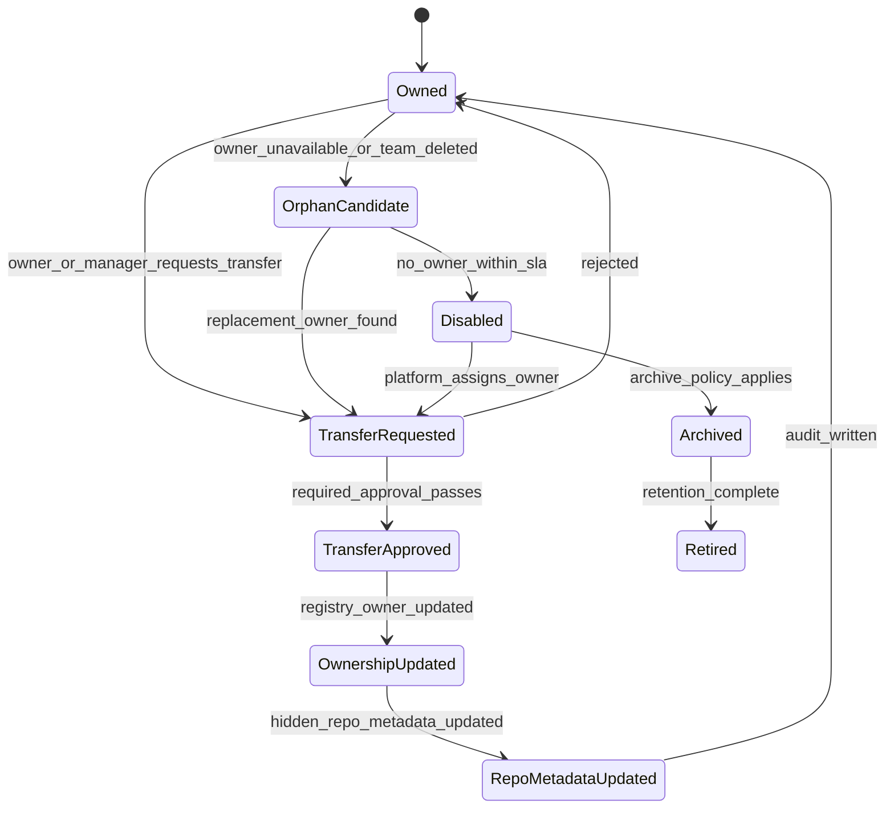
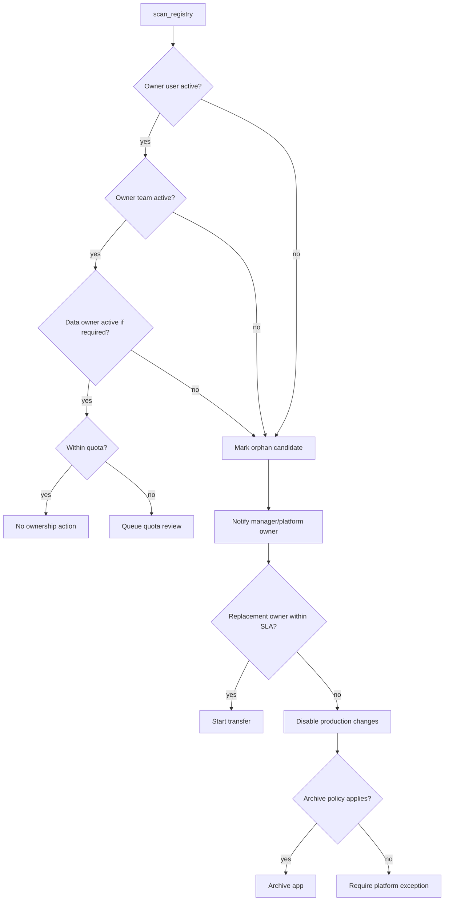

# Ownership Namespace and Quota

Issue: #1377
Status: implemented

This spec defines Cue's app ownership namespace, quota, transfer, orphan, and
visibility model. It feeds the App Registry, hidden GitLab project mapping,
runtime tenancy, approval routing, archive, and retirement behavior.

The canonical v0 JSON Schema is
[`../../../../projects/cue/schemas/ownership-namespace.v0.schema.json`](../../../../projects/cue/schemas/ownership-namespace.v0.schema.json).
The first team-owned example is
[`../../../../projects/cue/examples/team-ownership-namespace.v0.json`](../../../../projects/cue/examples/team-ownership-namespace.v0.json).

## Goals
<!-- type: manifest lang: yaml -->

```yaml
goals:
  - distinguish_personal_team_cross_team_and_platform_apps
  - derive_stable_app_id_and_hidden_gitlab_path_from_cue_ownership
  - prevent_uncontrolled_app_sprawl_with_quota_policy
  - detect_orphaned_apps_and_route_transfer_archive_or_retirement
  - keep_business_users_out_of_gitlab_while_preserving_auditability
  - remain_compatible_with_app_spec_v0_owner_team_and_owner_user
```

## Non-Goals
<!-- type: manifest lang: yaml -->

```yaml
non_goals:
  - implement_gitlab_project_provisioner
  - define_final_runtime_storage_schema
  - build_registry_or_admin_console_ui
  - expose_gitlab_to_business_users
  - replace_company_iam_or_hr_directory
related_issues:
  hidden_repo_provisioner: 1378
  runtime_data_tenancy: 1376
```

## Namespace Model
<!-- type: schema lang: yaml -->

```yaml
$schema: "https://json-schema.org/draft/2020-12/schema"
$id: "https://cclab.dev/cue/ownership-namespace/v0"
title: Cue Ownership Namespace v0
type: object
additionalProperties: false
required:
  - schema_version
  - app_id
  - namespace
  - owner
  - platform_owner
  - emergency_contact
  - quota_policy
  - transfer_policy
  - visibility
properties:
  schema_version:
    const: cue.ownership-namespace.v0
  app_id:
    type: string
    pattern: "^[a-z][a-z0-9-]{2,62}$"
  namespace:
    enum: [personal, team, cross_team, platform]
  display_name:
    type: string
    minLength: 1
  owner:
    type: object
    additionalProperties: false
    required: [owner_user, owner_team]
    properties:
      owner_user:
        type: [string, "null"]
      owner_team:
        type: [string, "null"]
      data_owner:
        type: [string, "null"]
  platform_owner:
    type: string
    minLength: 1
  emergency_contact:
    type: string
    minLength: 1
  quota_policy:
    type: string
    minLength: 1
  transfer_policy:
    enum: [owner_required, manager_required, platform_required]
  visibility:
    enum: [private_to_owner, team_visible, cross_team_visible, platform_visible]
```

Rules:

- `personal` apps require `owner_user` and may omit `owner_team`.
- `team` apps require `owner_team` and at least one accountable `owner_user`.
- `cross_team` apps require `owner_team`, `data_owner`, and manager/platform
  routing for production changes.
- `platform` apps require `platform_owner` and `emergency_contact`; business
  owner fields can be nullable only when a platform exception is recorded.

## App Identity Rules
<!-- type: config lang: yaml -->

```yaml
app_identity:
  app_id_pattern: "^[a-z][a-z0-9-]{2,62}$"
  generation:
    personal: "u-{user_slug}-{display_slug}"
    team: "t-{team_slug}-{display_slug}"
    cross_team: "x-{primary_team_slug}-{display_slug}"
    platform: "p-{platform_domain_slug}-{display_slug}"
  collision_handling:
    first_collision: append_short_hash
    repeated_collision: append_registry_sequence
  rename_policy:
    display_name: mutable
    app_id: immutable_after_first_sandbox_deploy
    gitlab_project_path: immutable_after_first_sandbox_deploy
  aliases:
    old_display_names_retained_in_registry: true
    old_app_ids_allowed: false
```

`app_id` is the stable product key used by Registry, deployment refs, runtime
tenancy, hidden repo mapping, and audit events. Display names can change; app
ids do not change after sandbox deploy.

## Role Model
<!-- type: schema lang: yaml -->

```yaml
roles:
  creator:
    can_create_draft: true
    can_request_sandbox: true
  app_owner:
    can_edit_app_spec: true
    can_request_production: true
    can_transfer_with_policy: true
  editor:
    can_edit_app_spec: true
    can_request_production: false
  viewer:
    can_use_runtime_app: true
    can_view_registry_entry: conditional
  approver:
    can_approve_production: conditional
    can_approve_risky_change: conditional
  data_owner:
    can_approve_connector_access: true
    can_approve_confidential_field_use: true
  platform_admin:
    can_override_transfer: true
    can_disable_app: true
    can_archive_or_retire_app: true
  security:
    can_block_release: true
    can_require_review: true
  auditor:
    can_view_audit: true
    can_export_evidence: true
  emergency_operator:
    can_disable_app: true
    can_restore_with_reason: true
```

Delegation rules:

- Creator is not automatically permanent owner for team apps.
- App owner can delegate editor access but cannot bypass data-owner approval.
- Platform admin can transfer or disable apps only with audit reason.
- Emergency operator permissions are time-bound and reason-bound.

## Quota Policy
<!-- type: config lang: yaml -->

```yaml
quota_profiles:
  personal_default:
    sandbox_apps_limit: 5
    production_apps_limit: 1
    inactive_days_before_review: 30
    production_requires_team_owner: true
  team_default:
    sandbox_apps_limit: 25
    production_apps_limit: 10
    inactive_days_before_review: 60
    owner_required: true
  cross_team_default:
    sandbox_apps_limit: 10
    production_apps_limit: 5
    inactive_days_before_review: 45
    data_owner_required: true
    manager_review_required: true
  platform_default:
    sandbox_apps_limit: 50
    production_apps_limit: 25
    inactive_days_before_review: 90
    platform_review_required: true
quota_exceptions:
  requires:
    - requesting_owner
    - approving_platform_owner
    - reason
    - expiration
    - audit_event
```

MVP quotas are conservative defaults. Enterprise deployments can tune limits
per organization, team, risk tier, or pilot cohort.

## Transfer State Machine
<!-- type: state-machine lang: mermaid -->



Transfer rules:

- Transfer updates Registry and hidden repo metadata but does not rewrite Git
  history or release tags.
- App Spec v0 compatibility fields `owner_team` and `owner_user` must be
  updated through a versioned app change when product semantics require it.
- Platform emergency transfer requires a reason and audit event.

## Orphan Detection
<!-- type: logic lang: mermaid -->



Orphan detection must run against Registry and IAM/HR group sources. It must not
depend on GitLab membership because generated app repos are hidden from business
users.

## Registry Visibility
<!-- type: config lang: yaml -->

```yaml
registry_visibility:
  personal:
    visible_to:
      - owner_user
      - platform_admin
      - auditor
  team:
    visible_to:
      - owner_team
      - app_owner
      - platform_admin
      - auditor
  cross_team:
    visible_to:
      - owner_team
      - participating_teams
      - data_owner
      - platform_admin
      - security
      - auditor
  platform:
    visible_to:
      - platform_owner
      - platform_admin
      - security
      - auditor
admin_console:
  shows_gitlab_project_id: true
  shows_gitlab_full_path: true
  business_registry_shows_gitlab: false
```

Business Registry views show ownership, risk, health, version, changelog,
usage, and lifecycle. They do not show GitLab mechanics.

## Hidden GitLab Mapping
<!-- type: config lang: yaml -->

```yaml
gitlab_mapping:
  root_group: cue-generated-apps
  group_by_namespace:
    personal: personal/{user_slug}
    team: teams/{team_slug}
    cross_team: cross-team/{primary_team_slug}
    platform: platform/{platform_domain_slug}
  project_path: "{app_id}"
  project_name: "{display_name}"
  metadata:
    cue_app_id: required
    cue_namespace: required
    cue_owner_user: optional
    cue_owner_team: optional
    cue_platform_owner: required
    cue_visibility: hidden
  user_membership:
    business_users: forbidden
    cue_service_account: maintainer
    platform_break_glass_group: owner
```

Mapping rules:

- GitLab path is derived from Cue ownership namespace at provisioning time.
- Business user transfer updates Registry owner fields and GitLab metadata; it
  does not add business users as GitLab project members.
- Path moves after sandbox deploy are forbidden unless platform performs an
  audited migration.

## Audit Events
<!-- type: config lang: yaml -->

```yaml
ownership_audit_events:
  - ownership_namespace_created
  - owner_assigned
  - role_delegated
  - role_revoked
  - quota_checked
  - quota_exception_granted
  - transfer_requested
  - transfer_approved
  - transfer_rejected
  - ownership_updated
  - orphan_candidate_detected
  - orphan_action_taken
  - app_disabled_for_orphan_owner
  - app_archived_by_ownership_policy
  - app_retired_by_ownership_policy
```

Each event must include `app_id`, `namespace`, `actor`, `reason`, `before`,
`after`, and `created_at`. Empty `before` or `after` values are `null`.

## Implementation Slices
<!-- type: changes lang: yaml -->

```yaml
changes:
  - id: S1
    deliverable: Ownership namespace schema and example metadata
  - id: S2
    deliverable: App id generation and collision rules
  - id: S3
    deliverable: Registry fields for namespace owner quota and orphan state
  - id: S4
    deliverable: Hidden GitLab group path mapping contract for provisioner
  - id: S5
    deliverable: Quota checker and exception audit events
  - id: S6
    deliverable: Owner transfer state machine and audit writer
  - id: S7
    deliverable: Orphan detection scan and action recommendations
  - id: S8
    deliverable: Registry and Admin visibility policy hooks
```

## Acceptance Mapping
<!-- type: manifest lang: yaml -->

```yaml
acceptance_mapping:
  distinguish_namespace_kinds:
    covered_by:
      - Namespace Model
      - Registry Visibility
  deterministic_app_identity:
    covered_by:
      - App Identity Rules
  gitlab_path_mapping:
    covered_by:
      - Hidden GitLab Mapping
  orphan_detection:
    covered_by:
      - Orphan Detection
      - Transfer State Machine
  auditable_transfer:
    covered_by:
      - Transfer State Machine
      - Audit Events
  quota_sprawl_control:
    covered_by:
      - Quota Policy
  registry_admin_visibility:
    covered_by:
      - Registry Visibility
  app_spec_v0_compatibility:
    covered_by:
      - Namespace Model
      - Transfer State Machine
```
