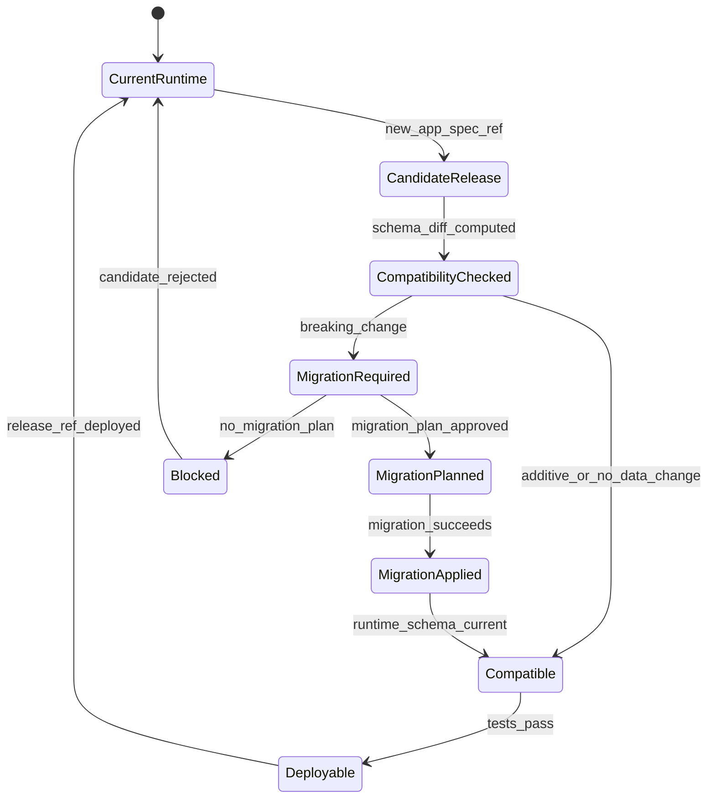

# Runtime Data Tenancy and Storage

Issue: #1376
Status: implemented

This spec defines where generated Cue apps store mutable runtime data. Hidden
GitLab repos store app artifacts and release refs. Runtime records, comments,
attachments, workflow state, usage, dashboard materializations, and runtime
audit events live in a separate runtime data substrate.

The managed target is AlloyDB. Local development and contract tests use
ordinary PostgreSQL. Cue must avoid AlloyDB-only behavior in the default local
test path.

The canonical v0 JSON Schema is
[`../../../../projects/cue/schemas/runtime-tenant.v0.schema.json`](../../../../projects/cue/schemas/runtime-tenant.v0.schema.json).
The first Tracker MVP example is
[`../../../../projects/cue/examples/tracker-runtime-tenant.v0.json`](../../../../projects/cue/examples/tracker-runtime-tenant.v0.json).

## Goals
<!-- type: manifest lang: yaml -->

```yaml
goals:
  - keep_mutable_runtime_data_out_of_hidden_git_repos
  - target_alloydb_for_managed_runtime_storage
  - use_postgresql_for_local_development_and_contract_tests
  - bind_runtime_tenants_to_app_id_environment_release_and_ownership_namespace
  - isolate_sandbox_and_production_data
  - support_tracker_records_comments_attachments_workflow_state_usage_and_audit
  - make_rollback_ref_based_without_rewriting_runtime_data
```

## Non-Goals
<!-- type: manifest lang: yaml -->

```yaml
non_goals:
  - run_local_alloydb_as_required_developer_dependency
  - store_runtime_records_in_git
  - design_every_connector_implementation
  - implement_full_database_migrations_in_this_spec
  - build_tracker_runtime_ui
  - replace_hidden_app_repo_lifecycle
```

## Storage Policy
<!-- type: config lang: yaml -->

```yaml
storage_policy:
  managed_target: alloydb
  local_dev_target: postgresql
  local_test_target: postgresql
  alloydb_required_for_default_tests: false
  managed_cluster_strategy:
    default_topology: shared_alloydb_cluster
    default_cluster_scope: environment_region
    default_isolation_unit: database_per_app
    shared_cluster_id_pattern: cue-runtime-{environment}-{region}
    app_database_name_pattern: cue_app_{app_id}_{environment}
    app_schema_name: app
    dedicated_cluster_policy: exception_only
    dedicated_cluster_triggers:
      - tier_3_or_above
      - heavy_workload_or_noisy_neighbor_risk
      - regulated_data_or_residency_exception
      - custom_backup_retention_or_cmek_requirement
      - platform_approved_isolation_exception
  allowed_default_sql:
    - postgresql_compatible_ddl
    - ordinary_transactions
    - jsonb
    - row_level_security_when_available
    - advisory_locks_when_needed
  disallowed_default_dependencies:
    - alloydb_only_extensions
    - local_gitlab_requirement
    - local_alloydb_requirement
  opt_in_checks:
    - alloydb_uat_migrations
    - managed_backup_policy
    - managed_observability
```

Local development should run against PostgreSQL. AlloyDB validation is a
managed-environment gate, not a prerequisite for basic contract tests.

Managed Cue starts with one shared AlloyDB cluster per environment and region.
Each generated app receives an app-owned database, app schema, and app runtime
role inside that shared cluster. Business users never see this binding. Cue
Registry and Platform Console own the mapping from app identity to cluster,
database, schema, role, and migration state.

Dedicated AlloyDB clusters are exceptions, not the default. They are reserved
for high-risk, high-load, residency, backup, encryption, or explicit isolation
cases approved by the platform team. Cross-app data access must still flow
through Cue data contracts, not direct SQL between app databases.

## Runtime Tenant Model
<!-- type: schema lang: yaml -->

```yaml
$schema: "https://json-schema.org/draft/2020-12/schema"
$id: "https://cclab.dev/cue/runtime-tenant/v0"
title: Cue Runtime Tenant v0
type: object
additionalProperties: false
required:
  - schema_version
  - app_id
  - environment
  - app_version
  - app_spec_ref
  - release_ref
  - owner_namespace
  - storage
  - retention
  - data_region
properties:
  schema_version:
    const: cue.runtime-tenant.v0
  app_id:
    type: string
  environment:
    enum: [sandbox, production]
  app_version:
    type: integer
    minimum: 1
  app_spec_ref:
    type: string
  release_ref:
    type: string
  owner_namespace:
    enum: [personal, team, cross_team, platform]
  storage:
    type: object
  retention:
    type: object
  data_region:
    type: string
```

Rules:

- `app_spec_ref` and `release_ref` bind runtime data to immutable generated-app
  artifacts.
- `environment` is part of the tenant identity; sandbox and production never
  share mutable tables.
- `owner_namespace` comes from `ownership-namespace.v0`.
- Storage metadata is Registry/platform state, not App Spec behavior.

## Tracker MVP Data Families
<!-- type: schema lang: yaml -->

```yaml
tracker_runtime_families:
  record:
    identity: runtime_record_id
    stores: field_values_jsonb
    required_keys: [app_id, environment, entity_name, record_id, created_by, created_at]
  comment:
    identity: comment_id
    stores: body_mentions_visibility
    required_keys: [app_id, environment, record_id, author, created_at]
  attachment:
    identity: attachment_id
    stores: blob_pointer_metadata_policy
    required_keys: [app_id, environment, record_id, blob_uri, mime_type, size_bytes]
  workflow_state:
    identity: workflow_state_id
    stores: current_state_transition_history
    required_keys: [app_id, environment, record_id, state, updated_at]
  dashboard_materialization:
    identity: materialization_id
    stores: metric_values_and_refresh_metadata
    required_keys: [app_id, environment, view_name, refreshed_at]
  usage_metric:
    identity: usage_event_id
    stores: actor_action_resource_latency
    required_keys: [app_id, environment, actor, action, created_at]
  runtime_audit:
    identity: audit_event_id
    stores: before_after_reason_actor
    required_keys: [app_id, environment, event_type, actor, created_at]
```

Runtime tables can be physically shared by platform, but every row must carry
tenant keys sufficient for app/environment isolation and retention.

## Sandbox and Production Isolation
<!-- type: config lang: yaml -->

```yaml
environment_policy:
  sandbox:
    allowed_sources:
      - synthetic_data
      - owner_uploaded_sample
      - policy_approved_sample_copy
    production_data_write: forbidden
    default_expiry_days: 30
    reset_allowed: true
    backup_required: false
  production:
    allowed_sources:
      - production_user_input
      - approved_connector_reference
      - approved_connector_cache
    synthetic_data: forbidden
    reset_allowed: false
    backup_required: true
    retention_required: true
```

Sandbox reset deletes sandbox runtime data only. It does not touch hidden app
repo history or production runtime data.

## Version and Migration Gate
<!-- type: state-machine lang: mermaid -->



Rules:

- Additive field changes can proceed when tests and policy pass.
- Breaking changes require migration plan approval before production deploy.
- Rollback can select a prior release ref only if runtime data is compatible or
  a rollback migration is approved.
- Runtime compatibility checks are release gates, not UI warnings only.

## Connector Boundary
<!-- type: config lang: yaml -->

```yaml
connector_boundary:
  direct_database_access_from_generated_app: forbidden
  allowed_runtime_connector_state:
    - connector_reference_id
    - policy_approved_cache
    - sync_checkpoint
    - last_successful_sync_at
    - field_level_projection_metadata
  cache_requires:
    - data_owner_approval
    - retention_policy
    - sensitivity_metadata
    - erase_or_refresh_behavior
```

Runtime storage may cache or reference connector data only through approved
connector policies. It must not become an unmanaged direct database path.

## Archive and Retention
<!-- type: config lang: yaml -->

```yaml
archive_retention:
  archive_effects:
    - disable_runtime_writes
    - preserve_runtime_reads_when_policy_allows
    - preserve_audit_events
    - freeze_production_ref
    - start_retention_timer
  retire_effects:
    - mark_registry_retired
    - prevent_new_deployments
    - execute_export_or_disposal_policy
    - preserve_required_audit_evidence
  erase_effects:
    - remove_or_anonymize_runtime_records_by_policy
    - preserve_non_personal_audit_evidence_when_required
```

Archive and retirement do not require deleting hidden app repo artifacts.
Runtime data disposal follows retention policy and legal/audit requirements.

## Registry Runtime Fields
<!-- type: schema lang: yaml -->

```yaml
registry_runtime_state:
  app_id: string
  environment: sandbox | production
  runtime_tenant_id: string
  storage_backend: alloydb | postgresql
  storage_cluster_id: string
  storage_cluster_mode: shared | dedicated
  storage_isolation_unit: database | schema
  storage_binding: string
  data_region: string
  current_app_version: integer
  current_release_ref: string
  migration_state: current | pending | blocked | failed
  health_status: healthy | degraded | disabled | archived | retired
  last_backup_at: timestamp | null
  retention_policy: string
```

Business users see lifecycle, health, version, and retention summaries. Dev and
platform admin views can show storage backend and binding details.

## Mamba and Bridge Contract
<!-- type: config lang: yaml -->

```yaml
backend_contract:
  product_target: mamba
  mamba_dependencies:
    persistence: cclab-pg-mamba
    schema_validation: cclab-schema-mamba
    runtime: cclab-runtime-mamba
    logging: cclab-log-mamba
  cpython_bridge_allowed: true
  cpython_bridge_rules:
    - api_shape_matches_future_mamba_service
    - sql_and_schema_contracts_remain_portable
    - no_cpython_only_runtime_semantics
    - linked_mamba_migration_issue_required
```

The repository interface should be written against Cue's runtime tenant
contract, not directly against AlloyDB-specific APIs.

## Implementation Slices
<!-- type: changes lang: yaml -->

```yaml
changes:
  - id: S1
    deliverable: runtime tenant schema and tracker example
  - id: S2
    deliverable: Registry runtime-state fields
  - id: S3
    deliverable: local PostgreSQL repository contract tests
  - id: S4
    deliverable: Tracker record comment attachment workflow table migrations
  - id: S5
    deliverable: sandbox reset expiry and isolation behavior
  - id: S6
    deliverable: production migration compatibility gate
  - id: S7
    deliverable: archive retention export erase lifecycle hooks
  - id: S8
    deliverable: AlloyDB UAT verification path
```

## Acceptance Mapping
<!-- type: manifest lang: yaml -->

```yaml
acceptance_mapping:
  runtime_store_distinct_from_git:
    covered_by:
      - Storage Policy
      - Runtime Tenant Model
  alloydb_and_local_postgres:
    covered_by:
      - Storage Policy
      - Mamba and Bridge Contract
  tracker_runtime_model:
    covered_by:
      - Tracker MVP Data Families
  sandbox_production_isolation:
    covered_by:
      - Sandbox and Production Isolation
  spec_version_migration_semantics:
    covered_by:
      - Version and Migration Gate
  rollback_without_data_rewrite:
    covered_by:
      - Version and Migration Gate
  archive_retirement_audit:
    covered_by:
      - Archive and Retention
  mamba_readiness:
    covered_by:
      - Mamba and Bridge Contract
```
