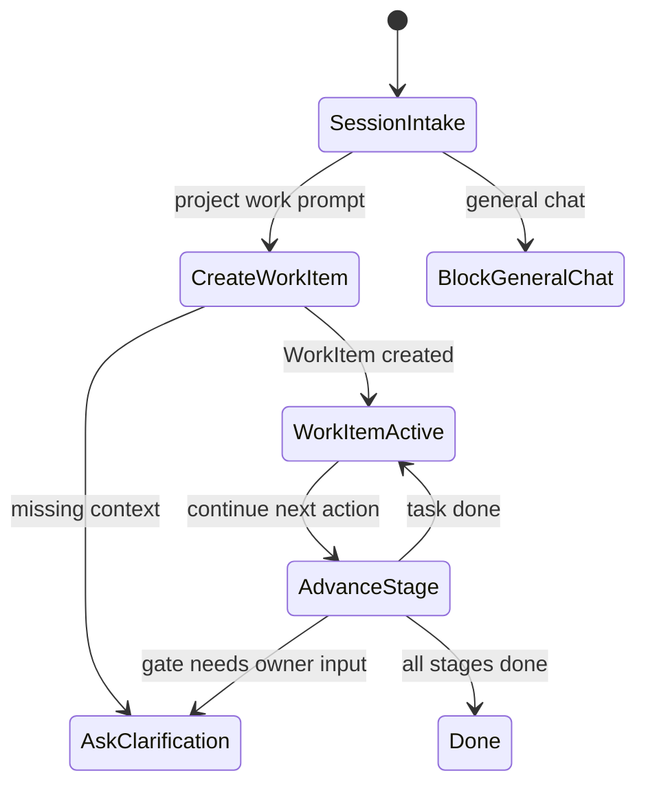
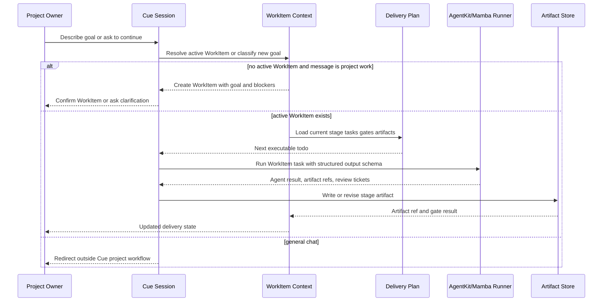

# Session WorkItem Delivery Model

This spec defines the product model for Cue's app-owner workspace after the
WorkItem discussion. Cue is conversation-first, but the conversation is not the
execution boundary. A Session is the working thread. A WorkItem is the durable
goal context attached to a Session. Agents may only execute when a Session has
an active WorkItem or when the current message is creating one.

The model intentionally does not force a universal goal size. One user may make
"reporting system" a WorkItem with import/export/permission tasks inside it;
another user may create separate WorkItems for report import and report export.
Cue normalizes the execution units inside the WorkItem into comparable
todo-sized stage tasks.

The agent execution boundary is AgentKit/Mamba-shaped from the beginning.
Cue must not couple product code directly to `claude -p` or any other
developer shell command. While Mamba is still catching up, the Python backend
may expose a `mambalibs` package as a contract-compatible preview of future
Mamba libraries. That package may use deterministic logic or a Claude headless
bridge, but it must accept the same WorkItem task envelope and return the same
structured result that `cclab-agent-mamba` will own once the Mamba binding is
live.

## Delivery Schema
<!-- type: schema lang: yaml -->

```yaml
$schema: "https://json-schema.org/draft/2020-12/schema"
$id: "https://cclab.dev/cue/session-workitem-delivery-model/v0"
title: Cue Session WorkItem Delivery Model v0
type: object
additionalProperties: false
required: [project, session, workitem, stage, task, artifact, gate]
properties:
  project:
    type: object
    additionalProperties: false
    required: [id, name, sessions]
    properties:
      id: { type: string, pattern: "^[a-z0-9][a-z0-9-]*$" }
      name: { type: string, minLength: 1 }
      sessions:
        type: array
        items: { $ref: "#/$defs/session_ref" }
  session:
    type: object
    additionalProperties: false
    required: [id, project_id, title, state, active_workitem_id, messages]
    properties:
      id: { type: string }
      project_id: { type: string }
      title: { type: string }
      state: { enum: [intake, workitem_active, paused, archived] }
      active_workitem_id: { type: ["string", "null"] }
      attached_workitem_ids:
        type: array
        items: { type: string }
      messages:
        type: array
        items: { $ref: "#/$defs/message" }
  workitem:
    type: object
    additionalProperties: false
    required: [id, project_id, goal, status, current_stage_id, stages, artifacts, gates]
    properties:
      id: { type: string, pattern: "^[a-z0-9][a-z0-9-]*$" }
      project_id: { type: string }
      goal: { $ref: "#/$defs/goal" }
      granularity: { enum: [small, medium, large] }
      status: { enum: [intake, ready, in_progress, blocked, done, canceled] }
      current_stage_id: { enum: [prd, td, codebase, test, deployment, operation] }
      stages:
        type: array
        items: { $ref: "#/$defs/stage" }
      artifacts:
        type: array
        items: { $ref: "#/$defs/artifact_ref" }
      gates:
        type: array
        items: { $ref: "#/$defs/gate" }
      related_workitem_ids:
        type: array
        items: { type: string }
  stage:
    $ref: "#/$defs/stage"
  task:
    $ref: "#/$defs/task"
  artifact:
    $ref: "#/$defs/artifact_ref"
  gate:
    $ref: "#/$defs/gate"
  agent_task:
    $ref: "#/$defs/agent_task"
  agent_result:
    $ref: "#/$defs/agent_result"
$defs:
  session_ref:
    type: object
    required: [id, title, active_workitem_id, updated_at]
    properties:
      id: { type: string }
      title: { type: string }
      active_workitem_id: { type: ["string", "null"] }
      updated_at: { type: string, format: date-time }
  message:
    type: object
    required: [id, speaker, body, created_at]
    properties:
      id: { type: string }
      speaker: { enum: [owner, cue, agent, system] }
      body: { type: string }
      created_at: { type: string, format: date-time }
      workitem_id: { type: ["string", "null"] }
  goal:
    type: object
    required: [title, intent, success_criteria]
    properties:
      title: { type: string, minLength: 1 }
      intent: { type: string, minLength: 1 }
      users:
        type: array
        items: { type: string }
      constraints:
        type: array
        items: { type: string }
      success_criteria:
        type: array
        items: { type: string }
      owner_context:
        type: object
        additionalProperties: false
        properties:
          owner_namespace: { enum: [personal, team, cross_team, platform] }
          owner_user: { type: ["string", "null"] }
          owner_team: { type: ["string", "null"] }
          data_owner: { type: ["string", "null"] }
  stage:
    type: object
    required: [id, status, agent_role, tasks, artifacts, gates]
    properties:
      id: { enum: [prd, td, codebase, test, deployment, operation] }
      status: { enum: [not_started, ready, in_progress, blocked, done] }
      agent_role: { enum: [pm, architect, designer, dev, data, qa_policy, release] }
      agent_label: { type: string }
      agent_task: { type: string }
      depends_on:
        type: array
        items: { enum: [prd, td, codebase, test, deployment, operation] }
      tasks:
        type: array
        items: { $ref: "#/$defs/task" }
      artifacts:
        type: array
        items: { $ref: "#/$defs/artifact_ref" }
      gates:
        type: array
        items: { $ref: "#/$defs/gate" }
  task:
    type: object
    required: [id, title, size, status, agent_role]
    properties:
      id: { type: string }
      title: { type: string, minLength: 1 }
      size: { enum: [todo, too_large] }
      status: { enum: [todo, doing, blocked, done] }
      agent_role: { enum: [pm, architect, designer, dev, data, qa_policy, release] }
      depends_on:
        type: array
        items: { type: string }
      output_artifact_ids:
        type: array
        items: { type: string }
      split_suggestion:
        type: array
        items: { type: string }
  artifact_ref:
    type: object
    required: [id, type, status]
    properties:
      id: { type: string }
      type: { enum: [prd, td, codebase_change, test_report, deployment_release, runtime_manifest, policy_report, audit_record] }
      version: { type: ["string", "null"] }
      status: { enum: [draft, reviewing, approved, failed, released, archived] }
  gate:
    type: object
    required: [id, type, status]
    properties:
      id: { type: string }
      type: { enum: [clarification, artifact_review, qc, policy, approval, deployment_health] }
      status: { enum: [open, passed, blocked, waived] }
      blocker: { type: ["string", "null"] }
  agent_task:
    type: object
    additionalProperties: false
    required: [id, workitem_id, stage_id, task_id, role, prompt, context, output_schema]
    properties:
      id: { type: string }
      workitem_id: { type: string }
      stage_id: { enum: [prd, td, codebase, test, deployment, operation] }
      task_id: { type: string }
      role: { enum: [pm, architect, designer, dev, data, qa_policy, release] }
      prompt: { type: string, minLength: 1 }
      context:
        type: object
        additionalProperties: true
      output_schema:
        type: object
        additionalProperties: true
      provider_hint:
        enum: [agentkit_mamba, deterministic, claude_headless]
  agent_result:
    type: object
    additionalProperties: false
    required: [task_id, status, content, artifact_refs, review_tickets]
    properties:
      task_id: { type: string }
      status: { enum: [completed, needs_input, blocked, failed] }
      content:
        type: object
        additionalProperties: true
      artifact_refs:
        type: array
        items: { $ref: "#/$defs/artifact_ref" }
      review_tickets:
        type: array
        items:
          type: object
          additionalProperties: true
      error: { type: ["string", "null"] }
```

## Agent State Machine
<!-- type: state-machine lang: mermaid -->



## Session Interaction
<!-- type: interaction lang: mermaid -->



## AgentKit Mamba Interface
<!-- type: schema lang: yaml -->

```yaml
runtime_contract:
  target_surface: cclab_agent_mamba
  current_agentkit_core:
    typed_agent: "Agent<Deps, Output>"
    provider_trait: LLMProvider
    messages: [system, user, assistant, tool]
    supports: [tools, response_schema, typed_output]
  current_mamba_binding:
    module: cclab.agent
    available_symbols:
      - AgentBuilder
      - builder_provider
      - builder_system_prompt
      - builder_build
      - run
      - AgentTeam
      - team_add_role
      - team_run
      - ClaudeProvider
      - GeminiProvider
      - OpenAIProvider
      - Message
      - ToolRegistry
      - schema_object
      - schema_validate
    limitation:
      - run currently returns a stub response
      - team_run currently returns a placeholder JSON artifact
      - cross-surface RPC files are generated TODO stubs
  cue_rule:
    product_code_depends_on: [agent_task, agent_result]
    forbidden_dependency: [direct_claude_p_shell_command, direct_score_cli_product_path]
    python_preview_package: projects/cue/backend/src/mambalibs
    allowed_bridge_until_mamba_live: [mambalibs_deterministic_provider, claude_headless_adapter]
    bridge_requirement:
      - accepts AgentTask-shaped input
      - returns AgentResult-shaped output
      - preserves output_schema and review_tickets fields
      - can be replaced by cclab_agent_mamba without frontend or WorkItem schema changes
```

## Scenarios
<!-- type: scenarios lang: yaml -->

```yaml
scenarios:
  - id: create_workitem_before_execution
    title: Agent creates a WorkItem before executing project work
    given:
      - session has no active WorkItem
      - owner asks Cue to build report export
    when:
      - agent classifies the message as project work
    then:
      - Cue creates or clarifies a WorkItem
      - Cue does not create PRD TD code test or deployment artifacts before the WorkItem exists

  - id: continue_existing_workitem
    title: Agent continues the active WorkItem
    given:
      - session has an active WorkItem
      - WorkItem current stage is TD
    when:
      - owner says continue
    then:
      - agent loads the WorkItem delivery plan
      - agent advances the next TD task
      - output is written as a TD artifact or gate update

  - id: flexible_goal_granularity
    title: Same domain can be one WorkItem or several WorkItems
    given:
      - one owner describes reporting system as a single goal
      - another owner describes report import and report export separately
    when:
      - Cue creates WorkItems
    then:
      - both shapes are valid
      - Cue normalizes each WorkItem into todo-sized stage tasks
      - Cue may suggest split or related WorkItems without forcing the owner

  - id: no_workitem_no_execution
    title: General chat does not trigger project execution
    given:
      - session has no active WorkItem
      - owner sends a general chat prompt
    when:
      - agent routes the message
    then:
      - Cue redirects or answers with intake guidance
      - no WorkItem artifact task gate or delivery state is mutated
```

## Changes
<!-- type: changes lang: yaml -->

```yaml
changes:
  - path: .aw/tech-design/projects/cue/session-workitem-delivery-model.md
    action: create
    impl_mode: hand-written
    description: Define Session as the interaction thread and WorkItem as durable goal-delivery context.
  - path: .aw/tech-design/projects/cue/README.md
    action: modify
    impl_mode: hand-written
    description: Link the Session WorkItem delivery model from the active Cue product architecture.
  - path: projects/cue/README.md
    action: modify
    impl_mode: hand-written
    description: Align developer-facing Cue README with Session entrypoint and WorkItem execution-boundary rules.
```

## Tests
<!-- type: tests lang: yaml -->

```yaml
tests:
  session_without_workitem_blocks_execution:
    kind: contract
    verifies:
      - agent cannot execute PRD TD code test or deployment stages without active WorkItem
  session_can_create_workitem:
    kind: contract
    verifies:
      - project work prompt in intake session creates or clarifies a WorkItem
  session_can_continue_workitem:
    kind: contract
    verifies:
      - active WorkItem drives next stage task and artifact update
  flexible_goal_granularity:
    kind: product
    verifies:
      - large and small user-defined goals are both valid WorkItem boundaries
```
