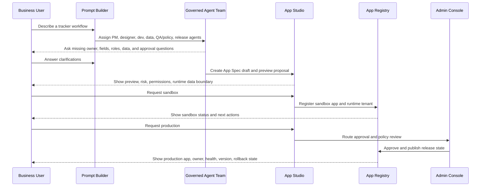
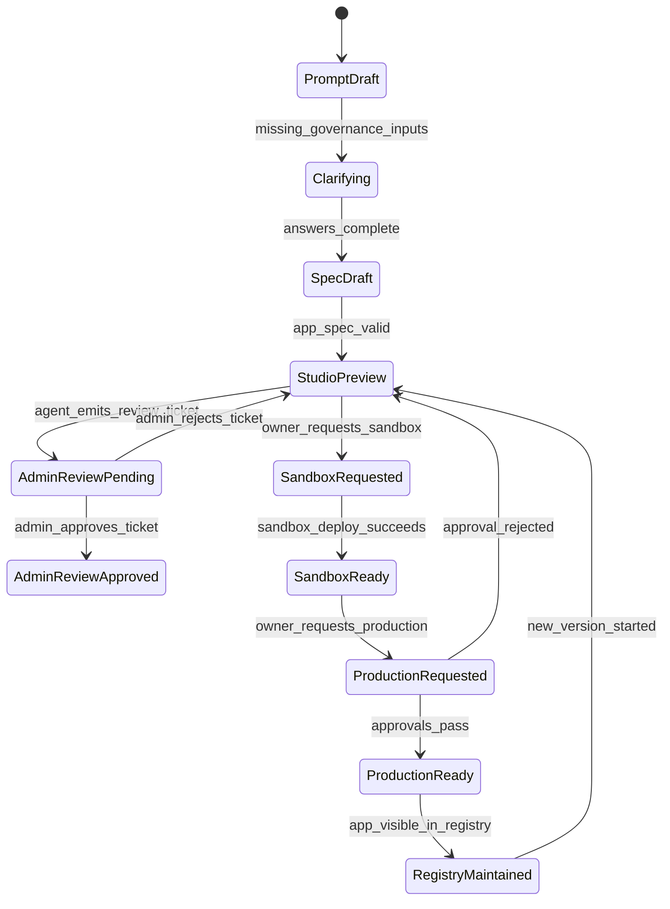

# Web MVP User Story

Issues: #1288, #1297, #1303
Status: draft TD contract

This tech-design spec defines the first user-facing Cue web story. It keeps UI
work tied to formal scenarios, state transitions, visible artifacts, hidden
platform actions, and e2e acceptance instead of treating user stories as loose
product prose.

The canonical Cue-local user story contract is
[`cue-user-story-contract.md`](cue-user-story-contract.md). This file consumes
that contract for the first web MVP slice and maps it into Score-valid
`scenarios`, `interaction`, `wireframe`, and `test-plan` sections until SDD
ships the upstream `user-story` section type in #1540.

The MVP story is: a business user describes a tracker app, Cue asks for missing
governance details, creates an App Spec draft, shows a Studio preview, deploys
a sandbox, routes production approval, and lists the app in Registry.

## Reference Context

External workbench reference:
[`../references/ai-workbench-ui-reference.md`](../references/ai-workbench-ui-reference.md).

App Studio and Admin Workspace UI decisions should use that research as pattern
context for prompt-first workspaces, blueprint/spec review, preview plus
artifact panes, deploy/test flow, resource/API permission gates, and governed
template starts. Cue must not copy an ungated app-generation product model:
the MVP keeps governed artifacts, hidden app repositories, runtime tenancy,
policy/test evidence, and Admin review tickets as the source of truth.

## Owner Complexity Boundary

General app owners should not see the platform control plane as the default
mental model. The owner-facing shell exposes five product actions only:
describe a need, confirm the agent proposal, try the Sandbox, request
Production, and manage owned apps. App Spec, GitLab, runtime tenant, database,
CI, policy packs, and release refs remain durable artifacts, but the owner UI
surfaces them through plain-language review states and ticket outcomes.

Platform maintainers keep a separate Admin workspace for hidden infrastructure,
resource/API approval, production release gates, and policy evidence. Admin
visibility must not leak back into the default app-owner route.

## Goals
<!-- type: manifest lang: yaml -->

```yaml
goals:
  - make_prompt_to_governed_app_visible_as_a_user_story
  - make_conversation_primary_but_artifacts_authoritative
  - show_the_assigned_governed_agent_team_for_each_app
  - make_zh_tw_the_default_ui_language_with_i18n_copy_boundaries
  - split_app_owner_and_platform_maintainer_views
  - expose_structured_artifacts_as_the_authoritative_state
  - define_first_routes_before_building_full_ui
  - keep_gitlab_hidden_from_business_users
  - surface_owner_risk_runtime_and_release_state_in_product_language
  - connect_prompt_builder_studio_sandbox_approval_and_registry
```

## Non-Goals
<!-- type: manifest lang: yaml -->

```yaml
non_goals:
  - build_pixel_final_design
  - expose_gitlab_branches_merge_requests_or_ci_to_business_users
  - implement_full_tracker_runtime
  - connect_real_alloydb_or_real_gitlab_in_the_ui_skeleton
  - replace_the_app_spec_governance_or_runtime_tenancy_contracts
```

## Interaction Contract
<!-- type: config lang: yaml -->

```yaml
interaction_model:
  primary_input: conversation
  authoritative_outputs:
    - app_spec
    - preview
    - primitive_edit_set
    - permission_model
    - runtime_tenant_binding
    - data_contract_plan
    - policy_result
    - test_result
    - sandbox_release
    - production_approval_package
    - registry_update
    - audit_event
  app_owner_controls:
    - answer_clarification
    - approve_spec_change
    - edit_business_setting
    - request_sandbox
    - request_production
    - approve_or_reject_agent_proposal
  personas:
    app_owner:
      sees:
        - app_spec
        - ui_proposal
        - permission_model
        - sandbox_release
        - production_approval_package
      hides:
        - hidden_gitlab_project
        - runtime_database_name
        - release_ref
        - ci_pipeline
    platform_maintainer:
      sees:
        - app_owner_artifacts
        - hidden_gitlab_project
        - runtime_tenant_binding
        - policy_test_pack
        - release_ref
        - quota_and_emergency_controls
  agent_team:
    pm_agent: scope_goal_owner_success_metric
    designer_agent: ui_primitives_layout_interaction
    dev_agent: hidden_repo_artifacts_generation
    data_agent: runtime_tenant_connectors_data_contracts
    qa_policy_agent: permissions_policy_tests_migration_audit
    release_agent: sandbox_production_release_registry_rollback
  invariant:
    - conversation_never_the_only_source_of_truth
    - every_accepted_agent_proposal_updates_structured_artifacts
    - business_users_never_need_gitlab_db_ci_or_deployment_details
    - platform_maintainers_can_inspect_hidden_infrastructure_without_changing_the_owner_contract
```

App owners should feel like they are talking to a delivery team, but every
accepted change must become a structured proposal, diff, setting, test, approval,
or release event. Free-form conversation can explain or request changes; it
cannot be the only persisted product state.

## Primary Journey
<!-- type: interaction lang: mermaid -->



## Scenarios
<!-- type: scenarios lang: yaml -->

```yaml
- id: S1
  title: App owner creates a governed tracker spec from conversation
  given:
    - app owner describes an internal tracker in natural language
    - required governance details are missing
  when:
    - Cue assigns the governed PM designer dev data QA-policy and release agents
    - app owner answers owner fields roles runtime data and approval questions
  then:
    - Cue creates an App Spec draft artifact
    - Cue shows the assigned agent team and draft review state
    - Cue does not expose GitLab project branch commit or CI terms to the app owner

- id: S2
  title: App owner reviews Studio preview and requests Sandbox
  given:
    - valid App Spec draft exists for the tracker app
    - policy checks show the app is Sandbox eligible
  when:
    - app owner opens App Studio
    - app owner reviews preview fields workflow permissions notifications and dashboard tabs
    - app owner clicks request Sandbox
  then:
    - Cue transitions the story state to SandboxReady
    - Cue navigates to /apps/:app_id/sandbox
    - Cue shows owner-visible artifacts and Sandbox acceptance guidance

- id: S3
  title: Platform maintainer sees hidden infrastructure without changing owner contract
  given:
    - app owner is viewing a Sandbox app
  when:
    - platform maintainer switches to the Platform persona
  then:
    - Cue shows platform-only artifacts including hidden GitLab project runtime tenant binding policy-test pack and release reference
    - Cue keeps the app owner contract unchanged
    - business-user copy still hides repository database branch commit and CI implementation details

- id: S4
  title: App owner requests Production and platform approves release
  given:
    - Sandbox review is complete
    - production approval package exists
  when:
    - app owner requests Production
    - platform admin approves policy runtime quota and release state
  then:
    - Cue transitions the app to ProductionReady
    - Cue records the production release tag and registry update
    - app owner sees production state health version rollback state and audit trail

- id: S5
  title: App owner manages the released app from Registry
  given:
    - governed app exists in ProductionReady or SandboxReady state
  when:
    - app owner opens Registry
  then:
    - Cue lists app identity owner namespace lifecycle risk health and version
    - Cue supports opening App Studio to start a new governed version
    - Cue preserves hidden GitLab and runtime binding as platform-maintained infrastructure

- id: S6
  title: Direct links and zh-TW copy remain stable across the story
  given:
    - Cue frontend is served by Jet web dev on port 3212
  when:
    - user opens /apps/:app_id/studio or /apps/:app_id/sandbox directly
  then:
    - route reloads without 404
    - default visible copy is zh-TW with professional terms allowed in English
    - all user-visible copy resolves through i18n resources rather than inline route text

- id: S7
  title: Admin reviews agent-produced tickets before deployment SaaS API or costly resource use
  given:
    - user describes an app need in conversation
    - agent team turns the request into App Spec implementation tests and release package
    - the result needs deployment test publication SaaS API access or costly training resources
  when:
    - Cue records Admin review tickets for deployment_test saas_api and resource_budget requests
    - platform admin opens the Admin workspace
    - platform admin reviews workspace app requester risk resource environment data scope agent output and rationale
  then:
    - Cue shows each ticket as pending Admin review
    - user workspace agents do not receive deployment SaaS API or costly resource permissions before approval
    - after approval Cue grants only the scoped ticket resource and records the audit event
```

## Route Contract
<!-- type: schema lang: yaml -->

```yaml
information_architecture:
  invariant: workspace_and_admin_are_separate_frontend_sites
  frontend_sites:
    workspace:
      routes: [prompt_builder, app_studio, runtime_preview, app_registry]
      primary_actor: app_owner
      forbidden_default_terms: [gitlab, branch, commit, ci, runtime_tenant, database_name, release_ref]
    admin:
      routes: [admin_console]
      primary_actor: platform_admin
      visible_terms: [review_ticket, resource_grant, api_grant, release_gate, runtime_binding, hidden_repo]
  workspace_model:
    user_workspace:
      owns: [conversation, requirements_summary, proposal_review, sandbox_acceptance, production_request, owned_apps]
      cannot_grant: [deployment_publication, saas_api, train_model, costly_compute, pii_access, production_runtime]
    admin_workspace:
      owns: [review_ticket_queue, capability_grants, saas_api_grants, resource_budgets, runtime_permissions, production_release_gates]
      grant_scope_required: [ticket_id, workspace_id, app_id, resource, environment_scope, data_scope, agent_output, audit_reason]
  backend_boundary:
    owns: [source_code_lifecycle, hidden_gitlab_repo, ci, tests, build, deploy, release_tag, rollback, registry_mapping, audit]
    user_visible_translation: [proposal, preview, sandbox_result, approval_status, production_state, health, changelog]
  mamba_library_boundary:
    sdd_mamba:
      owns: [work_item_state, artifact_transitions, review_gates, lifecycle_audit_events]
      forbidden: [shell_out_to_score_or_sdd_cli_in_product_request_path]
    cclab_agent_mamba:
      owns: [governed_agent_team_execution, structured_outputs, admin_review_ticket_emission]
      consumes: [sdd_mamba_artifact_contract]
  create_action:
    id: new_app
    label: New App
    target_route: prompt_builder
routes:
  prompt_builder:
    path: /apps/new
    primary_actor: business_user
    surface_role: app_studio_create_state
    shows:
      - prompt_input
      - clarification_questions
      - unsupported_or_blocked_request
      - draft_app_spec_summary
    hides:
      - gitlab_project
      - branch
      - commit_sha
  app_studio:
    path: /apps/:app_id/studio
    primary_actor: app_owner
    deep_link_reload: true
    owns_create_state: prompt_builder
    shows:
      - app_spec_preview
      - owner_visible_artifacts
      - field_workflow_permission_tabs
      - risk_impact
      - sandbox_request
      - production_request
    hides:
      - raw_git_diff
      - merge_request
      - hidden_repo_status
      - runtime_tenant
  runtime_preview:
    path: /apps/:app_id/sandbox
    primary_actor: app_owner
    deep_link_reload: true
    shows:
      - generated_tracker_preview
      - synthetic_or_sample_data_label
      - reset_sandbox_action
      - owner_acceptance_guidance
    hides:
      - runtime_tenant
      - database_name
      - cluster_id
  app_registry:
    path: /registry
    primary_actor: app_owner
    deep_link_reload: true
    shows:
      - app_id
      - display_name
      - owner
      - namespace
      - lifecycle
      - risk
      - runtime_health
      - release_version
      - owner_or_platform_context_guidance
    hides:
      - gitlab_full_path_for_business_users
  admin_console:
    path: /admin
    primary_actor: platform_admin
    deep_link_reload: true
    shows:
      - policy_findings
      - approval_queue
      - hidden_repo_status
      - runtime_storage_status
      - quota_and_orphan_alerts
      - persona_specific_admin_guidance
      - admin_review_ticket_queue
      - deployment_test_gate
      - saas_api_gate
      - costly_resource_gate
```

## Wireframe Contract
<!-- type: wireframe lang: yaml -->

```yaml
wireframe:
  workspace_shell:
    nav:
      - id: prompt_builder
        label: 說需求
      - id: app_studio
        label: 確認方案
      - id: runtime_preview
        label: 試用測試
      - id: registry
        label: 我的 Apps
    workspace_boundary:
      current_workspace: user_workspace
      review_ticket_status: pending_admin_ticket_count
    status_regions:
      - id: owner_context
      - id: environment_badge
      - id: risk_badge
  admin_shell:
    nav:
      - id: admin_console
        label: 平台審核
    workspace_boundary:
      current_workspace: admin_workspace
      review_ticket_status: pending_admin_ticket_count
    status_regions:
      - id: platform_context
      - id: persona_switch
      - id: artifact_authority_panel
      - id: review_badges
  prompt_builder:
    regions:
      - id: prompt_input
        component: textarea
      - id: clarification_panel
        component: question_list
      - id: draft_summary
        component: app_spec_summary
      - id: blocked_request
        component: policy_block
  app_studio:
    regions:
      - id: preview
        component: tracker_preview
      - id: config_tabs
        component: tabs
        tabs: [fields, workflow, permissions, notifications, dashboard]
      - id: risk_impact
        component: risk_panel
      - id: actions
        component: action_bar
        actions: [save_draft, request_sandbox, request_production]
  registry:
    regions:
      - id: app_table
        component: data_table
      - id: filters
        component: filter_bar
        filters: [owner, namespace, lifecycle, risk, health]
      - id: app_detail
        component: side_panel
  admin_console:
    regions:
      - id: admin_review_ticket_queue
        component: approval_panel
        actions: [approve_ticket, reject_ticket]
      - id: approval_queue
        component: queue
      - id: policy_findings
        component: finding_list
      - id: hidden_infrastructure
        component: key_value_panel
```

## User Story States
<!-- type: state-machine lang: mermaid -->



## Copy Rules
<!-- type: config lang: yaml -->

```yaml
copy_rules:
  default_locale: zh-TW
  fallback_locale: en-US
  locale_resolution:
    - explicit_locale_query_param
    - stored_user_locale
    - zh-TW_default
  professional_terms_can_remain_english:
    - App
    - App Spec
    - App Studio
    - Sandbox
    - Registry
    - Runtime tenant
    - GitLab
    - Policy
    - Approval
    - Release
  invariant:
    - user_visible_copy_resolves_through_i18n_resources
    - schema_keys_ids_routes_and_protocol_terms_do_not_get_translated
    - zh-TW_copy_uses_traditional_chinese_only
  say:
    - app
    - version
    - sandbox
    - production
    - owner
    - risk
    - approval
    - runtime data
    - release
  do_not_say_to_business_users:
    - gitlab_project_id
    - branch
    - merge_request
    - commit_sha
    - ci_pipeline_id
  admin_only_terms:
    - hidden_repo_status
    - runtime_storage_binding
    - release_ref
```

The UI may expose technical state to platform/admin personas, but the default
business-user language stays product-level.

## Implementation Slices
<!-- type: changes lang: yaml -->

```yaml
changes:
  - id: S1
    deliverable: route skeleton for App Studio Sandbox Registry Admin plus New App create action
  - id: S2
    deliverable: static user story state data from example App Spec ownership and runtime tenant files
  - id: S3
    deliverable: Prompt Builder skeleton with clarification panel
  - id: S4
    deliverable: App Studio skeleton with preview config tabs risk panel and sandbox action
  - id: S5
    deliverable: Registry skeleton with owner namespace lifecycle risk health and release columns
  - id: S6
    deliverable: Admin skeleton with policy approval hidden repo runtime storage and quota sections
  - id: S7
    deliverable: zh-TW default copy with en-US i18n fallback for route chrome panels lifecycle labels and actions
  - id: S8
    deliverable: Jet web dev server serves App deep links without 404
  - id: S9
    deliverable: Jet web dev server provides HMR for the React shell
  - id: S10
    deliverable: App owner vs platform maintainer persona switch with artifact visibility split
  - id: S11
    deliverable: Jet browser e2e smoke test for Sandbox deep link Studio to Sandbox flow and persona artifact visibility
  - id: S12
    deliverable: formal TD Scenarios and Test Plan for the Cue web MVP user story contract
  - id: S13
    deliverable: user workspace vs Admin workspace boundary with review tickets for deployment SaaS API and costly resources
  - id: S14
    deliverable: sdd-mamba and cclab-agent-mamba library boundary for Cue backend orchestration
```

## Test Plan

```mermaid
---
id: cue-web-mvp-user-story-test-plan
requirements:
  prompt_to_spec:
    id: S1
    text: "Conversation produces an App Spec draft and owner-safe artifact view"
    kind: functional
    risk: high
    verify: test
  studio_to_sandbox:
    id: S2
    text: "App Studio can request Sandbox and route to SandboxReady"
    kind: functional
    risk: high
    verify: test
  platform_artifacts:
    id: S3
    text: "Platform persona sees hidden infrastructure while owners do not"
    kind: authorization
    risk: high
    verify: test
  production_approval:
    id: S4
    text: "Production approval updates release and registry state"
    kind: workflow
    risk: medium
    verify: test
  registry_management:
    id: S5
    text: "Registry exposes governed app lifecycle and new-version handoff"
    kind: functional
    risk: medium
    verify: test
  deep_link_i18n:
    id: S6
    text: "Direct links reload and user-visible copy is i18n backed"
    kind: compatibility
    risk: medium
    verify: test
  admin_review_ticket_gate:
    id: S7
    text: "Deployment SaaS API and costly resource tickets require Admin workspace approval before grant"
    kind: authorization
    risk: high
    verify: test
elements:
  component_prompt_builder:
    kind: test
    type: "ts/component"
  jet_e2e_studio_sandbox:
    kind: test
    type: "jet/browser-e2e"
  jet_e2e_platform_visibility:
    kind: test
    type: "jet/browser-e2e"
  backend_e2e_production_approval:
    kind: test
    type: "future/e2e"
  registry_e2e_lifecycle:
    kind: test
    type: "future/e2e"
  http_and_i18n_smoke:
    kind: test
    type: "http+ui-smoke"
  admin_review_ticket_e2e:
    kind: test
    type: "jet/browser-e2e"
relations:
  - { from: component_prompt_builder, verifies: prompt_to_spec }
  - { from: jet_e2e_studio_sandbox, verifies: studio_to_sandbox }
  - { from: jet_e2e_platform_visibility, verifies: platform_artifacts }
  - { from: backend_e2e_production_approval, verifies: production_approval }
  - { from: registry_e2e_lifecycle, verifies: registry_management }
  - { from: http_and_i18n_smoke, verifies: deep_link_i18n }
  - { from: admin_review_ticket_e2e, verifies: admin_review_ticket_gate }
---
requirementDiagram
    requirement S1 {
      id: S1
      text: "Conversation produces App Spec draft"
      risk: high
      verifymethod: test
    }
    requirement S2 {
      id: S2
      text: "Studio routes to SandboxReady"
      risk: high
      verifymethod: test
    }
    requirement S3 {
      id: S3
      text: "Platform sees hidden infrastructure"
      risk: high
      verifymethod: test
    }
    requirement S4 {
      id: S4
      text: "Approval updates release registry"
      risk: medium
      verifymethod: test
    }
    requirement S5 {
      id: S5
      text: "Registry manages governed app"
      risk: medium
      verifymethod: test
    }
    requirement S6 {
      id: S6
      text: "Direct links and i18n hold"
      risk: medium
      verifymethod: test
    }
    requirement S7 {
      id: S7
      text: "Admin gates review tickets"
      risk: high
      verifymethod: test
    }
    element component_prompt_builder {
      type: "ts/component"
    }
    element jet_e2e_studio_sandbox {
      type: "jet/browser-e2e"
    }
    element jet_e2e_platform_visibility {
      type: "jet/browser-e2e"
    }
    element backend_e2e_production_approval {
      type: "future/e2e"
    }
    element registry_e2e_lifecycle {
      type: "future/e2e"
    }
    element http_and_i18n_smoke {
      type: "http+ui-smoke"
    }
    element admin_review_ticket_e2e {
      type: "jet/browser-e2e"
    }
    component_prompt_builder - verifies -> S1
    jet_e2e_studio_sandbox - verifies -> S2
    jet_e2e_platform_visibility - verifies -> S3
    backend_e2e_production_approval - verifies -> S4
    registry_e2e_lifecycle - verifies -> S5
    http_and_i18n_smoke - verifies -> S6
    admin_review_ticket_e2e - verifies -> S7
```

<!-- type: test-plan lang: mermaid -->



## Acceptance Mapping
<!-- type: manifest lang: yaml -->

```yaml
acceptance_mapping:
  prompt_builder_never_deploys_directly:
    covered_by:
      - Primary Journey
      - User Story States
      - Scenarios S1
  missing_governance_data_triggers_clarification:
    covered_by:
      - Primary Journey
      - Scenarios S1
      - Prompt Builder route contract
  high_risk_or_bypass_prompts_are_blocked:
    covered_by:
      - Prompt Builder route contract
      - Copy Rules
  studio_preview_from_app_spec_only:
    covered_by:
      - App Studio route contract
      - Wireframe Contract
      - Scenarios S2
  owner_can_request_sandbox:
    covered_by:
      - User Story States
      - App Studio route contract
      - Scenarios S2
  primary_surfaces_and_create_action_are_reachable:
    covered_by:
      - Route Contract
  direct_app_links_reload_without_404:
    covered_by:
      - Route Contract
      - Scenarios S6
      - Implementation Slices
  owner_and_platform_see_different_artifact_sets:
    covered_by:
      - Interaction Contract
      - Wireframe Contract
      - Scenarios S3
      - Implementation Slices
  jet_browser_e2e_covers_primary_slice:
    covered_by:
      - Route Contract
      - App Studio route contract
      - Scenarios S2
      - Scenarios S3
      - Test Plan
      - Implementation Slices
  production_and_registry_story_defined_before_backend:
    covered_by:
      - Scenarios S4
      - Scenarios S5
      - Test Plan
  admin_review_tickets_gate_deploy_saas_and_costly_resources:
    covered_by:
      - Route Contract
      - Wireframe Contract
      - User Story States
      - Scenarios S7
      - Test Plan
```
