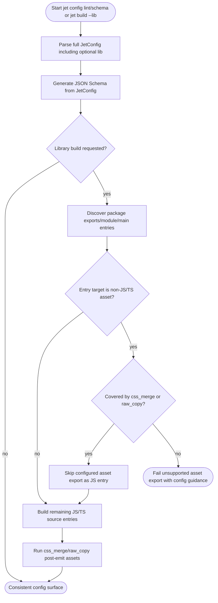
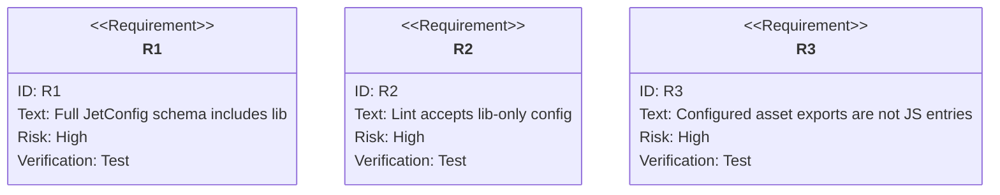

# jet build --lib: [lib] Config Schema and Asset Export Handling

## Logic
<!-- type: logic lang: mermaid -->

```mermaid
---
id: jet-lib-config-schema-lint-and-asset-export-flow
entry: start
nodes:
  start: { kind: start, label: "Start jet config lint/schema or jet build --lib" }
  parse_config: { kind: process, label: "Parse full JetConfig, including optional [lib]" }
  schema: { kind: process, label: "Generate JSON Schema from JetConfig" }
  build: { kind: decision, label: "Library build requested?" }
  discover: { kind: process, label: "Discover package exports/module/main entries" }
  asset_export: { kind: decision, label: "Entry target is non-JS/TS asset?" }
  configured_asset: { kind: decision, label: "Asset is covered by [lib].css_merge or [lib].raw_copy?" }
  skip_asset_entry: { kind: process, label: "Skip configured asset export as JS entry" }
  build_source: { kind: process, label: "Build remaining JS/TS source entries" }
  post_assets: { kind: process, label: "Run css_merge/raw_copy post-emit assets" }
  unsupported: { kind: terminal, label: "Fail unsupported asset export with config guidance" }
  done: { kind: terminal, label: "Config and lib asset export behavior are consistent" }
edges:
  - { from: start, to: parse_config }
  - { from: parse_config, to: schema }
  - { from: schema, to: build }
  - { from: build, to: done, label: "no" }
  - { from: build, to: discover, label: "yes" }
  - { from: discover, to: asset_export }
  - { from: asset_export, to: build_source, label: "no" }
  - { from: asset_export, to: configured_asset, label: "yes" }
  - { from: configured_asset, to: skip_asset_entry, label: "yes" }
  - { from: configured_asset, to: unsupported, label: "no" }
  - { from: skip_asset_entry, to: build_source }
  - { from: build_source, to: post_assets }
  - { from: post_assets, to: done }
---
flowchart TD
    start([Start jet config lint/schema or jet build --lib]) --> parse_config[Parse full JetConfig including optional lib]
    parse_config --> schema[Generate JSON Schema from JetConfig]
    schema --> build{Library build requested?}
    build -->|no| done([Consistent config surface])
    build -->|yes| discover[Discover package exports/module/main entries]
    discover --> asset_export{Entry target is non-JS/TS asset?}
    asset_export -->|no| build_source[Build remaining JS/TS source entries]
    asset_export -->|yes| configured_asset{Covered by css_merge or raw_copy?}
    configured_asset -->|yes| skip_asset_entry[Skip configured asset export as JS entry]
    configured_asset -->|no| unsupported([Fail unsupported asset export with config guidance])
    skip_asset_entry --> build_source
    build_source --> post_assets[Run css_merge/raw_copy post-emit assets]
    post_assets --> done
```
## Unit Test
<!-- type: unit-test lang: mermaid -->

```mermaid
---
id: jet-lib-config-schema-lint-and-asset-export-tests
requirements:
  R1:
    text: "jet config schema exposes the full JetConfig surface, including optional [lib].css_merge and [lib].raw_copy, without requiring [wasm]."
    risk: high
    verify: unit
  R2:
    text: "jet config lint accepts a lib-only jet.toml and still rejects malformed config."
    risk: high
    verify: unit
  R3:
    text: "jet build --lib skips package exports asset entries covered by css_merge/raw_copy and emits the configured asset output."
    risk: high
    verify: unit
---
requirementDiagram
requirement R1 {
  id: R1
  text: "Full JetConfig schema includes lib"
  risk: High
  verifymethod: Test
}
requirement R2 {
  id: R2
  text: "Lint accepts lib-only config"
  risk: High
  verifymethod: Test
}
requirement R3 {
  id: R3
  text: "Configured asset exports are not JS entries"
  risk: High
  verifymethod: Test
}
```
