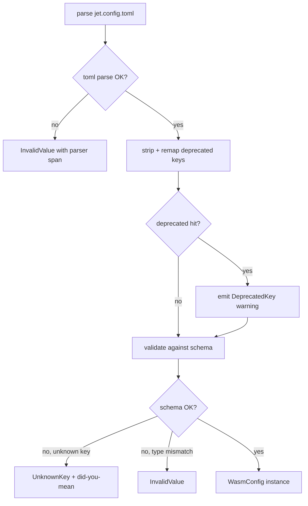

# jet config — schema-driven `jet.config.toml` validation

## Changes
<!-- type: changes lang: yaml -->

```yaml
changes:
  - path: ".aw/tech-design/projects/jet/config/jet-config-validation.md"
    action: modify
    section: doc
    impl_mode: hand-written
    description: |
      Legacy Jet TD content retained as notes during AW standardization.
      Rewrite this file into semantic TD sections before promoting source to CODEGEN.
```

## Legacy notes
<!-- type: doc lang: markdown -->

# jet config — schema-driven `jet.config.toml` validation

> Issue: #1233 — `jet: config — schema-driven jet.config validation`.
> Closed precedent: `bug-jet-dev-ignores-jet-config-yaml-dev-port-and-dev-p`
> (the dev server silently dropped `dev.port` because no key in the
> internal struct matched).
> Feeds: epic #1121 (module federation — `exposes` / `remotes` /
> `shared` sections will multiply the silent-misconfig surface).

### Problem

Today, `jet.config.toml` parsing uses plain `serde::Deserialize` with
defaults, so any key that doesn't match a struct field is silently
dropped. A typo, a pre-rename key, or a structural mistake fails
quietly and the user sees "it works but not the way I want".

### Goal

Make every `jet build` / `jet dev` invocation validate the config
against a schema **derived from the existing Rust `WasmConfig` struct**
(and the future `[dev]` / `[mfe]` siblings). Strict by default; lenient
fallback for explicitly-listed deprecated keys with a one-release
migration warning. Surface a `jet config lint` CLI for CI gating, and
emit `schemas/jet.config.schema.json` so editors can autocomplete and
validate inline.

### Slices

The change ships in five hand-written slices:

- **Slice 1 (this doc) — spec.** Pin the architecture: schema
  derivation via `schemars`, the diagnostic shape (file-relative
  span when toml-parser supports it, otherwise the bare key path),
  the strict / deprecated / unknown decision tree, and the CLI
  surface. No code lands in Slice 1.
- **Slice 2 (shipped) — typed `ConfigError` + unknown-key
  rejection.** `WasmConfig` and the inner `ConfigFile` wrapper
  now carry `#[serde(deny_unknown_fields)]`. `WasmConfig::load`
  delegates to a new `load_typed() -> Result<Self, ConfigError>`
  path; the legacy anyhow-returning entry point is preserved for
  existing callers. `ConfigError` ships five variants (`NotFound`,
  `Io`, `MissingWasmSection`, `UnknownKey { key, suggestion,
  span }`, `InvalidValue`) with `ConfigSpan { line, column }`
  populated from `toml::de::Error::span()` (falls back to `(0, 0)`
  for synthesized errors). Did-you-mean uses a vendored 30-line
  Levenshtein with the `max(2, key.len() / 3)` threshold from
  the spec; ties yield no suggestion. 17 unit tests cover happy
  path, missing section, unknown top-level key, unknown wasm
  field with and without suggestion, span reporting, classifier
  helpers, Levenshtein distances, and the legacy anyhow round-
  trip. `schemars::JsonSchema` derivation is deferred to Slice 5
  (it only matters for the JSON Schema export). No CLI change.
- **Slice 3 (shipped) — deprecated-key allowlist + warnings.**
  `DEPRECATED_KEYS: &[DeprecatedKeyEntry]` (deprecated, replacement,
  removal_version) is a static slice. `apply_deprecated_remap`
  parses the body to a `toml::Value`, removes each hit from the
  root table, walks the dotted replacement path (creating
  intermediate tables as needed), and inserts the original value at
  the leaf. Each rewrite emits a `DeprecatedKeyWarning` carrying the
  source span (line/column from `find_key_span` — top-of-line
  match). `WasmConfig::parse_str` calls `tracing::warn!` per
  warning then runs the strict deserialize on the rewritten body;
  `WasmConfig::parse_str_with_warnings` returns the warnings
  structurally for the future `jet config lint` subcommand. The
  anchor `dev-port` → `dev.port` ships in the production table per
  spec — current schema has no `[dev]` section, so a config that
  trips the anchor produces both the migration warning AND a
  downstream `UnknownKey` on `dev` (decision-tree compliant). 9
  new unit tests cover passthrough, single-segment → dotted
  rewrite, span attachment, warning Display formatting, anchor
  end-to-end, and the empty-table fast path. (26 tests total in
  the module.)
- **Slice 4 (shipped) — `jet config lint` subcommand.** New CLI
  verb under `jet config lint [--path <DIR>] [--format human|json]
  [--strict-warn]`. The dispatcher resolves `<root>/jet.config.toml`,
  routes through `WasmConfig::parse_str_with_warnings`, and
  formats the typed diagnostics. `--format json` prints a
  hand-rolled envelope (no extra dep) shaped
  `{path, ok, errors:[{kind,...}], warnings:[{kind,...}]}` so
  agents and CI gates can parse it. Exit codes: 0 on success,
  0 on warnings without `--strict-warn`, 1 on warnings-only
  with `--strict-warn`, 2 on any error. The `LintOutcome` →
  exit-code conversion is the sole mapping point so future
  flags (`--no-color`, `--quiet`, etc.) layer on top without
  duplicating the table. 13 unit tests cover the human/JSON
  formatters, the outcome → exit-code table, the `dev-port`
  anchor surface, and the JSON-string escaper. End-to-end
  smoke-tested via `./target/debug/jet config lint --path
  <tmp>` against both a valid and an unknown-key config.
- **Slice 8 (shipped) — per-sub-struct `deny_unknown_fields` rollout
  (R2 fully met).** Adds `#[serde(deny_unknown_fields)]` to every
  remaining `JetConfig` sub-struct: `DevConfig`, `JetBuildConfig`,
  `ResolveConfig`, `TestConfig`, `WebServerConfig`, `TaskDef`. With
  Slices 6 + 7 already covering top-level keys (with did-you-mean
  + line numbers) and Slice 2 already covering `[wasm]` keys, the
  loader now rejects unknown keys *anywhere* in the schema. The
  same `JetConfig::load` classifier from Slice 7 surfaces the
  rejection: `[dev]\nportt = 3000\n` produces a diagnostic naming
  the offending sub-key + 1-based line number. Did-you-mean against
  the in-section candidate set falls out of `serde`'s `expected one
  of` list when the message includes it; sub-section did-you-mean
  routing through the `nearest_candidate` Levenshtein helper is a
  Slice 9+ refinement (the current diagnostic already names the
  offending key + line, which is what closed the bug-precedent
  surface). New regression test
  `jet_config_rejects_unknown_sub_section_key` locks the wedge;
  the existing 14 config tests + 871-test jet lib suite continue
  to pass; all 15 example/project configs load clean.
- **Slice 7 (shipped) — `JetConfig::load` did-you-mean + line numbers
  for top-level typos (R2 / R4 polish).** Slice 6 made the loader
  reject unknown top-level sections; this slice makes the rejection
  *helpful*. `JetConfig::load` now wraps `toml::de::Error` through a
  `classify_jet_toml_error` helper that:
    1. extracts the offending key from `serde`'s `unknown field`
       message (mirroring the helper in `wasm_build::config`),
    2. lifts the 1-based line number from
       `toml::de::Error::span()` via a small `line_for_byte_offset`
       UTF-8-safe walker, and
    3. runs the existing `wasm_build::config::nearest_candidate`
       Levenshtein helper against `JET_TOP_LEVEL_KEYS` (`pipeline`
       / `dev` / `alias` / `build` / `resolve` / `test` / `wasm`).
  Net effect: `[devv]` at line 2 now produces
  `<path>: unknown section \`devv\` at line 2 — did you mean \`dev\`?`
  instead of the bare `toml::de::Error` message. The
  `nearest_candidate` helper from Slice 2 is reused via a public
  re-export — no candidate-set duplication. New regression test
  `jet_config_load_surfaces_did_you_mean_and_line_number` writes a
  tempfile and asserts every diagnostic component (typo name +
  did-you-mean hint + line number + file path); the existing 13
  config tests continue to pass. Sub-section did-you-mean (e.g.
  typoed keys *inside* `[dev]`) is still on the Slice 7+ roadmap
  alongside per-sub-struct `deny_unknown_fields`.
- **Slice 6 (shipped) — top-level `JetConfig` `deny_unknown_fields`
  + `[wasm]` field promotion (R2 / R4 wedge for `jet dev` / `jet
  build`).** Adds `#[serde(deny_unknown_fields)]` to the top-level
  `JetConfig` struct in `crates/jet/src/task_runner/config.rs` (the
  loader called from every `jet dev` / `jet build` startup) and
  promotes `[wasm]` from "ignored, looked at separately by the lint
  subcommand" to a recognized `pub wasm: Option<WasmConfig>` field.
  Net effect: a misspelled top-level section like `[devv]` (the
  closed-precedent surface from `bug-jet-dev-ignores-jet-config-
  yaml-dev-port-and-dev-p`) now fails the load with a `toml::de
  ::Error` rather than being silently dropped. Sub-sections remain
  permissive — per-section `deny_unknown_fields` rollout (Slice 7+)
  hardens inside-the-section keys; this slice closes the highest-
  blast-radius silent-misconfig surface first. Two new regression
  tests (`jet_config_rejects_unknown_top_level_section`,
  `jet_config_parses_wasm_section`) lock the wedge; existing 11
  config tests continue to pass; the schema regression test extends
  to require `wasm` in the top-level property set. All 14 jet
  example/projects configs (`examples/*-demo/jet.config.toml`,
  `projects/conductor/fe/jet.config.toml`) load clean — no
  migration needed because the only previously-tolerated unknown
  section was `[wasm]` itself, which is now a known field.
- **Slice 5 (shipped) — `jet config schema` subcommand + bootstrapped
  artifact.** `WasmConfig` and `RootPropValue` now derive
  `schemars::JsonSchema` (workspace already pulls schemars 0.8 via
  transitive deps; jet's `Cargo.toml` adds the direct dep). New
  module `crates/jet/src/wasm_build/schema.rs` ships
  `build_schema()` (wraps the derived `WasmConfig` schema under a
  required top-level `wasm` property + `additionalProperties:
  false` so the artifact mirrors the loader's
  `deny_unknown_fields`), `render(&RootSchema) -> String` (stable
  pretty-printed JSON with trailing newline so byte-equality is
  meaningful), and `run(workspace_root, mode)` dispatching three
  modes: `print` (stdout, no disk touch), `write` (writes
  `schemas/jet.config.schema.json` under the workspace root,
  `mkdir -p` the parent), `check` (compares fresh render against
  on-disk artifact). Exit codes via `SchemaOutcome::to_exit_code`:
  0 = ok / match, 1 = drift, 2 = missing / unreadable / malformed
  / unknown mode. CLI subcommand `jet config schema [--path
  <root>] [--write | --check]` (write/check `conflicts_with` so
  --check + --write is rejected by clap). 11 unit tests cover
  schema shape (top-level required wasm + additionalProperties
  false + WasmConfig definition with the three known fields),
  determinism + newline termination, all three on-disk outcomes
  (match / drift / missing), all three modes through `run()`
  (print no-disk-touch, write round-trip + follow-up check,
  drift → 1, missing → 2, unknown mode → 2), plus the
  `SchemaOutcome` exit-code table. End-to-end smoke verified: the
  bootstrapped `schemas/jet.config.schema.json` round-trips
  through `--check` with exit 0. Editor wiring (`.vscode/settings
  .json` + Zed `extensions/toml.toml`) is a follow-up — the
  artifact is in place ready for any consumer to point at it.

### Public surface (Slice 2 target)

```rust
#[derive(Debug, thiserror::Error)]
pub enum ConfigError {
    #[error("missing [wasm] section in {path:?}")]
    MissingWasmSection { path: PathBuf },

    #[error("unknown key {key:?} at {span:?}{}",
        .suggestion.as_ref()
            .map(|s| format!(" — did you mean {s:?}?"))
            .unwrap_or_default())]
    UnknownKey {
        key: String,
        span: ConfigSpan,
        suggestion: Option<String>,
    },

    #[error("invalid value for {key:?} at {span:?}: {message}")]
    InvalidValue { key: String, span: ConfigSpan, message: String },

    #[error("deprecated key {key:?} at {span:?} — replaced by {replacement:?} (will be removed in {removal_version})")]
    DeprecatedKey {                     // emitted as a warning by default;
        key: String,                    // promoted to error under --strict-warn
        replacement: String,
        removal_version: String,
        span: ConfigSpan,
    },
}

#[derive(Debug, Clone)]
pub struct ConfigSpan {
    pub line: usize,                    // 1-based
    pub column: usize,                  // 1-based
}
// ConfigSpan is `0,0` when the toml parser couldn't attach a span;
// that case is reserved for synthesized errors (e.g. missing required
// section) where there's no source location to point at.
```

`ConfigError` is the typed surface that `jet config lint` formats and
that `jet build` / `jet dev` route through. The current `anyhow::Error`
return on `WasmConfig::load` becomes `Result<WasmConfig, ConfigError>`
(callers wrap into anyhow as needed).

### Decision tree



### Did-you-mean suggestion algorithm

Vendored Levenshtein over the candidate key set (the schema's known
keys at the offending nesting level). Threshold: `distance <=
max(2, key.len() / 3)`. If multiple candidates tie, prefer the one
with the lowest distance; on further tie, emit no suggestion (avoid
guessing wrong). This matches the heuristic `cargo` uses for command-
name typos.

### Editor integration (Slice 5)

`schemas/jet.config.schema.json` lives at the **workspace root** so
editors find it without per-project config:

```jsonc
// .vscode/settings.json (committed)
{
  "evenBetterToml.schema.associations": [
    { "regex": "jet\\.config\\.toml$", "url": "./schemas/jet.config.schema.json" }
  ]
}
```

Zed picks it up via `extensions/toml.toml`'s `schemas` table — same URL.

CI gate: `cargo run -p jet -- config schema --check` exits non-zero
if the on-disk schema differs from a fresh generation, so the
artifact stays in lockstep with the Rust source of truth (R1).

### Out of scope

- **Config migration codemods.** The deprecated-key warning points
  the user at the rename; an automatic rewriter is filed separately
  (see issue body §"Out of Scope").
- **Environment-variable overrides.** `JET_DEV_PORT` etc. live
  in their own validation pass; this spec is file-only.
- **Plugin-contributed config sections.** Revisit after MFE
  (#1121) lands so the extension surface is real, not hypothetical.
- **YAML support.** The current loader is TOML-only. The closed
  precedent bug mentioned `jet.config.yaml`; this spec keeps TOML
  as the only supported format. If YAML is reintroduced, validation
  hooks the same `JetConfigSchema` derivation.

### Cross-references

- `crates/jet/src/wasm_build/config.rs` — current `WasmConfig`
  loader (the Slice-2 refactor target).
- `crates/jet/src/cli.rs` — CLI parser; Slice 4 adds the `config`
  subcommand here.
- `bug-jet-dev-ignores-jet-config-yaml-dev-port-and-dev-p` —
  closed precedent that motivated this spec.
- Epic #1121 — module federation; will add `[mfe]` section that
  this validator MUST cover before the silent-misconfig surface
  multiplies.
