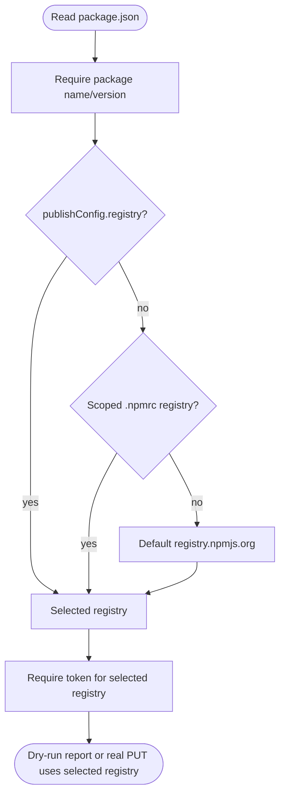
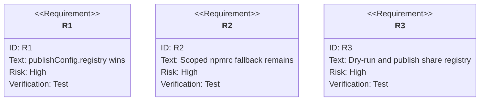

# jet publish: Registry Resolution Honors Package and Scope Configuration

## Logic
<!-- type: logic lang: mermaid -->


## Unit Test
<!-- type: unit-test lang: mermaid -->


## Changes
<!-- type: changes lang: yaml -->

```yaml
coverage_kind: semantic
changes:
  - path: "projects/jet/src/pkg_manager/publish.rs"
    action: modify
    section: logic
    description: |
      Resolve the publish registry from package.json publishConfig.registry
      before falling back to .npmrc scoped/default registry selection, and keep
      the selected registry in the shared prepare_publish path used by dry-run
      and real publish.
    impl_mode: hand-written
  - path: "projects/jet/tests/publish/library_publish_e2e.rs"
    action: modify
    section: unit-test
    description: |
      Add mock-registry coverage proving publishConfig.registry drives dry-run
      and real publish routing even when .npmrc points the same scope elsewhere.
    impl_mode: hand-written
  - path: "projects/jet/src/pkg_manager/npmrc.rs"
    action: modify
    section: unit-test
    description: |
      Keep scoped .npmrc registry fallback covered so publishConfig precedence
      does not regress existing scoped package routing.
    impl_mode: hand-written
```
