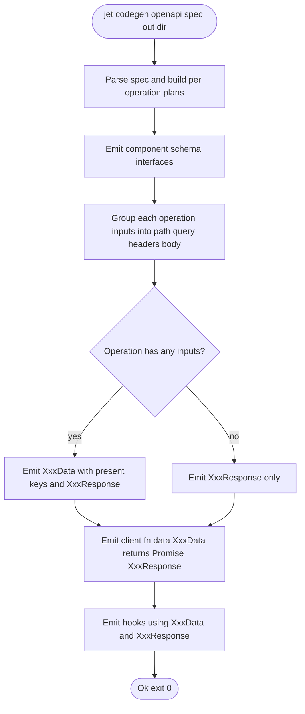
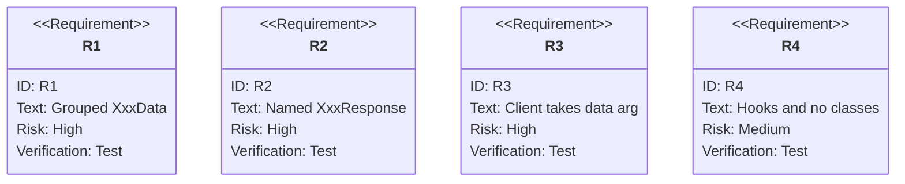

# TD: jet/codegen-openapi-named-types

## Logic
<!-- type: logic lang: mermaid -->

## Unit Test
<!-- type: unit-test lang: mermaid -->

# Reviews

### Review 1
**Verdict:** approved

- [logic] Contract complete: the flowchart captures component emission, per-operation input grouping into XxxData (present keys only), XxxResponse aliasing, and the client/hooks emission consuming the named types.
- [unit-test] Contract complete: R1-R4 map onto the acceptance criteria (grouped XxxData, named XxxResponse incl. void, the client data-argument signature, hooks using the named types with no runtime class).
