# TD: jet/codegen-openapi

## Logic

```mermaid
---
id: jet-codegen-openapi-logic
entry: start
nodes:
  start: { kind: start, label: "jet codegen openapi <spec> --out <dir>" }
  read_project: { kind: process, label: "Read package.json + jet.toml [codegen.openapi]; resolve stack/http/hooks with CLI override" }
  read: { kind: process, label: "Read spec file from disk" }
  parse: { kind: process, label: "Parse JSON into OpenAPI Spec model (serde, tolerate unknown keys)" }
  parse_ok: { kind: decision, label: "Parse succeeded?" }
  err_parse: { kind: terminal, label: "Err: invalid spec (exit 2)" }
  normalize: { kind: process, label: "Normalize 3.0 nullable and 3.1 type-array nullability" }
  resolve: { kind: process, label: "Resolve #/components/schemas $refs with cycle guard" }
  emit_types: { kind: process, label: "Emit types.ts from component and inline schemas" }
  client_dec: { kind: decision, label: "Emit client? (not --types-only)" }
  emit_client: { kind: process, label: "Emit runtime.ts + client.ts (createClient, one fn per operation)" }
  hooks_dec: { kind: decision, label: "Emit hooks? (resolved hook runtime is react-query and not --types-only)" }
  emit_hooks: { kind: process, label: "Emit hooks.ts for React Query (createHooks, useQuery/useMutation)" }
  write: { kind: process, label: "Write generated files to out dir + index.ts barrel" }
  done: { kind: terminal, label: "Ok (exit 0)" }
edges:
  - { from: start, to: read_project }
  - { from: read_project, to: read }
  - { from: read, to: parse }
  - { from: parse, to: parse_ok }
  - { from: parse_ok, to: err_parse, label: "no" }
  - { from: parse_ok, to: normalize, label: "yes" }
  - { from: normalize, to: resolve }
  - { from: resolve, to: emit_types }
  - { from: emit_types, to: client_dec }
  - { from: client_dec, to: hooks_dec, label: "no" }
  - { from: client_dec, to: emit_client, label: "yes" }
  - { from: emit_client, to: hooks_dec }
  - { from: hooks_dec, to: write, label: "no" }
  - { from: hooks_dec, to: emit_hooks, label: "yes" }
  - { from: emit_hooks, to: write }
  - { from: write, to: done }
---
flowchart TD
    start([jet codegen openapi spec --out dir]) --> read_project[Read package json and jet toml codegen openapi; resolve stack http hooks]
    read_project --> read[Read spec file from disk]
    read --> parse[Parse JSON into OpenAPI Spec model]
    parse --> parse_ok{Parse succeeded?}
    parse_ok -->|no| err_parse([Err: invalid spec exit 2])
    parse_ok -->|yes| normalize[Normalize 3.0 nullable and 3.1 type-array nullability]
    normalize --> resolve[Resolve components.schemas refs with cycle guard]
    resolve --> emit_types[Emit types.ts from component and inline schemas]
    emit_types --> client_dec{Emit client? not --types-only}
    client_dec -->|no| hooks_dec{Emit hooks? not --no-hooks}
    client_dec -->|yes| emit_client[Emit runtime.ts and client.ts]
    emit_client --> hooks_dec
    hooks_dec -->|no| write[Write generated files to out dir]
    hooks_dec -->|yes| emit_hooks[Emit hooks.ts React Query createHooks useQuery useMutation]
    emit_hooks --> write
    write --> done([Ok exit 0])
```

<!-- type: logic lang: mermaid -->


## Unit Test

```mermaid
---
id: jet-codegen-openapi-unit-test
requirements:
  R1:
    text: "3.0 nullable and 3.1 type-array nullability both produce a nullable union."
    risk: high
    verify: unit
  R2:
    text: "Schema mapping covers object, array, enum, oneOf, anyOf, allOf, ref, additionalProperties, required vs optional."
    risk: high
    verify: unit
  R3:
    text: "Client functions name from operationId with method-path fallback and type path, query, body, and response."
    risk: high
    verify: unit
  R4:
    text: "Hooks emit useQuery for GET and useMutation for write methods only when the resolved hook runtime is React Query."
    risk: medium
    verify: unit
  R5:
    text: "Generated output is deterministic and matches committed golden snapshots."
    risk: high
    verify: command
  R6:
    text: "CLI flags override jet.toml [codegen.openapi], which overrides package.json auto-detection for stack/http/hooks."
    risk: high
    verify: unit
---
requirementDiagram
requirement R1 {
  id: R1
  text: "Nullable reconciliation"
  risk: High
  verifymethod: Test
}
requirement R2 {
  id: R2
  text: "Schema to TS mapping"
  risk: High
  verifymethod: Test
}
requirement R3 {
  id: R3
  text: "Typed client functions"
  risk: High
  verifymethod: Test
}
requirement R4 {
  id: R4
  text: "Stack-aware React Query hooks"
  risk: Medium
  verifymethod: Test
}
requirement R5 {
  id: R5
  text: "Deterministic golden output"
  risk: High
  verifymethod: Test
}
requirement R6 {
  id: R6
  text: "Stack resolution precedence"
  risk: High
  verifymethod: Test
}
```

<!-- type: unit-test lang: mermaid -->



## Changes
<!-- type: changes lang: yaml -->

```yaml
coverage_kind: semantic
changes:
  - path: "projects/jet/src/cli.rs"
    action: modify
    section: logic
    impl_mode: hand-written
    description: |
      Add stack-aware OpenAPI codegen CLI resolution: flags override
      [codegen.openapi] in jet.toml, which overrides package.json
      auto-detection for frontend stack, hook runtime, and HTTP backend.
  - path: "projects/jet/src/task_runner/config.rs"
    action: modify
    section: logic
    impl_mode: hand-written
    description: |
      Add typed jet.toml schema support for [codegen.openapi] stack/http/hooks
      so generators can resolve output from project configuration.
  - path: "projects/jet/src/codegen/mod.rs"
    action: modify
    section: logic
    impl_mode: hand-written
    description: |
      Own the pure OpenAPI generation pipeline and CLI-facing run path:
      parse spec JSON, resolve stack/http/hooks from project files, build type
      map and operation plans, emit selected files, and write deterministic
      output.
  - path: "projects/jet/src/codegen/openapi.rs"
    action: modify
    section: logic
    impl_mode: hand-written
    description: |
      Model the OpenAPI 3.0/3.1 subset consumed by Jet codegen, including
      nullable reconciliation inputs and deterministic path/schema maps.
  - path: "projects/jet/src/codegen/tsmap.rs"
    action: modify
    section: logic
    impl_mode: hand-written
    description: |
      Map OpenAPI schema nodes to TypeScript type expressions for nullable,
      object, array, enum, composition, ref, and additionalProperties cases.
  - path: "projects/jet/src/codegen/plan.rs"
    action: modify
    section: logic
    impl_mode: hand-written
    description: |
      Build operation plans with deterministic names, grouped input fields,
      query/mutation classification, and response type aliases.
  - path: "projects/jet/src/codegen/types_emit.rs"
    action: modify
    section: logic
    impl_mode: hand-written
    description: |
      Emit types.ts from component schemas plus per-operation request and
      response type aliases.
  - path: "projects/jet/src/codegen/client_emit.rs"
    action: modify
    section: logic
    impl_mode: hand-written
    description: |
      Emit runtime.ts and typed client.ts functions for the selected OpenAPI
      operation plans.
  - path: "projects/jet/src/codegen/hooks_emit.rs"
    action: modify
    section: logic
    impl_mode: hand-written
    description: |
      Emit TanStack Query hooks for GET operations and mutations for write
      operations only when stack resolution selects React Query hooks.
  - path: "projects/jet/tests/codegen/openapi_golden.rs"
    action: modify
    section: unit-test
    impl_mode: hand-written
    description: |
      Golden snapshots, deterministic output checks, nullable/composition
      assertions, and TypeScript smoke coverage for jet codegen openapi.
```

## E2E Test
<!-- type: e2e-test lang: yaml -->

```yaml
e2e_tests:
  - id: stack_aware_openapi_codegen
    capability_id: rust-native-frontend-toolchain
    claim_id: stack-aware-openapi-codegen
    name: "Stack-aware OpenAPI codegen"
    command: "cargo test -p jet --test openapi_golden"
    proves: "OpenAPI codegen resolves stack, HTTP backend, and hooks from CLI flags, jet.toml, and package.json."
```

# Reviews

### Review 1
**Verdict:** approved

- [logic] Contract is complete and codegen-ready: the Mermaid Plus flowchart models the full pipeline (read, parse, normalize 3.0/3.1, resolve refs, emit types/client/hooks, write) with a parse-failure terminal and the types-only/no-hooks decision branches that match the CLI flags.
- [unit-test] Contract is complete: R1-R5 map one-to-one onto the acceptance criteria (nullable reconciliation, schema-to-TS mapping, typed client functions, React Query hooks, deterministic golden output) with appropriate risk and verify methods.
