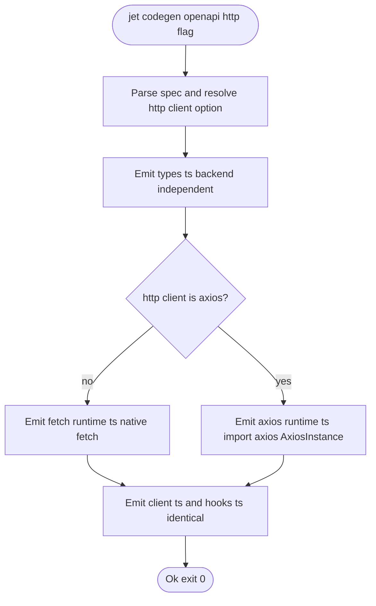
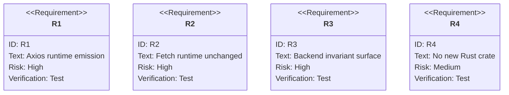

# TD: jet/codegen-openapi-http-client

## Logic
<!-- type: logic lang: mermaid -->

## Unit Test
<!-- type: unit-test lang: mermaid -->

# Reviews

### Review 1
**Verdict:** approved

- [logic] Contract complete: the flowchart captures the `--http` branch — types.ts is emitted backend-independently, the decision selects the fetch or axios runtime emitter, and client.ts/hooks.ts are shared, matching the backend-invariance requirement.
- [unit-test] Contract complete: R1-R4 map onto the acceptance criteria (axios runtime emission, fetch runtime unchanged, byte-identical client/hooks/types/index across backends, no new Rust crate).
