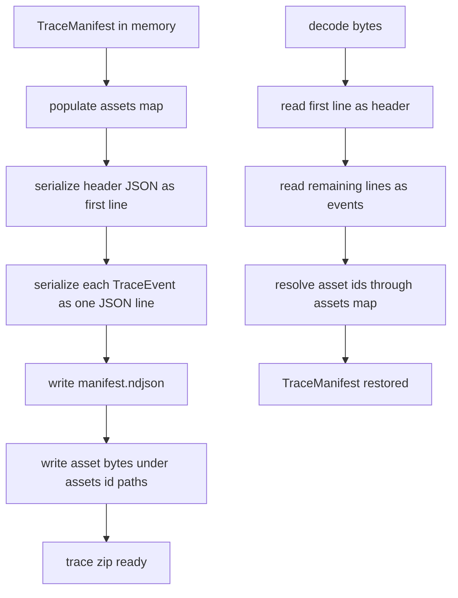
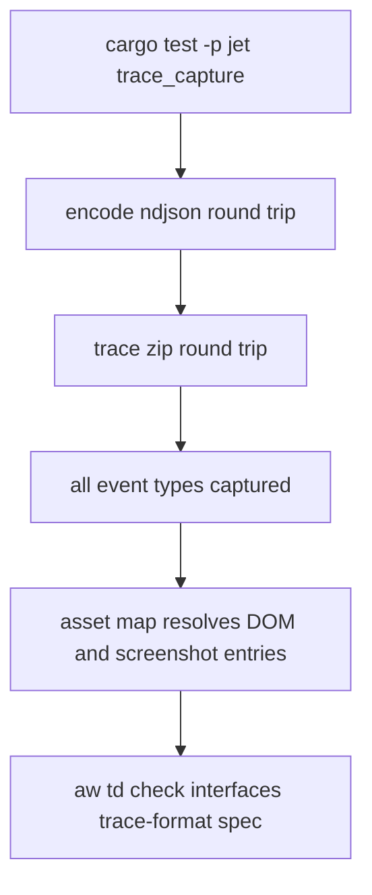

# Jet Trace Format

## Changes
<!-- type: changes lang: yaml -->

```yaml
changes:
  - path: ".aw/tech-design/projects/jet/interfaces/trace/format.md"
    action: modify
    section: doc
    impl_mode: hand-written
    description: |
      Legacy Jet TD content retained as notes during AW standardization.
      Rewrite this file into semantic TD sections before promoting source to CODEGEN.
```

## Legacy notes
<!-- type: doc lang: markdown -->

# Jet Trace Format

### Overview

Jet trace files are self-describing `trace.zip` archives. Each archive contains
a `manifest.ndjson` entry plus binary assets under `assets/`. The format is
owned by Jet and intentionally does not depend on Playwright's trace schema.

Archive layout:

```text
trace.zip
  manifest.ndjson
  assets/dom-0
  assets/screenshot-0
  assets/dom-1
  assets/screenshot-1
```

The first NDJSON line is a manifest header. Subsequent lines are trace events
tagged by a `kind` field. Asset ids are stored in the header `assets` map and
resolve to zip entry paths.

### Requirements

```mermaid
---
id: jet-trace-format-requirements
entry: TF1
---
requirementDiagram
    requirement TF1 {
        id: TF1
        text: trace zip contains manifest.ndjson and zero or more assets entries
        risk: high
        verifymethod: test
    }
    requirement TF2 {
        id: TF2
        text: manifest.ndjson first line is the TraceManifestHeader JSON object
        risk: high
        verifymethod: test
    }
    requirement TF3 {
        id: TF3
        text: manifest.ndjson event lines use a kind discriminator
        risk: high
        verifymethod: test
    }
    requirement TF4 {
        id: TF4
        text: schema version starts at one and changes only on breaking format updates
        risk: medium
        verifymethod: review
    }
    requirement TF5 {
        id: TF5
        text: asset ids use dom step id and screenshot step id conventions
        risk: medium
        verifymethod: test
    }
    requirement TF6 {
        id: TF6
        text: encode and decode round trip through manifest ndjson bytes
        risk: high
        verifymethod: test
    }
```

### Schema

```yaml
schemas:
  TraceManifestHeader:
    type: object
    required:
      - version
      - test_id
      - spec_file
      - test_title
      - outcome
      - started_at
      - finished_at
      - assets
    fields:
      version:
        type: integer
        const: 1
      test_id:
        type: string
      spec_file:
        type: string
      test_title:
        type: string
      outcome:
        enum:
          - passed
          - failed
          - timed-out
      started_at:
        type: integer
      finished_at:
        type: integer
      assets:
        type: map
        key: asset_id
        value: zip_entry_path
  TraceEvent:
    discriminator: kind
    variants:
      - action_step
      - console
      - network
      - screenshot
  AssetId:
    patterns:
      - dom-{step_id}
      - screenshot-{step_id}
    zip_entry: assets/{id}
  SerdeNaming:
    TraceOutcome: kebab-case
    ActionKind: snake_case
    ConsoleLevel: lowercase
    optional_fields: skip_serializing_if Option::is_none
```

### Logic



### Test Plan



### Changes

```yaml
changes:
  - path: .aw/tech-design/crates/jet/interfaces/trace/format.md
    action: create
    section: doc
    purpose: Re-home and normalize the Jet trace file format contract.
    impl_mode: hand-written
  - path: .aw/tech-design/crates/jet/testing/trace-format.md
    action: delete
    section: doc
    purpose: Remove stale testing-directory note without section annotations.
    impl_mode: hand-written
  - path: crates/jet/src/trace/manifest.rs
    action: none
    section: doc
    purpose: Existing trace manifest representation described by this spec.
    impl_mode: hand-written
  - path: crates/jet/src/trace/archive.rs
    action: none
    section: doc
    purpose: Existing trace archive writer described by this spec.
    impl_mode: hand-written
```
