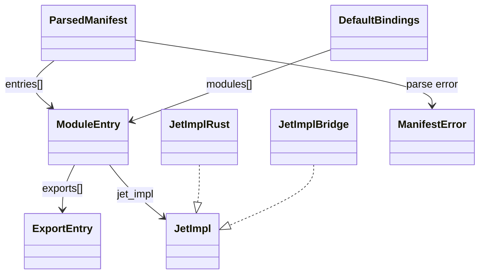
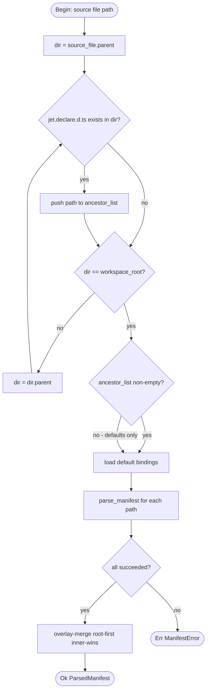

## Parsed Manifest Schema
<!-- type: schema lang: yaml -->

```yaml
$schema: "https://json-schema.org/draft/2020-12/schema"
$id: "jet-wasm-binding-manifest"
title: ParsedManifest
description: >
  The in-memory representation of a fully-merged jet.declare.d.ts binding
  manifest. Produced by parse_manifest(); consumed by the transpiler import
  resolver. Cross-references: subset.md#S9 (whitelisted import acceptance),
  subset.md#X5 (dynamic-import-non-tsx rejection), subset.md#X6
  (undeclared-import rejection).
type: object
required:
  - entries
properties:
  entries:
    type: array
    description: >
      Ordered list of module binding entries. Merged across all ancestor
      jet.declare.d.ts files; inner manifests win on per-module_name conflict.
    items:
      $ref: "#/$defs/ModuleEntry"
    minItems: 0
additionalProperties: false
$defs:
  ModuleEntry:
    $id: "module-entry"
    title: ModuleEntry
    description: >
      One declared ambient module from a jet.declare.d.ts file.
      Corresponds to one `declare module "<name>" { ... }` block.
    type: object
    required:
      - module_name
      - exports
      - jet_impl
    properties:
      module_name:
        type: string
        minLength: 1
        description: >
          The bare-specifier or package path exactly as it appears in the
          `declare module "<name>"` string literal. Used as the lookup key
          during import resolution.
        examples:
          - "lodash/get"
          - "@tanstack/react-query"
          - "fetch"
          - "console"
      exports:
        type: array
        description: >
          List of export declarations within the module block.
          An empty array is valid for modules that expose only a default export.
        items:
          $ref: "#/$defs/ExportEntry"
      jet_impl:
        $ref: "#/$defs/JetImpl"
        description: >
          Discriminated union declaring how the module is provided at
          WASM runtime. Parsed from `declare const __jet_impl: "<discriminant>"`.
    additionalProperties: false
  ExportEntry:
    $id: "export-entry"
    title: ExportEntry
    description: >
      One export within a ModuleEntry. Represents either a default export
      or a named export function or value declaration.
    type: object
    required:
      - kind
      - name
    properties:
      kind:
        type: string
        enum:
          - default
          - named
        description: >
          default — corresponds to `export default function` or `export default`.
          named   — corresponds to `export function <name>` or `export { <name> }`.
      name:
        type: string
        minLength: 1
        description: >
          The exported identifier. For kind=default the parser records the
          literal string "default". For kind=named this is the export's
          identifier as it appears in source.
        examples:
          - "default"
          - "useQuery"
          - "get"
      signature:
        type: string
        description: >
          Optional TypeScript function signature string preserved verbatim from
          the declaration. Used only for documentation; the transpiler does not
          parse this field.
        examples:
          - "(obj: unknown, path: string): unknown"
          - "<T>(opts: UseQueryOpts): UseQueryResult<T>"
    additionalProperties: false
  JetImpl:
    $id: "jet-impl"
    title: JetImpl
    description: >
      Discriminated union for the __jet_impl declaration. Two variants:
        rust:<symbol>   — the export is reimplemented in Rust at the given symbol
                          path. The manifest declares only that the symbol exists;
                          transpiler lowering semantics are specified in transpiler.md.
        bridge:<symbol> — the export is bridged via wasm-bindgen at the given symbol
                          path. The manifest declares only the bridge surface;
                          codec/call-site codegen is specified in transpiler.md.
      Any other prefix is a parse error (MANIFEST_PARSE_004).
    oneOf:
      - $ref: "#/$defs/JetImplRust"
      - $ref: "#/$defs/JetImplBridge"
  JetImplRust:
    $id: "jet-impl-rust"
    title: JetImplRust
    description: >
      Variant: `rust:<symbol>`. Declares that this module's exports are
      reimplemented in Rust. The symbol path is a Rust path string
      (e.g. "lodash_get", "jet_wasm_json::parse"). Cross-reference: subset.md#S9.
    type: object
    required:
      - discriminant
      - symbol
    properties:
      discriminant:
        type: string
        const: rust
        description: Literal discriminant value "rust".
      symbol:
        type: string
        minLength: 1
        pattern: "^[A-Za-z_][A-Za-z0-9_:]*$"
        description: >
          Rust symbol path identifying the implementation. Must be a valid Rust
          path segment (letters, digits, underscores, double-colon separator).
        examples:
          - "lodash_get"
          - "jet_wasm_json::parse"
          - "jet_wasm_json::stringify"
    additionalProperties: false
  JetImplBridge:
    $id: "jet-impl-bridge"
    title: JetImplBridge
    description: >
      Variant: `bridge:<symbol>`. Declares that this module's exports are
      bridged via wasm-bindgen at the given symbol path. The symbol path is
      a JS/WASM bridge identifier (e.g. "@tanstack/react-query",
      "jet_bridge_console"). Cross-reference: subset.md#S9, subset.md#X5.
    type: object
    required:
      - discriminant
      - symbol
    properties:
      discriminant:
        type: string
        const: bridge
        description: Literal discriminant value "bridge".
      symbol:
        type: string
        minLength: 1
        description: >
          Bridge symbol identifier. May contain slashes and @ characters
          as used in npm package specifiers, or a plain identifier for
          internal bridges.
        examples:
          - "@tanstack/react-query"
          - "jet_bridge_fetch"
          - "jet_bridge_console"
    additionalProperties: false
  ManifestError:
    $id: "manifest-error"
    title: ManifestError
    description: >
      Error type returned by parse_manifest() on failure. Each variant maps
      to a stable error code (R10). The transpiler treats all variants as
      fatal build errors.
    type: object
    required:
      - code
      - message
    properties:
      code:
        type: string
        enum:
          - MANIFEST_PARSE_001
          - MANIFEST_PARSE_002
          - MANIFEST_PARSE_003
          - MANIFEST_PARSE_004
          - MANIFEST_PARSE_005
        description: >
          Stable error code. Codes are stable across jet versions and used in
          CI error output and error message templates.
          MANIFEST_PARSE_001 — FileNotFound: jet.declare.d.ts path does not exist.
          MANIFEST_PARSE_002 — ParseError: file is not valid TypeScript ambient syntax.
          MANIFEST_PARSE_003 — MissingModuleName: a `declare module` block has an
                               empty or absent string literal name.
          MANIFEST_PARSE_004 — UnknownImplDiscriminant: `__jet_impl` value does not
                               start with "rust:" or "bridge:".
          MANIFEST_PARSE_005 — DuplicateModule: two entries in the merged manifest
                               share the same module_name after overlay merge.
      message:
        type: string
        description: >
          Human-readable error message. May contain the file path, line/col, and
          the offending token. Template per code:
          MANIFEST_PARSE_001: "jet.declare.d.ts not found at {path}"
          MANIFEST_PARSE_002: "parse error in {path}:{line}:{col} — {detail}"
          MANIFEST_PARSE_003: "missing module name in declare module block at {path}:{line}:{col}"
          MANIFEST_PARSE_004: "unknown __jet_impl discriminant '{value}' in module '{module}' at {path}:{line}:{col}; expected 'rust:<symbol>' or 'bridge:<symbol>'"
          MANIFEST_PARSE_005: "duplicate module '{module}' after overlay merge from {path}"
      path:
        type: string
        description: Filesystem path of the manifest file that triggered the error.
      line:
        type: integer
        minimum: 1
        description: One-based source line number of the offending token (when applicable).
      col:
        type: integer
        minimum: 1
        description: One-based source column number of the offending token (when applicable).
    additionalProperties: false
  DefaultBindings:
    $id: "default-bindings"
    title: DefaultBindings
    description: >
      V0 starter set of browser API modules pre-bundled with jet. Projects do
      not need to redeclare these in their own jet.declare.d.ts. The comprehensive
      WinterCG-aligned set is a named follow-up issue
      (enhancement(jet-wasm): WinterCG-aligned default binding set) per R11.
      Each entry is a ModuleEntry with jet_impl.discriminant=bridge referencing
      an internal jet bridge symbol.
      The 4-module v0 set is provided as a Rust constant in
      `crates/jet-wasm/src/manifest/defaults.rs` (see Changes section) — the
      JSON Schema `default:` block here is documentation of the shape, not a
      runtime constraint. Validators MUST NOT require these entries to be
      present in user-supplied jet.declare.d.ts files; they are unconditionally
      merged in by the loader.
    type: object
    properties:
      modules:
        type: array
        items:
          $ref: "#/$defs/ModuleEntry"
        description: >
          Pre-bundled entries (4 modules). Inner project manifests may override
          any of these on a per-module_name basis via the overlay merge algorithm.
        default:
          - module_name: "fetch"
            exports:
              - { kind: default, name: default, signature: "(input: RequestInfo, init?: RequestInit): Promise<Response>" }
            jet_impl:
              discriminant: bridge
              symbol: "jet_bridge_fetch"
          - module_name: "console"
            exports:
              - { kind: named, name: log,   signature: "(...args: unknown[]): void" }
              - { kind: named, name: warn,  signature: "(...args: unknown[]): void" }
              - { kind: named, name: error, signature: "(...args: unknown[]): void" }
              - { kind: named, name: info,  signature: "(...args: unknown[]): void" }
            jet_impl:
              discriminant: bridge
              symbol: "jet_bridge_console"
          - module_name: "localStorage"
            exports:
              - { kind: named, name: getItem,    signature: "(key: string): string | null" }
              - { kind: named, name: setItem,    signature: "(key: string, value: string): void" }
              - { kind: named, name: removeItem, signature: "(key: string): void" }
              - { kind: named, name: clear,      signature: "(): void" }
            jet_impl:
              discriminant: bridge
              symbol: "jet_bridge_local_storage"
          - module_name: "JSON"
            exports:
              - { kind: named, name: parse,     signature: "(text: string): unknown" }
              - { kind: named, name: stringify,  signature: "(value: unknown): string" }
            jet_impl:
              discriminant: rust
              symbol: "jet_wasm_json"
    additionalProperties: false
```
## Type Dependency Graph
<!-- type: dependency lang: mermaid -->


## Manifest Discovery Logic
<!-- type: logic lang: mermaid -->


## Grammar Rules
<!-- type: cli lang: yaml -->

```yaml
$schema: "https://json-schema.org/draft/2020-12/schema"
$id: "jet-declare-grammar"
title: JetDeclareGrammar
description: >
  Grammar rules for jet.declare.d.ts — the TypeScript ambient module declaration
  file that the jet parser accepts as a binding manifest. The parser accepts
  only the constructs listed under `accepted`. Any other TypeScript syntax
  encountered in the file is a parse error (MANIFEST_PARSE_002).

  Canonical example:

    declare module "lodash/get" {
      export default function(obj: unknown, path: string): unknown;
      declare const __jet_impl: "rust:lodash_get";
    }

    declare module "@tanstack/react-query" {
      export function useQuery<T>(opts: UseQueryOpts): UseQueryResult<T>;
      declare const __jet_impl: "bridge:@tanstack/react-query";
    }

  Cross-references: subset.md#S9 (whitelisted import acceptance),
  subset.md#X5 (dynamic-import-non-tsx rejection),
  subset.md#X6 (undeclared-import rejection).
type: object
properties:
  accepted:
    type: array
    description: TypeScript ambient constructs the jet parser recognises and records.
    items:
      $ref: "#/$defs/GrammarRule"
    default:
      - id: G1
        construct: declare_module
        syntax: "declare module \"<bare-specifier>\" { ... }"
        description: >
          Top-level ambient module block. The string literal after `module`
          becomes ModuleEntry.module_name. Nesting is not supported; each
          `declare module` block is a flat entry.
        example: "declare module \"lodash/get\" { ... }"

      - id: G2
        construct: export_default_function
        syntax: "export default function(<params>): <return>;"
        description: >
          Default function export inside a declare module block. Recorded as
          ExportEntry { kind: default, name: "default", signature: "<params>: <return>" }.
          The function keyword must be present; export default arrow functions
          are rejected (G-reject-1).
        example: "export default function(obj: unknown, path: string): unknown;"

      - id: G3
        construct: export_named_function
        syntax: "export function <name>(<params>): <return>;"
        description: >
          Named function export inside a declare module block. Recorded as
          ExportEntry { kind: named, name: "<name>", signature: "<params>: <return>" }.
          Generic type parameters in the signature are preserved verbatim in
          the signature string but are not parsed further.
        example: "export function useQuery<T>(opts: UseQueryOpts): UseQueryResult<T>;"

      - id: G4
        construct: export_named_const
        syntax: "export const <name>: <type>;"
        description: >
          Named constant export. Recorded as ExportEntry { kind: named, name: "<name>" }.
          No signature field is recorded for const declarations.
        example: "export const VERSION: string;"

      - id: G5
        construct: jet_impl_declaration
        syntax: "declare const __jet_impl: \"<discriminant>:<symbol>\";"
        description: >
          Special sentinel declaration that sets the ModuleEntry.jet_impl field.
          Must appear exactly once per declare module block. The string literal
          value is split on the first colon; the prefix must be "rust" or
          "bridge" (otherwise MANIFEST_PARSE_004). The remainder is the symbol.
          The identifier __jet_impl is the only recognised sentinel; all other
          `declare const` names inside a module block are silently ignored.
        example: "declare const __jet_impl: \"rust:lodash_get\";"

  rejected:
    type: array
    description: >
      TypeScript constructs that are syntactically valid TypeScript but are
      not accepted inside a jet.declare.d.ts file. Encountering any of these
      raises MANIFEST_PARSE_002 with the construct kind in the error detail.
    items:
      $ref: "#/$defs/RejectedRule"
    default:
      - id: G-reject-1
        construct: export_default_arrow
        syntax: "export default (<params>) => <return>;"
        reason: >
          Arrow function syntax in ambient declarations is non-standard.
          Use `export default function(<params>): <return>;` instead.

      - id: G-reject-2
        construct: import_statement
        syntax: "import ... from '...';"
        reason: >
          Import statements are not permitted inside jet.declare.d.ts.
          The file declares the module surface; it does not import from other
          modules. Reference types by name directly (they are ambient).

      - id: G-reject-3
        construct: export_default_class
        syntax: "export default class { ... }"
        reason: >
          Class declarations are not supported in the jet binding manifest.
          Declare individual methods as named function exports instead.

      - id: G-reject-4
        construct: nested_declare_module
        syntax: "declare module \"a\" { declare module \"b\" { ... } }"
        reason: >
          Nested module declarations are not supported. Each module must be
          declared at the top level of the file.

      - id: G-reject-5
        construct: non_ambient_statement
        syntax: "const x = 1;"
        reason: >
          Non-ambient (value-space) statements are rejected. The file must
          contain only ambient declarations (declare module, declare const).

$defs:
  GrammarRule:
    type: object
    required:
      - id
      - construct
      - syntax
      - description
    properties:
      id:
        type: string
        pattern: "^G[0-9]+$"
      construct:
        type: string
      syntax:
        type: string
      description:
        type: string
      example:
        type: string
    additionalProperties: false
  RejectedRule:
    type: object
    required:
      - id
      - construct
      - syntax
      - reason
    properties:
      id:
        type: string
        pattern: "^G-reject-[0-9]+$"
      construct:
        type: string
      syntax:
        type: string
      reason:
        type: string
    additionalProperties: false
```
## Changes
<!-- type: changes lang: yaml -->

```yaml
changes:
  - path: .aw/tech-design/crates/jet/interfaces/wasm-renderer/binding-manifest.md
    action: create
    section: dependency
    impl_mode: hand-written
    description: >
      New spec file defining the jet.declare.d.ts binding manifest format.
      Covers grammar rules (G1-G5, G-reject-1 through G-reject-5), the
      ParsedManifest / ModuleEntry / ExportEntry / JetImpl / ManifestError
      JSON Schema, the nearest-ancestor overlay-merge discovery algorithm,
      the v0 default binding set (fetch, console, localStorage, JSON), and
      stable error codes MANIFEST_PARSE_001 through MANIFEST_PARSE_005.
      (R1, R2, R3, R4, R5, R6, R7, R8, R9, R10, R11)

  - path: .aw/tech-design/crates/jet/interfaces/wasm-renderer/binding-manifest.schema.json
    action: create
    section: schema
    impl_mode: hand-written
    description: >
      Companion JSON Schema 2020-12 file (the machine-readable projection of
      the ParsedManifest schema section). Used by the conformance harness and
      CI to validate jet.declare.d.ts manifest files. Mirrors the pattern
      established by conformance.yaml.schema.json in subset-rigor.md. (R9)

  - path: crates/jet-manifest-cli/Cargo.toml
    action: create
    section: cli
    impl_mode: hand-written
    description: >
      New companion crate manifest for jet-manifest-cli. Declares dependencies
      on cclab-cli-registry (linkme slice), serde_yaml, and jsonschema.
      Hosts the `parse-manifest` subcommand of cclab-cli. (R5)

  - path: crates/jet-manifest-cli/src/lib.rs
    action: create
    section: cli
    impl_mode: hand-written
    description: >
      Implementation of the parse-manifest CLI subcommand. Registers via
      #[distributed_slice(CLI_MODULES)]. Entry point invokes
      parse_manifest(path) per the Manifest Discovery Logic section and
      prints the merged ParsedManifest as YAML, or exits 1 with a
      MANIFEST_PARSE_xxx error message to stderr. (R5, R10)

  - path: crates/jet-wasm/src/manifest/mod.rs
    action: create
    section: logic
    impl_mode: hand-written
    description: >
      New manifest module root inside the existing jet-wasm crate. Re-exports
      the public surface: parse_manifest, ParsedManifest, ModuleEntry,
      ExportEntry, JetImpl, JetImplRust, JetImplBridge, ManifestError, and
      DEFAULT_BINDINGS. The transpiler (jet-tsx-to-rust, when it lands) imports
      from jet-wasm::manifest. (R5, R6, R7)

  - path: crates/jet-wasm/src/manifest/parser.rs
    action: create
    section: logic
    impl_mode: hand-written
    description: >
      Implements parse_manifest(path: &Path) -> Result<ParsedManifest,
      ManifestError> inside the jet-wasm crate. Walks ancestor directories
      collecting jet.declare.d.ts paths, loads default bindings from
      defaults.rs, parses each file with tree-sitter-typescript, and performs
      overlay merge per the Manifest Discovery Logic section. (R5, R6)

  - path: crates/jet-wasm/src/manifest/defaults.rs
    action: create
    section: logic
    impl_mode: hand-written
    description: >
      Defines the DEFAULT_BINDINGS constant: the v0 pre-bundled ModuleEntry
      list for fetch, console, localStorage, and JSON hosted in the jet-wasm
      crate. Each entry carries the jet_impl discriminant and symbol as
      specified in DefaultBindings schema. Projects may override any entry
      via their own jet.declare.d.ts. (R7)

  - path: crates/cclab-cli/Cargo.toml
    action: modify
    section: cli
    impl_mode: hand-written
    description: >
      Add jet-manifest-cli as a dependency so the parse-manifest subcommand
      appears in `cclab --help`. (R5)

  - path: crates/cclab-cli/src/main.rs
    action: modify
    section: cli
    impl_mode: hand-written
    description: >
      Add `use jet_manifest_cli as _;` to force-link the distributed-slice
      registration for the parse-manifest subcommand. (R5)
```

# Reviews

### Review 1
**Verdict:** needs-revision

- [changes] The Changes section creates files at `crates/jet-tsx-to-rust/src/manifest.rs` and `crates/jet-tsx-to-rust/src/defaults.rs`, but the `jet-tsx-to-rust` crate does NOT exist in the workspace today. `ls crates/` shows only `jet`, `jet-wasm`, `jet-wasm-renderer-poc`, and `jet-conformance-cli` for the jet family. Per the wasm-canvas-renderer epic, jet-tsx-to-rust is a Phase 1 deliverable that has not landed yet; this spec assumes it exists. Either (a) add a `crates/jet-tsx-to-rust/Cargo.toml` create entry to bootstrap the crate (introduces structure unrelated to the binding-manifest issue), or (b) host the manifest module inside the existing `jet-wasm` crate as `crates/jet-wasm/src/manifest/{mod,parser,defaults}.rs`. The transpiler can import from jet-wasm when it eventually arrives. Recommend (b) — minimal new structure, no premature crate creation.

- [schema] The `DefaultBindings.modules` property uses JSON Schema's `default:` keyword to enumerate the 4 v0 modules. JSON Schema `default` is a HINT for consumers (e.g. UI defaulting), not a constraint that an instance MUST contain those entries. As written, a CI validator would accept a manifest with zero default bindings. If the v0 starter set is the contract every project inherits (R7), it must either be (a) constrained via a `contains` / `enum` rule on `modules`, OR (b) specified as a Rust constant in `defaults.rs` and the schema's role demoted to documentation. Recommend (b): the v0 set is shipped code, not user-supplied YAML; the schema documents the shape and `defaults.rs` provides the values.

### Review 2
**Verdict:** approved

- [changes] Round-1 finding 1 addressed: the two former `crates/jet-tsx-to-rust/...` entries are replaced with three entries under the existing `jet-wasm` crate at `crates/jet-wasm/src/manifest/{mod,parser,defaults}.rs`. The `mod.rs` description correctly notes the future jet-tsx-to-rust transpiler as a downstream consumer. Implementation path is unambiguous and respects current workspace state.
- [schema] Round-1 finding 2 addressed: `DefaultBindings.description` now states explicitly that the 4-module v0 set lives as a Rust constant in `crates/jet-wasm/src/manifest/defaults.rs`, that the JSON Schema `default:` block is documentation of the shape (not a runtime constraint), and that validators MUST NOT require those entries in user-supplied files. Eliminates the false-positive where a CI validator might fail empty-default manifests.
- [schema] ParsedManifest, ModuleEntry, ExportEntry, JetImpl/JetImplRust/JetImplBridge, ManifestError unchanged from round 1; previously verified solid.
- [dependency] Untouched in round 1; ownership graph remains accurate after the schema doc-vs-constraint clarification.
- [logic] Untouched in round 1; nearest-ancestor + overlay-merge flowchart remains correct.
- [cli] Untouched in round 1; G1–G5 / G-reject-1–5 grammar rules remain concrete.
- [changes] Total file entries are now 9 (was 8 in round 1; net +1 because two former jet-tsx-to-rust entries became three jet-wasm/src/manifest entries). All `impl_mode: hand-written`.
