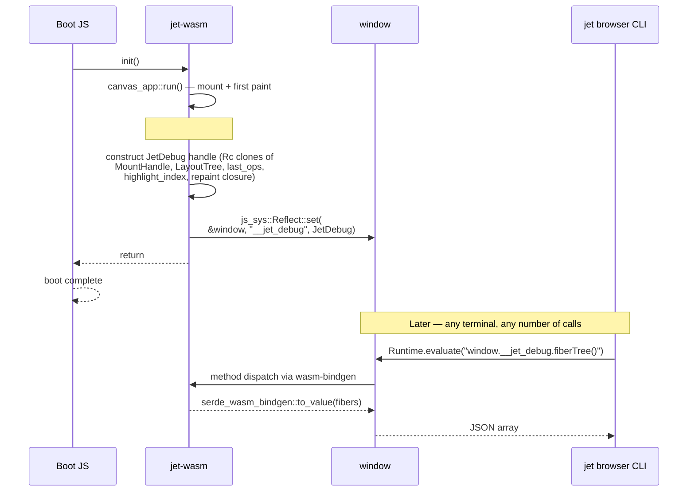
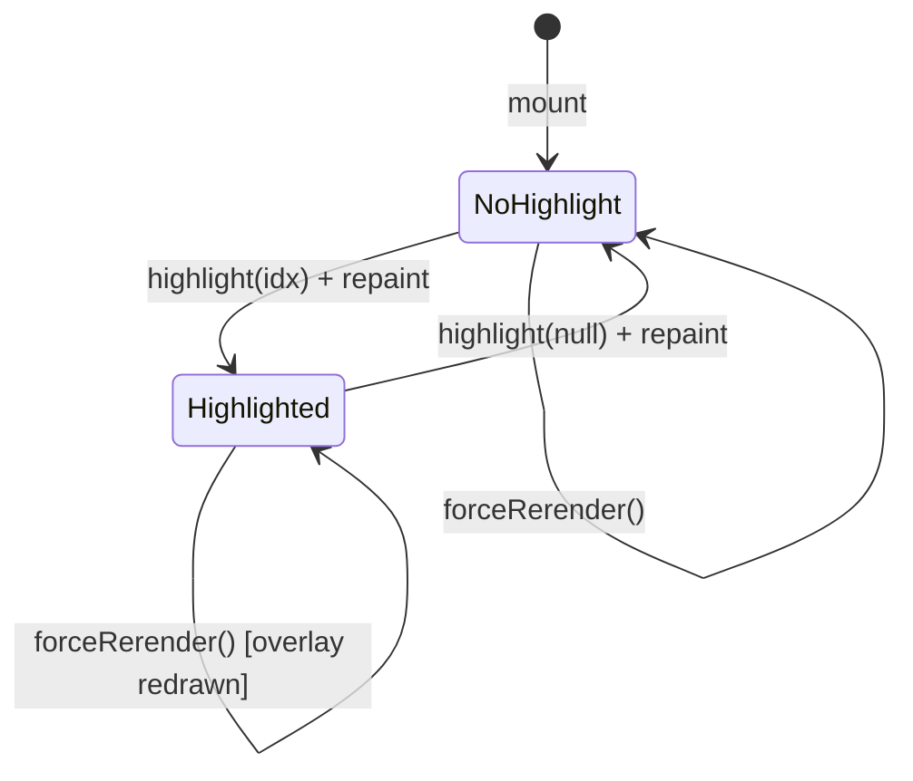

# jet-wasm — debug bridge (`JetDebug` + `window.__jet_debug`)

## Changes
<!-- type: changes lang: yaml -->

```yaml
changes:
  - path: ".aw/tech-design/projects/jet/interfaces/wasm-renderer/debug-bridge.md"
    action: modify
    section: doc
    impl_mode: hand-written
    description: |
      Legacy Jet TD content retained as notes during AW standardization.
      Rewrite this file into semantic TD sections before promoting source to CODEGEN.
```

## Legacy notes
<!-- type: doc lang: markdown -->

# jet-wasm — debug bridge (`JetDebug` + `window.__jet_debug`)

### Overview

Canvas-rendered jet-wasm apps are opaque to Chrome DevTools — the
Elements panel sees one `<canvas>`, and React DevTools doesn't
understand a Rust fiber tree. The `debug` feature on `jet-wasm`
closes that gap: at mount time it publishes a `JetDebug` handle on
`window.__jet_debug`, and any external tool (the `jet browser` CLI,
Chrome DevTools Console, future web panels) can walk the fiber
tree, hook values, layout tree, and last-frame paint ops through
that handle.

The bridge is a **read-only inspection surface**. The only mutating
methods are `highlight()` and `forceRerender()`, and both are
idempotent-or-harmless — they can't corrupt runtime state.

Design axiom this extends: **A5** (React-compat subset is enforced
at build time) — by extension, the runtime's internal shape is also
knowable at debug time without a separate React-DevTools protocol.

### Scope

- **In scope**: serialize Element / LayoutTree / PaintOp / Fiber to
  JSON-ish JS values; hit-test a canvas-space point; overlay a
  highlight rect; force a re-render.
- **Out of scope**:
  - Direct state mutation (setters are user-code territory — use the
    app's own buttons or an eval-injected setter).
  - Time-travel / replay (future milestone).
  - Arbitrary hook-value rendering — primitive chain-downcast only
    (`i64`/`f64`/`bool`/`String`/…). Non-primitives surface as
    `type_name: "<unknown>"` rather than panicking.
  - DWARF remapping to TSX lines (tracked separately in
    `transpiler.md` — the TSX side-car is a stepping stone).

### Feature gating

```toml
# crates/jet-wasm/Cargo.toml
debug = ["canvas-app", "dep:serde", "dep:serde_json",
         "dep:serde-wasm-bindgen", "dep:js-sys"]
```

- **Off by default.** Release builds have zero debug overhead;
  `window.__jet_debug` is undefined, and `jet browser` CLI commands
  detect this with `typeof window.__jet_debug === "undefined"` and
  print a clear hint instead of a confusing eval error.
- Enabled by `jet build --wasm --debug` and `jet dev --wasm --debug`.
  The scaffolded `.jet/wasm-build/Cargo.toml` toggles the feature
  based on `wasm_build::Profile`.
- Implies `canvas-app` — the bridge needs access to `MountHandle`
  (from `react`) and the live `LayoutTree` (from `canvas_app::run`),
  both of which live behind that feature.

### JetDebug surface

```yaml
openrpc: 1.3.0
info:
  title: window.__jet_debug
  version: 0.1.0
  description: >
    Methods exposed via wasm-bindgen on `window.__jet_debug`.
    Callers invoke them from JS (DevTools Console, `Runtime.evaluate`,
    CLI-injected script) and receive JSON values.
methods:
  - name: elementTree
    summary: Serialized snapshot of the currently-mounted Element tree.
    params: []
    result:
      name: root
      schema: { $ref: "#/components/schemas/DebugElement" }
  - name: layoutTree
    summary: Serialized last-laid-out tree.
    params: []
    result:
      name: layout
      schema: { $ref: "#/components/schemas/DebugLayoutTree" }
  - name: paintOps
    summary: PaintOps from the last frame, or null before first paint.
    params: []
    result:
      name: ops
      schema:
        oneOf:
          - { type: "null" }
          - { type: array, items: { $ref: "#/components/schemas/DebugPaintOp" } }
  - name: fiberTree
    summary: Flat list of fibers with hook_count + dirty flag.
    params: []
    result:
      name: fibers
      schema:
        type: array
        items: { $ref: "#/components/schemas/DebugFiber" }
  - name: hookValues
    summary: Per-hook-slot summary for a given fiber.
    params:
      - name: fiber_id
        schema: { type: integer, format: uint32 }
    result:
      name: hooks
      schema:
        type: array
        items: { $ref: "#/components/schemas/DebugHook" }
  - name: pickAt
    summary: Topmost laid-out node under a canvas-space point, or null.
    params:
      - name: x
        schema: { type: number }
      - name: y
        schema: { type: number }
    result:
      name: pick
      schema:
        oneOf:
          - { type: "null" }
          - { $ref: "#/components/schemas/DebugPickResult" }
  - name: highlight
    summary: >
      Overlay a 2px red stroke over the node at `index`. Pass
      `undefined`/`null` to clear. Triggers a repaint.
    params:
      - name: index
        required: false
        schema:
          oneOf:
            - { type: "null" }
            - { type: integer, format: uint32 }
    result:
      name: ok
      schema: { type: "null" }
  - name: forceRerender
    summary: >
      Mark the root fiber dirty and flush. Useful after an external
      state mutation (`eval`'d directly into the WASM heap) to
      propagate to the canvas without waiting for a user click.
    params: []
    result:
      name: ok
      schema: { type: "null" }
components:
  schemas:
    DebugElement:
      type: object
      properties:
        kind:
          type: string
          enum: [intrinsic, text, component, empty, fragment]
      oneOf:
        - title: Intrinsic
          required: [tag, props, children]
          properties:
            tag: { type: string }
            props: { $ref: "#/components/schemas/DebugProps" }
            children:
              type: array
              items: { $ref: "#/components/schemas/DebugElement" }
        - title: Text
          required: [text]
          properties:
            text: { type: string }
        - title: Component
          required: [name]
          properties:
            name: { type: string }
        - title: Empty
        - title: Fragment
          required: [children]
          properties:
            children:
              type: array
              items: { $ref: "#/components/schemas/DebugElement" }
    DebugProps:
      type: object
      properties:
        id:         { oneOf: [ { type: "null" }, { type: string } ] }
        class_name: { oneOf: [ { type: "null" }, { type: string } ] }
        style:      { oneOf: [ { type: "null" }, { type: string } ] }
        has_on_click:  { type: boolean }
        has_on_change: { type: boolean }
    DebugLayoutTree:
      type: object
      required: [root_rect, nodes]
      properties:
        root_rect: { $ref: "#/components/schemas/DebugRect" }
        nodes:
          type: array
          items: { $ref: "#/components/schemas/DebugLaidOutNode" }
    DebugLaidOutNode:
      type: object
      required: [rect, kind]
      properties:
        rect: { $ref: "#/components/schemas/DebugRect" }
        kind:
          oneOf:
            - title: Intrinsic
              required: [kind, tag]
              properties:
                kind: { const: intrinsic }
                tag: { type: string }
                id: { oneOf: [{ type: "null" }, { type: string }] }
                has_on_click: { type: boolean }
            - title: Text
              required: [kind, text]
              properties:
                kind: { const: text }
                text: { type: string }
    DebugRect:
      type: object
      required: [x, y, w, h]
      properties:
        x: { type: number }
        y: { type: number }
        w: { type: number }
        h: { type: number }
    DebugPaintOp:
      type: object
      required: [op]
      properties:
        op:
          type: string
          enum: [fill_rect, stroke_rect, text, push_clip, pop_clip]
      oneOf:
        - title: FillRect
          required: [rect, color]
        - title: StrokeRect
          required: [rect, color, width]
        - title: Text
          required: [origin, content, font, color]
        - title: PushClip
          required: [rect]
        - title: PopClip
    DebugFiber:
      type: object
      required: [id, hook_count, dirty]
      properties:
        id:         { type: integer, format: uint64 }
        hook_count: { type: integer, format: uint64 }
        dirty:      { type: boolean }
    DebugHook:
      type: object
      required: [kind]
      properties:
        kind:
          type: string
          enum: [State, Memo, Ref, Context]
        type_name:
          oneOf: [{ type: "null" }, { type: string }]
        value:
          description: >
            Primitive-chain-downcast JSON value, or null when the
            concrete T isn't in the Copy-primitive whitelist
            (i64 / i32 / u64 / u32 / f64 / f32 / bool / String / etc.).
    DebugPickResult:
      type: object
      required: [index, node]
      properties:
        index: { type: integer, format: uint32 }
        node:  { $ref: "#/components/schemas/DebugLaidOutNode" }
```

### Bridge lifecycle



### Shared state machine



- `highlight_index: Rc<RefCell<Option<usize>>>` lives in the
  canvas_app scope; the Rc is cloned into both the `JetDebug`
  handle and the repaint closure.
- Each repaint pass reads the index, and if set, appends a
  `PaintOp::StrokeRect` with color `(255, 51, 51, 255)` + width
  `2.0` to the ops list before execution. No separate overlay
  layer — this keeps the debug surface cheap and ensures
  `paintOps()` reflects exactly what hit the canvas.
- Out-of-range indices (layout shifted since last `layoutTree()`)
  are treated as "clear" — no panic.

### Non-Copy hook summaries

`summarize_any(&dyn Any)` tries a fixed chain of `downcast_ref` on
the Copy-primitive + String set, in order:

```
i64  i32  u64  u32  f64  f32  bool  String  &'static str  ()
```

First hit wins; returns `(Some(type_name), Some(json_value))`. None
match → `(Some("<unknown primitive chain missed>"), None)`. The
runtime never panics on a hook-value lookup; if a user component
stores a custom struct in `useState`, the CLI shows
`State<unknown primitive chain missed> = <unknown>` rather than
crashing the bridge.

This mirrors the is_copy_primitive check in
`logic/wasm-renderer-transpiler.md` — keep the two aligned: any type
newly emitted by the transpiler as a hook value must also be added here
(otherwise the debug experience silently degrades).

### Error modes

| Call | Failure mode | What the caller sees |
|---|---|---|
| Any method, non-debug build | `window.__jet_debug` undefined | CLI detects via `typeof` probe; prints `app is not built with --debug`. |
| `hookValues(bogus_id)` | Fiber id not in runtime | Returns `[]` (empty array). Not an error. |
| `highlight(out_of_range)` | Index past `layout.nodes.len()` | Clamped to None (clear). Not an error. |
| `pickAt(out_of_canvas)` | No node contains point | Returns `null`. |
| Serialization fails (can't happen for current mirror types) | — | Returns `JsValue::from_str(e.to_string())` as a JS Error. |

### Cross-references

- `logic/wasm-renderer-paint-runtime.md` — event loop + CaptureBackend integration
  that populates `last_ops` for `paintOps()`.
- `tools/wasm-renderer-browser-cli.md` — the primary consumer of this surface.
- `logic/wasm-renderer-transpiler.md` — source of hook-value types that
  `summarize_any` must recognize.
- Code: `crates/jet-wasm/src/debug/mod.rs`.
