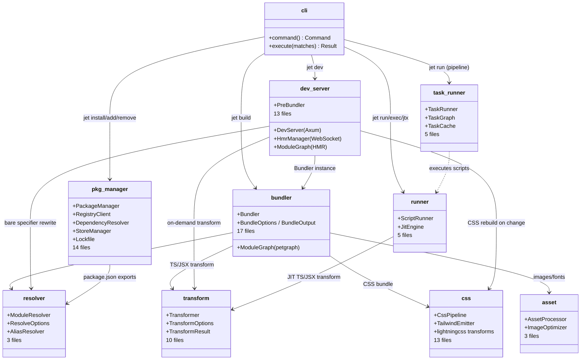
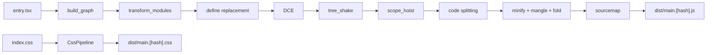
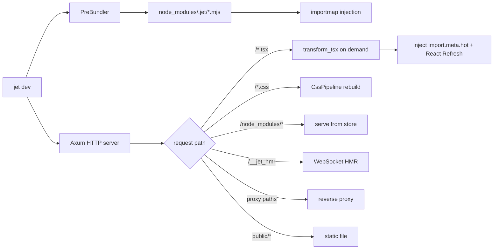
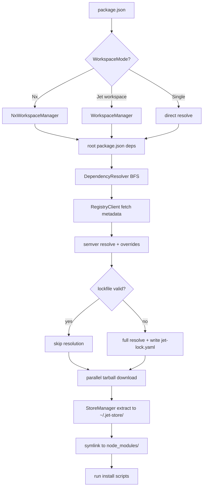

# jet Architecture

## Changes
<!-- type: changes lang: yaml -->

```yaml
changes:
  - path: ".aw/tech-design/projects/jet/logic/architecture.md"
    action: modify
    section: doc
    impl_mode: hand-written
    description: |
      Legacy Jet TD content retained as notes during AW standardization.
      Rewrite this file into semantic TD sections before promoting source to CODEGEN.
```

## Legacy notes
<!-- type: doc lang: markdown -->

# jet Architecture

### Overview

Rust-native JavaScript/TypeScript build tool and package manager. Covers the full frontend toolchain: dependency installation, module resolution, code transformation, bundling, dev server with HMR, CSS pipeline, task orchestration, and JIT script execution.

<!-- LOC counts removed — derive from source with `find crates/jet/src/ -name '*.rs' | xargs wc -l` -->

### Subsystem Map



### Subsystem Summary

<!-- LOC counts removed — they drift continuously. Derive from source:
     find crates/jet/src/{subsystem}/ -name '*.rs' | xargs wc -l -->

| Subsystem | Files | Key Crates |
|-----------|-------|------------|
| `bundler/` | 17 | petgraph, rayon, dashmap, parking_lot |
| `dev_server/` | 13 | axum, tokio-tungstenite, notify |
| `pkg_manager/` | 14 | reqwest, semver, flate2, tar |
| `transform/` | 10 | tree-sitter, tree-sitter-typescript |
| `css/` | 13 | lightningcss, globset |
| `task_runner/` | 5 | toml, glob |
| `resolver/` | 3 | node-resolve |
| `runner/` | 5 | tokio (process), base64 |
| `asset/` | 3 | image, sha2 |
| `cli.rs` | 1 | clap |

### Bundler Pipeline

Production build pipeline (`jet build`):



### Dev Server Pipeline

Dev serve pipeline (`jet dev`):



### Package Manager Pipeline

Install pipeline (`jet install`):



### CLI Command Tree

```yaml
jet:
  init:
    args: { name: { optional: true } }
  install:
    args:
      packages: { variadic: true }
      frozen-lockfile: { flag: true }
      no-cache: { flag: true }
      no-install: { flag: true }
      nx: { flag: true }
  add:
    args:
      package: { required: true }
      dev: { short: D, flag: true }
  remove:
    args: { package: { required: true } }
  update:
    args:
      package: { optional: true }
      latest: { flag: true }
  audit: {}
  patch:
    args: { package: { required: true } }
  patch-commit:
    args: { package: { required: true } }
  publish:
    args:
      tag: { default: latest }
      access: { optional: true }
  pack: {}
  store:
    prune: {}
  dev:
    args:
      port: { short: p, optional: true }
      host: { default: "127.0.0.1" }
  build:
    args:
      nx: { flag: true }
      project: { short: p, optional: true }
      watch: { short: w, flag: true }
      output: { short: o, default: dist }
      minify: { flag: true }
      no-minify: { flag: true }
      sourcemap: { default: external, enum: [external, inline, hidden, none] }
      splitting: { flag: true }
      define: { append: true }
      drop: { append: true, enum: [console, debugger] }
  check: {}
  run:
    args:
      target: { optional: true }
      args: { variadic: true, trailing: true }
      watch: { short: w, flag: true }
      filter: { optional: true }
      dry: { flag: true }
  exec:
    args:
      cmd: { required: true }
      args: { variadic: true, trailing: true }
  jtx:
    args:
      package: { required: true }
      args: { variadic: true, trailing: true }
```

### Key Data Types

```json
{
  "$schema": "https://json-schema.org/draft/2020-12/schema",
  "$id": "jet://schemas/architecture-types",
  "definitions": {
    "BundleOptions": {
      "type": "object",
      "properties": {
        "entry": { "type": "string", "format": "path" },
        "output_dir": { "type": "string", "format": "path" },
        "source_maps": { "type": "boolean", "default": true },
        "minify": { "type": "boolean", "default": false },
        "externals": { "type": "array", "items": { "type": "string" } },
        "externalize_all_packages": { "type": "boolean", "default": false },
        "defines": { "type": "object", "additionalProperties": { "type": "string" } }
      }
    },
    "ServerConfig": {
      "type": "object",
      "properties": {
        "host": { "type": "string", "default": "127.0.0.1" },
        "port": { "type": "integer", "default": 3000 },
        "root_dir": { "type": "string", "format": "path" },
        "public_dir": { "type": "string", "format": "path" },
        "entry": { "type": "string", "format": "path" },
        "proxy": { "type": "object", "additionalProperties": { "type": "string" } },
        "aliases": { "type": "object", "additionalProperties": { "type": "string" } }
      },
      "required": ["host", "port", "root_dir", "entry"]
    },
    "TransformOptions": {
      "type": "object",
      "properties": {
        "jsx_pragma": { "type": "string" },
        "jsx_fragment": { "type": "string" },
        "jsx_automatic": { "type": "boolean", "default": false },
        "ts_target": { "enum": ["ES5","ES2015","ES2016","ES2017","ES2018","ES2019","ES2020","ES2021","ES2022","ESNext"] },
        "source_maps": { "type": "boolean" },
        "minify": { "type": "boolean" },
        "dev_mode": { "type": "boolean" }
      }
    },
    "JetConfig": {
      "type": "object",
      "description": "jet.config.toml top-level schema",
      "properties": {
        "pipeline": {
          "type": "object",
          "additionalProperties": { "$ref": "#/definitions/TaskDef" }
        },
        "dev": {
          "type": "object",
          "properties": {
            "port": { "type": "integer" },
            "proxy": { "type": "object", "additionalProperties": { "type": "string" } }
          }
        },
        "alias": { "type": "object", "additionalProperties": { "type": "string" } },
        "build": {
          "type": "object",
          "properties": {
            "out_dir": { "type": "string" }
          }
        }
      }
    },
    "TaskDef": {
      "type": "object",
      "properties": {
        "depends_on": { "type": "array", "items": { "type": "string" } },
        "inputs": { "type": "array", "items": { "type": "string" } },
        "outputs": { "type": "array", "items": { "type": "string" } },
        "cache": { "type": "boolean", "default": true },
        "persistent": { "type": "boolean", "default": false }
      }
    }
  }
}
```

### External Dependency Map

| Category | Crate | Used By |
|----------|-------|---------|
| Parsing | tree-sitter, tree-sitter-javascript, tree-sitter-typescript | transform |
| CSS | lightningcss | css, bundler/css_bundle |
| HTTP server | axum, tower, tower-http | dev_server |
| WebSocket | tokio-tungstenite | dev_server/hmr |
| File watch | notify | dev_server/watcher |
| HTTP client | reqwest | pkg_manager/registry |
| Graph | petgraph | bundler/graph |
| Concurrency | dashmap, parking_lot, rayon | bundler, pkg_manager |
| Semver | semver | pkg_manager/resolver |
| Archive | flate2, tar | pkg_manager/store |
| Image | image | asset/image_processor |
| Hash | sha2 | asset, pkg_manager |
| Glob | glob, globset | pkg_manager/workspace, css/tailwind |
| Serialization | serde_json, serde_yaml, toml | all |
| CLI | clap | cli |
| Async | tokio, futures, futures-util | all async |

### Changes

```yaml
changes:
  - path: .aw/tech-design/crates/jet/architecture.md
    action: delete
    section: doc
    impl_mode: hand-written
    description: "Remove the old root loose architecture spec."
  - path: .aw/tech-design/crates/jet/logic/architecture.md
    action: add
    section: doc
    impl_mode: hand-written
    description: "Rehome and normalize the architecture spec under logic/ with typed sections."
  - path: crates/jet/src/lib.rs
    action: reference
    section: doc
    impl_mode: hand-written
    description: "Defines the crate module surface used by the subsystem map."
  - path: crates/jet/src/cli.rs
    action: reference
    section: doc
    impl_mode: hand-written
    description: "Defines the CLI command tree."
```
