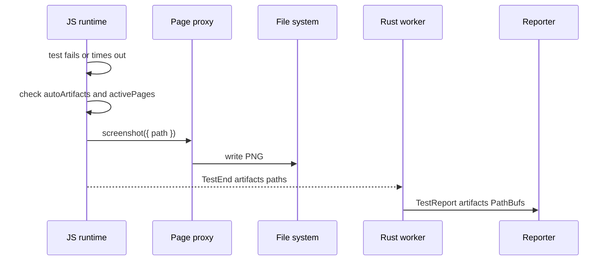
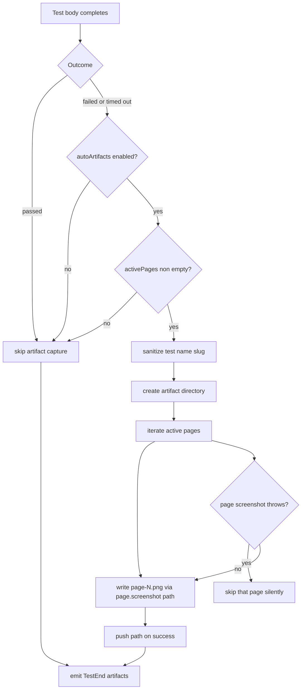
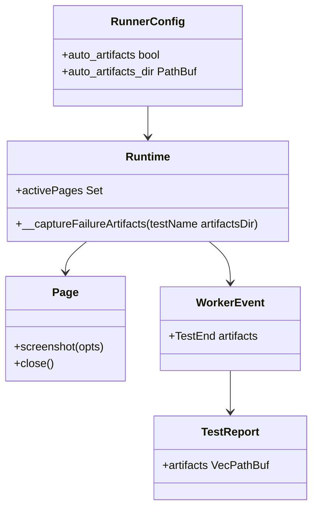

# Jet Auto Artifacts

## Changes
<!-- type: changes lang: yaml -->

```yaml
changes:
  - path: ".aw/tech-design/projects/jet/logic/auto-artifacts.md"
    action: modify
    section: doc
    impl_mode: hand-written
    description: |
      Legacy Jet TD content retained as notes during AW standardization.
      Rewrite this file into semantic TD sections before promoting source to CODEGEN.
```

## Legacy notes
<!-- type: doc lang: markdown -->

# Jet Auto Artifacts

### Overview

This spec owns automatic screenshot artifacts for failed or timed-out native
test runner tests. The JavaScript runtime tracks active `Page` objects, captures
PNG screenshots before fixture cleanup when a test fails, emits artifact paths
on `WorkerEvent::TestEnd`, and the Rust runner persists those paths into
`TestReport.artifacts`. Capture is best effort: artifact failures never replace
the original test error.

### Owned Surface

| Area | Source | Responsibility |
|------|--------|----------------|
| Runtime page tracking | `crates/jet/runtime/test/index.js` | `__jet.activePages` registration and removal |
| Failure capture | `crates/jet/runtime/test/index.js` | `__captureFailureArtifacts` path creation and screenshot calls |
| Page screenshot write | `crates/jet/runtime/test/page.js` | `page.screenshot({ path })` persists PNG files |
| Config | `crates/jet/src/test_runner/config.rs` | `auto_artifacts` and `auto_artifacts_dir` defaults |
| Wire | `crates/jet/src/test_runner/wire.rs` | `WorkerEvent::TestEnd.artifacts` |
| Reporting | `crates/jet/src/test_runner/reporter.rs` | `TestReport.artifacts` |
| Worker bridge | `crates/jet/src/test_runner/worker.rs` | Boot opts and artifact path threading |
| Integration tests | `crates/jet/tests/auto_artifacts_tests.rs` | Failure capture, disabled capture, multiple pages, passing tests |

### Requirements

```mermaid
---
id: jet-auto-artifacts-requirements
entry: A1
---
requirementDiagram
    requirement A1 {
        id: A1
        text: TestEnd carries artifact paths only when non empty and TestReport stores PathBuf artifacts
        risk: high
        verifymethod: test
    }
    requirement A2 {
        id: A2
        text: RunnerConfig auto_artifacts defaults true and false disables capture
        risk: medium
        verifymethod: test
    }
    requirement A3 {
        id: A3
        text: RunnerConfig auto_artifacts_dir defaults to project test results artifacts directory
        risk: medium
        verifymethod: test
    }
    requirement A4 {
        id: A4
        text: Runtime tracks fixture and context pages until close removes them
        risk: high
        verifymethod: test
    }
    requirement A5 {
        id: A5
        text: Failed or timed out tests capture active pages before fixture teardown
        risk: high
        verifymethod: test
    }
    requirement A6 {
        id: A6
        text: Screenshot path uses sanitized test name directory and page index file names
        risk: medium
        verifymethod: test
    }
    requirement A7 {
        id: A7
        text: Capture failures are swallowed and never mask the original test error
        risk: high
        verifymethod: test
    }
```



### Scenarios

```yaml
scenarios:
  - id: AA1
    requirement: A1
    title: Failing spec writes page-1.png and TestReport contains artifact path
  - id: AA2
    requirement: A2
    title: auto_artifacts false keeps artifacts empty for failing spec
  - id: AA3
    requirement: A4
    title: Failing spec with default page and context page captures both
  - id: AA4
    requirement: A5
    title: Passing spec emits no artifacts
```

### Interaction



### Logic



### Dependency Model



### Data Schema

```yaml
RuntimeOptions:
  autoArtifacts:
    type: bool
    default: true
  artifactsDir:
    type: string
    default: "<project_root>/test-results/artifacts"
ArtifactPath:
  pattern: "<artifactsDir>/<sanitized-test-name>/page-<n>.png"
  slug_rules:
    - lowercase test name
    - replace non alphanumeric runs with "-"
    - trim leading and trailing "-"
    - truncate to 80 chars
    - fallback to "test"
WorkerEventTestEnd:
  artifacts:
    type: Vec<String>
    serialize: skip when empty
TestReport:
  artifacts:
    type: Vec<PathBuf>
```

### Test Plan

```mermaid
---
id: jet-auto-artifacts-test-plan
entry: T1
---
requirementDiagram
    requirement A1 {
        id: A1
        text: artifact wire and report path
        risk: high
        verifymethod: test
    }
    requirement A2 {
        id: A2
        text: disabled config
        risk: medium
        verifymethod: test
    }
    requirement A4 {
        id: A4
        text: active page tracking
        risk: high
        verifymethod: test
    }
    element T1 {
        type: test
        docref: cargo test -p jet --test auto_artifacts_tests
    }
```

### Execution

```bash
cargo test -p jet --test auto_artifacts_tests
```

### Coverage Matrix

| Requirement | Test functions |
|-------------|----------------|
| A1 | `aa1_failing_test_produces_artifact` |
| A2 | disabled-config test in `auto_artifacts_tests.rs` |
| A3 | config default assertions in runner config tests |
| A4 | two-page failure test in `auto_artifacts_tests.rs` |
| A5 | `aa1_failing_test_produces_artifact`, two-page failure test |
| A6 | path format checks in `auto_artifacts_tests.rs` |
| A7 | best-effort behavior covered by runtime guard and failure tests |

### Changes

```yaml
files:
  - path: .aw/tech-design/crates/jet/logic/auto-artifacts.md
    action: ADD
    impl_mode: hand-written
    desc: Re-home the auto artifacts TD as a checker-compliant current-state contract.

  - path: .aw/tech-design/crates/jet/testing/auto-artifacts.md
    action: DELETE
    impl_mode: hand-written
    desc: Remove the unexpected top-level testing directory copy of this TD.

  - path: crates/jet/runtime/test/index.js
    action: NONE
    impl_mode: hand-written
    desc: Existing active page tracking and failure artifact capture.

  - path: crates/jet/runtime/test/page.js
    action: NONE
    impl_mode: hand-written
    desc: Existing screenshot path write behavior.

  - path: crates/jet/src/test_runner/wire.rs
    action: NONE
    impl_mode: hand-written
    desc: Existing TestEnd artifacts field.

  - path: crates/jet/src/test_runner/reporter.rs
    action: NONE
    impl_mode: hand-written
    desc: Existing TestReport artifacts field.

  - path: crates/jet/tests/auto_artifacts_tests.rs
    action: NONE
    impl_mode: hand-written
    desc: Existing integration tests for failure screenshots and artifact configuration.
```
