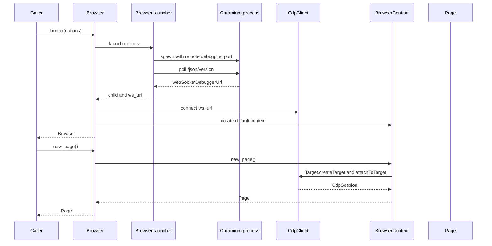
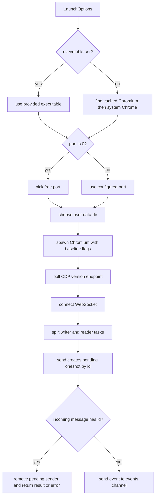
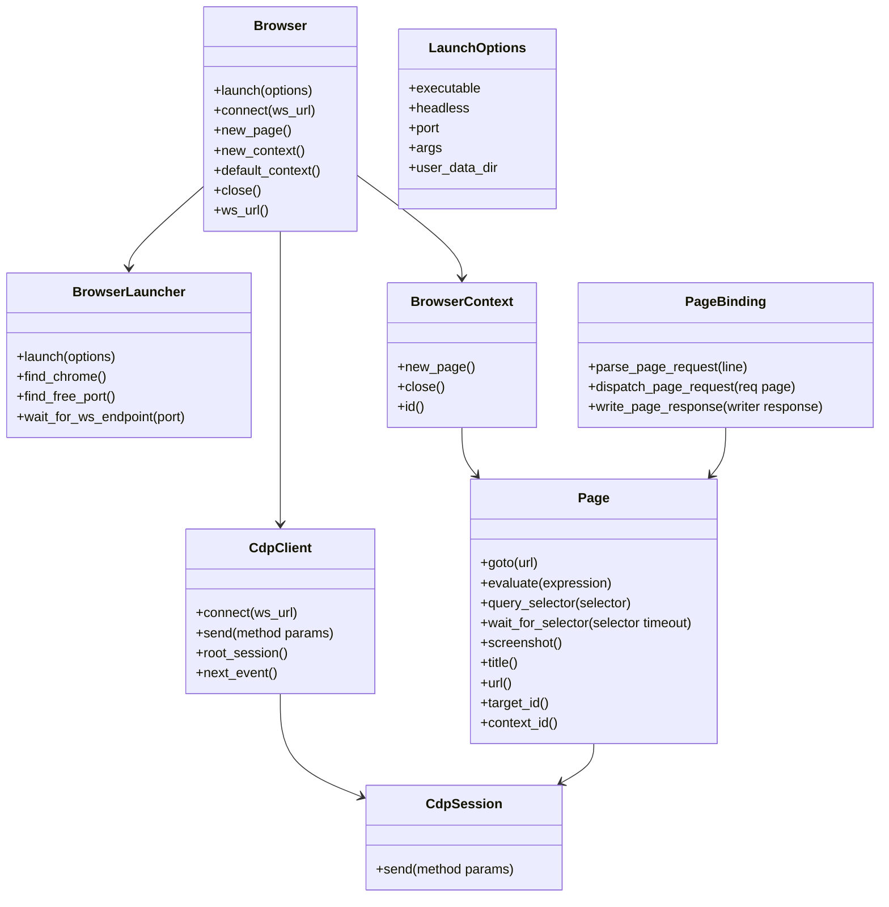

# Jet Browser Driver

## Changes
<!-- type: changes lang: yaml -->

```yaml
changes:
  - path: ".aw/tech-design/projects/jet/logic/browser-driver.md"
    action: modify
    section: doc
    impl_mode: hand-written
    description: |
      Legacy Jet TD content retained as notes during AW standardization.
      Rewrite this file into semantic TD sections before promoting source to CODEGEN.
```

## Legacy notes
<!-- type: doc lang: markdown -->

# Jet Browser Driver

### Overview

This spec owns Jet's native browser driver. The driver launches or connects to
Chromium over the Chrome DevTools Protocol, manages a WebSocket JSON-RPC
transport, creates browser contexts and pages, exposes page operations used by
the test runner, and provides a lower-level locator engine for Rust callers.
The implementation intentionally avoids Node.js and Playwright as runtime
dependencies.

### Owned Surface

| Area | Source | Responsibility |
|------|--------|----------------|
| Browser facade | `crates/jet/src/browser/mod.rs` | Launch, connect, default context, new page, new context, close |
| Launcher | `crates/jet/src/browser/launcher.rs` | Chrome lookup, free port, temp profile, process spawn, CDP endpoint polling |
| CDP transport | `crates/jet/src/browser/cdp.rs` | WebSocket connect, request ids, pending map, event channel, root/page sessions |
| Contexts | `crates/jet/src/browser/context.rs` | BrowserContext creation, isolated page creation, context close |
| Page API | `crates/jet/src/browser/page.rs` | Navigate, evaluate, query selector, screenshot, title, URL, context id |
| Locator API | `crates/jet/src/browser/locator.rs` | Rust-side locator selection and actionability semantics |
| Page binding | `crates/jet/src/cdp_driver/page_binding.rs` | NDJSON page request/response dispatch for JS runtime pages |
| Browser install | `crates/jet/src/browser/install.rs` | Pinned Chromium cache installer used by launcher lookup |

### Requirements

```mermaid
---
id: jet-browser-driver-requirements
entry: B1
---
requirementDiagram
    requirement B1 {
        id: B1
        text: Browser launch finds Chrome or cached Chromium and returns a connected CDP browser
        risk: high
        verifymethod: test
    }
    requirement B2 {
        id: B2
        text: Browser connect attaches to an existing CDP WebSocket without owning a child process
        risk: medium
        verifymethod: test
    }
    requirement B3 {
        id: B3
        text: Browser owns an implicit default context and can create isolated contexts
        risk: high
        verifymethod: test
    }
    requirement B4 {
        id: B4
        text: New pages are created by target commands and attached with flattened sessions
        risk: high
        verifymethod: test
    }
    requirement B5 {
        id: B5
        text: CDP transport routes responses by request id and events through an event channel
        risk: high
        verifymethod: test
    }
    requirement B6 {
        id: B6
        text: Page API supports navigation evaluation DOM query screenshots title and URL reads
        risk: high
        verifymethod: test
    }
    requirement B7 {
        id: B7
        text: Page binding exposes JS runtime page requests with structured success and error responses
        risk: high
        verifymethod: test
    }
    requirement B8 {
        id: B8
        text: Browser close sends Browser.close and kills an owned child process when present
        risk: medium
        verifymethod: test
    }
```



### Scenarios

```yaml
scenarios:
  - id: S1
    requirement: B1
    title: Launch locates a cached or system Chrome executable and discovers the CDP endpoint
  - id: S2
    requirement: B3
    title: Browser creates default and user browser contexts with isolated pages
  - id: S3
    requirement: B4
    title: Browser new_page opens a tab in the default context
  - id: S4
    requirement: B5
    title: CDP request response pair completes through pending map lookup
  - id: S5
    requirement: B6
    title: Page navigate waits for load then evaluate returns a value
  - id: S6
    requirement: B7
    title: PageRequest click fill hover keyboard screenshot and history actions dispatch to Page
  - id: S7
    requirement: B8
    title: Browser close disposes the default context and terminates the owned process
```

### Interaction



### Logic



### Dependency Model



### Data Schema

```yaml
LaunchOptions:
  fields:
    executable:
      type: Option<PathBuf>
      default: null
      meaning: provided Chrome path or auto-detect
    headless:
      type: bool
      default: true
    port:
      type: u16
      default: 0
      meaning: 0 means choose a free port
    args:
      type: Vec<String>
      default: []
    user_data_dir:
      type: Option<PathBuf>
      default: null
      meaning: null creates a temporary profile directory
CdpRequest:
  fields:
    id: u64
    method: String
    params: serde_json::Value
    sessionId: Option<String>
CdpEvent:
  fields:
    method: String
    params: serde_json::Value
    session_id: Option<String>
PageResponse:
  result_shape: tagged enum with snake_case kind
  error_shape:
    fields:
      req_id: u64
      message: String
```

### Test Plan

```mermaid
---
id: jet-browser-driver-test-plan
entry: T1
---
requirementDiagram
    requirement B3 {
        id: B3
        text: browser contexts
        risk: high
        verifymethod: test
    }
    requirement B5 {
        id: B5
        text: cdp message routing
        risk: high
        verifymethod: test
    }
    requirement B6 {
        id: B6
        text: page api
        risk: high
        verifymethod: test
    }
    requirement B7 {
        id: B7
        text: page binding
        risk: high
        verifymethod: test
    }
    element T1 {
        type: test
        docref: cargo test -p jet browser_context
    }
    element T2 {
        type: test
        docref: cargo test -p jet cdp_driver::page_binding::tests
    }
    element T3 {
        type: test
        docref: cargo test -p jet --test browser_cli_smoke -- --ignored
    }
```

### Execution

```bash
cargo test -p jet cdp_driver::page_binding::tests
cargo test -p jet browser::locator::tests
cargo test -p jet --test browser_context
cargo test -p jet --test browser_install
```

### Coverage Matrix

| Requirement | Test functions |
|-------------|----------------|
| B1 | `browser_install` cache and launcher tests |
| B2 | Covered by browser connection smoke paths |
| B3 | `browser_launch_exposes_default_and_new_context`, context isolation tests |
| B4 | page creation tests in `browser_context.rs` |
| B5 | CDP and page binding serialization tests |
| B6 | page API parity and browser smoke tests |
| B7 | `cdp_driver::page_binding::tests` |
| B8 | browser context and browser smoke teardown paths |

### Changes

```yaml
files:
  - path: .aw/tech-design/crates/jet/logic/browser-driver.md
    action: ADD
    impl_mode: hand-written
    desc: Re-home the browser driver TD as a checker-compliant current-state contract.

  - path: .aw/tech-design/crates/jet/testing/browser-driver.md
    action: DELETE
    impl_mode: hand-written
    desc: Remove the unexpected top-level testing directory copy of this TD.

  - path: crates/jet/src/browser/mod.rs
    action: NONE
    impl_mode: hand-written
    desc: Existing Browser facade for launch connect contexts pages and close.

  - path: crates/jet/src/browser/launcher.rs
    action: NONE
    impl_mode: hand-written
    desc: Existing Chrome lookup process launch and CDP endpoint polling.

  - path: crates/jet/src/browser/cdp.rs
    action: NONE
    impl_mode: hand-written
    desc: Existing WebSocket JSON-RPC request response and event transport.

  - path: crates/jet/src/browser/page.rs
    action: NONE
    impl_mode: hand-written
    desc: Existing high-level Page API.

  - path: crates/jet/src/cdp_driver/page_binding.rs
    action: NONE
    impl_mode: hand-written
    desc: Existing JS runtime page request and response bridge.
```
