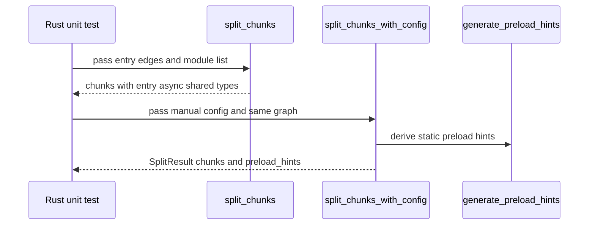
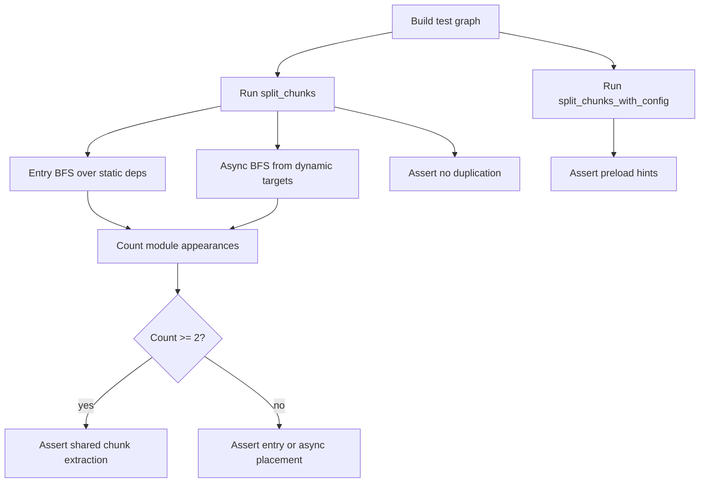
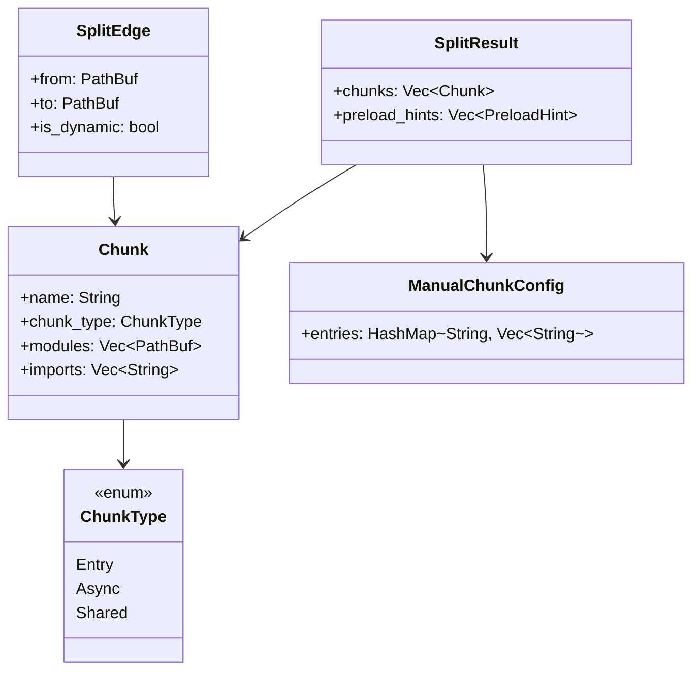

# Jet Bundler Splitting Tests

## Changes
<!-- type: changes lang: yaml -->

```yaml
changes:
  - path: ".aw/tech-design/projects/jet/logic/bundler-splitting-tests.md"
    action: modify
    section: doc
    impl_mode: hand-written
    description: |
      Legacy Jet TD content retained as notes during AW standardization.
      Rewrite this file into semantic TD sections before promoting source to CODEGEN.
```

## Legacy notes
<!-- type: doc lang: markdown -->

# Jet Bundler Splitting Tests

### Overview

This spec owns test coverage for Jet's code-splitting planner in
`crates/jet/src/bundler/splitting.rs`. The implementation partitions modules
at dynamic import boundaries, extracts shared chunks, supports manual chunk
routing, and emits preload hints for static entry imports.

### Coverage Surface

| Area | Source | Covered behavior |
|------|--------|------------------|
| Basic splitting | `splitting.rs` | No dynamic imports, one dynamic import, chunk naming |
| Shared extraction | `splitting.rs` | Shared modules pulled out of entry and async chunks |
| Manual chunks | `splitting.rs` | Glob-routed vendor chunks and empty config behavior |
| Preload hints | `splitting.rs` | Shared static chunks get hints; async chunks do not |
| Multi-entry simulation | `splitting.rs` | Disjoint entry chunks and shared common modules |
| Dynamic cycles | `splitting.rs` | Dynamic import cycles return without infinite traversal |
| Diamond boundary | `splitting.rs` | Static/dynamic diamond dependencies extract a shared chunk |
| Leaf dynamic import | `splitting.rs` | Leaf async chunk contains exactly the target module |

### Requirements

```mermaid
---
id: jet-bundler-splitting-test-requirements
entry: TR1
---
requirementDiagram
    requirement TR1 {
        id: TR1
        text: Multi-entry shared modules are extracted once
        risk: high
        verifymethod: test
    }
    requirement TR2 {
        id: TR2
        text: Entry splits produce disjoint entry module sets
        risk: high
        verifymethod: test
    }
    requirement TR3 {
        id: TR3
        text: Preload hints include shared static chunks and exclude async chunks
        risk: high
        verifymethod: test
    }
    requirement TR4 {
        id: TR4
        text: Circular dynamic imports do not hang chunk splitting
        risk: high
        verifymethod: test
    }
    requirement TR5 {
        id: TR5
        text: Diamond dependencies crossing dynamic boundaries extract shared modules
        risk: medium
        verifymethod: test
    }
    requirement TR6 {
        id: TR6
        text: Leaf dynamic imports produce single-module async chunks
        risk: medium
        verifymethod: test
    }
```

### TR1: Multi-Entry Shared Extraction

```yaml
id: TR1
priority: high
status: implemented
source:
  - crates/jet/src/bundler/splitting.rs
```

Tests must verify a utility module reached from an entry chunk and a second
dynamic entry-like target is extracted into a single shared chunk.

### TR2: Disjoint Entry Chunks

```yaml
id: TR2
priority: high
status: implemented
source:
  - crates/jet/src/bundler/splitting.rs
```

Tests must verify two simulated entry roots each keep their own modules while
their common dependency is placed in a shared chunk.

### TR3: Async Preload Metadata

```yaml
id: TR3
priority: high
status: implemented
source:
  - crates/jet/src/bundler/splitting.rs
```

Tests must verify `split_chunks_with_config` produces `assets/shared.js` as a
static preload hint while excluding lazy async chunk names from hints.

### TR4: Circular Dynamic Imports

```yaml
id: TR4
priority: high
status: implemented
source:
  - crates/jet/src/bundler/splitting.rs
```

Tests must verify dynamic cycles produce async chunks without infinite BFS and
without absorbing cycle targets into the entry chunk.

### TR5: Diamond Dynamic Boundary

```yaml
id: TR5
priority: medium
status: implemented
source:
  - crates/jet/src/bundler/splitting.rs
```

Tests must verify a module reachable from both the entry path and a dynamic
path is extracted to a shared chunk and removed from entry/async chunks.

### TR6: Leaf Dynamic Import

```yaml
id: TR6
priority: medium
status: implemented
source:
  - crates/jet/src/bundler/splitting.rs
```

Tests must verify a dynamic import target with no dependencies creates exactly
one async chunk containing that target and no shared chunk.

### Scenarios

```yaml
scenarios:
  - id: S1
    requirement: TR1
    title: Two entry-like roots share a utility module
  - id: S2
    requirement: TR2
    title: Simulated entries produce disjoint entry chunks
  - id: S3
    requirement: TR3
    title: Shared chunk gets preload hint but lazy chunk does not
  - id: S4
    requirement: TR4
    title: Circular dynamic imports do not infinite loop
  - id: S5
    requirement: TR5
    title: Diamond dependency with dynamic boundary extracts shared module
  - id: S6
    requirement: TR6
    title: Leaf dynamic import produces a single-module async chunk
```

### Interaction



### Logic



### Dependency Model



### Test Plan

```mermaid
---
id: jet-bundler-splitting-test-plan
entry: T1
---
requirementDiagram
    requirement TR1 {
        id: TR1
        text: multi-entry shared extraction
        risk: high
        verifymethod: test
    }
    requirement TR3 {
        id: TR3
        text: preload hints
        risk: high
        verifymethod: test
    }
    requirement TR4 {
        id: TR4
        text: dynamic cycles
        risk: high
        verifymethod: test
    }
    requirement TR5 {
        id: TR5
        text: diamond boundary
        risk: medium
        verifymethod: test
    }
    element T1 {
        type: test
        docref: cargo test -p jet splitting::tests
    }
    element T2 {
        type: test
        docref: cargo test -p jet test_multi_entry_shared_extraction
    }
    element T3 {
        type: test
        docref: cargo test -p jet test_preload_hints_multi_chunk
    }
```

### Execution

```bash
cargo test -p jet splitting::tests
cargo test -p jet test_multi_entry_shared_extraction
cargo test -p jet test_multi_entry_disjoint_chunks
cargo test -p jet test_preload_hints_multi_chunk
cargo test -p jet test_circular_dynamic_imports
cargo test -p jet test_diamond_dynamic_boundary_shared
cargo test -p jet test_leaf_dynamic_import_single_chunk
```

### Coverage Matrix

| Requirement | Test functions |
|-------------|----------------|
| TR1 | `test_multi_entry_shared_extraction` |
| TR2 | `test_multi_entry_disjoint_chunks` |
| TR3 | `test_preload_hints_multi_chunk`, `test_preload_hints_for_shared_chunks` |
| TR4 | `test_circular_dynamic_imports` |
| TR5 | `test_diamond_dynamic_boundary_shared` |
| TR6 | `test_leaf_dynamic_import_single_chunk` |

### Changes

```yaml
files:
  - path: .aw/tech-design/crates/jet/logic/bundler-splitting-tests.md
    action: MODIFY
    section: doc
    impl_mode: hand-written
    desc: Replace TODO-heavy test coverage spec with this checkable current-state contract.

  - path: crates/jet/src/bundler/splitting.rs
    action: NONE
    section: doc
    impl_mode: hand-written
    desc: Existing tests cover baseline splitting, manual chunks, preload hints, multi-entry simulation, dynamic cycles, diamond extraction, and leaf async chunks.
```
