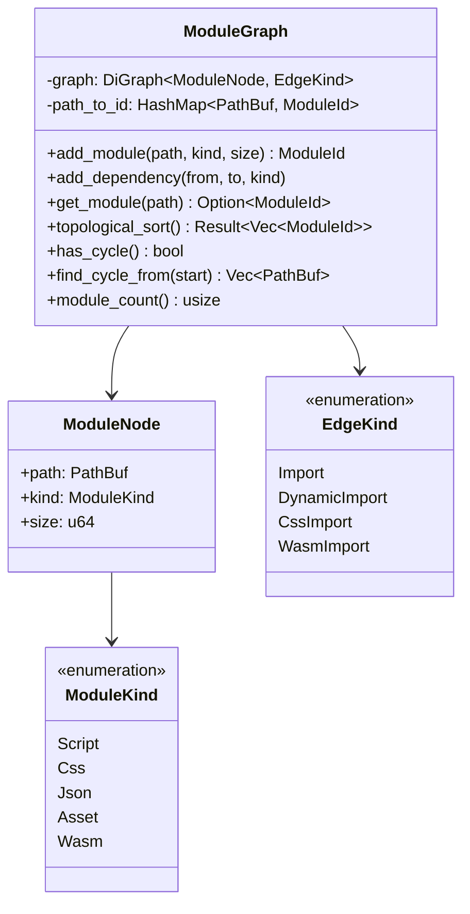
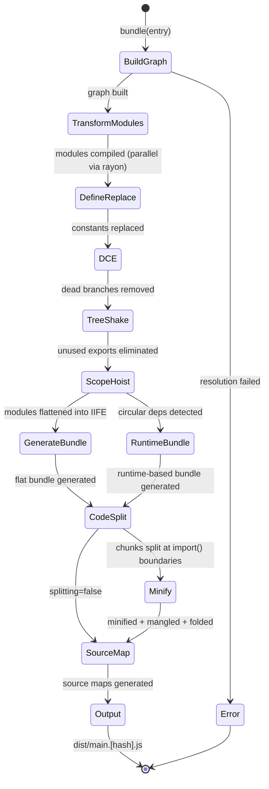
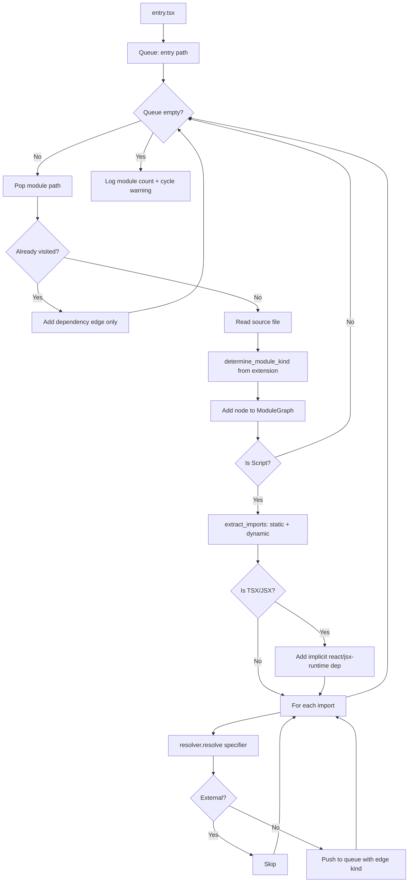
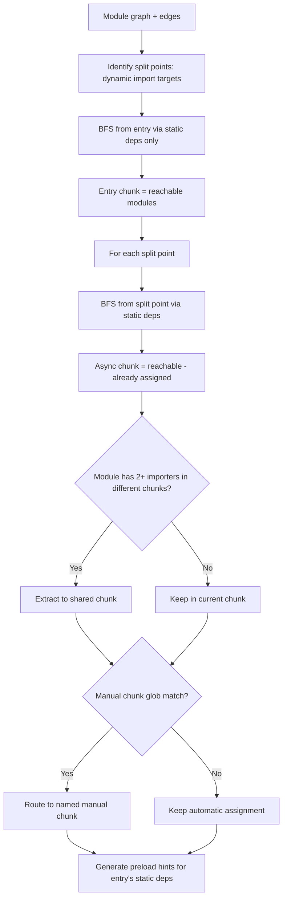

# jet Bundler

## Changes
<!-- type: changes lang: yaml -->

```yaml
changes:
  - path: ".aw/tech-design/projects/jet/logic/bundler.md"
    action: modify
    section: doc
    impl_mode: hand-written
    description: |
      Legacy Jet TD content retained as notes during AW standardization.
      Rewrite this file into semantic TD sections before promoting source to CODEGEN.
```

## Legacy notes
<!-- type: doc lang: markdown -->

# jet Bundler

### Overview

JavaScript/TypeScript bundler subsystem. Builds a module dependency graph via `petgraph`, resolves imports, transforms TS/TSX/JSX via Tree-sitter, and generates optimized production bundles with tree shaking, scope hoisting, code splitting, minification, and source maps.

<!-- LOC counts removed — derive from source with `wc -l crates/jet/src/bundler/*.rs` -->

### Module Graph



### Build Pipeline



### Graph Building



### Scope Hoisting

Two phases of scope hoisting:

**Phase 1** (`generate_scope_hoisted_bundle`): Wraps each module in an IIFE invocation with `_m{n}` namespace objects and a `_r()` switch-based require.

```
(function() {
  'use strict';
  var _m0 = {exports: {}};
  var _m1 = {exports: {}};
  function _r(id) { switch(id) { case 0: return _m0.exports; ... } }
  // Execute in dependency order (leaves first)
  (function(module, exports, require) { /* dep body */ })(_m1, _m1.exports, _r);
  (function(module, exports, require) { /* entry body */ })(_m0, _m0.exports, _r);
})();
```

**Phase 2** (`generate_flattened_bundle`): True module flattening — merges all module bodies into a single flat scope with `_m{n}_` prefixed variables. Unsafe modules (eval, with, arguments) retain IIFE wrappers.

Post-flattening optimizations (`scope_hoist_opt.rs`):
- `inline_cross_module_constants`: propagate immutable bindings across module boundaries
- `eliminate_unused_exports`: remove exports not referenced by any other module
- `is_side_effect_free`: detect pure modules safe for elimination

### Code Splitting

```yaml
schema: jet://schemas/code-splitting
definitions:
  Chunk:
    type: object
    required: [name, chunk_type, modules]
    fields:
      name:
        type: string
        description: "e.g. main or chunk-abc123"
      chunk_type:
        enum: [Entry, Async, Shared]
      modules:
        type: array
        items: path
      imports:
        type: array
        items: string
        description: Other chunk names this chunk imports
  SplitEdge:
    type: object
    required: [from, to, is_dynamic]
    fields:
      from: path
      to: path
      is_dynamic: boolean
  SplitResult:
    type: object
    fields:
      chunks:
        type: array
        items: Chunk
      preload_hints:
        type: array
        items:
          href: string
          is_static: boolean
  ManualChunkConfig:
    type: object
    fields:
      entries:
        type: map
        key: chunk_name
        value: glob_patterns
        description: Modules matching a named chunk glob route to that chunk.
```

### Splitting Logic



### Minification Pipeline

Post-bundle minification pipeline (applied in `jet build`):


| Pass | What it does |
|------|-------------|
| `replace_defines` | `process.env.NODE_ENV` -> `"production"`, `import.meta.env.*`, custom |
| `eliminate_dead_code` | Remove `if ("production" !== "production") { ... }` branches |
| `minify_js` | Strip comments, collapse whitespace, drop console/debugger |
| `replace_bool_literals` | `true` -> `!0`, `false` -> `!1` |
| `mangle_variables_with_root` | AST scope analysis, rename function-local vars to `a,b,...,z,A,...` |
| `fold_constants` | `1+2` -> `3`, `"a"+"b"` -> `"ab"`, `typeof undefined` -> `"undefined"` |
| `eliminate_dead_after_return` | Remove statements after `return`/`throw` |

### Tree Shaking

```yaml
schema: jet://schemas/tree-shake-result
type: object
fields:
  used_exports:
    type: map
    key: module_path
    value:
      type: array
      items: export_name
    description: Module path to used export names.
  eliminated_modules:
    type: array
    items: path
    description: Modules fully removed because no exports are used and no side effects remain.
  eliminated_bytes:
    type: integer
    description: Estimated bytes saved.
```

Analysis phases:
1. **Collect exports**: ESM `export` declarations + CJS `module.exports` / `exports.*`
2. **Mark used**: ESM `import { a }` -> `a` used in target; `import *` -> all used; `export { a } from` -> re-export
3. **CJS used**: `const { a } = require()` -> destructured props; `mod.a` -> property access
4. **sideEffects**: `package.json` `"sideEffects": false` -> safe to eliminate entirely
5. **Eliminate**: Module with exports, none used, no side effects -> removed

### Source Map Generation

| Mode | Behavior |
|------|----------|
| `External` | Write `main.hash.js.map`, append `//# sourceMappingURL` comment |
| `Inline` | Base64-encode map as data URL in `//# sourceMappingURL` |
| `Hidden` | Write `.map` file, no comment in JS |
| `None` | Skip entirely |

VLQ-encoded mappings. `sourcesContent` included for original source.

`compose_source_maps()` chains multi-pass transforms: TypeScript -> JS -> bundled -> minified.

### Compilation Cache

```yaml
schema: jet://schemas/compiled-module
type: object
required: [path, code, hash]
description: Keyed by PathBuf and mtime_u64 in DashMap for lock-free concurrent access.
fields:
  path: path
  code: string
  source_map: string
  dependencies:
    type: array
    items: string
  hash: string
```
