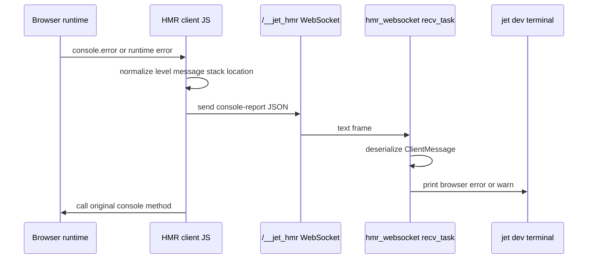
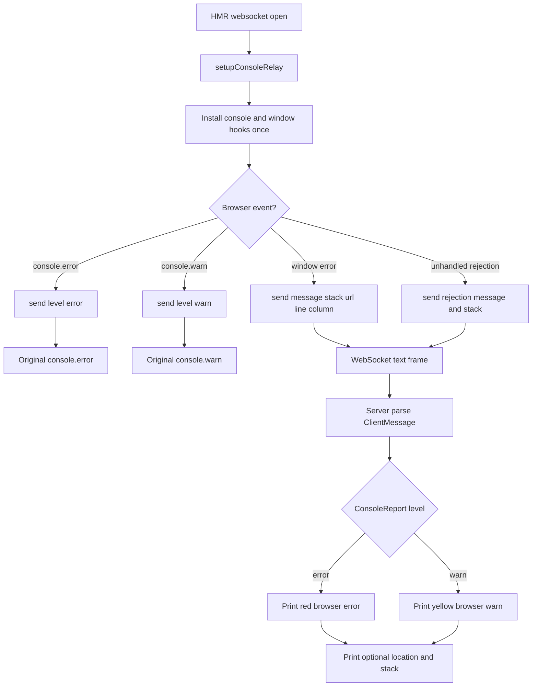
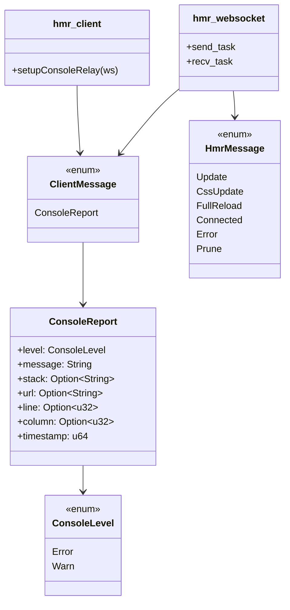

# Jet Console Error Relay

## Changes
<!-- type: changes lang: yaml -->

```yaml
changes:
  - path: ".aw/tech-design/projects/jet/logic/console-error-relay.md"
    action: modify
    section: doc
    impl_mode: hand-written
    description: |
      Legacy Jet TD content retained as notes during AW standardization.
      Rewrite this file into semantic TD sections before promoting source to CODEGEN.
```

## Legacy notes
<!-- type: doc lang: markdown -->

# Jet Console Error Relay

### Overview

The console error relay forwards browser runtime warnings and errors from the
Jet HMR client back to the `jet dev` terminal over the existing `/__jet_hmr`
WebSocket. It is always active while HMR is connected and does not broadcast
client reports back to other browsers.

### Source Map

| Contract | Source | Runtime role |
|----------|--------|--------------|
| Client message model | `crates/jet/src/dev_server/hmr.rs` | Deserialize browser-to-server `console-report` frames |
| Browser capture hooks | `crates/jet/src/dev_server/hmr_client.rs` | Capture `console.error`, `console.warn`, uncaught exceptions, and unhandled rejections |
| WebSocket receiver | `crates/jet/src/dev_server/mod.rs` | Parse `ClientMessage` frames and print terminal output |
| Existing server messages | `crates/jet/src/dev_server/hmr.rs` | Continue to own server-to-browser `HmrMessage` traffic |

### Constraints

| Constraint | Detail |
|------------|--------|
| Always on | No config flag; active whenever the HMR runtime connects |
| One way | Browser reports are printed by the server and are not re-broadcast |
| Preserve originals | Wrapped console methods call their original browser methods |
| Capture scope | Captures errors and warnings only, not log/info/debug |
| Loop avoidance | Client ignores messages beginning with `[Jet]` when wrapping console methods |

### Requirements

```mermaid
---
id: jet-console-error-relay-requirements
entry: R1
---
requirementDiagram
    requirement R1 {
        id: R1
        text: Browser console reports serialize as client messages
        risk: high
        verifymethod: test
    }
    requirement R2 {
        id: R2
        text: HMR client captures error warn exception and rejection events
        risk: high
        verifymethod: inspection
    }
    requirement R3 {
        id: R3
        text: Server recv task parses console-report text frames
        risk: high
        verifymethod: inspection
    }
    requirement R4 {
        id: R4
        text: Server prints level-specific terminal prefixes and stack frames
        risk: medium
        verifymethod: inspection
    }
    requirement R5 {
        id: R5
        text: Relay does not interrupt normal HMR server-to-client messages
        risk: high
        verifymethod: inspection
    }
```

### R1: Client Message Contract

```yaml
id: R1
priority: high
status: implemented
source:
  - crates/jet/src/dev_server/hmr.rs
```

`ClientMessage` must deserialize browser frames tagged with
`type: "console-report"`. The payload includes `level`, `message`, optional
`stack`, optional source location, and browser timestamp. Unknown client message
types fail deserialization.

### R2: Browser Capture

```yaml
id: R2
priority: high
status: implemented
source:
  - crates/jet/src/dev_server/hmr_client.rs
```

`setupConsoleRelay(ws)` must hook `console.error`, `console.warn`,
`window.error`, and `window.unhandledrejection`. Console method wrappers must
send a relay event and then call the original console method.

### R3: Server Reception

```yaml
id: R3
priority: high
status: implemented
source:
  - crates/jet/src/dev_server/mod.rs
```

The HMR websocket receive task must parse incoming text frames as
`ClientMessage`. `ConsoleReport` frames are handled locally; close frames still
terminate the receiver and other messages are ignored.

### R4: Terminal Rendering

```yaml
id: R4
priority: medium
status: implemented
source:
  - crates/jet/src/dev_server/mod.rs
```

Error reports print `[browser error]` in red. Warning reports print
`[browser warn]` in yellow. When URL, line, or stack are present, the server
prints location and up to ten stack lines.

### R5: HMR Isolation

```yaml
id: R5
priority: high
status: implemented
source:
  - crates/jet/src/dev_server/hmr.rs
  - crates/jet/src/dev_server/mod.rs
```

Console relay messages are separate from the existing `HmrMessage` enum. The
server-to-client broadcast loop continues to serialize only `HmrMessage`, while
browser-to-server text frames use `ClientMessage`.

### Scenarios

```yaml
scenarios:
  - id: S1
    requirement: R1
    title: Console error JSON deserializes
  - id: S2
    requirement: R1
    title: Unknown client type is rejected
  - id: S3
    requirement: R2
    title: Browser console error is captured and original method still runs
  - id: S4
    requirement: R2
    title: Unhandled rejection becomes an error report
  - id: S5
    requirement: R3
    title: Server receive task handles text console-report frame
  - id: S6
    requirement: R4
    title: Stack frames are capped in terminal output
  - id: S7
    requirement: R5
    title: HMR update broadcast remains server-to-client only
```

### Interaction



### Logic



### Dependency Model



### Schema

```yaml
$schema: "https://json-schema.org/draft/2020-12/schema"
$id: "jet://schemas/dev-server/client-message"
title: ClientMessage
oneOf:
  - type: object
    title: ConsoleReport
    required:
      - type
      - level
      - message
      - timestamp
    properties:
      type:
        const: console-report
      level:
        type: string
        enum: [error, warn]
      message:
        type: string
      stack:
        anyOf:
          - type: string
          - type: "null"
      url:
        anyOf:
          - type: string
          - type: "null"
      line:
        anyOf:
          - type: integer
          - type: "null"
      column:
        anyOf:
          - type: integer
          - type: "null"
      timestamp:
        type: integer
        minimum: 0
```

### Test Plan

```mermaid
---
id: jet-console-error-relay-test-plan
entry: T1
---
requirementDiagram
    requirement R1 {
        id: R1
        text: client message schema
        risk: high
        verifymethod: test
    }
    requirement R2 {
        id: R2
        text: browser capture hooks
        risk: high
        verifymethod: inspection
    }
    requirement R3 {
        id: R3
        text: server reception
        risk: high
        verifymethod: inspection
    }
    element T1 {
        type: test
        docref: cargo test -p jet dev_server::hmr::tests::client_message_console_report_error
    }
    element T2 {
        type: test
        docref: cargo test -p jet dev_server::hmr::tests::client_message_console_report_warn
    }
    element T3 {
        type: test
        docref: cargo test -p jet dev_server::hmr::tests::client_message_unknown_type_fails
    }
```

### Unit Commands

```bash
cargo test -p jet dev_server::hmr::tests::client_message_console_report_error
cargo test -p jet dev_server::hmr::tests::client_message_console_report_warn
cargo test -p jet dev_server::hmr::tests::client_message_unknown_type_fails
```

### Manual Smoke

1. Run `jet dev`.
2. Open the served page in a browser.
3. Execute `console.error("relay smoke")`.
4. Verify the terminal prints a `[browser error] relay smoke` line.

### Changes

```yaml
files:
  - path: .aw/tech-design/crates/jet/logic/console-error-relay.md
    action: MODIFY
    impl_mode: hand-written
    desc: Replace TODO template with checkable current-state contract.

  - path: crates/jet/src/dev_server/hmr.rs
    action: NONE
    impl_mode: hand-written
    desc: Existing implementation defines ClientMessage and ConsoleLevel plus schema tests.

  - path: crates/jet/src/dev_server/hmr_client.rs
    action: NONE
    impl_mode: hand-written
    desc: Existing implementation installs browser-side console relay hooks on HMR open.

  - path: crates/jet/src/dev_server/mod.rs
    action: NONE
    impl_mode: hand-written
    desc: Existing implementation parses ClientMessage frames and prints terminal diagnostics.
```
