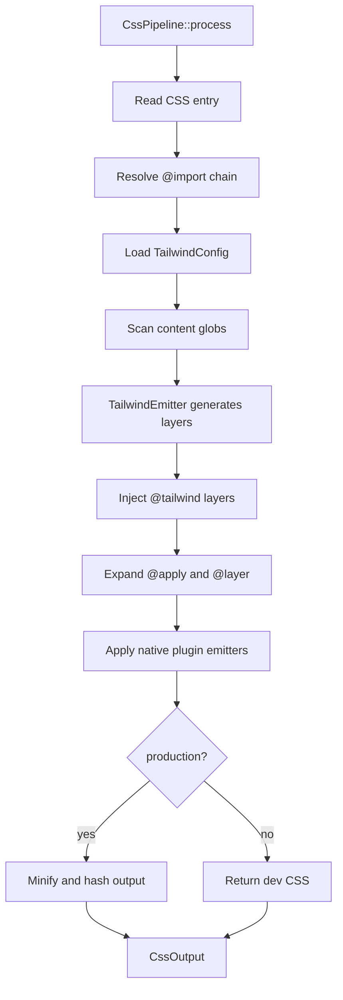

# Jet PostCSS Tailwind Foundation

## Changes
<!-- type: changes lang: yaml -->

```yaml
changes:
  - path: ".aw/tech-design/projects/jet/logic/css/postcss-tailwind-foundation.md"
    action: modify
    section: doc
    impl_mode: hand-written
    description: |
      Legacy Jet TD content retained as notes during AW standardization.
      Rewrite this file into semantic TD sections before promoting source to CODEGEN.
```

## Legacy notes
<!-- type: doc lang: markdown -->

# Jet PostCSS Tailwind Foundation

### Overview

Jet implements a native Rust CSS pipeline instead of invoking Node PostCSS. The
pipeline resolves CSS imports, scans source content for Tailwind-like classes,
generates Tailwind layers, expands directives, applies native plugin emitters,
and serves or bundles the resulting CSS through Jet's dev server and bundler.

Current source surface:

| Concern | Source |
|---------|--------|
| Pipeline orchestration | `crates/jet/src/css/mod.rs` |
| Directives | `crates/jet/src/css/directives.rs` |
| Import resolution | `crates/jet/src/css/import_resolver.rs` |
| Tailwind config/scanner/emitter | `crates/jet/src/css/tailwind/` |
| Native plugins | `crates/jet/src/css/plugins/` |
| Dev server CSS handling | `crates/jet/src/dev_server/mod.rs` |
| Test coverage focus | `jet/logic/postcss-tailwind.md` |

### Requirements

```yaml
requirements:
  - id: R1
    title: Native CSS pipeline
    priority: must
    statement: "Jet must process CSS in Rust without executing Node PostCSS plugins."
  - id: R2
    title: Import resolution
    priority: must
    statement: "CSS @import statements must be recursively inlined with circular import detection."
  - id: R3
    title: Tailwind content scanning
    priority: must
    statement: "Tailwind class candidates must be extracted from configured source globs."
  - id: R4
    title: Tailwind JIT utility emission
    priority: must
    statement: "Only used utility classes should emit CSS rules."
  - id: R5
    title: Directive expansion
    priority: must
    statement: "@tailwind, @apply, and @layer directives must be expanded before final output."
  - id: R6
    title: Dark mode and variants
    priority: must
    statement: "Variant prefixes such as hover, focus, responsive, group, peer, and dark must wrap selectors correctly."
  - id: R7
    title: Native plugin emitters
    priority: should
    statement: "tailwindcss-animate and @tailwindcss/typography must be represented by native Rust emitters."
  - id: R8
    title: Dev server integration
    priority: must
    statement: "Jet dev server must rebuild CSS when CSS or scanned content changes."
  - id: R9
    title: Production output
    priority: must
    statement: "Production builds must emit content-hashed CSS suitable for dist output."
```

### Scenarios

```yaml
scenarios:
  - name: Tailwind utilities are emitted for used classes
    covers: [R3, R4, R6]
    given:
      - "A CSS entry contains @tailwind utilities."
      - "A TSX source file uses flex, text-blue-500, and dark:bg-gray-900."
    when:
      - "CssPipeline::process runs."
    then:
      - "Output contains CSS for the used utilities."
      - "Unused utility rules are absent."
  - name: Apply directive expands declarations
    covers: [R5]
    given:
      - "CSS contains .btn { @apply flex items-center px-4; }."
    when:
      - "Directive processing runs."
    then:
      - "The @apply directive is replaced with CSS declarations."
  - name: Import chain is inlined
    covers: [R2]
    given:
      - "a.css imports b.css and b.css imports c.css."
    when:
      - "Import resolution runs."
    then:
      - "Output includes c, b, then a content."
      - "No @import statements remain."
  - name: Native plugin CSS is emitted
    covers: [R7]
    given:
      - "Tailwind config lists tailwindcss-animate and @tailwindcss/typography."
    when:
      - "TailwindEmitter generates layers."
    then:
      - "Animation keyframes and prose CSS are included when matching classes are used."
  - name: Dev CSS rebuild
    covers: [R8]
    given:
      - "jet dev is running."
    when:
      - "A TSX file adds a new Tailwind class."
    then:
      - "The CSS pipeline rebuilds through the existing dev-server watcher path."
```

### Logic



### Schema

```yaml
types:
  CssPipeline:
    source: crates/jet/src/css/mod.rs
    inputs:
      root: PathBuf
      config: TailwindConfig
      production: bool
    output: CssOutput
  TailwindConfig:
    source: crates/jet/src/css/tailwind/config.rs
    fields:
      content: "Vec<String>"
      dark_mode: DarkMode
      theme: ThemeConfig
      plugins: "Vec<String>"
  CssOutput:
    source: crates/jet/src/css/output.rs
    fields:
      css: String
      hash: String
  TailwindLayers:
    source: crates/jet/src/css/tailwind/mod.rs
    fields:
      base: String
      components: String
      utilities: String
```

### Changes

```yaml
changes:
  - path: .aw/tech-design/crates/jet/postcss-tailwind.md
    action: delete
    impl_mode: hand-written
    description: "Remove the root loose feature spec with placeholder sections."
  - path: .aw/tech-design/crates/jet/logic/css/postcss-tailwind-foundation.md
    action: add
    impl_mode: hand-written
    description: "Rehome and normalize the CSS/Tailwind feature foundation spec."
  - path: .aw/tech-design/crates/jet/logic/postcss-tailwind.md
    action: reference
    impl_mode: hand-written
    description: "Active focused test-coverage spec for this subsystem."
```
