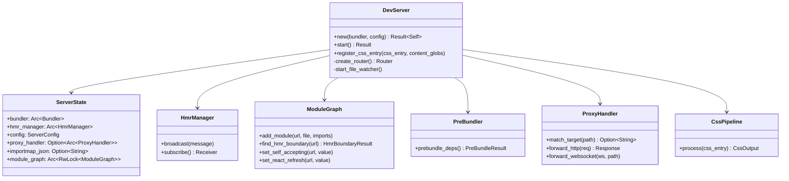
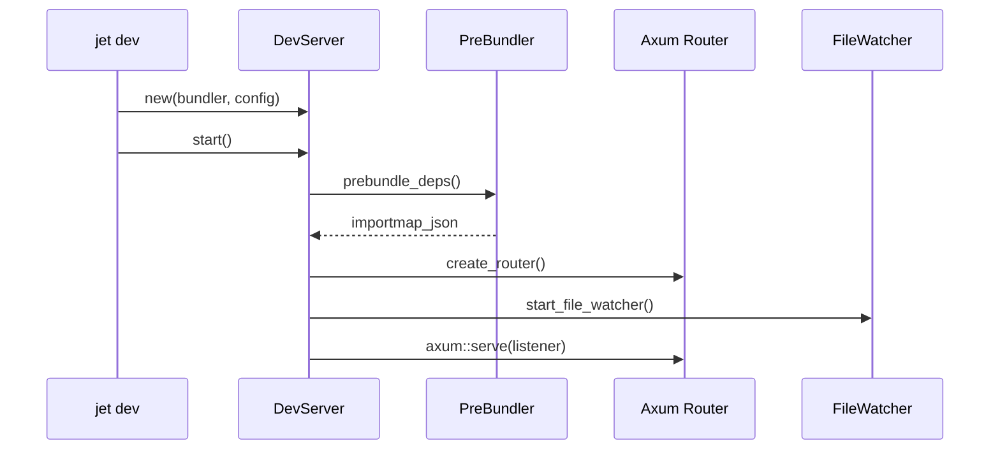
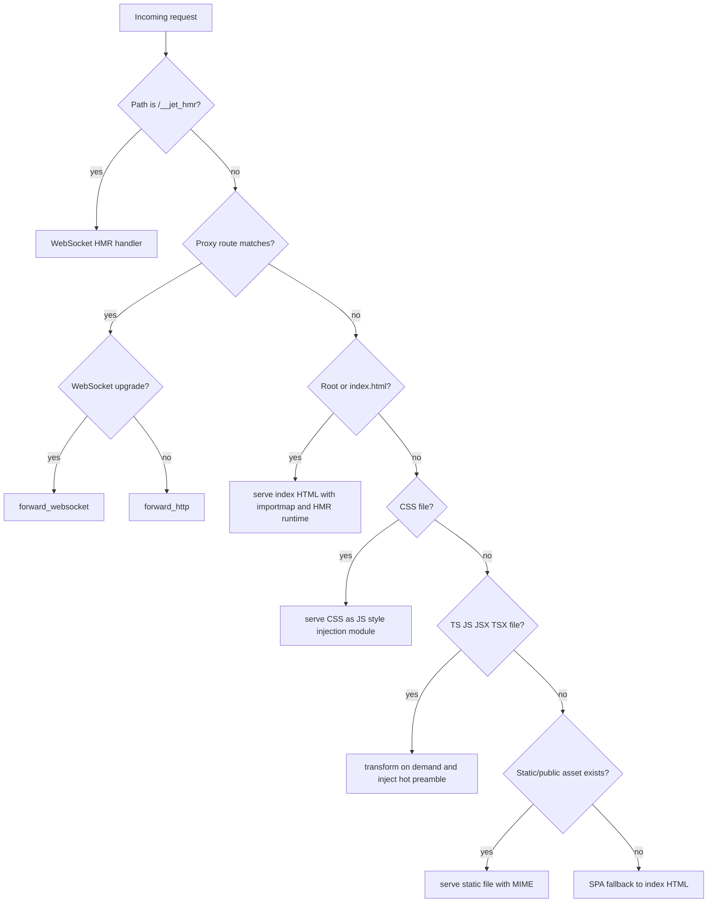
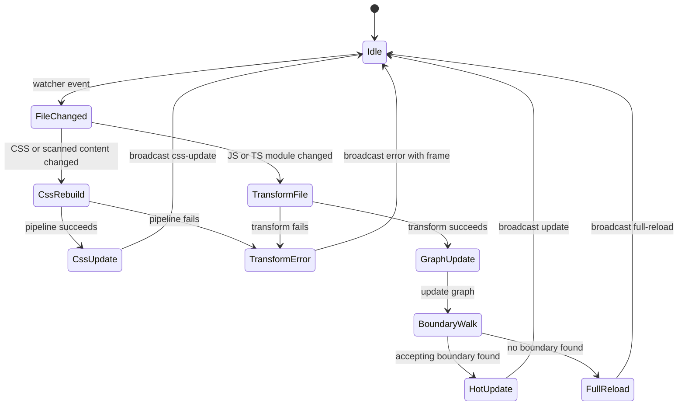
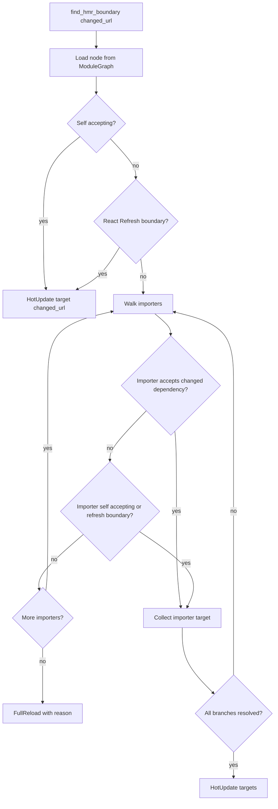

# Jet Dev Server

## Changes
<!-- type: changes lang: yaml -->

```yaml
changes:
  - path: ".aw/tech-design/projects/jet/logic/dev-server.md"
    action: modify
    section: doc
    impl_mode: hand-written
    description: |
      Legacy Jet TD content retained as notes during AW standardization.
      Rewrite this file into semantic TD sections before promoting source to CODEGEN.
```

## Legacy notes
<!-- type: doc lang: markdown -->

# Jet Dev Server

### Overview

Jet dev server is an Axum-based development server for source-first frontend
serving. It combines on-demand TypeScript/JSX transforms, HMR, React Fast
Refresh, CSS processing, CJS-to-ESM pre-bundling, importmap injection, static
file serving, SPA fallback, and optional reverse proxying.

### Source Map

| Concern | Source |
|---------|--------|
| Server lifecycle and request routing | `crates/jet/src/dev_server/mod.rs` |
| HMR message model and manager | `crates/jet/src/dev_server/hmr.rs` |
| HMR browser runtime | `crates/jet/src/dev_server/hmr_client.rs` |
| HMR module graph | `crates/jet/src/dev_server/module_graph.rs` |
| Dependency pre-bundling | `crates/jet/src/dev_server/prebundle.rs` |
| Importmap construction/injection | `crates/jet/src/dev_server/importmap.rs` |
| Reverse proxy | `crates/jet/src/dev_server/proxy.rs` |
| Source analysis and error frames | `crates/jet/src/dev_server/source_analysis.rs` |

### Requirements

```mermaid
---
id: jet-dev-server-requirements
entry: R1
---
requirementDiagram
    requirement R1 {
        id: R1
        text: Server starts with configured host port root and optional proxy routes
        risk: high
        verifymethod: test
    }
    requirement R2 {
        id: R2
        text: Startup prebundles dependencies and caches importmap JSON
        risk: high
        verifymethod: test
    }
    requirement R3 {
        id: R3
        text: Request routing prioritizes HMR proxy static source transform CSS and SPA fallback
        risk: high
        verifymethod: test
    }
    requirement R4 {
        id: R4
        text: HMR tracks module graph boundaries and broadcasts update reload error prune messages
        risk: high
        verifymethod: test
    }
    requirement R5 {
        id: R5
        text: CSS requests and CSS file changes run through CssPipeline when needed
        risk: high
        verifymethod: test
    }
    requirement R6 {
        id: R6
        text: HTML responses inject importmap process polyfill and HMR runtime
        risk: medium
        verifymethod: test
    }
    requirement R7 {
        id: R7
        text: Reverse proxy preserves HTTP behavior and forwards websocket upgrades
        risk: high
        verifymethod: test
    }
```



### Scenarios

```yaml
scenarios:
  - id: S1
    requirement: R2
    title: Startup prebundles dependencies and injects importmap
  - id: S2
    requirement: R3
    title: TypeScript request transforms on demand
  - id: S3
    requirement: R4
    title: Self-accepting module receives hot update
  - id: S4
    requirement: R4
    title: No HMR boundary triggers full reload
  - id: S5
    requirement: R5
    title: Tailwind CSS entry is processed into a style module
  - id: S6
    requirement: R6
    title: Index HTML receives importmap and HMR runtime
  - id: S7
    requirement: R7
    title: Proxy route forwards HTTP and websocket traffic
```

### Server Architecture



### Startup Sequence



### Request Routing



### HMR Lifecycle



### HMR Boundary Detection



### Schema

```yaml
HmrMessage:
  source: crates/jet/src/dev_server/hmr.rs
  serde:
    tag: type
    rename_all: kebab-case
  variants:
    - Connected
    - Update:
        path: string
        timestamp: integer
        acceptedBy: optional string
    - CssUpdate:
        css: string
        filename: string
        timestamp: integer
    - FullReload:
        reason: string
    - Error:
        message: string
        file: optional string
        line: optional integer
        column: optional integer
        frame: optional string
    - Prune:
        paths: array string
ModuleGraphNode:
  source: crates/jet/src/dev_server/module_graph.rs
  fields:
    url: string
    file: string
    imports: array string
    importers: array string
    is_self_accepting: boolean
    accepted_deps: array string
    has_react_refresh: boolean
```

### Config

```yaml
ServerConfig:
  source: crates/jet/src/dev_server/mod.rs
  fields:
    root_dir: PathBuf
    host: string
    port: u16
    open: boolean
    proxy: "HashMap<String, String>"
ProxyConfig:
  source: jet.config.toml
  example:
    dev:
      proxy:
        /api: "http://localhost:3200"
        /mcp: "http://localhost:3200"
Importmap:
  cache_file: ".jet/_importmap.json"
  html_injection: "<script type=\"importmap\">"
```

### Test Plan

```mermaid
---
id: jet-dev-server-test-plan
entry: T1
---
requirementDiagram
    requirement R3 {
        id: R3
        text: request routing
        risk: high
        verifymethod: test
    }
    requirement R4 {
        id: R4
        text: HMR
        risk: high
        verifymethod: test
    }
    requirement R5 {
        id: R5
        text: CSS handling
        risk: high
        verifymethod: test
    }
    requirement R6 {
        id: R6
        text: importmap injection
        risk: medium
        verifymethod: test
    }
    element T1 {
        type: test
        docref: cargo test -p jet dev_server::
    }
    element T2 {
        type: test
        docref: cargo test -p jet dev_server::hmr::tests
    }
    element T3 {
        type: test
        docref: cargo test -p jet dev_server::importmap::tests
    }
```

### Execution

```bash
cargo test -p jet dev_server::
cargo test -p jet dev_server::hmr::tests
cargo test -p jet dev_server::importmap::tests
```

### Changes

```yaml
files:
  - path: .aw/tech-design/crates/jet/logic/dev-server.md
    action: MODIFY
    impl_mode: hand-written
    desc: Replace loose architecture prose with a checker-compliant current-state contract.

  - path: crates/jet/src/dev_server/mod.rs
    action: NONE
    impl_mode: hand-written
    desc: Existing implementation owns lifecycle, routes, CSS handling, HMR websocket, and fallback serving.

  - path: crates/jet/src/dev_server/hmr.rs
    action: NONE
    impl_mode: hand-written
    desc: Existing implementation owns HMR message schemas and boundary result bridge.

  - path: crates/jet/src/dev_server/prebundle.rs
    action: NONE
    impl_mode: hand-written
    desc: Existing implementation owns startup dependency pre-bundling and importmap cache generation.
```
