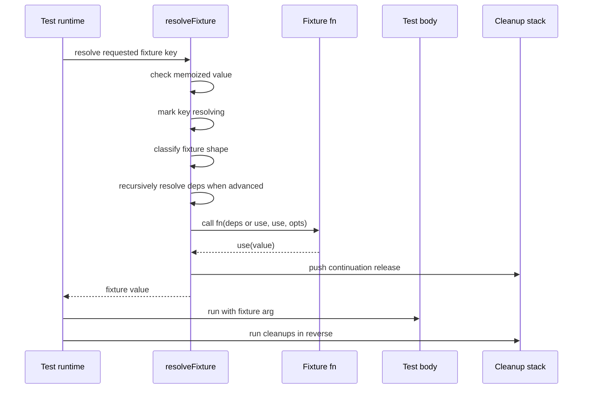
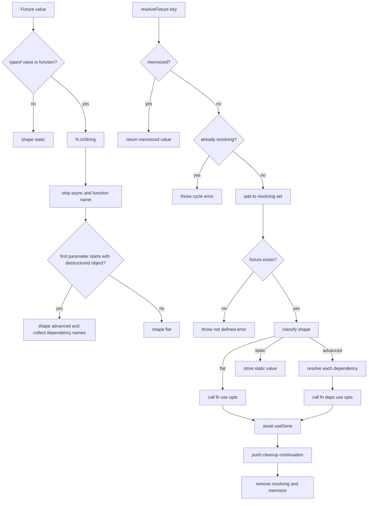
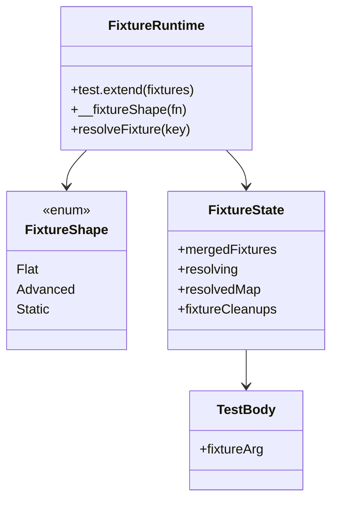

# Jet Fixture DI

## Changes
<!-- type: changes lang: yaml -->

```yaml
changes:
  - path: ".aw/tech-design/projects/jet/logic/fixture-di.md"
    action: modify
    section: doc
    impl_mode: hand-written
    description: |
      Legacy Jet TD content retained as notes during AW standardization.
      Rewrite this file into semantic TD sections before promoting source to CODEGEN.
```

## Legacy notes
<!-- type: doc lang: markdown -->

# Jet Fixture DI

### Overview

This spec owns the advanced `test.extend` fixture dependency support in Jet's
embedded test runtime. Fixtures can use the flat `(use, opts)` form or the
advanced `({ dep }, use, opts)` form. The runtime classifies each fixture,
resolves dependencies per test with a DFS, memoizes fixture values within that
test, detects cycles, and runs fixture cleanups in reverse registration order.

### Owned Surface

| Area | Source | Responsibility |
|------|--------|----------------|
| Shape detection | `crates/jet/runtime/test/index.js` | `__fixtureShape(fn)` classifies flat, advanced, or static fixtures |
| Fixture registration | `crates/jet/runtime/test/index.js` | `test.extend(fixtures)` returns a bound test object |
| Resolution | `crates/jet/runtime/test/index.js` | Per-test DFS, memoization, dependency object construction, cycle guard |
| Cleanup | `crates/jet/runtime/test/index.js` | Reverse-order cleanup through `use` continuation release |
| Integration tests | `crates/jet/tests/fixture_di_tests.rs` | Advanced dependency, shared dependency, cycle, undefined dep, flat regression |

### Requirements

```mermaid
---
id: jet-fixture-di-requirements
entry: F1
---
requirementDiagram
    requirement F1 {
        id: F1
        text: Advanced fixtures with destructured first parameter are called with deps use and opts
        risk: high
        verifymethod: test
    }
    requirement F2 {
        id: F2
        text: Flat fixtures with use first parameter keep the use and opts contract
        risk: high
        verifymethod: test
    }
    requirement F3 {
        id: F3
        text: Shape detector returns advanced flat or static based on function source and non function values
        risk: medium
        verifymethod: test
    }
    requirement F4 {
        id: F4
        text: Dependencies resolve through per test DFS and memoize values within the test
        risk: high
        verifymethod: test
    }
    requirement F5 {
        id: F5
        text: Cycles fail the test with Fixture DI cycle detected message
        risk: high
        verifymethod: test
    }
    requirement F6 {
        id: F6
        text: Missing dependency names fail the test with fixture not defined message
        risk: medium
        verifymethod: test
    }
    requirement F7 {
        id: F7
        text: Fixture cleanups run in reverse registration order
        risk: high
        verifymethod: test
    }
    requirement F8 {
        id: F8
        text: Existing flat fixture tests continue to pass
        risk: medium
        verifymethod: test
    }
```



### Scenarios

```yaml
scenarios:
  - id: FD1
    requirement: F1
    title: Advanced fixture depends on flat fixture
  - id: FD2
    requirement: F4
    title: Advanced fixture depends on another advanced fixture
  - id: FD3
    requirement: F4
    title: Shared dependency resolves once for multiple dependents
  - id: FD4
    requirement: F5
    title: Fixture cycle fails with cycle message
  - id: FD5
    requirement: F6
    title: Undefined dependency fails with not defined message
  - id: FD6
    requirement: F8
    title: Flat fixture remains compatible
```

### Interaction



### Logic



### Dependency Model



### Data Schema

```yaml
fixture_shape:
  flat:
    call: "fn(useFn, opts)"
  advanced:
    call: "fn(deps, useFn, opts)"
    deps:
      type: Set<String>
      extracted_from: destructured first parameter
  static:
    call: none
    value: non_function_value
per_test_state:
  resolving:
    type: Set<String>
    purpose: detect dependency cycles
  resolvedMap:
    type: Map<String, unknown>
    purpose: memoize fixture values within one test
  fixtureCleanups:
    type: Array<Function>
    order: reverse registration
errors:
  cycle: "Fixture DI cycle detected involving \"<key>\""
  missing: "Fixture \"<key>\" is not defined"
```

### Test Plan

```mermaid
---
id: jet-fixture-di-test-plan
entry: T1
---
requirementDiagram
    requirement F1 {
        id: F1
        text: advanced fixture dependencies
        risk: high
        verifymethod: test
    }
    requirement F4 {
        id: F4
        text: memoized DFS
        risk: high
        verifymethod: test
    }
    requirement F5 {
        id: F5
        text: cycle handling
        risk: high
        verifymethod: test
    }
    requirement F8 {
        id: F8
        text: flat regression
        risk: medium
        verifymethod: test
    }
    element T1 {
        type: test
        docref: cargo test -p jet --test fixture_di_tests
    }
```

### Execution

```bash
cargo test -p jet --test fixture_di_tests
```

### Coverage Matrix

| Requirement | Test functions |
|-------------|----------------|
| F1 | `fd1_advanced_depends_on_flat`, `fd2_advanced_chain` |
| F2 | flat fixture regression in `fixture_di_tests.rs` |
| F3 | covered through advanced and flat fixture integration behavior |
| F4 | `fd2_advanced_chain`, shared dependency test in `fixture_di_tests.rs` |
| F5 | `fd4_cycle_detected` |
| F6 | undefined dependency test in `fixture_di_tests.rs` |
| F7 | cleanup ordering test in `fixture_di_tests.rs` |
| F8 | flat fixture regression in `fixture_di_tests.rs` |

### Changes

```yaml
files:
  - path: .aw/tech-design/crates/jet/logic/fixture-di.md
    action: ADD
    impl_mode: hand-written
    desc: Re-home the fixture DI TD as a checker-compliant current-state contract.

  - path: .aw/tech-design/crates/jet/testing/fixture-di.md
    action: DELETE
    impl_mode: hand-written
    desc: Remove the unexpected top-level testing directory copy of this TD.

  - path: crates/jet/runtime/test/index.js
    action: NONE
    impl_mode: hand-written
    desc: Existing fixture shape detection, dependency resolution, memoization, cycle guard, and cleanup handling.

  - path: crates/jet/tests/fixture_di_tests.rs
    action: NONE
    impl_mode: hand-written
    desc: Existing integration tests for advanced fixtures, cycles, missing deps, and flat compatibility.
```
