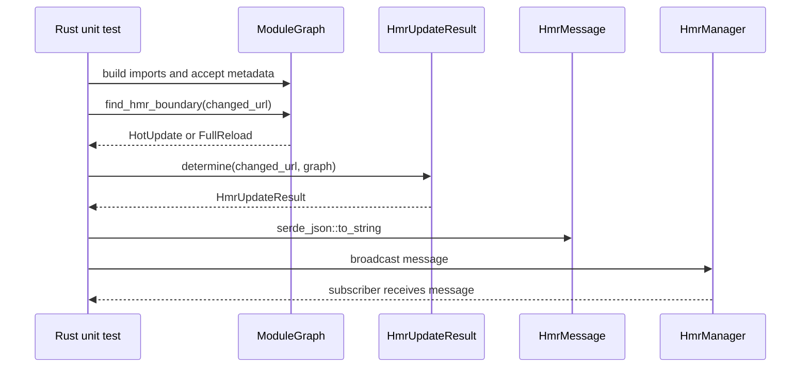
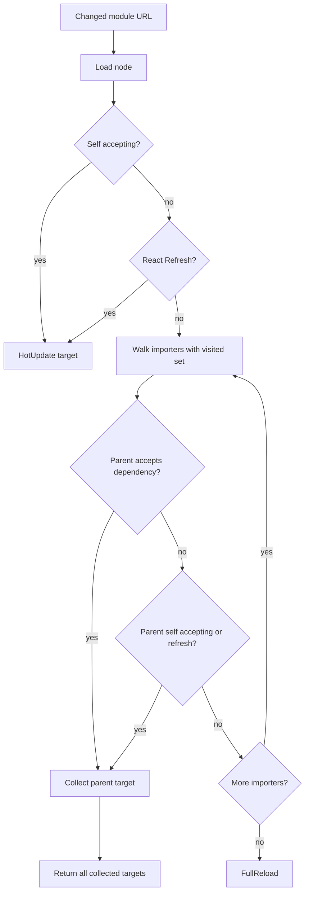
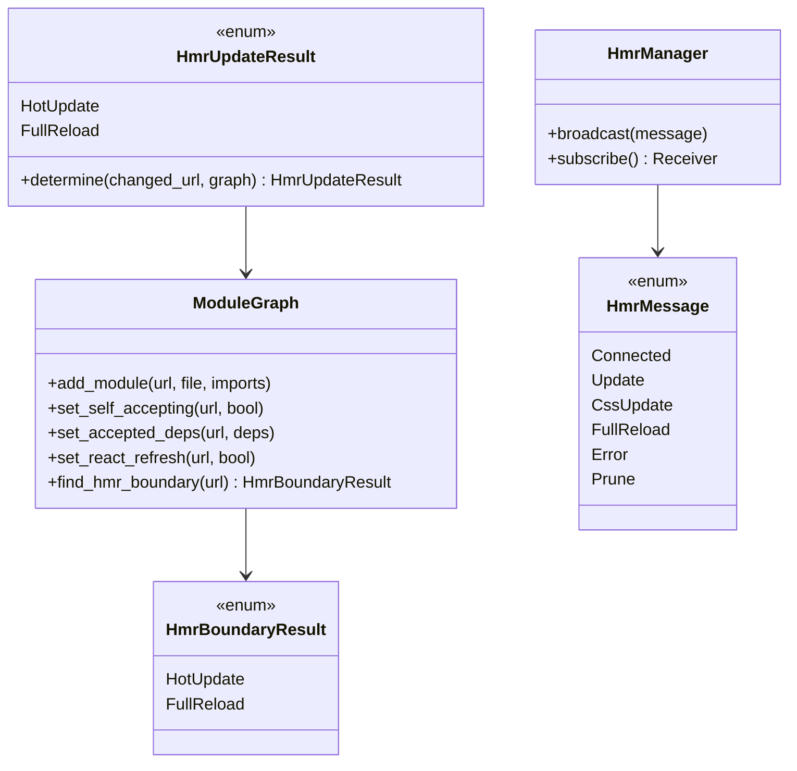

# Jet HMR Test Coverage

## Changes
<!-- type: changes lang: yaml -->

```yaml
changes:
  - path: ".aw/tech-design/projects/jet/logic/hmr.md"
    action: modify
    section: doc
    impl_mode: hand-written
    description: |
      Legacy Jet TD content retained as notes during AW standardization.
      Rewrite this file into semantic TD sections before promoting source to CODEGEN.
```

## Legacy notes
<!-- type: doc lang: markdown -->

# Jet HMR Test Coverage

### Overview

This spec owns focused test coverage for Jet's HMR subsystem. The dev-server
architecture is specified in `logic/dev-server.md`; this file tracks coverage
for module graph invalidation, boundary discovery, message serialization, and
HMR manager broadcasting.

### Coverage Surface

| Area | Source | Covered behavior |
|------|--------|------------------|
| Module graph updates | `crates/jet/src/dev_server/module_graph.rs` | Import edges, stale edge removal, module removal, orphans |
| Boundary detection | `crates/jet/src/dev_server/module_graph.rs` | Self accept, parent accept, React Refresh, unknown modules, no boundary |
| Graph traversal | `crates/jet/src/dev_server/module_graph.rs` | Cycles, diamond graphs, deep chains |
| Update result bridge | `crates/jet/src/dev_server/hmr.rs` | `HmrUpdateResult::determine` maps graph results |
| Message serde | `crates/jet/src/dev_server/hmr.rs` | `HmrMessage` variants and optional fields |
| Broadcast channel | `crates/jet/src/dev_server/hmr.rs` | `HmrManager` delivers messages to subscribers |

### Requirements

```mermaid
---
id: jet-hmr-test-requirements
entry: TR1
---
requirementDiagram
    requirement TR1 {
        id: TR1
        text: Circular import traversal terminates without a boundary
        risk: high
        verifymethod: test
    }
    requirement TR2 {
        id: TR2
        text: Circular import traversal still finds a self-accepting boundary
        risk: high
        verifymethod: test
    }
    requirement TR3 {
        id: TR3
        text: Diamond graphs collect multiple hot-update targets
        risk: high
        verifymethod: test
    }
    requirement TR4 {
        id: TR4
        text: Deep importer chains traverse to distant boundaries
        risk: medium
        verifymethod: test
    }
    requirement TR5 {
        id: TR5
        text: HmrUpdateResult bridges parent-accept and React Refresh graph outcomes
        risk: high
        verifymethod: test
    }
    requirement TR6 {
        id: TR6
        text: HmrMessage serialization covers connected update error prune css and reload variants
        risk: medium
        verifymethod: test
    }
    requirement TR7 {
        id: TR7
        text: HmrManager broadcast delivers messages to active subscribers
        risk: medium
        verifymethod: test
    }
```

### Scenarios

```yaml
scenarios:
  - id: S1
    requirement: TR1
    title: Circular import chain returns FullReload
  - id: S2
    requirement: TR2
    title: Circular chain finds self-accepting boundary
  - id: S3
    requirement: TR3
    title: Diamond graph collects multiple targets
  - id: S4
    requirement: TR4
    title: Deep chain traverses to distant boundary
  - id: S5
    requirement: TR5
    title: HmrUpdateResult determines parent accept
  - id: S6
    requirement: TR5
    title: HmrUpdateResult determines React Refresh boundary
  - id: S7
    requirement: TR6
    title: Connected message serializes with no extra fields
  - id: S8
    requirement: TR6
    title: Update acceptedBy serializes when present
  - id: S9
    requirement: TR6
    title: Error minimal message skips optional fields
  - id: S10
    requirement: TR7
    title: HmrManager broadcast reaches subscriber
```

### Interaction



### Logic



### Dependency Model



### Test Plan

```mermaid
---
id: jet-hmr-test-plan
entry: T1
---
requirementDiagram
    requirement TR1 {
        id: TR1
        text: cycle termination
        risk: high
        verifymethod: test
    }
    requirement TR3 {
        id: TR3
        text: diamond target collection
        risk: high
        verifymethod: test
    }
    requirement TR5 {
        id: TR5
        text: update result bridge
        risk: high
        verifymethod: test
    }
    requirement TR6 {
        id: TR6
        text: message serde
        risk: medium
        verifymethod: test
    }
    element T1 {
        type: test
        docref: cargo test -p jet module_graph::tests
    }
    element T2 {
        type: test
        docref: cargo test -p jet hmr::tests
    }
```

### Execution

```bash
cargo test -p jet module_graph::tests
cargo test -p jet hmr::tests
cargo test -p jet test_circular_import_chain_bfs_termination
cargo test -p jet test_diamond_graph_multiple_targets
cargo test -p jet hmr_message_update_with_accepted_by
cargo test -p jet hmr_manager_broadcast_receive
```

### Coverage Matrix

| Requirement | Test functions |
|-------------|----------------|
| TR1 | `test_circular_import_chain_bfs_termination` |
| TR2 | `test_circular_import_chain_with_boundary` |
| TR3 | `test_diamond_graph_multiple_targets` |
| TR4 | `test_deep_chain_bfs_traversal` |
| TR5 | `determine_hot_update_for_parent_accept`, `determine_hot_update_for_react_refresh` |
| TR6 | `hmr_message_connected_serialization`, `hmr_message_update_with_accepted_by`, `hmr_message_error_minimal_fields` |
| TR7 | `hmr_manager_broadcast_receive` |

### Changes

```yaml
files:
  - path: .aw/tech-design/crates/jet/logic/hmr.md
    action: MODIFY
    section: doc
    impl_mode: hand-written
    desc: Replace old TODO-heavy HMR coverage spec with this checkable current-state contract.

  - path: crates/jet/src/dev_server/module_graph.rs
    action: NONE
    section: doc
    impl_mode: hand-written
    desc: Existing tests cover boundary traversal, cycles, diamond graphs, deep chains, stale edges, and orphan removal.

  - path: crates/jet/src/dev_server/hmr.rs
    action: NONE
    section: doc
    impl_mode: hand-written
    desc: Existing tests cover HmrUpdateResult bridging, HmrMessage serialization, and HmrManager broadcast.
```
