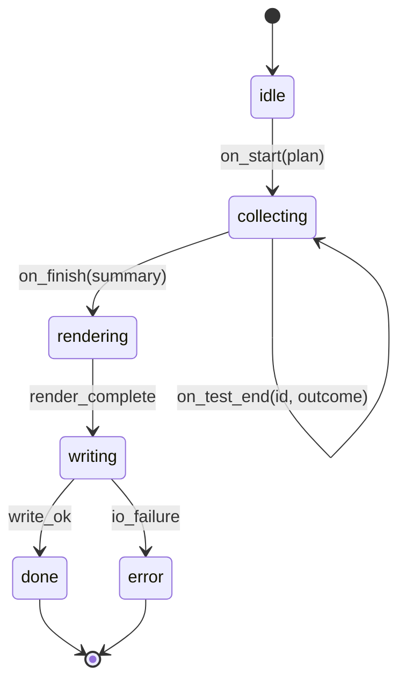
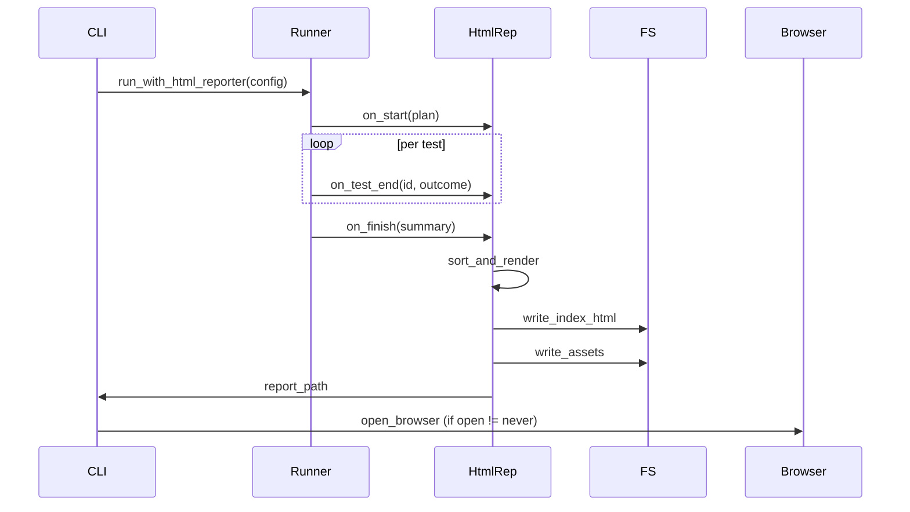

# Jet HTML Reporter

## Changes
<!-- type: changes lang: yaml -->

```yaml
changes:
  - path: ".aw/tech-design/projects/jet/logic/html-reporter.md"
    action: modify
    section: doc
    impl_mode: hand-written
    description: |
      Legacy Jet TD content retained as notes during AW standardization.
      Rewrite this file into semantic TD sections before promoting source to CODEGEN.
```

## Legacy notes
<!-- type: doc lang: markdown -->

# Jet HTML Reporter

### Overview

Static HTML report generator for the jet native test runner. After `jet test` completes, `HtmlReporter` consumes the NDJSON wire protocol event stream (same `testEnd` events as the JSON reporter) and writes a self-contained `test-results/html-report/index.html` with a sibling `assets/` directory containing CSS and JS — no CDN or local server required.

The report surface includes:

- Aggregate stats header: total / passed / failed / flaky / skipped counts, total wall-clock duration, optional shard index/total.
- Collapsible test tree grouped by file and describe blocks with per-test status badges.
- Per-test detail panel: status, duration, error message, stack trace, screenshots, and a trace deep-link to `test-results/<name>-trace.zip`.
- Filter controls: filter by status, tag, file, and duration bucket.
- URL fragment deep-linking: selected test survives bookmark and reload.
- Previous/next navigation between test detail views.
- Dark/light theme toggle with responsive layout.
- Auto-open in default browser after run, gated by `open: on-failure | always | never`.

Key modules:

- `crates/jet/src/reporters/html.rs` — `HtmlReporter` implementing the `Reporter` trait.
- `crates/jet/src/reporters/open_browser.rs` — cross-platform browser launcher (macOS `open`, Linux `xdg-open`, Windows `cmd /c start`; suppressed when `CI=true`).
- `crates/jet/src/runner/config.rs` — `HtmlReporterOpts { output_folder, open: OpenMode }` wired into `ReporterConfig`.
- `crates/jet/runtime/test/reporters/html/assets/` — `app.js`, `app.css`, `data.js` (generated per run).
- `crates/jet/src/reporters/html/templates/index.html.tera` — Tera template rendered server-side.

Activation: `--reporter=html` CLI flag or `reporter: 'html'` / `reporter: [['html', opts]]` in `jet.test.config.ts`.
### Reporter State Machine


### Reporter Interaction


### Reporter Logic

```mermaid
---
id: html-reporter-render-logic
entry: start
nodes:
  start:          { kind: start,    label: "Receive on_finish" }
  parse_events:   { kind: process,  label: "Collect testEnd rows" }
  extract_trace:  { kind: decision, label: "trace_path present?" }
  set_trace_link: { kind: process,  label: "Set trace_link" }
  store_row:      { kind: process,  label: "Store TestRow" }
  more_events:    { kind: decision, label: "More events?" }
  compute_stats:  { kind: process,  label: "Compute ReportSummary" }
  sort_rows:      { kind: process,  label: "Sort rows by test_id" }
  render_html:    { kind: process,  label: "Render index.html via Tera" }
  inline_assets:  { kind: process,  label: "Inline app.js + app.css" }
  write_output:   { kind: process,  label: "Write index.html + assets/" }
  maybe_open:     { kind: decision, label: "open == always OR (on-failure AND failed > 0)?" }
  open_browser:   { kind: process,  label: "Spawn open / xdg-open / start" }
  done:           { kind: terminal, label: "Done" }
edges:
  - { from: start,          to: parse_events }
  - { from: parse_events,   to: extract_trace }
  - { from: extract_trace,  to: set_trace_link, label: "yes" }
  - { from: extract_trace,  to: store_row,      label: "no" }
  - { from: set_trace_link, to: store_row }
  - { from: store_row,      to: more_events }
  - { from: more_events,    to: parse_events,   label: "yes" }
  - { from: more_events,    to: compute_stats,  label: "no" }
  - { from: compute_stats,  to: sort_rows }
  - { from: sort_rows,      to: render_html }
  - { from: render_html,    to: inline_assets }
  - { from: inline_assets,  to: write_output }
  - { from: write_output,   to: maybe_open }
  - { from: maybe_open,     to: open_browser, label: "yes" }
  - { from: maybe_open,     to: done,         label: "no" }
  - { from: open_browser,   to: done }
---
flowchart TD
    start([Receive on_finish]) --> parse_events[Collect testEnd rows]
    parse_events --> extract_trace{trace_path present?}
    extract_trace -->|yes| set_trace_link[Set trace_link]
    extract_trace -->|no| store_row[Store TestRow]
    set_trace_link --> store_row
    store_row --> more_events{More events?}
    more_events -->|yes| parse_events
    more_events -->|no| compute_stats[Compute ReportSummary]
    compute_stats --> sort_rows[Sort rows by test_id]
    sort_rows --> render_html[Render index.html via Tera]
    render_html --> inline_assets[Inline app.js + app.css]
    inline_assets --> write_output[Write index.html + assets/]
    write_output --> maybe_open{open == always OR on-failure AND failed > 0?}
    maybe_open -->|yes| open_browser[Spawn open/xdg-open/start]
    maybe_open -->|no| done([Done])
    open_browser --> done
```


### Schema

```yaml
$schema: "https://json-schema.org/draft/2020-12/schema"
$id: html-reporter-data-model
title: HtmlReporterDataModel
definitions:
  OpenMode:
    type: string
    enum: [always, on-failure, never]
    description: >-
      Controls when the reporter auto-opens the generated report in the
      default browser after a test run completes.

  HtmlReporterOpts:
    type: object
    required: [output_folder, open]
    properties:
      output_folder:
        type: string
        description: Output directory for the HTML report. Default is test-results/html-report.
      open:
        $ref: "#/definitions/OpenMode"
    additionalProperties: false

  TestStatus:
    type: string
    enum: [passed, failed, skipped, flaky]

  TestRow:
    type: object
    required: [test_id, name, status, duration_ms, file]
    properties:
      test_id:
        type: string
        description: >-
          Stable identifier derived from file + describe_stack + test_name.
          Used for sort order and shard deduplication.
      name:
        type: string
        description: Full test title including describe stack.
      status:
        $ref: "#/definitions/TestStatus"
      duration_ms:
        type: integer
        minimum: 0
      file:
        type: string
        description: Relative path from project root.
      line:
        type: integer
        description: 1-based line number of the test() call.
      stack_trace:
        type: string
        description: Raw stack string from testEnd payload. Present only when status=failed.
      matcher_diff:
        type: string
        description: Structured diff from expect() failure. Present only when status=failed.
      trace_path:
        type: string
        description: >-
          Relative path to the .zip trace file (test-results/<name>-trace.zip).
          Present only when trace was captured.
      screenshots:
        type: array
        items:
          type: string
          description: Relative path to a captured screenshot file.
      logs:
        type: array
        items:
          type: string
        description: Captured console lines during the test.
    additionalProperties: false

  ShardInfo:
    type: object
    required: [index, total]
    properties:
      index:
        type: integer
        minimum: 1
      total:
        type: integer
        minimum: 1
    additionalProperties: false

  ReportSummary:
    type: object
    required: [total, passed, failed, skipped, flaky, duration_ms]
    properties:
      total:
        type: integer
        minimum: 0
      passed:
        type: integer
        minimum: 0
      failed:
        type: integer
        minimum: 0
      skipped:
        type: integer
        minimum: 0
      flaky:
        type: integer
        minimum: 0
        description: Tests that failed on first attempt and passed on retry.
      duration_ms:
        type: integer
        minimum: 0
      shard:
        $ref: "#/definitions/ShardInfo"
    additionalProperties: false

  ReportData:
    type: object
    required: [version, summary, tests]
    properties:
      version:
        const: 1
        description: Schema version for forward compatibility.
      summary:
        $ref: "#/definitions/ReportSummary"
      tests:
        type: array
        items:
          $ref: "#/definitions/TestRow"
        description: Test rows sorted by test_id for deterministic output.
    additionalProperties: false
```
### CLI

```yaml
$schema: "https://json-schema.org/draft/2020-12/schema"
$id: html-reporter-cli
title: HtmlReporterCLI
description: CLI commands for the jet HTML reporter.

definitions:
  JetTestCommand:
    type: object
    description: Extends jet test with HTML reporter flags.
    properties:
      "--reporter":
        type: string
        description: >-
          Comma-separated reporter list. Valid values: term, json, html.
          Default: term,json. Use --reporter=html or --reporter=list,html
          to activate the HTML reporter.
        examples:
          - "--reporter=html"
          - "--reporter=list,html"
      "--reporter-output":
        type: string
        description: >-
          Output directory for the HTML report. Default: test-results/html-report.
          Maps to HtmlReporterOpts.output_folder.
        examples:
          - "--reporter-output=ci-artifacts/report"

  JetReportViewCommand:
    type: object
    description: Open an HTML report directory in the system default browser.
    required: [dir]
    properties:
      dir:
        type: string
        description: Path to the report directory containing index.html.
      "--open":
        type: string
        enum: [always, on-failure, never]
        description: >-
          Override the open mode. Default: always (since view is explicitly requested).
      "--serve":
        type: boolean
        description: >-
          Serve the report on a local HTTP port rather than opening a file:// URL.
          Port is randomly assigned and printed to stdout.
    examples:
      - "jet report view test-results/html-report"
      - "jet report view test-results/html-report --serve"

  # Note: `jet report merge` (cross-shard merged view) is deferred — see Scope ▸ Out of Scope.
  # When sharding lands, a follow-up issue will reintroduce JetReportMergeCommand together with
  # its handler entry in Changes and a verifying scenario.

commands:
  - name: jet test
    ref: "#/definitions/JetTestCommand"
  - name: jet report view
    ref: "#/definitions/JetReportViewCommand"
```
### Scenarios

```yaml
scenarios:
  - id: S1
    title: All-pass run produces self-contained HTML report
    given:
      - "--reporter=html flag is set"
      - "jet test is invoked on a suite with no failures"
    when:
      - "jet test completes"
    then:
      - "test-results/html-report/index.html exists"
      - "assets/ sibling directory contains app.js and app.css"
      - "ReportSummary.failed == 0"
      - "No stack trace drawers rendered in the output"

  - id: S2
    title: Failed test produces status badge and stack trace drawer
    given:
      - "--reporter=html flag is set"
      - "jet test is invoked on a suite with 1 failing test"
    when:
      - "jet test completes"
    then:
      - "test-results/html-report/index.html exists"
      - "The failing test row carries status badge 'failed'"
      - "Stack trace drawer is rendered (collapsed by default)"
      - "ReportSummary.failed == 1"

  - id: S3
    title: Combined list and html reporters both produce output
    given:
      - "--reporter=list,html flag is set"
    when:
      - "jet test runs"
    then:
      - "Terminal summary is printed to stdout"
      - "test-results/html-report/index.html is also written"

  - id: S4
    title: Custom output directory is honoured
    given:
      - "--reporter-output=tmp/my-report flag is set"
    when:
      - "jet test completes"
    then:
      - "Report is written to tmp/my-report/index.html"
      - "Default path test-results/html-report/index.html is NOT created"

  - id: S5
    title: jet report view opens the report in the system browser
    given:
      - "A report directory with index.html exists at test-results/html-report"
    when:
      - "jet report view test-results/html-report is invoked"
    then:
      - "System browser opens the report (open / xdg-open / start is spawned)"

  - id: S8
    title: HTML output is deterministic for identical input
    given:
      - "The same NDJSON event stream is replayed twice through HtmlReporter"
    when:
      - "HTML generation runs both times"
    then:
      - "Both produced index.html files are byte-identical"
      - "Test rows are sorted by test_id in both outputs"

  - id: S9
    title: Trace link appears in the detail panel when trace file present
    given:
      - "A test produces a trace file at test-results/<name>-trace.zip"
      - "--trace=retain-on-failure is set"
    when:
      - "The HTML report is generated"
    then:
      - "'View trace' link is present in the failing test row"
      - "The link references the relative trace path"

  - id: S10
    title: URL fragment deep-link restores selected test on reload
    given:
      - "A test is selected in the report and its URL fragment is bookmarked"
    when:
      - "The report is reloaded with the fragment URL"
    then:
      - "The same test is highlighted and its detail panel is visible"

  - id: S11
    title: Auto-open is suppressed in CI environment
    given:
      - "CI=true environment variable is set"
      - "open config is 'always'"
    when:
      - "jet test completes and HtmlReporter finishes writing"
    then:
      - "No browser process is spawned"
      - "Report path is printed to stdout"
```
### Test Plan

```mermaid
---
id: html-reporter-test-plan
requirements:
  self_contained_report:
    id: R1
    text: "HtmlReporter writes test-results/html-report/index.html with sibling assets/"
    kind: functional
    risk: high
    verify: test
  test_tree_display:
    id: R2
    text: "Report shows collapsible test tree grouped by file and describe blocks"
    kind: functional
    risk: high
    verify: test
  detail_panel:
    id: R3
    text: "Each test entry has detail panel with status, duration, error, stack trace, screenshots, and trace link"
    kind: functional
    risk: high
    verify: test
  stats_header:
    id: R4
    text: "Report displays stats header with total/passed/failed/flaky/skipped counts and suite duration"
    kind: functional
    risk: high
    verify: test
  filter_support:
    id: R5
    text: "Report supports filtering by status, tag, file, and duration bucket"
    kind: functional
    risk: high
    verify: test
  existing_event_stream:
    id: R6
    text: "Reporter reads testEnd events from existing NDJSON wire protocol without new format"
    kind: interface
    risk: high
    verify: analysis
  reporter_selection:
    id: R7
    text: "Reporter selectable via --reporter=html CLI flag and jet.test.config.ts reporter key"
    kind: functional
    risk: high
    verify: test
  auto_open:
    id: R8
    text: "Reporter auto-opens index.html in default browser gated by open config knob"
    kind: functional
    risk: medium
    verify: test
  deep_link:
    id: R9
    text: "Report supports URL fragment deep linking that survives bookmark and reload"
    kind: functional
    risk: medium
    verify: test
  prev_next_nav:
    id: R10
    text: "Detail view provides previous/next navigation buttons between test results"
    kind: functional
    risk: medium
    verify: test
  theme_toggle:
    id: R11
    text: "Report supports dark/light theme toggle and responsive layout"
    kind: functional
    risk: low
    verify: test
elements:
  smoke_index_html_exists:
    kind: test
    type: "rs/integration"
  smoke_stats_rendered:
    kind: test
    type: "rs/integration"
  smoke_test_row_fields:
    kind: test
    type: "rs/integration"
  smoke_reporter_flag:
    kind: test
    type: "rs/integration"
  smoke_determinism:
    kind: test
    type: "rs/integration"
  smoke_trace_link:
    kind: test
    type: "rs/integration"
  smoke_deep_link:
    kind: test
    type: "rs/integration"
  smoke_filter_counts:
    kind: test
    type: "rs/integration"
  analysis_no_new_wire_format:
    kind: analysis
    type: "spec-review"
  analysis_assets_self_contained:
    kind: analysis
    type: "spec-review"
  smoke_auto_open:
    kind: test
    type: "rs/integration"
  smoke_prev_next_nav:
    kind: test
    type: "rs/integration"
  smoke_theme_toggle:
    kind: test
    type: "rs/integration"
relations:
  - { from: smoke_index_html_exists,  verifies: self_contained_report }
  - { from: smoke_stats_rendered,     verifies: stats_header }
  - { from: smoke_test_row_fields,    verifies: detail_panel }
  - { from: smoke_test_row_fields,    verifies: test_tree_display }
  - { from: smoke_reporter_flag,      verifies: reporter_selection }
  - { from: smoke_determinism,        verifies: stats_header }
  - { from: smoke_trace_link,         verifies: detail_panel }
  - { from: smoke_deep_link,          verifies: deep_link }
  - { from: smoke_filter_counts,      verifies: filter_support }
  - { from: analysis_no_new_wire_format, verifies: existing_event_stream }
  - { from: analysis_assets_self_contained, verifies: self_contained_report }
  - { from: smoke_auto_open,          verifies: auto_open }
  - { from: smoke_prev_next_nav,      verifies: prev_next_nav }
  - { from: smoke_theme_toggle,       verifies: theme_toggle }
---
requirementDiagram
    requirement R1 {
      id: R1
      text: "HtmlReporter writes test-results/html-report/index.html with sibling assets/"
      risk: high
      verifymethod: test
    }
    requirement R2 {
      id: R2
      text: "Report shows collapsible test tree grouped by file and describe blocks"
      risk: high
      verifymethod: test
    }
    requirement R3 {
      id: R3
      text: "Each test entry has detail panel with status, duration, error, stack trace, screenshots, and trace link"
      risk: high
      verifymethod: test
    }
    requirement R4 {
      id: R4
      text: "Stats header with total/passed/failed/flaky/skipped counts and suite duration"
      risk: high
      verifymethod: test
    }
    requirement R5 {
      id: R5
      text: "Filter by status, tag, file, and duration bucket"
      risk: high
      verifymethod: test
    }
    requirement R6 {
      id: R6
      text: "Reads testEnd events from existing NDJSON wire protocol"
      risk: high
      verifymethod: analysis
    }
    requirement R7 {
      id: R7
      text: "--reporter=html and jet.test.config.ts reporter key accepted"
      risk: high
      verifymethod: test
    }
    requirement R8 {
      id: R8
      text: "Auto-open in default browser gated by open config knob"
      risk: medium
      verifymethod: test
    }
    requirement R9 {
      id: R9
      text: "URL fragment deep linking survives bookmark and reload"
      risk: medium
      verifymethod: test
    }
    requirement R10 {
      id: R10
      text: "Detail view previous/next navigation buttons"
      risk: medium
      verifymethod: test
    }
    requirement R11 {
      id: R11
      text: "Dark/light theme toggle and responsive layout"
      risk: low
      verifymethod: test
    }
    element smoke_index_html_exists {
      type: "rs/integration"
    }
    element smoke_stats_rendered {
      type: "rs/integration"
    }
    element smoke_test_row_fields {
      type: "rs/integration"
    }
    element smoke_reporter_flag {
      type: "rs/integration"
    }
    element smoke_determinism {
      type: "rs/integration"
    }
    element smoke_trace_link {
      type: "rs/integration"
    }
    element smoke_deep_link {
      type: "rs/integration"
    }
    element smoke_filter_counts {
      type: "rs/integration"
    }
    element analysis_no_new_wire_format {
      type: "spec-review"
    }
    element analysis_assets_self_contained {
      type: "spec-review"
    }
    element smoke_auto_open {
      type: "rs/integration"
    }
    element smoke_prev_next_nav {
      type: "rs/integration"
    }
    element smoke_theme_toggle {
      type: "rs/integration"
    }
    smoke_index_html_exists - verifies -> R1
    smoke_stats_rendered - verifies -> R4
    smoke_test_row_fields - verifies -> R3
    smoke_test_row_fields - verifies -> R2
    smoke_reporter_flag - verifies -> R7
    smoke_determinism - verifies -> R4
    smoke_trace_link - verifies -> R3
    smoke_deep_link - verifies -> R9
    smoke_filter_counts - verifies -> R5
    analysis_no_new_wire_format - verifies -> R6
    analysis_assets_self_contained - verifies -> R1
    smoke_auto_open - verifies -> R8
    smoke_prev_next_nav - verifies -> R10
    smoke_theme_toggle - verifies -> R11
```


### Changes

```yaml
changes:
  - path: crates/jet/src/reporters/html.rs
    action: create
    section: doc
    impl_mode: hand-written
    description: >-
      HtmlReporter struct implementing the Reporter trait. Consumes testEnd
      events from the NDJSON wire protocol, builds Vec<TestRow>, sorts by
      test_id for determinism, renders index.html via Tera template, and
      writes assets/ directory. Implements auto-open via open_browser helper.

  - path: crates/jet/src/reporters/html/templates/index.html.tera
    action: create
    section: doc
    impl_mode: hand-written
    description: >-
      Tera template for the top-level HTML page. Renders the stats header,
      test tree, and detail panel shell. JS/CSS are referenced from assets/.

  - path: crates/jet/src/reporters/open_browser.rs
    action: create
    section: doc
    impl_mode: hand-written
    description: >-
      Cross-platform browser auto-open helper. Uses `open` on macOS,
      `xdg-open` on Linux, `cmd /c start` on Windows. Suppressed when
      CI=true environment variable is set. Respects the OpenMode enum
      (always / on-failure / never).

  - path: crates/jet/src/reporters/mod.rs
    action: modify
    section: doc
    impl_mode: hand-written
    description: >-
      Register HtmlReporter with the reporter registry. Add html variant
      to ReporterKind enum. Wire HtmlReporter into reporter factory based
      on RunnerConfig.reporter list.

  - path: crates/jet/src/runner/config.rs
    action: modify
    section: doc
    impl_mode: hand-written
    description: >-
      Add HtmlReporterOpts { output_folder: String, open: OpenMode } and
      wire into ReporterConfig. Add html to reporter enum. Document
      --reporter-output flag.

  - path: crates/jet/src/cli.rs
    action: modify
    section: doc
    impl_mode: hand-written
    description: >-
      Accept --reporter=html and --reporter-output=<dir> CLI flags.
      Forward both into RunnerConfig. ~15 LOC delta.

  - path: crates/jet/src/cli/report.rs
    action: create
    section: doc
    impl_mode: hand-written
    description: >-
      Subcommand handler for `jet report`. Registers the `jet report view`
      subcommand: resolves the report directory, calls the open_browser
      helper with OpenMode::Always. This is the dispatch point for
      JetReportViewCommand defined in the CLI section.

  - path: crates/jet/runtime/test/reporters/html/assets/app.js
    action: create
    section: doc
    impl_mode: hand-written
    description: >-
      Client-side bundle (~500 LOC). Implements: filter UI (by status / tag /
      file / duration bucket), URL fragment deep-link handler, previous/next
      navigation between test results, collapsible test tree, and dark/light
      theme toggle. Reads serialised ReportData from the inlined data.js
      variable.

  - path: crates/jet/runtime/test/reporters/html/assets/app.css
    action: create
    section: doc
    impl_mode: hand-written
    description: >-
      Stylesheet (~300 LOC) using CSS custom properties for light/dark theme
      and responsive layout. Self-contained — no CDN or external fonts.

  - path: crates/jet/runtime/test/reporters/html/assets/data.js
    action: create
    section: doc
    impl_mode: hand-written
    description: >-
      Generated per run (variable LOC). Inlines the serialised ReportData
      JSON as a JS variable so the viewer requires no local server.
      Written by HtmlReporter at report generation time.

  - path: crates/jet/tests/html_reporter_smoke.rs
    action: create
    section: doc
    impl_mode: hand-written
    description: >-
      Integration tests (~250 LOC): report generated from canned NDJSON
      fixture, index.html valid HTML, URL fragment deep-link round-trip,
      filter counts correct, golden-diff determinism check.
```
