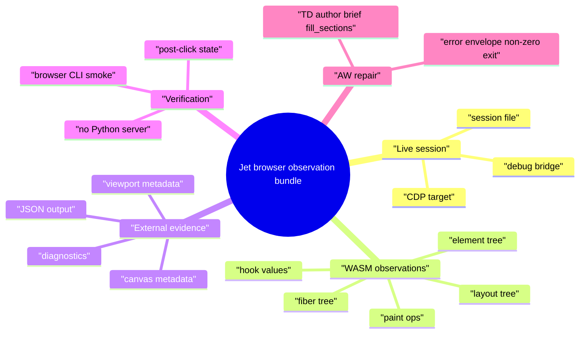
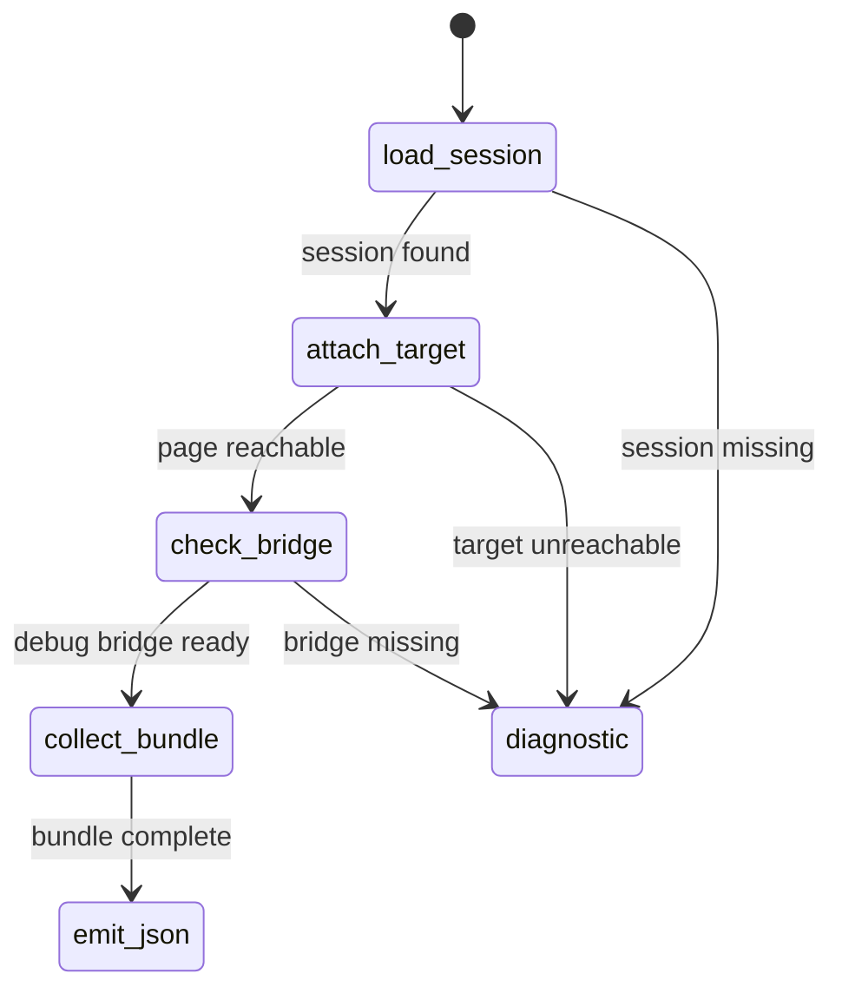
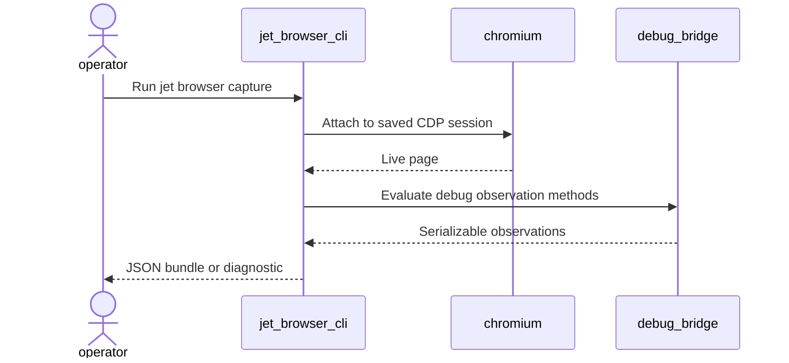
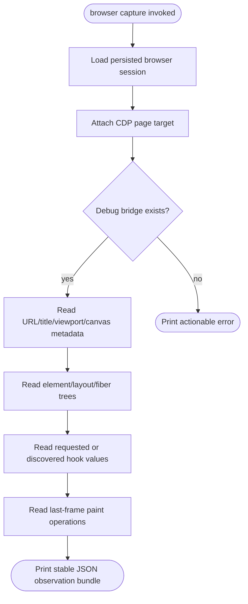
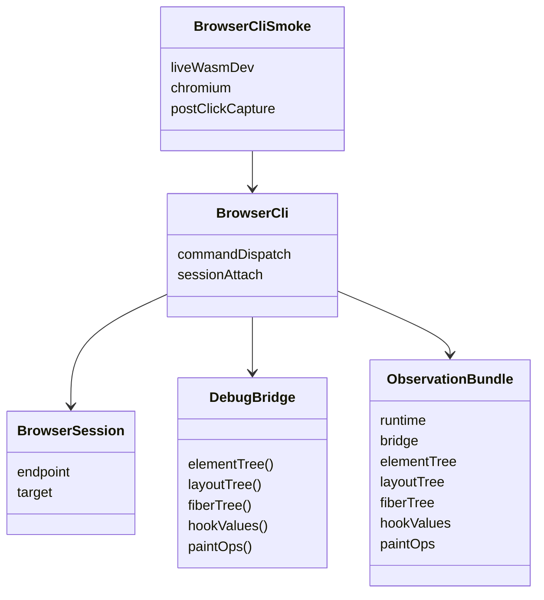
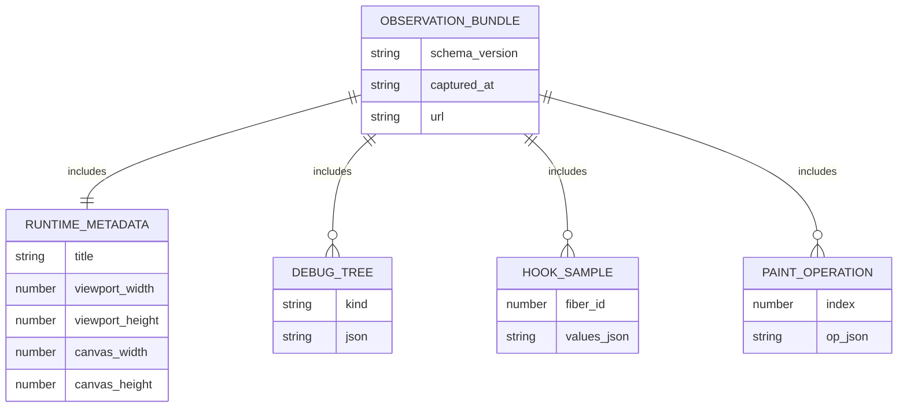
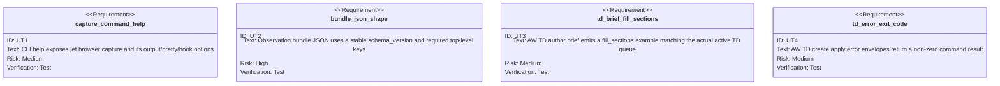

# Jet Browser Observation Bundle

## Scenarios
<!-- type: scenarios lang: yaml -->

```yaml
scenarios:
  - id: capture_live_wasm_debug_bundle
    given: "A Jet WASM app is served through `jet dev --wasm --debug` and a `jet browser` session is attached to the live Chromium target."
    when: "The operator runs the observation-bundle command."
    then: "Jet prints one deterministic JSON bundle containing debug-bridge metadata, element/layout/fiber trees, paint operations, viewport/canvas metadata, and sampled hook values."
  - id: reject_non_debug_target
    given: "A browser session points at a page that lacks `window.__jet_debug`."
    when: "The operator runs the observation-bundle command."
    then: "Jet exits with an actionable diagnostic that names the missing debug bridge and instructs the operator to rebuild with `jet dev --wasm --debug` or `jet build --wasm --debug`."
  - id: observe_after_interaction
    given: "The counter fixture has rendered and the operator clicks the live WASM button through Chromium."
    when: "The observation bundle is captured after the click."
    then: "The bundle records non-empty layout and paint evidence and includes the updated counter hook value."
  - id: avoid_ad_hoc_static_server
    given: "DOM/WASM parity triage needs evidence for an external mismatch."
    when: "The observation bundle is collected."
    then: "The evidence comes from Jet's own WASM dev/browser session machinery rather than `python -m http.server` or another generic static server."
  - id: stop_td_apply_error_loops
    given: "AW TD section-apply validation emits an `action:error` envelope."
    when: "A shell or agent loop checks the command result."
    then: "The command exits non-zero so automation stops instead of treating the error envelope as success."
```
## Mindmap
<!-- type: mindmap lang: mermaid -->


## State Machine
<!-- type: state-machine lang: mermaid -->


## Interaction
<!-- type: interaction lang: mermaid -->


## Logic
<!-- type: logic lang: mermaid -->


## Dependency
<!-- type: dependency lang: mermaid -->


## DB Model
<!-- type: db-model lang: mermaid -->


## Schema
<!-- type: schema lang: yaml -->

```yaml
$schema: "https://json-schema.org/draft/2020-12/schema"
title: "JetBrowserObservationBundle"
type: object
required:
  - schema_version
  - runtime
  - bridge
  - element_tree
  - layout_tree
  - fiber_tree
  - hook_values
  - paint_ops
properties:
  schema_version:
    type: string
    const: "jet.browser.observation.v1"
  runtime:
    type: object
    required: [url, title, viewport, canvas]
    properties:
      url: { type: string }
      title: { type: string }
      viewport:
        type: object
        required: [width, height, device_pixel_ratio]
        properties:
          width: { type: number }
          height: { type: number }
          device_pixel_ratio: { type: number }
      canvas:
        type: object
        required: [present]
        properties:
          present: { type: boolean }
          width: { type: number }
          height: { type: number }
  bridge:
    type: object
    required: [available]
    properties:
      available: { type: boolean }
      diagnostic: { type: string }
  element_tree: {}
  layout_tree: {}
  fiber_tree: {}
  hook_values:
    type: array
    items:
      type: object
      required: [fiber_id, values]
      properties:
        fiber_id: { type: integer }
        values: {}
  paint_ops:
    type: array
    items: {}
```
## REST API
<!-- type: rest-api lang: yaml -->

```yaml
openapi: "3.1.0"
info:
  title: "Jet browser observation bundle"
  version: "0.0.0"
paths: {}
x-contract:
  public_http_api: false
  rationale: "The capture surface is a local CLI command over the saved Jet browser CDP session."
```
## RPC API
<!-- type: rpc-api lang: yaml -->

```yaml
openrpc: "1.3.2"
info:
  title: "Jet browser observation bundle RPC"
  version: "0.0.0"
methods: []
x-contract:
  public_rpc_api: false
  internal_bridge_methods:
    - "window.__jet_debug.elementTree"
    - "window.__jet_debug.layoutTree"
    - "window.__jet_debug.fiberTree"
    - "window.__jet_debug.hookValues"
    - "window.__jet_debug.paintOps"
```
## Async API
<!-- type: async-api lang: yaml -->

```yaml
asyncapi: "2.6.0"
info:
  title: "Jet browser observation bundle async API"
  version: "0.0.0"
channels: {}
x-contract:
  public_async_api: false
  rationale: "The bundle is captured synchronously from the live browser target."
```
## CLI
<!-- type: cli lang: yaml -->

```yaml
command:
  name: jet
  subcommands:
    browser:
      subcommands:
        capture:
          about: "Print a parity-ready JSON observation bundle from the attached jet-wasm debug session"
          args:
            - name: output
              long: "--output"
              value: "path"
              required: false
              behavior: "Write the bundle to a file instead of stdout"
            - name: pretty
              long: "--pretty"
              required: false
              behavior: "Pretty-print JSON output"
            - name: hook
              long: "--hook"
              value: "fiber-id"
              repeatable: true
              required: false
              behavior: "Include hook values for specific fiber ids; defaults to discovered fiber ids with hooks"
          diagnostics:
            - "No saved browser session"
            - "Chromium target unreachable"
            - "window.__jet_debug unavailable; rebuild with `jet dev --wasm --debug` or `jet build --wasm --debug`"
```
## Wireframe
<!-- type: wireframe lang: yaml -->

```yaml
screens: []
x-contract:
  user_interface: false
  output_surface: "CLI stdout or JSON file"
  readable_order:
    - "schema_version"
    - "runtime"
    - "bridge"
    - "element_tree"
    - "layout_tree"
    - "fiber_tree"
    - "hook_values"
    - "paint_ops"
```
## Component
<!-- type: component lang: yaml -->

```yaml
schemaVersion: "1.0.0"
modules: []
x-contract:
  browser_ui_components: false
  cli_component:
    name: "browser capture command"
    owns:
      - "observation bundle collection"
      - "diagnostic formatting"
      - "stdout/file JSON emission"
```
## Design Token
<!-- type: design-token lang: yaml -->

```yaml
$schema: "https://design-tokens.github.io/community-group/format/"
tokens: {}
x-contract:
  visual_design_tokens: false
  rationale: "This work adds a machine-readable CLI evidence bundle, not a new visual surface."
```
## Config
<!-- type: config lang: yaml -->

```yaml
$schema: "https://json-schema.org/draft/2020-12/schema"
title: "Jet browser capture options"
type: object
properties:
  output:
    type: string
    description: "Optional path for writing the JSON observation bundle"
  pretty:
    type: boolean
    default: false
  hooks:
    type: array
    items: { type: integer }
    default: []
additionalProperties: false
```
## Manifest
<!-- type: manifest lang: yaml -->

```yaml
manifests:
  - path: "projects/jet/Cargo.toml"
    action: "unchanged"
    rationale: "The capture command can use existing serde_json and browser CLI dependencies."
  - path: "projects/agentic-workflow/Cargo.toml"
    action: "unchanged"
    rationale: "The AW TD brief fix uses existing CLI/test dependencies."
```
## Runtime Image
<!-- type: runtime-image lang: yaml -->

```yaml
images: []
x-contract:
  container_changes: false
  runtime_requirements:
    - "Jet WASM debug app served by Jet dev/build tooling"
    - "Pinned Chromium installed through Jet browser tooling"
    - "Saved `.jet/browser-session.json` from `jet browser launch` or `jet browser debug`"
```
## Deployment
<!-- type: deployment lang: yaml -->

```yaml
deployments: []
x-contract:
  deployment_changes: false
  release_surface:
    - "local Jet CLI"
    - "test-only live Chromium smoke"
```
## Unit Test
<!-- type: unit-test lang: mermaid -->


## E2E Test
<!-- type: e2e-test lang: yaml -->

```yaml
e2e_tests:
  - id: live_wasm_capture_after_click
    name: "Live WASM capture after click"
    fixture: "projects/jet/examples/counter-demo"
    command: "cargo test -p jet --test browser_cli_smoke -- --nocapture"
    steps:
      - "Build the counter demo through the Jet WASM debug path"
      - "Serve it through Jet's WASM dev server"
      - "Attach Chromium through Jet browser session machinery"
      - "Click the live counter button"
      - "Capture the observation bundle"
    assertions:
      - "bundle.schema_version == jet.browser.observation.v1"
      - "bundle.layout_tree is non-empty"
      - "bundle.paint_ops is non-empty"
      - "bundle.hook_values includes the post-click counter value"
      - "no python static server is used"
```
## Changes
<!-- type: changes lang: yaml -->

```yaml
changes:
  - path: "projects/jet/src/cli.rs"
    action: "modify"
    section: "cli"
    impl_mode: "hand-written"
    rationale: "Add `jet browser capture` help, option parsing, and dispatch into browser_cli."
  - path: "projects/jet/src/browser_cli/mod.rs"
    action: "modify"
    section: "logic"
    impl_mode: "hand-written"
    rationale: "Collect runtime metadata, debug trees, hook values, and paint ops from the live WASM debug bridge."
  - path: "projects/jet/tests/browser_cli_smoke.rs"
    action: "modify"
    section: "e2e-test"
    impl_mode: "hand-written"
    rationale: "Exercise capture after a real click through Jet WASM dev/browser session machinery."
  - path: "projects/agentic-workflow/src/cli/td.rs"
    action: "modify"
    section: "cli"
    impl_mode: "hand-written"
    rationale: "Fix the TD author brief fill_sections example and make TD create-apply error envelopes return non-zero so automation stops on validation failures."
  - path: ".aw/tech-design/projects/jet/logic/jet-browser-observation-bundle.md"
    action: "verify"
    section: "async-api"
    impl_mode: "hand-written"
    rationale: "Traceability repair: hand-written TD section retained as the implementation edge during AW standardization."
  - path: ".aw/tech-design/projects/jet/logic/jet-browser-observation-bundle.md"
    action: "verify"
    section: "component"
    impl_mode: "hand-written"
    rationale: "Traceability repair: hand-written TD section retained as the implementation edge during AW standardization."
  - path: ".aw/tech-design/projects/jet/logic/jet-browser-observation-bundle.md"
    action: "verify"
    section: "config"
    impl_mode: "hand-written"
    rationale: "Traceability repair: hand-written TD section retained as the implementation edge during AW standardization."
  - path: ".aw/tech-design/projects/jet/logic/jet-browser-observation-bundle.md"
    action: "verify"
    section: "db-model"
    impl_mode: "hand-written"
    rationale: "Traceability repair: hand-written TD section retained as the implementation edge during AW standardization."
  - path: ".aw/tech-design/projects/jet/logic/jet-browser-observation-bundle.md"
    action: "verify"
    section: "dependency"
    impl_mode: "hand-written"
    rationale: "Traceability repair: hand-written TD section retained as the implementation edge during AW standardization."
  - path: ".aw/tech-design/projects/jet/logic/jet-browser-observation-bundle.md"
    action: "verify"
    section: "deployment"
    impl_mode: "hand-written"
    rationale: "Traceability repair: hand-written TD section retained as the implementation edge during AW standardization."
  - path: ".aw/tech-design/projects/jet/logic/jet-browser-observation-bundle.md"
    action: "verify"
    section: "design-token"
    impl_mode: "hand-written"
    rationale: "Traceability repair: hand-written TD section retained as the implementation edge during AW standardization."
  - path: ".aw/tech-design/projects/jet/logic/jet-browser-observation-bundle.md"
    action: "verify"
    section: "interaction"
    impl_mode: "hand-written"
    rationale: "Traceability repair: hand-written TD section retained as the implementation edge during AW standardization."
  - path: ".aw/tech-design/projects/jet/logic/jet-browser-observation-bundle.md"
    action: "verify"
    section: "manifest"
    impl_mode: "hand-written"
    rationale: "Traceability repair: hand-written TD section retained as the implementation edge during AW standardization."
  - path: ".aw/tech-design/projects/jet/logic/jet-browser-observation-bundle.md"
    action: "verify"
    section: "mindmap"
    impl_mode: "hand-written"
    rationale: "Traceability repair: hand-written TD section retained as the implementation edge during AW standardization."
  - path: ".aw/tech-design/projects/jet/logic/jet-browser-observation-bundle.md"
    action: "verify"
    section: "rest-api"
    impl_mode: "hand-written"
    rationale: "Traceability repair: hand-written TD section retained as the implementation edge during AW standardization."
  - path: ".aw/tech-design/projects/jet/logic/jet-browser-observation-bundle.md"
    action: "verify"
    section: "rpc-api"
    impl_mode: "hand-written"
    rationale: "Traceability repair: hand-written TD section retained as the implementation edge during AW standardization."
  - path: ".aw/tech-design/projects/jet/logic/jet-browser-observation-bundle.md"
    action: "verify"
    section: "runtime-image"
    impl_mode: "hand-written"
    rationale: "Traceability repair: hand-written TD section retained as the implementation edge during AW standardization."
  - path: ".aw/tech-design/projects/jet/logic/jet-browser-observation-bundle.md"
    action: "verify"
    section: "scenarios"
    impl_mode: "hand-written"
    rationale: "Traceability repair: hand-written TD section retained as the implementation edge during AW standardization."
  - path: ".aw/tech-design/projects/jet/logic/jet-browser-observation-bundle.md"
    action: "verify"
    section: "schema"
    impl_mode: "hand-written"
    rationale: "Traceability repair: hand-written TD section retained as the implementation edge during AW standardization."
  - path: ".aw/tech-design/projects/jet/logic/jet-browser-observation-bundle.md"
    action: "verify"
    section: "state-machine"
    impl_mode: "hand-written"
    rationale: "Traceability repair: hand-written TD section retained as the implementation edge during AW standardization."
  - path: ".aw/tech-design/projects/jet/logic/jet-browser-observation-bundle.md"
    action: "verify"
    section: "unit-test"
    impl_mode: "hand-written"
    rationale: "Traceability repair: hand-written TD section retained as the implementation edge during AW standardization."
  - path: ".aw/tech-design/projects/jet/logic/jet-browser-observation-bundle.md"
    action: "verify"
    section: "wireframe"
    impl_mode: "hand-written"
    rationale: "Traceability repair: hand-written TD section retained as the implementation edge during AW standardization."
```

# Reviews

### Review 1
**Verdict:** approved

- [scenarios] Applicability covers the live WASM debug capture, non-debug diagnostics, post-interaction state proof, and no-Python-server constraint.
- [cli] CLI applicability names a bounded `jet browser capture` surface with output, pretty, and hook selection options.
- [changes] Change list is scoped to Jet browser capture, live smoke coverage, and the AW TD author brief bug discovered while running the lifecycle.

# Reviews

### Review 1
**Verdict:** approved

- [logic] Capture flow is implementable: load session, attach CDP target, check debug bridge, collect runtime/tree/hook/paint data, then print JSON or diagnostic.
- [cli] Command contract is bounded to `jet browser capture` with optional output, pretty printing, and hook selection.
- [unit-test] Test requirements cover CLI discoverability, bundle JSON shape, and the AW TD author brief fix found during lifecycle execution.
- [e2e-test] Live smoke path uses Jet WASM dev/browser machinery and explicitly forbids the Python static server shortcut.
- [changes] File list is scoped to Jet browser CLI/capture code, browser smoke verification, and the required AW TD prompt repair.
