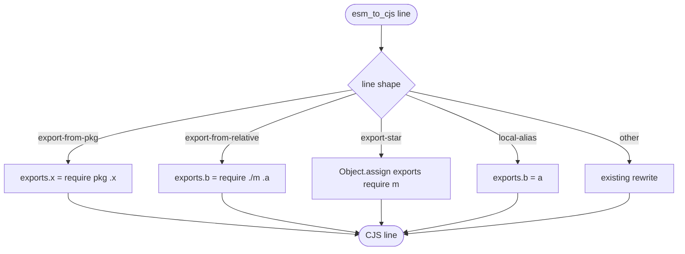

# jet build --lib CJS: Re-export and Renamed-Alias Edge Cases

## Logic
<!-- type: logic lang: mermaid -->

# Reviews

### Review 1
**Verdict:** approved

- [logic] Applicability sound: classify each export/import line and rewrite re-export-from-pkg, re-export-from-relative, export-star, and local renamed-alias to correct CJS exports/require; other lines unchanged. Extends A1 CJS; ESM/preserve/IIFE out of scope.
