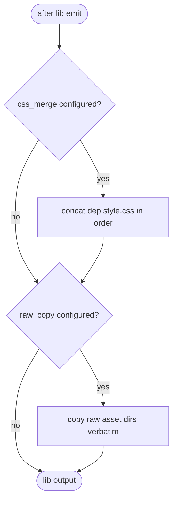

# jet build --lib CSS cascade-merge + raw asset copy

## Logic
<!-- type: logic lang: mermaid -->



## Changes
<!-- type: changes lang: yaml -->

```yaml
coverage_kind: semantic
changes:
  - path: "projects/jet/src/task_runner/config.rs"
    action: modify
    section: logic
    description: |
      Add [lib] config: css_merge (ordered list of dependent style.css to concatenate) and raw_copy (src dir -> out dir verbatim copies).
    impl_mode: hand-written
  - path: "projects/jet/src/bundler/lib_build.rs"
    action: modify
    section: logic
    description: |
      After lib emit: when css_merge configured, concatenate the dependent packages style.css into the output style.css in declared cascade order; when raw_copy configured, copy the raw asset directories verbatim into out_dir preserving paths for deep imports.
    impl_mode: hand-written
  - path: "projects/jet/tests/build/lib_css_merge.rs"
    action: create
    section: unit-test
    description: |
      Tests: css_merge produces style.css with dep CSS in declared order; raw_copy lands icons/images/audio verbatim at deep-import paths; neither configured = unchanged.
    impl_mode: hand-written
```

