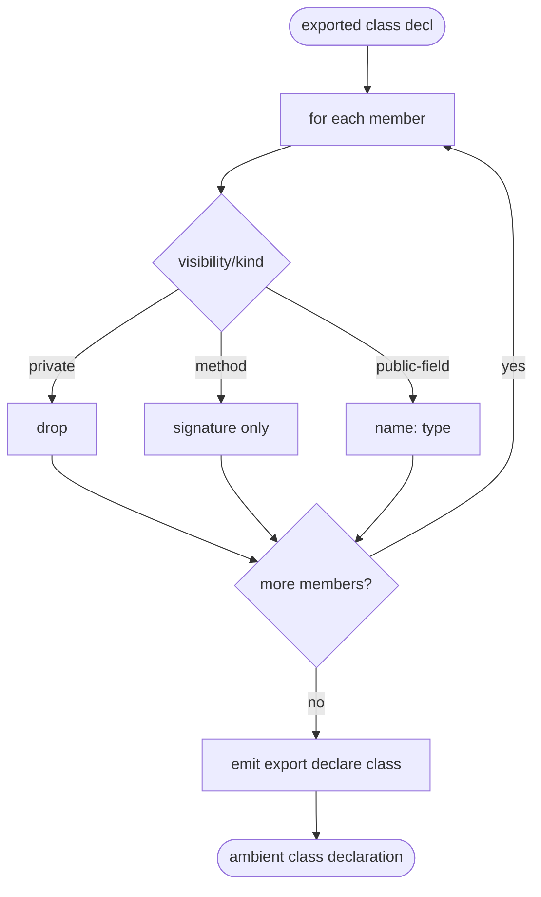

# jet build --lib .d.ts: Class-Member Reduction + Remaining Export Shapes

## Logic
<!-- type: logic lang: mermaid -->

# Reviews

### Review 1
**Verdict:** approved

- [logic] Applicability sound: per class member, branch private(drop)/method(signature)/public-field(name:type), loop, emit ambient export declare class. Extends A2 dts; library output modes (LF1) and CJS (LF3) out of scope.
