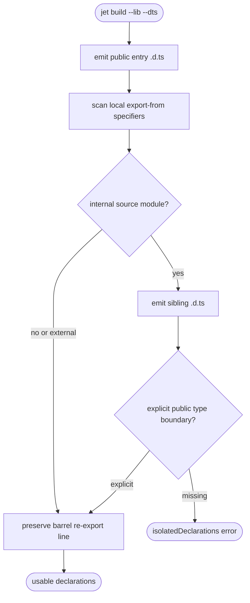

# jet build --lib --dts: Barrel Re-Export Declaration Completeness

## Logic
<!-- type: logic lang: mermaid -->


## Changes
<!-- type: changes lang: yaml -->

```yaml
coverage_kind: semantic
changes:
  - path: "projects/jet/src/bundler/lib_build.rs"
    action: modify
    section: logic
    description: |
      Emit a declaration tree for each public library entry: keep the entry
      `.d.ts` as the public `LibBuildResult::types` record, and write sibling
      `.d.ts` files for internal modules reached by local `export ... from`
      barrel re-exports so preserved `export * from "./x"` declarations do not
      dangle.
    impl_mode: hand-written
  - path: "projects/jet/src/bundler/dts.rs"
    action: modify
    section: logic
    description: |
      Tighten isolatedDeclarations behavior so exported functions, public class
      methods, and public class fields without explicit return/type annotations
      fail loudly instead of emitting implicit-any declarations.
    impl_mode: hand-written
  - path: "projects/jet/tests/build/library_dts.rs"
    action: modify
    section: unit-test
    description: |
      Add regression coverage for barrel re-export sibling declaration files and
      explicit failures for untyped exported function/class-member return types.
    impl_mode: hand-written
```
