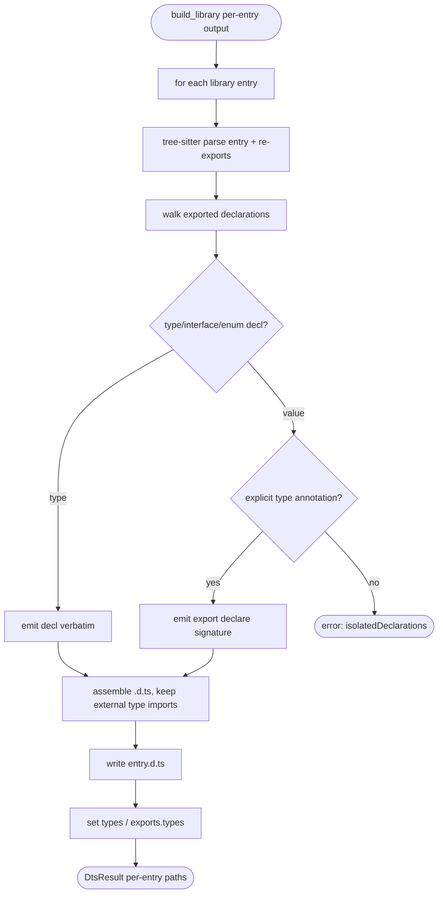

# jet build --lib: .d.ts Type Declaration Emission

## Logic
<!-- type: logic lang: mermaid -->



## Changes
<!-- type: changes lang: yaml -->

```yaml
coverage_kind: semantic
changes:
  - path: "projects/jet/src/bundler/dts.rs"
    action: create
    section: logic
    description: |
      New isolatedDeclarations-style declaration emitter: parse a library entry
      with tree-sitter-typescript, walk top-level exported declarations, emit
      type/interface/enum decls verbatim and `export declare` signatures for
      explicitly-typed exported values, error on untyped exports, and return the
      assembled `<entry>.d.ts` text (external type imports preserved).
    impl_mode: hand-written
  - path: "projects/jet/src/bundler/types.rs"
    action: modify
    section: logic
    description: |
      Add a `declaration: bool` option (emit .d.ts) to the library build options,
      defaulting on for lib mode and off for app mode.
    impl_mode: hand-written
  - path: "projects/jet/src/bundler/lib_build.rs"
    action: modify
    section: logic
    description: |
      When declaration emission is enabled, call dts::emit_declarations for each
      entry, write `<entry>.d.ts` alongside the JS output, and record
      types/exports.types in LibBuildResult/metadata.
    impl_mode: hand-written
  - path: "projects/jet/src/cli.rs"
    action: modify
    section: cli
    description: |
      Wire a `--dts/--no-dts` flag (and `[lib].dts` config) into the library
      build options.
    impl_mode: hand-written
  - path: "projects/jet/tests/build/library_dts.rs"
    action: create
    section: unit-test
    description: |
      Tests: a typed fixture library emits `.d.ts` with the right exported
      signatures, the build sets `types`/`exports.types`, and a consumer
      type-checks clean against the emitted declarations.
    impl_mode: hand-written
```

# Reviews

### Review 1
**Verdict:** approved

- [logic] Contract logic (id jet-build-lib-dts-flow) is complete and deterministic: per library entry, parse with tree-sitter, walk exported declarations, branch type-vs-value, emit type/interface/enum verbatim and `export declare` signatures for explicitly-typed values, terminal error on untyped exports (isolatedDeclarations contract), assemble per-entry .d.ts preserving external type imports, write `<entry>.d.ts`, and set types/exports.types. All nodes reachable; both decisions (classify, is_typed) carry labeled branches; terminals (err_untyped, done) are real ends. Scope correct: builds on A1 output; publish/registry is A3.
