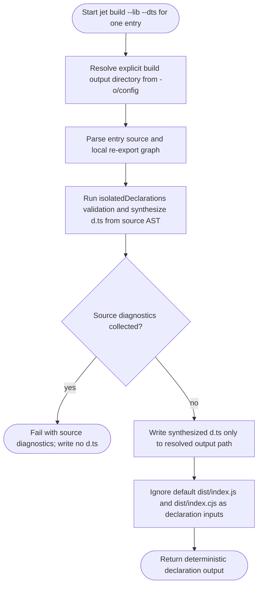

# jet build --lib --dts: Source-First Declaration Emission

## Logic
<!-- type: logic lang: mermaid -->

```mermaid
---
id: jet-lib-dts-source-first-output-isolation
entry: start
nodes:
  start: { kind: start, label: "Start jet build --lib --dts for one entry" }
  resolve_output: { kind: process, label: "Resolve explicit build output directory from -o/config" }
  parse_source: { kind: process, label: "Parse entry source and local re-export graph" }
  emit_from_source: { kind: process, label: "Run isolatedDeclarations validation and synthesize .d.ts from source AST" }
  has_diagnostics: { kind: decision, label: "Source diagnostics collected?" }
  fail: { kind: terminal, label: "Fail with source diagnostics; write no .d.ts" }
  write_to_output: { kind: process, label: "Write synthesized .d.ts only to resolved output path" }
  ignore_stale_dist: { kind: process, label: "Ignore default dist/index.js and dist/index.cjs as declaration inputs" }
  done: { kind: terminal, label: "Return deterministic declaration output" }
edges:
  - { from: start, to: resolve_output }
  - { from: resolve_output, to: parse_source }
  - { from: parse_source, to: emit_from_source }
  - { from: emit_from_source, to: has_diagnostics }
  - { from: has_diagnostics, to: fail, label: "yes" }
  - { from: has_diagnostics, to: write_to_output, label: "no" }
  - { from: write_to_output, to: ignore_stale_dist }
  - { from: ignore_stale_dist, to: done }
---
flowchart TD
    start([Start jet build --lib --dts for one entry]) --> resolve_output[Resolve explicit build output directory from -o/config]
    resolve_output --> parse_source[Parse entry source and local re-export graph]
    parse_source --> emit_from_source[Run isolatedDeclarations validation and synthesize d.ts from source AST]
    emit_from_source --> has_diagnostics{Source diagnostics collected?}
    has_diagnostics -->|yes| fail([Fail with source diagnostics; write no d.ts])
    has_diagnostics -->|no| write_to_output[Write synthesized d.ts only to resolved output path]
    write_to_output --> ignore_stale_dist[Ignore default dist/index.js and dist/index.cjs as declaration inputs]
    ignore_stale_dist --> done([Return deterministic declaration output])
```
