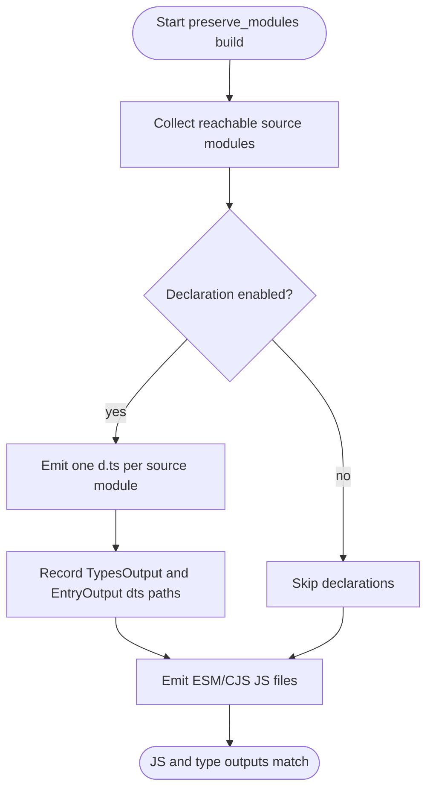
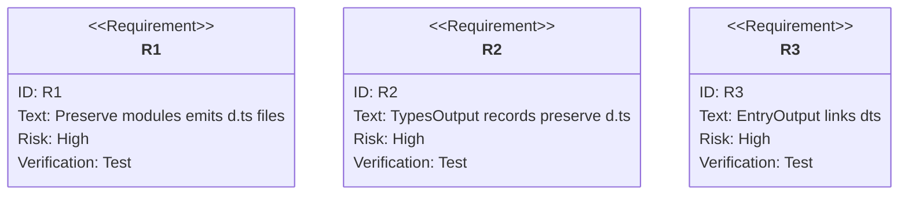

# jet build --lib --dts --preserve-modules: Preserve Module Declarations

## Logic
<!-- type: logic lang: mermaid -->


## Changes
<!-- type: changes lang: yaml -->

```yaml
coverage_kind: semantic
changes:
  - path: "projects/jet/src/bundler/lib_build.rs"
    action: modify
    section: logic
    description: |
      Extend build_library_preserve_modules so declaration=true emits one
      .d.ts file per reachable source module, records those files in
      LibBuildResult::types, and attaches the matching .d.ts path to each
      ESM/CJS EntryOutput.
    impl_mode: hand-written
  - path: "projects/jet/tests/build/library_dts.rs"
    action: modify
    section: unit-test
    description: |
      Add a preserve_modules + dts regression covering dual ESM/CJS output,
      sibling .d.ts files for every source module, result.types reporting, and
      EntryOutput::dts links.
    impl_mode: hand-written
```

## Unit Test
<!-- type: unit-test lang: mermaid -->


