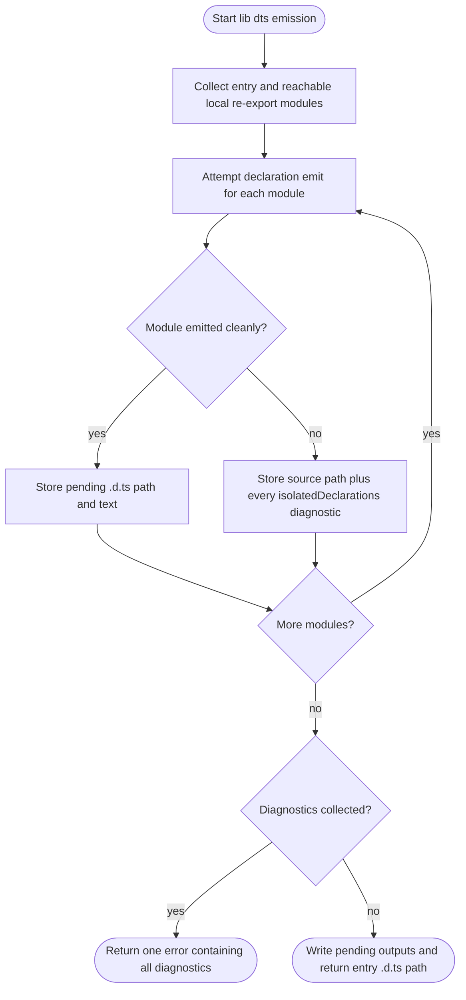

# jet build --lib --dts: Aggregate isolatedDeclarations Diagnostics

## Logic
<!-- type: logic lang: mermaid -->


## Changes
<!-- type: changes lang: yaml -->

```yaml
coverage_kind: semantic
changes:
  - path: "projects/jet/src/bundler/dts.rs"
    action: modify
    section: logic
    description: |
      Introduce a declaration diagnostic aggregate for one module. Export-boundary
      validation records all isolatedDeclarations errors in source order instead
      of returning at the first missing type/return annotation.
    impl_mode: hand-written
  - path: "projects/jet/src/bundler/lib_build.rs"
    action: modify
    section: logic
    description: |
      Buffer declaration output for every module in the entry declaration tree,
      aggregate module-scoped diagnostics, and return one formatted error before
      writing any .d.ts files when diagnostics exist.
    impl_mode: hand-written
  - path: "projects/jet/tests/build/library_dts.rs"
    action: modify
    section: unit-test
    description: |
      Add a regression test with multiple invalid exports across the entry and a
      local re-exported module. The assertion must prove the final error includes
      all invalid symbols and both source files.
    impl_mode: hand-written
```
