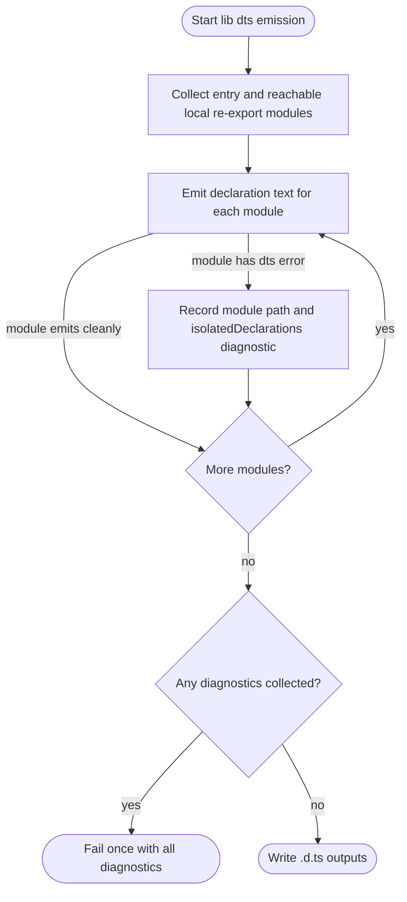

# jet build --lib --dts: Aggregate isolatedDeclarations Diagnostics

## Logic
<!-- type: logic lang: mermaid -->

```mermaid
---
id: jet-build-lib-dts-aggregate-isolated-declarations-logic
entry: start
nodes:
  start: { kind: start, label: "Start lib dts emission" }
  collect_modules: { kind: process, label: "Collect entry and reachable local re-export modules" }
  emit_module: { kind: process, label: "Emit declaration text for each module" }
  collect_diagnostic: { kind: process, label: "Record module path and isolatedDeclarations diagnostic" }
  more_modules: { kind: decision, label: "More modules?" }
  has_errors: { kind: decision, label: "Any diagnostics collected?" }
  fail_all: { kind: terminal, label: "Fail once with all diagnostics" }
  write_outputs: { kind: terminal, label: "Write .d.ts outputs" }
edges:
  - { from: start, to: collect_modules }
  - { from: collect_modules, to: emit_module }
  - { from: emit_module, to: collect_diagnostic, label: "module has dts error" }
  - { from: emit_module, to: more_modules, label: "module emits cleanly" }
  - { from: collect_diagnostic, to: more_modules }
  - { from: more_modules, to: emit_module, label: "yes" }
  - { from: more_modules, to: has_errors, label: "no" }
  - { from: has_errors, to: fail_all, label: "yes" }
  - { from: has_errors, to: write_outputs, label: "no" }
---
flowchart TD
    start([Start lib dts emission]) --> collect_modules[Collect entry and reachable local re-export modules]
    collect_modules --> emit_module[Emit declaration text for each module]
    emit_module -->|module has dts error| collect_diagnostic[Record module path and isolatedDeclarations diagnostic]
    emit_module -->|module emits cleanly| more_modules{More modules?}
    collect_diagnostic --> more_modules
    more_modules -->|yes| emit_module
    more_modules -->|no| has_errors{Any diagnostics collected?}
    has_errors -->|yes| fail_all([Fail once with all diagnostics])
    has_errors -->|no| write_outputs([Write .d.ts outputs])
```
