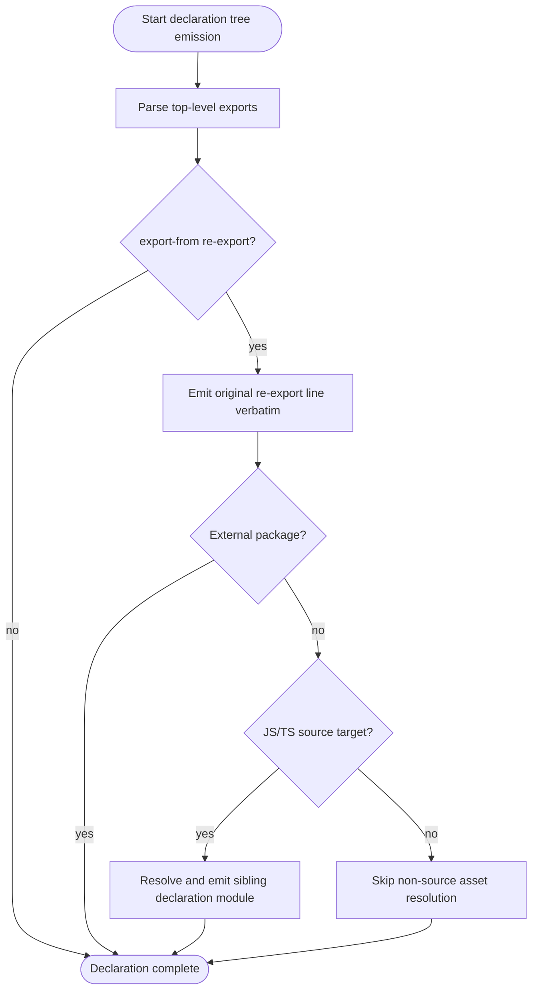
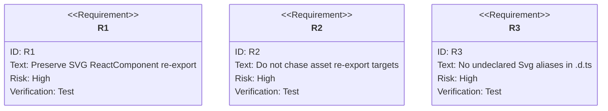

# jet build --lib --dts: SVGR Asset Re-export Declarations

## Logic
<!-- type: logic lang: mermaid -->


## Changes
<!-- type: changes lang: yaml -->

```yaml
coverage_kind: semantic
changes:
  - path: "projects/jet/src/bundler/lib_build.rs"
    action: modify
    section: logic
    description: |
      Keep declaration-tree traversal for local JS/TS re-export targets, but
      skip non-source asset re-export targets such as .svg so the emitted
      .d.ts preserves the asset re-export for ambient module declarations.
    impl_mode: hand-written
  - path: "projects/jet/src/bundler/dts.rs"
    action: modify
    section: unit-test
    description: |
      Add emitter-level regression coverage proving SVGR-style
      `export { ReactComponent as Icon } from "./icon.svg"` statements are
      preserved verbatim and do not become runtime SVG aliases.
    impl_mode: hand-written
  - path: "projects/jet/tests/build/library_dts.rs"
    action: modify
    section: unit-test
    description: |
      Add library-build declaration coverage for an entry that re-exports an
      SVG ReactComponent with an ambient `*.svg` module declaration, asserting
      index.d.ts keeps the source-level re-export and no transformed Svg*
      alias leaks into the declaration output.
    impl_mode: hand-written
```

## Unit Test
<!-- type: unit-test lang: mermaid -->


